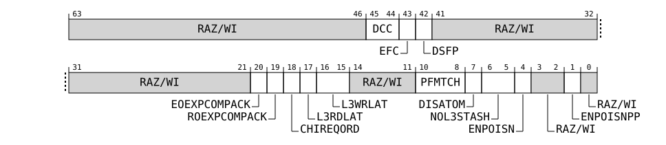

# IMP_CLUSTERECTLR_EL1, Cluster Extended Control Register

Source: <https://developer.arm.com/documentation/107721/0001/AArch64-registers/AArch64-generic-system-control-registers-summary/IMP-CLUSTERECTLR-EL1--Cluster-Extended-Control-Register>

### IMP\_CLUSTERECTLR\_EL1, Cluster Extended Control Register

This register should be used for dynamically changing implementation specific control bits.

### Configurations

AArch64 register IMP\_CLUSTERECTLR\_EL1 bits [63:0] are architecturally mapped to External System register [CLUSTERECTLR, Cluster Extended Control Register](/documentation/107721/0001/External-registers/Registers-accessed-over-the-utility-bus/External-cluster-system-control-registers-summary/CLUSTERECTLR--Cluster-Extended-Control-Register?lang=en "This register should be used for dynamically changing implementation specific control bits.") bits [63:0].

### Attributes

Width
:   64

Functional group
:   Generic System Control

Access type
:   See bit descriptions

Reset value
:   ```
    0000 0000 0000 0000 0011 0100 0000 0000 0000 0000 0000 00xx x000 0101 0101 0010
    |    |    |    |    |    |    |    |    |    |    |    |    |    |    |    |  |
    63   59   55   51   47   43   39   35   31   27   23   19   15   11   7    3  0
    ```

    > ### Note
    >
    > Where the reset reads xxxx, see individual bits.

### Bit descriptions

Figure 1. AArch64\_imp\_clusterectlr\_el1 bit assignments



<table id="dkc1733414846504__aimp_clusterectlr_el1-0">
 <caption>
  <span class="documents-tablecap">
   <span class="documents-table--title-label">
    Table 1.
   </span>
   IMP_CLUSTERECTLR_EL1 bit descriptions
  </span>
 </caption>
 <colgroup>
  <col span="1"/>
  <col span="1"/>
  <col span="1"/>
  <col span="1"/>
 </colgroup>
 <thead>
  <tr>
   <th class="documents-nocellnorowborder" colspan="1" id="d51441e152" rowspan="1">
    Bits
   </th>
   <th class="documents-nocellnorowborder" colspan="1" id="d51441e155" rowspan="1">
    Name
   </th>
   <th class="documents-nocellnorowborder" colspan="1" id="d51441e158" rowspan="1">
    Description
   </th>
   <th class="documents-cell-norowborder" colspan="1" id="d51441e161" rowspan="1">
    Reset
   </th>
  </tr>
 </thead>
 <tbody>
  <tr>
   <td class="documents-nocellnorowborder" colspan="1" rowspan="1">
    [63:46]
   </td>
   <td class="documents-nocellnorowborder" colspan="1" rowspan="1">
    <span class="documents-archterm">
     RAZ/WI
    </span>
   </td>
   <td class="documents-nocellnorowborder" colspan="1" rowspan="1">
    Reserved
   </td>
   <td class="documents-cell-norowborder" colspan="1" id="dkc1733414846504__63-46-reset" rowspan="1">
    <span class="documents-archterm">
     RAZ/WI
    </span>
   </td>
  </tr>
  <tr>
   <td class="documents-nocellnorowborder" colspan="1" rowspan="1">
    [45:44]
   </td>
   <td class="documents-nocellnorowborder" colspan="1" rowspan="1">
    DCC
   </td>
   <td class="documents-nocellnorowborder" colspan="1" rowspan="1">
    <p>
     Downstream cache control. Controls whether evictions of clean cachelines send data on the CHI interface. Set this based on whether there is a cache on the path to memory.
    </p>
    <dl>
     <dt class="documents-dlterm">
      <span class="documents-g.number.bin">
       0b00
      </span>
     </dt>
     <dd>
      <p>
       Disables sending data when clean cachelines are evicted.
      </p>
     </dd>
     <dt class="documents-dlterm">
      <span class="documents-g.number.bin">
       0b01
      </span>
     </dt>
     <dd>
      <p>
       Enables sending WriteEvictFull transactions when Unique Clean cachelines are evicted. Shared Clean cacheline evictions do not send data.
      </p>
     </dd>
     <dt class="documents-dlterm">
      <span class="documents-g.number.bin">
       0b10
      </span>
     </dt>
     <dd>
      <p>
       Enables sending WriteEvictOrEvict transactions when Unique Clean cachelines are evicted. Shared Clean cacheline evictions do not send data.
      </p>
     </dd>
     <dt class="documents-dlterm">
      <span class="documents-g.number.bin">
       0b11
      </span>
     </dt>
     <dd>
      <p>
       Enables sending WriteEvictOrEvict transactions when Unique Clean or Shared Clean cachelines are evicted. This is the reset value.
      </p>
     </dd>
    </dl>
   </td>
   <td class="documents-cell-norowborder" colspan="1" id="dkc1733414846504__id-45-44-reset" rowspan="1">
    <span class="documents-g.number.bin">
     0b11
    </span>
   </td>
  </tr>
  <tr>
   <td class="documents-nocellnorowborder" colspan="1" rowspan="1">
    [43]
   </td>
   <td class="documents-nocellnorowborder" colspan="1" rowspan="1">
    EFC
   </td>
   <td class="documents-nocellnorowborder" colspan="1" rowspan="1">
    <p>
     Eviction flush control. Controls whether hardware cache flushes and DC CISW instructions send data when evicting clean cachelines on the CHI interface.
    </p>
    <dl>
     <dt class="documents-dlterm">
      <span class="documents-g.number.bin">
       0b0
      </span>
     </dt>
     <dd>
      <p>
       Disables sending data when hardware cache flushes or DC CISW instructions evict a clean cacheline. Sending of Evict transactions is controlled by Downstream Snoop Filter Present (DSFP). This is the reset value.
      </p>
     </dd>
     <dt class="documents-dlterm">
      <span class="documents-g.number.bin">
       0b1
      </span>
     </dt>
     <dd>
      <p>
       Sending of data when hardware cache flushes or DC CISW instructions evict clean cachelines is controlled by Downstream Cache Control (DCC). Sending of Evict transactions is controlled by Downstream Snoop Filter Present (DSFP).
      </p>
     </dd>
    </dl>
   </td>
   <td class="documents-cell-norowborder" colspan="1" id="dkc1733414846504__id-43-reset" rowspan="1">
    <span class="documents-g.number.bin">
     0b0
    </span>
   </td>
  </tr>
  <tr>
   <td class="documents-nocellnorowborder" colspan="1" rowspan="1">
    [42]
   </td>
   <td class="documents-nocellnorowborder" colspan="1" rowspan="1">
    DSFP
   </td>
   <td class="documents-nocellnorowborder" colspan="1" rowspan="1">
    <p>
     Downstream snoop filter present. Enables sending Evict transactions on the CHI interface when clean cachelines are evicted without data. Enable this if there is at least one snoop filter in the path to memory.
    </p>
    <dl>
     <dt class="documents-dlterm">
      <span class="documents-g.number.bin">
       0b0
      </span>
     </dt>
     <dd>
      <p>
       Disables sending Evict transactions when clean cachelines are evicted without data.
      </p>
     </dd>
     <dt class="documents-dlterm">
      <span class="documents-g.number.bin">
       0b1
      </span>
     </dt>
     <dd>
      <p>
       Enables sending of Evict transactions when clean cachelines are evicted without data. This is the reset value.
      </p>
     </dd>
    </dl>
   </td>
   <td class="documents-cell-norowborder" colspan="1" id="dkc1733414846504__id-42-reset" rowspan="1">
    <span class="documents-g.number.bin">
     0b1
    </span>
   </td>
  </tr>
  <tr>
   <td class="documents-nocellnorowborder" colspan="1" rowspan="1">
    [41:21]
   </td>
   <td class="documents-nocellnorowborder" colspan="1" rowspan="1">
    <span class="documents-archterm">
     RAZ/WI
    </span>
   </td>
   <td class="documents-nocellnorowborder" colspan="1" rowspan="1">
    Reserved
   </td>
   <td class="documents-cell-norowborder" colspan="1" id="dkc1733414846504__41-21-reset" rowspan="1">
    <span class="documents-archterm">
     RAZ/WI
    </span>
   </td>
  </tr>
  <tr>
   <td class="documents-nocellnorowborder" colspan="1" rowspan="1">
    [20]
   </td>
   <td class="documents-nocellnorowborder" colspan="1" rowspan="1">
    EOEXPCOMPACK
   </td>
   <td class="documents-nocellnorowborder" colspan="1" rowspan="1">
    <p>
     Controls the CHI ExpCompAck field when sending CHI ReadNoSnp Endpoint Order transactions to the system
    </p>
    <dl>
     <dt class="documents-dlterm">
      <span class="documents-g.number.bin">
       0b0
      </span>
     </dt>
     <dd>
      <p>
       CHI ReadNoSnp transactions sent with Endpoint Order will have ExpCompAck=0
      </p>
     </dd>
     <dt class="documents-dlterm">
      <span class="documents-g.number.bin">
       0b1
      </span>
     </dt>
     <dd>
      <p>
       CHI ReadNoSnp transactions sent with Endpoint Order will have ExpCompAck=1
      </p>
     </dd>
    </dl>
   </td>
   <td class="documents-cell-norowborder" colspan="1" id="dkc1733414846504__id-20-reset" rowspan="1">
    <span class="documents-g.number.bin">
     0b0
    </span>
   </td>
  </tr>
  <tr>
   <td class="documents-nocellnorowborder" colspan="1" rowspan="1">
    [19]
   </td>
   <td class="documents-nocellnorowborder" colspan="1" rowspan="1">
    ROEXPCOMPACK
   </td>
   <td class="documents-nocellnorowborder" colspan="1" rowspan="1">
    <p>
     Controls the CHI ExpCompAck field when sending CHI ReadNoSnp Request Order transactions to the system
    </p>
    <dl>
     <dt class="documents-dlterm">
      <span class="documents-g.number.bin">
       0b0
      </span>
     </dt>
     <dd>
      <p>
       CHI ReadNoSnp transactions sent with Request Order will have ExpCompAck=0
      </p>
     </dd>
     <dt class="documents-dlterm">
      <span class="documents-g.number.bin">
       0b1
      </span>
     </dt>
     <dd>
      <p>
       CHI ReadNoSnp transactions sent with Request Order will have ExpCompAck=1
      </p>
     </dd>
    </dl>
   </td>
   <td class="documents-cell-norowborder" colspan="1" id="dkc1733414846504__id-19-reset" rowspan="1">
    <span class="documents-g.number.bin">
     0b0
    </span>
   </td>
  </tr>
  <tr>
   <td class="documents-nocellnorowborder" colspan="1" rowspan="1">
    [18]
   </td>
   <td class="documents-nocellnorowborder" colspan="1" rowspan="1">
    CHIREQORD
   </td>
   <td class="documents-nocellnorowborder" colspan="1" rowspan="1">
    <p>
     Allow Request Order on CHI ports. Enables the use of Request Order when sending Non-snoopable CHI transactions to the system for Dev-R and Normal NC memory.
    </p>
    <dl>
     <dt class="documents-dlterm">
      <span class="documents-g.number.bin">
       0b0
      </span>
     </dt>
     <dd>
      <p>
       Disables sending Request Order on the CHI interface to the system. Will send No Order instead.
      </p>
     </dd>
     <dt class="documents-dlterm">
      <span class="documents-g.number.bin">
       0b1
      </span>
     </dt>
     <dd>
      <p>
       Enables sending Request Order on the CHI interface to the system for Non-snoopable transactions.
      </p>
     </dd>
    </dl>
   </td>
   <td class="documents-cell-norowborder" colspan="1" id="dkc1733414846504__id-18-reset" rowspan="1">
    <span class="documents-g.number.bin">
     0b0
    </span>
   </td>
  </tr>
  <tr>
   <td class="documents-nocellnorowborder" colspan="1" rowspan="1">
    [17]
   </td>
   <td class="documents-nocellnorowborder" colspan="1" rowspan="1">
    L3RDLAT
   </td>
   <td class="documents-nocellnorowborder" colspan="1" rowspan="1">
    <p>
     L3 data RAM read (output) latency.
    </p>
    <dl>
     <dt class="documents-dlterm">
      <span class="documents-g.number.bin">
       0b0
      </span>
     </dt>
     <dd>
      <p>
       The L3 data RAM output latency is 2 cycles.
      </p>
     </dd>
     <dt class="documents-dlterm">
      <span class="documents-g.number.bin">
       0b1
      </span>
     </dt>
     <dd>
      <p>
       The L3 data RAM output latency is 3 cycles.
      </p>
     </dd>
    </dl>
   </td>
   <td class="documents-cell-norowborder" colspan="1" id="dkc1733414846504__id-17-reset" rowspan="1">
    <p>
     <span>
      x
     </span>
     <a class="document-topic" document-topic-path="/107721/0001/AArch64-registers/AArch64-generic-system-control-registers-summary/IMP-CLUSTERECTLR-EL1--Cluster-Extended-Control-Register?lang=en#fntarg_1" href="/documentation/107721/0001/AArch64-registers/AArch64-generic-system-control-registers-summary/IMP-CLUSTERECTLR-EL1--Cluster-Extended-Control-Register?lang=en#fntarg_1" id="fnsrc_1">
      <sup>
       1
      </sup>
     </a>
    </p>
   </td>
  </tr>
  <tr>
   <td class="documents-nocellnorowborder" colspan="1" rowspan="1">
    [16:15]
   </td>
   <td class="documents-nocellnorowborder" colspan="1" rowspan="1">
    L3WRLAT
   </td>
   <td class="documents-nocellnorowborder" colspan="1" rowspan="1">
    <p>
     L3 data RAM write (input) latency.
    </p>
    <dl>
     <dt class="documents-dlterm">
      <span class="documents-g.number.bin">
       0b00
      </span>
     </dt>
     <dd>
      <p>
       The L3 data RAM input latency is 1 cycle with an additional hold cycle.
      </p>
     </dd>
     <dt class="documents-dlterm">
      <span class="documents-g.number.bin">
       0b01
      </span>
     </dt>
     <dd>
      <p>
       The L3 data RAM input latency is 2 cycles without an additional hold cycle.
      </p>
     </dd>
     <dt class="documents-dlterm">
      <span class="documents-g.number.bin">
       0b10
      </span>
     </dt>
     <dd>
      <p>
       The L3 data RAM input latency is 2 cycles with an additional hold cycle. This is only usable if the L3 data RAM output latency is 3 cycles.
      </p>
     </dd>
    </dl>
   </td>
   <td class="documents-cell-norowborder" colspan="1" id="dkc1733414846504__id-16-15-reset" rowspan="1">
    <p>
     <span>
      xx
     </span>
     <a class="document-topic" document-topic-path="/107721/0001/AArch64-registers/AArch64-generic-system-control-registers-summary/IMP-CLUSTERECTLR-EL1--Cluster-Extended-Control-Register?lang=en#fntarg_2" href="/documentation/107721/0001/AArch64-registers/AArch64-generic-system-control-registers-summary/IMP-CLUSTERECTLR-EL1--Cluster-Extended-Control-Register?lang=en#fntarg_2" id="fnsrc_2">
      <sup>
       2
      </sup>
     </a>
    </p>
   </td>
  </tr>
  <tr>
   <td class="documents-nocellnorowborder" colspan="1" rowspan="1">
    [14:11]
   </td>
   <td class="documents-nocellnorowborder" colspan="1" rowspan="1">
    <span class="documents-archterm">
     RAZ/WI
    </span>
   </td>
   <td class="documents-nocellnorowborder" colspan="1" rowspan="1">
    Reserved
   </td>
   <td class="documents-cell-norowborder" colspan="1" id="dkc1733414846504__14-11-reset" rowspan="1">
    <span class="documents-archterm">
     RAZ/WI
    </span>
   </td>
  </tr>
  <tr>
   <td class="documents-nocellnorowborder" colspan="1" rowspan="1">
    [10:8]
   </td>
   <td class="documents-nocellnorowborder" colspan="1" rowspan="1">
    PFMTCH
   </td>
   <td class="documents-nocellnorowborder" colspan="1" rowspan="1">
    <p>
     Prefetch matching delay. Controls the amount of tie a prefetch waits for a possible match with a later read. Encoded as powers of 2, from 1-128.
    </p>
    <dl>
     <dt class="documents-dlterm">
      <span class="documents-g.number.bin">
       0b000
      </span>
     </dt>
     <dd>
      <p>
       Wait for 1 cycle.
      </p>
     </dd>
     <dt class="documents-dlterm">
      <span class="documents-g.number.bin">
       0b001
      </span>
     </dt>
     <dd>
      <p>
       Wait for 2 cycles.
      </p>
     </dd>
     <dt class="documents-dlterm">
      <span class="documents-g.number.bin">
       0b010
      </span>
     </dt>
     <dd>
      <p>
       Wait for 4 cycles.
      </p>
     </dd>
     <dt class="documents-dlterm">
      <span class="documents-g.number.bin">
       0b011
      </span>
     </dt>
     <dd>
      <p>
       Wait for 8 cycles.
      </p>
     </dd>
     <dt class="documents-dlterm">
      <span class="documents-g.number.bin">
       0b100
      </span>
     </dt>
     <dd>
      <p>
       Wait for 16 cycles.
      </p>
     </dd>
     <dt class="documents-dlterm">
      <span class="documents-g.number.bin">
       0b101
      </span>
     </dt>
     <dd>
      <p>
       Wait for 32 cycles.
      </p>
     </dd>
     <dt class="documents-dlterm">
      <span class="documents-g.number.bin">
       0b110
      </span>
     </dt>
     <dd>
      <p>
       Wait for 64 cycles.
      </p>
     </dd>
     <dt class="documents-dlterm">
      <span class="documents-g.number.bin">
       0b111
      </span>
     </dt>
     <dd>
      <p>
       Wait for 128 cycles.
      </p>
     </dd>
    </dl>
   </td>
   <td class="documents-cell-norowborder" colspan="1" id="dkc1733414846504__id-10-8-reset" rowspan="1">
    <span class="documents-g.number.bin">
     0b101
    </span>
   </td>
  </tr>
  <tr>
   <td class="documents-nocellnorowborder" colspan="1" rowspan="1">
    [7]
   </td>
   <td class="documents-nocellnorowborder" colspan="1" rowspan="1">
    DISATOM
   </td>
   <td class="documents-nocellnorowborder" colspan="1" rowspan="1">
    <p>
     Disable cacheable shareable atomics being sent to the interconnect.
    </p>
    <dl>
     <dt class="documents-dlterm">
      <span class="documents-g.number.bin">
       0b0
      </span>
     </dt>
     <dd>
      <p>
       Cacheable shareable atomics will be sent to the interconnect if the BROADCASTATOMIC pin is set.
      </p>
     </dd>
     <dt class="documents-dlterm">
      <span class="documents-g.number.bin">
       0b1
      </span>
     </dt>
     <dd>
      <p>
       Cacheable shareable atomics will be handled inside the cluster.
      </p>
     </dd>
    </dl>
   </td>
   <td class="documents-cell-norowborder" colspan="1" id="dkc1733414846504__id-7-reset" rowspan="1">
    <span class="documents-g.number.bin">
     0b0
    </span>
   </td>
  </tr>
  <tr>
   <td class="documents-nocellnorowborder" colspan="1" rowspan="1">
    [6:5]
   </td>
   <td class="documents-nocellnorowborder" colspan="1" rowspan="1">
    NOL3STASH
   </td>
   <td class="documents-nocellnorowborder" colspan="1" rowspan="1">
    <p>
     CPU StashOnce request behaviour when L3 is not present or powered down.
    </p>
    <dl>
     <dt class="documents-dlterm">
      <span class="documents-g.number.bin">
       0b00
      </span>
     </dt>
     <dd>
      <p>
       Stashes are sent out to the interconnect, if supported.
      </p>
     </dd>
     <dt class="documents-dlterm">
      <span class="documents-g.number.bin">
       0b01
      </span>
     </dt>
     <dd>
      <p>
       Normal read request sent to interconnect.
      </p>
     </dd>
     <dt class="documents-dlterm">
      <span class="documents-g.number.bin">
       0b10
      </span>
     </dt>
     <dd>
      <p>
       StashOnce has no effect.
      </p>
     </dd>
    </dl>
   </td>
   <td class="documents-cell-norowborder" colspan="1" id="dkc1733414846504__id-6-5-reset" rowspan="1">
    <span class="documents-g.number.bin">
     0b10
    </span>
   </td>
  </tr>
  <tr>
   <td class="documents-nocellnorowborder" colspan="1" rowspan="1">
    [4]
   </td>
   <td class="documents-nocellnorowborder" colspan="1" rowspan="1">
    ENPOISN
   </td>
   <td class="documents-nocellnorowborder" colspan="1" rowspan="1">
    <p>
     Interconnect data poisoning support for the CHI Requester(s). This bit is ignored for AXI configurations, which never support poisoning.
    </p>
    <dl>
     <dt class="documents-dlterm">
      <span class="documents-g.number.bin">
       0b0
      </span>
     </dt>
     <dd>
      <p>
       Interconnect does not support data poisoning, so nCLUSTERERRIREQ will be asserted when poisoned data is evicted from the cluster or returned on a snoop.
      </p>
     </dd>
     <dt class="documents-dlterm">
      <span class="documents-g.number.bin">
       0b1
      </span>
     </dt>
     <dd>
      <p>
       Interconnect supports data poisoning, so no error recovery interrupt will be generated when poisoned data is evicted from the cluster or returned on a snoop.
      </p>
     </dd>
    </dl>
   </td>
   <td class="documents-cell-norowborder" colspan="1" id="dkc1733414846504__id-4-reset" rowspan="1">
    <span class="documents-g.number.bin">
     0b1
    </span>
   </td>
  </tr>
  <tr>
   <td class="documents-nocellnorowborder" colspan="1" rowspan="1">
    [3:2]
   </td>
   <td class="documents-nocellnorowborder" colspan="1" rowspan="1">
    <span class="documents-archterm">
     RAZ/WI
    </span>
   </td>
   <td class="documents-nocellnorowborder" colspan="1" rowspan="1">
    Reserved
   </td>
   <td class="documents-cell-norowborder" colspan="1" id="dkc1733414846504__3-2-reset" rowspan="1">
    <span class="documents-archterm">
     RAZ/WI
    </span>
   </td>
  </tr>
  <tr>
   <td class="documents-nocellnorowborder" colspan="1" rowspan="1">
    [1]
   </td>
   <td class="documents-nocellnorowborder" colspan="1" rowspan="1">
    ENPOISNPP
   </td>
   <td class="documents-nocellnorowborder" colspan="1" rowspan="1">
    <p>
     Interconnect data poisoning support for the CHI Peripheral Port. This bit is ignored for AXI configurations, which never support poisoning.
    </p>
    <dl>
     <dt class="documents-dlterm">
      <span class="documents-g.number.bin">
       0b0
      </span>
     </dt>
     <dd>
      <p>
       Interconnect does not support data poisoning, so nCLUSTERERRIREQ will be asserted when poisoned data is evicted from the cluster or returned on a snoop.
      </p>
     </dd>
     <dt class="documents-dlterm">
      <span class="documents-g.number.bin">
       0b1
      </span>
     </dt>
     <dd>
      <p>
       Interconnect supports data poisoning, so no error recovery interrupt will be generated when poisoned data is evicted from the cluster or returned on a snoop.
      </p>
     </dd>
    </dl>
   </td>
   <td class="documents-cell-norowborder" colspan="1" id="dkc1733414846504__id-1-reset" rowspan="1">
    <span class="documents-g.number.bin">
     0b1
    </span>
   </td>
  </tr>
  <tr>
   <td class="documents-row-nocellborder" colspan="1" rowspan="1">
    [0]
   </td>
   <td class="documents-row-nocellborder" colspan="1" rowspan="1">
    <span class="documents-archterm">
     RAZ/WI
    </span>
   </td>
   <td class="documents-row-nocellborder" colspan="1" rowspan="1">
    Reserved
   </td>
   <td class="documents-cellrowborder" colspan="1" id="dkc1733414846504__0-reset" rowspan="1">
    <span class="documents-archterm">
     RAZ/WI
    </span>
   </td>
  </tr>
 </tbody>
</table>

### Access

MRS <Xt>, S3\_0\_C15\_C3\_4

<table>
 <colgroup>
  <col span="1"/>
  <col span="1"/>
  <col span="1"/>
  <col span="1"/>
  <col span="1"/>
 </colgroup>
 <thead>
  <tr>
   <th class="documents-nocellnorowborder" colspan="1" id="d51441e1173" rowspan="1">
    op0
   </th>
   <th class="documents-nocellnorowborder" colspan="1" id="d51441e1176" rowspan="1">
    op1
   </th>
   <th class="documents-nocellnorowborder" colspan="1" id="d51441e1179" rowspan="1">
    CRn
   </th>
   <th class="documents-nocellnorowborder" colspan="1" id="d51441e1182" rowspan="1">
    CRm
   </th>
   <th class="documents-cell-norowborder" colspan="1" id="d51441e1185" rowspan="1">
    op2
   </th>
  </tr>
 </thead>
 <tbody>
  <tr>
   <td class="documents-row-nocellborder" colspan="1" rowspan="1">
    <span class="documents-g.number.bin">
     0b11
    </span>
   </td>
   <td class="documents-row-nocellborder" colspan="1" rowspan="1">
    <span class="documents-g.number.bin">
     0b000
    </span>
   </td>
   <td class="documents-row-nocellborder" colspan="1" rowspan="1">
    <span class="documents-g.number.bin">
     0b1111
    </span>
   </td>
   <td class="documents-row-nocellborder" colspan="1" rowspan="1">
    <span class="documents-g.number.bin">
     0b0011
    </span>
   </td>
   <td class="documents-cellrowborder" colspan="1" rowspan="1">
    <span class="documents-g.number.bin">
     0b100
    </span>
   </td>
  </tr>
 </tbody>
</table>

MSR S3\_0\_C15\_C3\_4, <Xt>

<table>
 <colgroup>
  <col span="1"/>
  <col span="1"/>
  <col span="1"/>
  <col span="1"/>
  <col span="1"/>
 </colgroup>
 <thead>
  <tr>
   <th class="documents-nocellnorowborder" colspan="1" id="d51441e1250" rowspan="1">
    op0
   </th>
   <th class="documents-nocellnorowborder" colspan="1" id="d51441e1253" rowspan="1">
    op1
   </th>
   <th class="documents-nocellnorowborder" colspan="1" id="d51441e1256" rowspan="1">
    CRn
   </th>
   <th class="documents-nocellnorowborder" colspan="1" id="d51441e1259" rowspan="1">
    CRm
   </th>
   <th class="documents-cell-norowborder" colspan="1" id="d51441e1262" rowspan="1">
    op2
   </th>
  </tr>
 </thead>
 <tbody>
  <tr>
   <td class="documents-row-nocellborder" colspan="1" rowspan="1">
    <span class="documents-g.number.bin">
     0b11
    </span>
   </td>
   <td class="documents-row-nocellborder" colspan="1" rowspan="1">
    <span class="documents-g.number.bin">
     0b000
    </span>
   </td>
   <td class="documents-row-nocellborder" colspan="1" rowspan="1">
    <span class="documents-g.number.bin">
     0b1111
    </span>
   </td>
   <td class="documents-row-nocellborder" colspan="1" rowspan="1">
    <span class="documents-g.number.bin">
     0b0011
    </span>
   </td>
   <td class="documents-cellrowborder" colspan="1" rowspan="1">
    <span class="documents-g.number.bin">
     0b100
    </span>
   </td>
  </tr>
 </tbody>
</table>

### Accessibility

MRS <Xt>, S3\_0\_C15\_C3\_4

```
if PSTATE.EL == EL0 then
    UNDEFINED;
elsif PSTATE.EL == EL1 then
    if EL2Enabled() && HCR_EL2.TIDCP == '1' then
        AArch64.SystemAccessTrap(EL2, 0x18);
    else
        return IMP_CLUSTERECTLR_EL1;
elsif PSTATE.EL == EL2 then
    return IMP_CLUSTERECTLR_EL1;
elsif PSTATE.EL == EL3 then
    return IMP_CLUSTERECTLR_EL1;
```

MSR S3\_0\_C15\_C3\_4, <Xt>

```
if PSTATE.EL == EL0 then
    UNDEFINED;
elsif PSTATE.EL == EL1 then
    if EL2Enabled() && HCR_EL2.TIDCP == '1' then
        AArch64.SystemAccessTrap(EL2, 0x18);
    elsif Halted() && EDSCR.SDD == '1' && boolean IMPLEMENTATION_DEFINED "EL3 trap priority when SDD == '1'" && ACTLR_EL3.ECTLREN == '0' then
        UNDEFINED;
    elsif EL2Enabled() && ACTLR_EL2.ECTLREN == '0' then
        AArch64.SystemAccessTrap(EL2, 0x18);
    elsif ACTLR_EL3.ECTLREN == '0' then
        if Halted() && EDSCR.SDD == '1' then
            UNDEFINED;
        else
            AArch64.SystemAccessTrap(EL3, 0x18);
    else
        IMP_CLUSTERECTLR_EL1 = X[t];
elsif PSTATE.EL == EL2 then
    if Halted() && EDSCR.SDD == '1' && boolean IMPLEMENTATION_DEFINED "EL3 trap priority when SDD == '1'" && ACTLR_EL3.ECTLREN == '0' then
        UNDEFINED;
    elsif ACTLR_EL3.ECTLREN == '0' then
        if Halted() && EDSCR.SDD == '1' then
            UNDEFINED;
        else
            AArch64.SystemAccessTrap(EL3, 0x18);
    else
        IMP_CLUSTERECTLR_EL1 = X[t];
elsif PSTATE.EL == EL3 then
    IMP_CLUSTERECTLR_EL1 = X[t];
```

[1](/documentation/107721/0001/AArch64-registers/AArch64-generic-system-control-registers-summary/IMP-CLUSTERECTLR-EL1--Cluster-Extended-Control-Register?lang=en#fnsrc_1) This field resets to the value of the L3\_DATA\_RD\_LATENCY configuration parameter.

[2](/documentation/107721/0001/AArch64-registers/AArch64-generic-system-control-registers-summary/IMP-CLUSTERECTLR-EL1--Cluster-Extended-Control-Register?lang=en#fnsrc_2) This field resets to the value of the L3\_DATA\_WR\_LATENCY configuration parameter.
