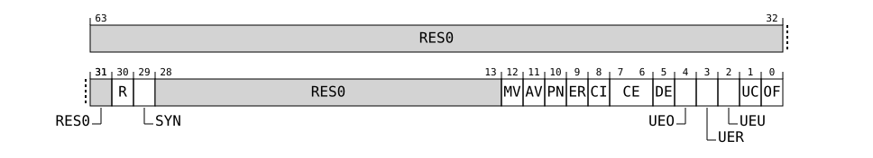

# ERXPFGF_EL1, Selected Pseudo-fault Generation Feature Register

Source: <https://developer.arm.com/documentation/107721/0001/AArch64-registers/AArch64-RAS-registers-summary/ERXPFGF-EL1--Selected-Pseudo-fault-Generation-Feature-Register>

### ERXPFGF\_EL1, Selected Pseudo-fault Generation Feature Register

Accesses the ext-CLUSTERRAS\_ERR0PFGF register when the value in AArch64-ERRSELR\_EL1.SEL is set to 0.

### Configurations

AArch64 register ERXPFGF\_EL1 bits [63:0] are architecturally mapped to External System register [CLUSTERRAS\_ERR0PFGF, Pseudo-fault Generation Feature Register](/documentation/107721/0001/External-registers/Registers-accessed-over-the-utility-bus/External-cluster-RAS-registers-summary/CLUSTERRAS-ERR0PFGF--Pseudo-fault-Generation-Feature-Register?lang=en "Defines which common architecturally-defined fault generation features are implemented.") bits [63:0].

### Attributes

Width
:   64

Functional group
:   RAS registers

Access type
:   See bit descriptions

Reset value
:   ```
    xxxx xxxx xxxx xxxx xxxx xxxx xxxx xxxx x11x xxxx xxxx xxxx xxx1 0101 0110 0011
    |    |    |    |    |    |    |    |    |    |    |    |    |    |    |    |  |
    63   59   55   51   47   43   39   35   31   27   23   19   15   11   7    3  0
    ```

    > ### Note
    >
    > Where the reset reads xxxx, see individual bits.

### Bit descriptions

Figure 1. AArch64\_erxpfgf\_el1 bit assignments



<table id="bqq1733414907528__aerxpfgf_el1-0">
 <caption>
  <span class="documents-tablecap">
   <span class="documents-table--title-label">
    Table 1.
   </span>
   ERXPFGF_EL1 bit descriptions
  </span>
 </caption>
 <colgroup>
  <col span="1"/>
  <col span="1"/>
  <col span="1"/>
  <col span="1"/>
 </colgroup>
 <thead>
  <tr>
   <th class="documents-nocellnorowborder" colspan="1" id="d216903e152" rowspan="1">
    Bits
   </th>
   <th class="documents-nocellnorowborder" colspan="1" id="d216903e155" rowspan="1">
    Name
   </th>
   <th class="documents-nocellnorowborder" colspan="1" id="d216903e158" rowspan="1">
    Description
   </th>
   <th class="documents-cell-norowborder" colspan="1" id="d216903e161" rowspan="1">
    Reset
   </th>
  </tr>
 </thead>
 <tbody>
  <tr>
   <td class="documents-nocellnorowborder" colspan="1" rowspan="1">
    [63:31]
   </td>
   <td class="documents-nocellnorowborder" colspan="1" rowspan="1">
    <span class="documents-archterm">
     RES0
    </span>
   </td>
   <td class="documents-nocellnorowborder" colspan="1" rowspan="1">
    Reserved
   </td>
   <td class="documents-cell-norowborder" colspan="1" id="bqq1733414907528__63-31-reset" rowspan="1">
    <span class="documents-archterm">
     RES0
    </span>
   </td>
  </tr>
  <tr>
   <td class="documents-nocellnorowborder" colspan="1" rowspan="1">
    [30]
   </td>
   <td class="documents-nocellnorowborder" colspan="1" rowspan="1">
    R
   </td>
   <td class="documents-nocellnorowborder" colspan="1" rowspan="1">
    <p>
     Restartable. Support for Error Generation Counter restart mode.
    </p>
    <dl>
     <dt class="documents-dlterm">
      <span class="documents-g.number.bin">
       0b1
      </span>
     </dt>
     <dd>
      <p>
       Feature controllable.
      </p>
     </dd>
    </dl>
   </td>
   <td class="documents-cell-norowborder" colspan="1" id="bqq1733414907528__id-30-reset" rowspan="1">
    <span class="documents-g.number.bin">
     0b1
    </span>
   </td>
  </tr>
  <tr>
   <td class="documents-nocellnorowborder" colspan="1" rowspan="1">
    [29]
   </td>
   <td class="documents-nocellnorowborder" colspan="1" rowspan="1">
    SYN
   </td>
   <td class="documents-nocellnorowborder" colspan="1" rowspan="1">
    <p>
     Syndrome. Fault syndrome injection.
    </p>
    <dl>
     <dt class="documents-dlterm">
      <span class="documents-g.number.bin">
       0b1
      </span>
     </dt>
     <dd>
      <p>
       When an injected error is recorded, the node does not update the ext-CLUSTERRAS_ERR0STATUS.{IERR, SERR} fields. ext-CLUSTERRAS_ERR0STATUS.{IERR, SERR} are writable when ext-CLUSTERRAS_ERR0STATUS.V == 0.
      </p>
     </dd>
    </dl>
    <div class="documents-p">
     <blockquote title="Note info">
      <h3 class="documents-underline">
       Note
      </h3>
      Software can write intended values into the ext-CLUSTERRAS_ERR0STATUS.{IERR, SERR} fields when setting up a fault injection event.
     </blockquote>
    </div>
   </td>
   <td class="documents-cell-norowborder" colspan="1" id="bqq1733414907528__id-29-reset" rowspan="1">
    <span class="documents-g.number.bin">
     0b1
    </span>
   </td>
  </tr>
  <tr>
   <td class="documents-nocellnorowborder" colspan="1" rowspan="1">
    [28:13]
   </td>
   <td class="documents-nocellnorowborder" colspan="1" rowspan="1">
    <span class="documents-archterm">
     RES0
    </span>
   </td>
   <td class="documents-nocellnorowborder" colspan="1" rowspan="1">
    Reserved
   </td>
   <td class="documents-cell-norowborder" colspan="1" id="bqq1733414907528__28-13-reset" rowspan="1">
    <span class="documents-archterm">
     RES0
    </span>
   </td>
  </tr>
  <tr>
   <td class="documents-nocellnorowborder" colspan="1" rowspan="1">
    [12]
   </td>
   <td class="documents-nocellnorowborder" colspan="1" rowspan="1">
    MV
   </td>
   <td class="documents-nocellnorowborder" colspan="1" rowspan="1">
    <p>
     Miscellaneous syndrome.
    </p>
    <p>
     Additional syndrome injection. Defines whether software can control all or part of the syndrome recorded in the CLUSTERRAS_ERR0MISC0 register when an injected error is recorded.
    </p>
    <p>
     CLUSTERRAS_ERR0MISC1-3 registers are reserved and unused for this purpose.
    </p>
    <dl>
     <dt class="documents-dlterm">
      <span class="documents-g.number.bin">
       0b1
      </span>
     </dt>
     <dd>
      <p>
       When an injected error is recorded, the node does not update all the syndrome fields in CLUSTERRAS_ERR0MISC0.
      </p>
      <p>
       The node records syndrome in CLUSTERRAS_ERR0MISC0 OFO, CECO, OFR, CECR, WAY, INDX, LVL, and IND fields and sets ext-CLUSTERRAS_ERR0STATUS.MV to 1. CLUSTERRAS_ERR0PGFCTL.MV is
       <span class="documents-archterm">
        RAO
       </span>
       .
      </p>
     </dd>
    </dl>
    <div class="documents-p">
     <blockquote title="Note info">
      <h3 class="documents-underline">
       Note
      </h3>
      Software can write intended values into the CLUSTERRAS_ERR0MISC0 register when setting up a fault injection event.
     </blockquote>
    </div>
   </td>
   <td class="documents-cell-norowborder" colspan="1" id="bqq1733414907528__id-12-reset" rowspan="1">
    <span class="documents-g.number.bin">
     0b1
    </span>
   </td>
  </tr>
  <tr>
   <td class="documents-nocellnorowborder" colspan="1" rowspan="1">
    [11]
   </td>
   <td class="documents-nocellnorowborder" colspan="1" rowspan="1">
    AV
   </td>
   <td class="documents-nocellnorowborder" colspan="1" rowspan="1">
    <p>
     Address syndrome. Address syndrome injection. Always
     <span class="documents-archterm">
      RAZ/WI
     </span>
     .
    </p>
    <dl>
     <dt class="documents-dlterm">
      <span class="documents-g.number.bin">
       0b0
      </span>
     </dt>
     <dd>
      <p>
       The node does not support ext-CLUSTERRAS_ERR0ADDR and does not set ext-CLUSTERRAS_ERR0STATUS.AV.
      </p>
     </dd>
    </dl>
   </td>
   <td class="documents-cell-norowborder" colspan="1" id="bqq1733414907528__id-11-reset" rowspan="1">
    <span class="documents-g.number.bin">
     0b0
    </span>
   </td>
  </tr>
  <tr>
   <td class="documents-nocellnorowborder" colspan="1" rowspan="1">
    [10]
   </td>
   <td class="documents-nocellnorowborder" colspan="1" rowspan="1">
    PN
   </td>
   <td class="documents-nocellnorowborder" colspan="1" rowspan="1">
    <p>
     Poison flag. Describes how the fault generation feature of the node sets the ext-CLUSTERRAS_ERR0STATUS.PN status flag.
    </p>
    <dl>
     <dt class="documents-dlterm">
      <span class="documents-g.number.bin">
       0b1
      </span>
     </dt>
     <dd>
      <p>
       When an injected error is recorded, ext-CLUSTERRAS_ERR0STATUS.PN is set to ext-CLUSTERRAS_ERR0PFGCTL.PN.
      </p>
     </dd>
    </dl>
   </td>
   <td class="documents-cell-norowborder" colspan="1" id="bqq1733414907528__id-10-reset" rowspan="1">
    <span class="documents-g.number.bin">
     0b1
    </span>
   </td>
  </tr>
  <tr>
   <td class="documents-nocellnorowborder" colspan="1" rowspan="1">
    [9]
   </td>
   <td class="documents-nocellnorowborder" colspan="1" rowspan="1">
    ER
   </td>
   <td class="documents-nocellnorowborder" colspan="1" rowspan="1">
    <p>
     Error Reported flag. Describes how the fault generation feature of the node sets the ext-CLUSTERRAS_ERR0STATUS.ER status flag.
    </p>
    <dl>
     <dt class="documents-dlterm">
      <span class="documents-g.number.bin">
       0b0
      </span>
     </dt>
     <dd>
      <p>
       When an injected error is recorded, the node does not set ext-CLUSTERRAS_ERR0STATUS.ER.
      </p>
     </dd>
    </dl>
    <p>
     This bit reads-as-zero.
    </p>
   </td>
   <td class="documents-cell-norowborder" colspan="1" id="bqq1733414907528__id-9-reset" rowspan="1">
    <span class="documents-g.number.bin">
     0b0
    </span>
   </td>
  </tr>
  <tr>
   <td class="documents-nocellnorowborder" colspan="1" rowspan="1">
    [8]
   </td>
   <td class="documents-nocellnorowborder" colspan="1" rowspan="1">
    CI
   </td>
   <td class="documents-nocellnorowborder" colspan="1" rowspan="1">
    <p>
     Critical Error flag. Describes how the fault generation feature of the node sets the ext-CLUSTERRAS_ERR0STATUS.CI status flag.
    </p>
    <dl>
     <dt class="documents-dlterm">
      <span class="documents-g.number.bin">
       0b1
      </span>
     </dt>
     <dd>
      <p>
       When an injected error is recorded, ext-CLUSTERRAS_ERR0STATUS.CI is set to ext-CLUSTERRAS_ERR0PFGCTL.CI.
      </p>
     </dd>
    </dl>
   </td>
   <td class="documents-cell-norowborder" colspan="1" id="bqq1733414907528__id-8-reset" rowspan="1">
    <span class="documents-g.number.bin">
     0b1
    </span>
   </td>
  </tr>
  <tr>
   <td class="documents-nocellnorowborder" colspan="1" rowspan="1">
    [7:6]
   </td>
   <td class="documents-nocellnorowborder" colspan="1" rowspan="1">
    CE
   </td>
   <td class="documents-nocellnorowborder" colspan="1" rowspan="1">
    <p>
     Corrected Error generation. Describes the types of Corrected Error that the fault generation feature of the node can generate.
    </p>
    <dl>
     <dt class="documents-dlterm">
      <span class="documents-g.number.bin">
       0b01
      </span>
     </dt>
     <dd>
      <p>
       The fault generation feature of the node allows generation of a non-specific Corrected Error, that is, a Corrected Error that is recorded as ext-CLUSTERRAS_ERR0STATUS.CE == 0b10.
      </p>
     </dd>
    </dl>
   </td>
   <td class="documents-cell-norowborder" colspan="1" id="bqq1733414907528__id-7-6-reset" rowspan="1">
    <span class="documents-g.number.bin">
     0b01
    </span>
   </td>
  </tr>
  <tr>
   <td class="documents-nocellnorowborder" colspan="1" rowspan="1">
    [5]
   </td>
   <td class="documents-nocellnorowborder" colspan="1" rowspan="1">
    DE
   </td>
   <td class="documents-nocellnorowborder" colspan="1" rowspan="1">
    <p>
     Deferred Error generation. Describes whether the fault generation feature of the node can generate this type of error.
    </p>
    <dl>
     <dt class="documents-dlterm">
      <span class="documents-g.number.bin">
       0b1
      </span>
     </dt>
     <dd>
      <p>
       The fault generation feature of the node allows generation of this type of error.
      </p>
     </dd>
    </dl>
   </td>
   <td class="documents-cell-norowborder" colspan="1" id="bqq1733414907528__id-5-reset" rowspan="1">
    <span class="documents-g.number.bin">
     0b1
    </span>
   </td>
  </tr>
  <tr>
   <td class="documents-nocellnorowborder" colspan="1" rowspan="1">
    [4]
   </td>
   <td class="documents-nocellnorowborder" colspan="1" rowspan="1">
    UEO
   </td>
   <td class="documents-nocellnorowborder" colspan="1" rowspan="1">
    <p>
     Latent or Restartable Error generation. Describes whether the fault generation feature of the node can generate this type of error.
    </p>
    <dl>
     <dt class="documents-dlterm">
      <span class="documents-g.number.bin">
       0b0
      </span>
     </dt>
     <dd>
      <p>
       The fault generation feature of the node cannot generate this type of error.
      </p>
     </dd>
    </dl>
    <p>
     This bit reads-as-zero.
    </p>
   </td>
   <td class="documents-cell-norowborder" colspan="1" id="bqq1733414907528__id-4-reset" rowspan="1">
    <span class="documents-g.number.bin">
     0b0
    </span>
   </td>
  </tr>
  <tr>
   <td class="documents-nocellnorowborder" colspan="1" rowspan="1">
    [3]
   </td>
   <td class="documents-nocellnorowborder" colspan="1" rowspan="1">
    UER
   </td>
   <td class="documents-nocellnorowborder" colspan="1" rowspan="1">
    <p>
     Signaled or Recoverable Error generation. Describes whether the fault generation feature of the node can generate this type of error.
    </p>
    <dl>
     <dt class="documents-dlterm">
      <span class="documents-g.number.bin">
       0b0
      </span>
     </dt>
     <dd>
      <p>
       The fault generation feature of the node cannot generate this type of error.
      </p>
     </dd>
    </dl>
    <p>
     This bit reads-as-zero.
    </p>
   </td>
   <td class="documents-cell-norowborder" colspan="1" id="bqq1733414907528__id-3-reset" rowspan="1">
    <span class="documents-g.number.bin">
     0b0
    </span>
   </td>
  </tr>
  <tr>
   <td class="documents-nocellnorowborder" colspan="1" rowspan="1">
    [2]
   </td>
   <td class="documents-nocellnorowborder" colspan="1" rowspan="1">
    UEU
   </td>
   <td class="documents-nocellnorowborder" colspan="1" rowspan="1">
    <p>
     Unrecoverable Error generation. Describes whether the fault generation feature of the node can generate this type of error.
    </p>
    <dl>
     <dt class="documents-dlterm">
      <span class="documents-g.number.bin">
       0b0
      </span>
     </dt>
     <dd>
      <p>
       The fault generation feature of the node cannot generate this type of error.
      </p>
     </dd>
    </dl>
    <p>
     This bit reads-as-zero.
    </p>
   </td>
   <td class="documents-cell-norowborder" colspan="1" id="bqq1733414907528__id-2-reset" rowspan="1">
    <span class="documents-g.number.bin">
     0b0
    </span>
   </td>
  </tr>
  <tr>
   <td class="documents-nocellnorowborder" colspan="1" rowspan="1">
    [1]
   </td>
   <td class="documents-nocellnorowborder" colspan="1" rowspan="1">
    UC
   </td>
   <td class="documents-nocellnorowborder" colspan="1" rowspan="1">
    <p>
     Uncontainable Error generation. Describes whether the fault generation feature of the node can generate this type of error.
    </p>
    <dl>
     <dt class="documents-dlterm">
      <span class="documents-g.number.bin">
       0b1
      </span>
     </dt>
     <dd>
      <p>
       The fault generation feature of the node allows generation of this type of error.
      </p>
     </dd>
    </dl>
   </td>
   <td class="documents-cell-norowborder" colspan="1" id="bqq1733414907528__id-1-reset" rowspan="1">
    <span class="documents-g.number.bin">
     0b1
    </span>
   </td>
  </tr>
  <tr>
   <td class="documents-row-nocellborder" colspan="1" rowspan="1">
    [0]
   </td>
   <td class="documents-row-nocellborder" colspan="1" rowspan="1">
    OF
   </td>
   <td class="documents-row-nocellborder" colspan="1" rowspan="1">
    <p>
     Overflow flag. Describes how the fault generation feature of the node sets the ext-CLUSTERRAS_ERR0STATUS.OF status flag.
    </p>
    <dl>
     <dt class="documents-dlterm">
      <span class="documents-g.number.bin">
       0b1
      </span>
     </dt>
     <dd>
      <p>
       When an injected error is recorded, ext-CLUSTERRAS_ERR0STATUS.OF is set to ext-CLUSTERRAS_ERR0PFGCTL.OF.
      </p>
     </dd>
    </dl>
   </td>
   <td class="documents-cellrowborder" colspan="1" id="bqq1733414907528__id-0-reset" rowspan="1">
    <span class="documents-g.number.bin">
     0b1
    </span>
   </td>
  </tr>
 </tbody>
</table>

### Access

MRS <Xt>, ERXPFGF\_EL1

<table>
 <colgroup>
  <col span="1"/>
  <col span="1"/>
  <col span="1"/>
  <col span="1"/>
  <col span="1"/>
 </colgroup>
 <thead>
  <tr>
   <th class="documents-nocellnorowborder" colspan="1" id="d216903e814" rowspan="1">
    op0
   </th>
   <th class="documents-nocellnorowborder" colspan="1" id="d216903e817" rowspan="1">
    op1
   </th>
   <th class="documents-nocellnorowborder" colspan="1" id="d216903e820" rowspan="1">
    CRn
   </th>
   <th class="documents-nocellnorowborder" colspan="1" id="d216903e823" rowspan="1">
    CRm
   </th>
   <th class="documents-cell-norowborder" colspan="1" id="d216903e826" rowspan="1">
    op2
   </th>
  </tr>
 </thead>
 <tbody>
  <tr>
   <td class="documents-row-nocellborder" colspan="1" rowspan="1">
    <span class="documents-g.number.bin">
     0b11
    </span>
   </td>
   <td class="documents-row-nocellborder" colspan="1" rowspan="1">
    <span class="documents-g.number.bin">
     0b000
    </span>
   </td>
   <td class="documents-row-nocellborder" colspan="1" rowspan="1">
    <span class="documents-g.number.bin">
     0b0101
    </span>
   </td>
   <td class="documents-row-nocellborder" colspan="1" rowspan="1">
    <span class="documents-g.number.bin">
     0b0100
    </span>
   </td>
   <td class="documents-cellrowborder" colspan="1" rowspan="1">
    <span class="documents-g.number.bin">
     0b100
    </span>
   </td>
  </tr>
 </tbody>
</table>

### Accessibility

MRS <Xt>, ERXPFGF\_EL1

```
if PSTATE.EL == EL0 then
    UNDEFINED;
elsif PSTATE.EL == EL1 then
    if Halted() && EDSCR.SDD == '1' && boolean IMPLEMENTATION_DEFINED "EL3 trap priority when SDD == '1'" && SCR_EL3.FIEN == '0' then
        UNDEFINED;
    elsif EL2Enabled() && HCR_EL2.FIEN == '0' then
        AArch64.SystemAccessTrap(EL2, 0x18);
    elsif EL2Enabled() && SCR_EL3.FGTEn == '1' && HFGRTR_EL2.ERXPFGF_EL1 == '1' then
        AArch64.SystemAccessTrap(EL2, 0x18);
    elsif SCR_EL3.FIEN == '0' then
        if Halted() && EDSCR.SDD == '1' then
            UNDEFINED;
        else
            AArch64.SystemAccessTrap(EL3, 0x18);
    else
        return ERXPFGF_EL1;
elsif PSTATE.EL == EL2 then
    if Halted() && EDSCR.SDD == '1' && boolean IMPLEMENTATION_DEFINED "EL3 trap priority when SDD == '1'" && SCR_EL3.FIEN == '0' then
        UNDEFINED;
    elsif SCR_EL3.FIEN == '0' then
        if Halted() && EDSCR.SDD == '1' then
            UNDEFINED;
        else
            AArch64.SystemAccessTrap(EL3, 0x18);
    else
        return ERXPFGF_EL1;
elsif PSTATE.EL == EL3 then
    return ERXPFGF_EL1;
```
