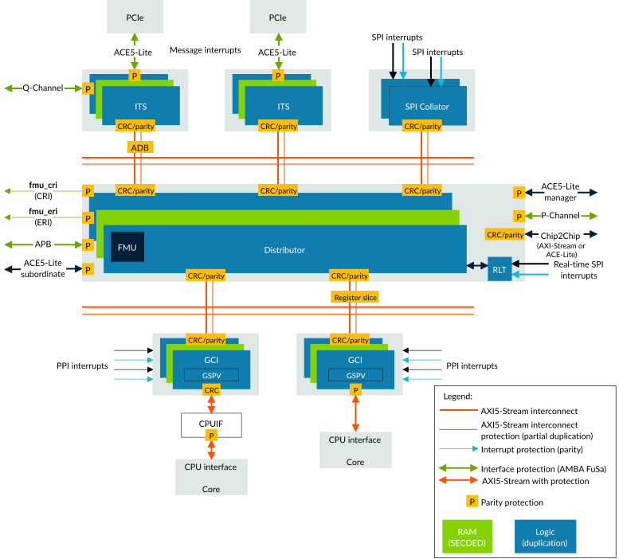

# Functional safety in GIC-720AE

Source: <https://developer.arm.com/documentation/102666/0201/Functional-safety-in-GIC-720AE>

### Functional safety in GIC-720AE

GIC-720AE is a version of GIC-700 with FuSa detection features added. All FuSa features are “bolted on” to GIC-700 and do not alter the original GIC-700 functionality.

The following figure shows where the main protection mechanisms of GIC-720AE reside.

Figure 1. Protection mechanism distribution

GIC-720AE contains the following FuSa protection mechanisms.

### Lock-step logic protection

The logic is protected with duplicated logic running in lock-step with a temporal delay.

### RAM protection

The RAMs are shared between the lock-stepped primary and secondary blocks and are protected with SECDED ECC. The address is further protected with address parity.

### AMBA® AXI5-Stream interconnect protection

The AXI5-Stream interconnect that connects the GIC blocks, is protected with either:

- AMBA parity for simple point-to-point connections
- End-to-end CRC for switched connections or when:
  - ADB domain bridges are required.
  - `structure` `== wrap` and the GIC is configured to reduce the number of AXI5-Stream interfaces on the GCI.

### AMBA external interface protection

All external AMBA interfaces are protected with AMBA parity signals. AMBA parity protects point-to-point connections consisting of wires and buffers only, and no gates. This protection includes the ACE5-Lite, AXI5-Stream, Q-Channel, P-Channel, Cross-Chip (CC), and APB external ports.

> ### Note
>
> - The P-Channel protection is for cross-chip functions on the Distributor.
> - [Protection mechanism distribution](https://developer.arm.com/documentation/102666/0201/Functional-safety-in-GIC-720AE?lang=en#ilc1528992220035__fig.safety_mechanism_distribution) shows Q-Channel parity protection that is enabled on only one ITS block. However, when `qch_protection_type` == 1, the Q-Channel protection is present for all Q-Channel interfaces.

### AMBA cross-chip interface protection

End-to-end CRC protection for cross-chip connections that use either ACE5-Lite or AXI5-Stream.

### PPI and SPI source interrupt parity protection

The PPI and SPI interrupt input sources are protected with optional parity protection. There is one parity bit for each PPI and SPI input pin.

### CPUIF protection

CPUIF protection provides protection for the AXI5-Stream interface between a GCI and a processor. CPUIF protection is required when there is not a point-to-point connection between the GCI and the processor, and it allows CRC protection to be used on the AXI5-Stream interface.

### Behavioral separation

Multi view support enables behavioral separation between interrupts and PEs in different views.

### GSPV protection

The GIC Stream Protocol Validator (GSPV) gives protocol level error detection and correction for the GIC Stream protocol, including the lower level AXI5-Stream protocol rules. Each GIC Cluster Interface (GCI) contains a GSPV.

This protection supports mixed criticality systems, where the processor has a lower ASIL level than ASIL D.

### AXI5-Stream PING/ACK

GIC-720AE contains a watchdog-based PING/ACK mechanism. This mechanism protects against systematic errors on the interconnect that connects the various GIC blocks. If the mechanism does not receive a response within the programmable timeout window, it reports a fault.

The AXI5-Stream protection contains a PING/ACK mechanism, as part of CRC end-to-end protection, where separate CRC packets are sent to check the data integrity of data packets and protect against spurious packets and packet loss.

### Clocks and resets

The clocks and resets are duplicated. The internally gated clocks operate with a temporal delay of two. That is, the secondary logic operates two cycles later than the primary logic.

### Fault Management Unit

The Fault Management Unit (FMU) resides in the Distributor. It processes faults that the protection mechanisms detect from all GIC blocks. The FMU records the fault syndrome in the error records and reports the fault using Error Recovery Interrupt (ERI) and Critical Error Interrupt (CRI). There are also FMU registers that enable fault injection and clearing for each protection mechanism. The FMU communicates with an external processor, which is responsible for handling errors after fault detection, through an APB port. The APB port is for FuSa purposes and does not exist on the GIC-700, the non-FuSa version.

### Protection mechanisms

For a detailed list of the protection mechanisms available in GIC-720AE, see the Fault Detection and Control mechanisms chapter in the Arm® CoreLink™ GIC-720AE Generic Interrupt Controller Safety Manual.
