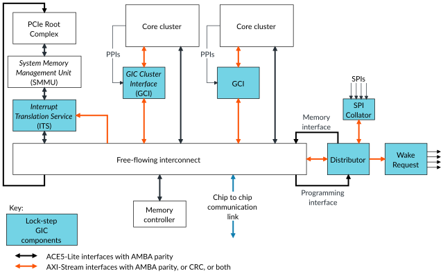
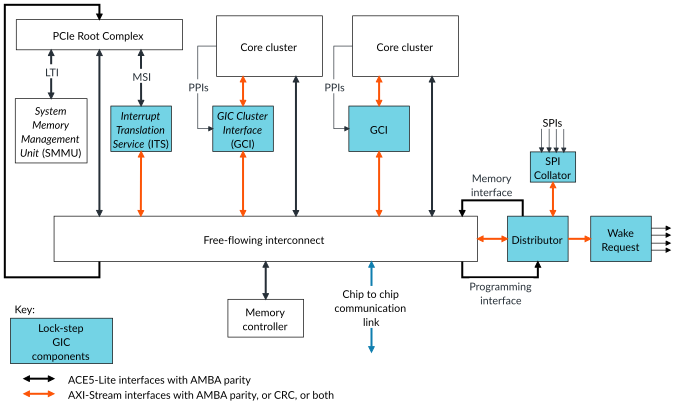
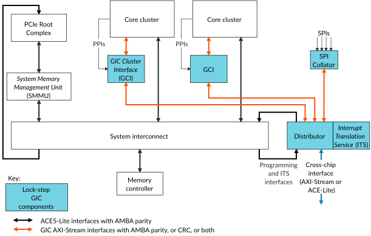

# Component overview

Source: <https://developer.arm.com/documentation/102666/0201/About-the-GIC-720AE/Component-overview>

### Component overview

The GIC-720AE comprises several significant blocks that work in combination to create a single architecturally compliant GICv3, v3.1, v3.2, v3.3, v4.1, and v4.2 implementation within the system.

Each significant block contains lock-stepped primary and secondaries to protect the blocks core logic, plus some protection mechanisms that protect the interfaces of the block.

The GIC-720AE consists of the following blocks:

Distributor (GICD)
:   The Distributor is the hub of all the GIC communications and contains the functionality for all Shared Peripheral Interrupts (SPIs)
    , real-time SPIs,
     and also Locality-specific Peripheral Interrupts (LPIs).
     The Distributor supports up to 960 real-time SPIs, to use with devices that require a deterministic interrupt latency response. It is responsible for the entire GIC programmers model
    , except for the GITS\_TRANSLATER register, which is hosted in the Interrupt Translation Service (ITS) block.

    In configurations that support GICv4.1 and GICv4.2, the Distributor also manages vSGIs and the management of vPEs.

    The Distributor also maintains the coherency of the SPI register space in multichip configurations.

    The LPI functionality for all cores on a chip is combined into a single cache in the Distributor.

GIC Cluster Interface (GCI)
:   The
    GCI maintains the Private Peripheral Interrupts (PPIs) and Software Generated Interrupts (SGIs) for
    a particular set of cores.
    A
    GCI can scale from 1-
    64 cores and is best placed next to the processors that it is servicing to reduce wiring to the cores.

    A GCI is also referred to as a Redistributor.

    The GIC architecture specifies a Redistributor address space containing 2 pages for each core for GICv3 and 4 pages for each core for GICv4.1 and v4.2. The SGI page functionality is contained in the GIC-720AE Redistributor. However, the Distributor contains the other pages for all cores on a chip. To ensure that the GCI receives compliant GIC Stream protocol from the cores, it contains a GIC Stream Protocol Validator (GSPV).

    The GIC-720AE supports powering down the GCIs and the associated cores, separately from the Distributor.

    During configuration, the GCI can be set to provide a wake request signal for each of the cores it supports.

Interrupt Translation Service (ITS)
:   The ITS translates message-based interrupts, Message-Signaled Interrupts (MSI/MSIx), from an external PCI Express (PCIe) Root Complex (RC), or other sources. The ITS also manages LPIs during core power management.

    The GIC-720AE supports up to 32 ITS blocks for each chip.

    For more information about the ITS, see the [Learn the architecture - Generic Interrupt Controller v3 and v4, LPIs](https://developer.arm.com/documentation/102923/latest).

MSI-64 Encapsulator
:   The MSI-64 Encapsulator is a small block that combines the DeviceID (DID), required by writes to the GITS\_TRANSLATER register, into a single memory access.

SPI Collator
:   The
    GIC-720AE supports up to 1984 SPIs that are spread across the system
    , but this quantity reduces by the number of real-time SPIs that connect to the Distributor. The SPI Collator enables
     standard SPIs to be converted into messages remotely from the Distributor.

    Up to 32 SPI Collators can be supported in a single configuration. The 1984 SPIs minus any real-time SPIs, can be spread across 32 SPI Collators, with a maximum of 1024 standard SPIs in one SPI Collator.

Wake Request
:   The Wake Request contains all the architecturally defined
    wake\_request signals for each core on the chip. It is a separate block that can be positioned remotely from the Distributor, such as next to a system control processor.

GIC interconnect
:   The GIC interconnect is a set of components that can be used for routing the AXI5-Stream interfaces between the different blocks.

Top level
:   The top level has no specific interfaces but combines the interfaces of other blocks within the clock or power domain to reduce the number of domain bridges. The
    GIC-720AE build scripts enable you to build the GIC from either:

    - A single combined block that uses a dedicated 16-bit  AXI5-Stream interconnect.
    - A set of individual blocks that interconnect using your own transport layer.

The following figure shows a GIC-720AE with a free-flowing interconnect in an example system.

Figure 1. GIC-720AE with free-flowing interconnect in an example system

A free-flowing channel is clear to transmit a transaction that arrives at its destination without any non-transient dependencies on other transactions.

The following figure shows a GIC-720AE example system with the PCIe root complex connecting directly to the interconnect.

Figure 2. GIC-720AE with interconnect in an example system

Cross-chip interfaces enable communication between cores in a multichip configuration.

The following figure shows a monolithic GIC-720AE with interconnect in an example system.

Figure 3. Monolithic GIC-720AE with interconnect in an example system

If the GIC supports LPIs, there must be free-flowing access to main memory. This requirement is irrespective of the interconnect that is used for routing the AXI5-Stream interfaces. For more information, see the Arm® CoreLink™ GIC-720AE Generic Interrupt Controller Configuration and Integration Manual and the interconnect documentation.

The GIC-720AE implements version 3, v3.1, v3.2, v3.3, v4.1, and v4.2 of the [Arm® Generic Interrupt Controller Architecture Specification, GIC architecture version 3 and version 4](https://developer.arm.com/documentation/ihi0069/hb). To use GIC-720AE with a core, the core must:

- Implement any of the Armv8.x-A, Armv9.x-A, or Armv8.x-R architectures and support the GIC Stream protocol.
- Support the extended range of GICv3.1 interrupts, when GIC-720AE is configured and programmed to use >960 SPIs or >16 PPIs for each core.
- Support the extended packets in the GIC Stream protocol when [GICR\_FCTLR](https://developer.arm.com/documentation/102666/0201/Programmers-model-for-GIC-720AE/Redistributor-registers-for-control-and-physical-LPIs-summary/GICR-FCTLR--Function-Control-Register?lang=en "This register controls the clock gate overrides, the denial of Q-Channel requests, and the scrubbing of all RAMs in the associated Redistributor. For real-time GCIs, it can also disable the combining of GIC Stream messages.").ECP == 1.
- Support GICv4.1 and GICv4.2, when GIC-720AE is configured and programmed to use these GICv4 features.
- Support AMBA parity on its AXI5-Stream interfaces.
