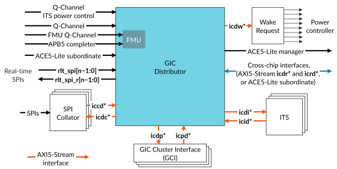

# Distributor (GICD)

Source: <https://developer.arm.com/documentation/102666/0201/Components-in-GIC-720AE/Distributor--GICD->

### Distributor (GICD)

The Distributor is the main communication point between all GIC-720AE blocks. It performs SPI management, real-time SPI prioritization, and LPI caching, and all communications with other blocks and chips. It also contains the Fault Management Unit (FMU).

When the GIC is configured to support GICv4.1, then the Distributor also performs vPE management.

The following figure shows the Distributor and its interfaces. The figure does not show the protection signals that a configuration can include.

Figure 1. GIC-720AE Distributor

> ### Note
>
> If
> [GICD\_CFGID](https://developer.arm.com/documentation/102666/0201/Programmers-model-for-GIC-720AE/Distributor-registers--GICD-GICDA--summary/GICD-CFGID--Configuration-ID-Register?lang=en "This register contains information that enables test software to determine if the GIC-720AE system is compatible.").ACE\_CC == 1, the GIC replaces the
> icdr\* and
> icrd\*
> AXI5-Stream interfaces with an
> ACE5-Lite subordinate interface.

The Distributor is the main hub of the GIC and it implements most of the GICv4.1 architecture including:

- Programming, forwarding, and prioritization of SPIs and real-time SPIs, see [SPIs](https://developer.arm.com/documentation/102666/0201/Operation-of-GIC-720AE/SPIs?lang=en "A Shared Peripheral Interrupt (SPI) is generated by a peripheral that is accessible across the whole system such as a USB receiver, and which can connect to several cores. SPIs are typically used for peripherals that are not tightly coupled to a specific core.").
- Caching and forwarding of LPIs, see [LPIs](https://developer.arm.com/documentation/102666/0201/Operation-of-GIC-720AE/LPIs?lang=en "Locality-specific Peripheral Interrupts (LPIs) are always message-based, and can be from a peripheral, or from a PCIe root complex.").
- SGI routing and forwarding, see [SGIs](https://developer.arm.com/documentation/102666/0201/Operation-of-GIC-720AE/SGIs?lang=en "Software Generated Interrupts (SGIs) are inter-processor interrupts, that is, interrupts generated from one core and sent to other cores.").
- vSGI forwarding and routing, when the GIC is configured to support GICv4.1.
- Management and control of vPEs and residency, when the GIC is configured to support GICv4.1.
- Programming interface for all registers, apart from GITS\_TRANSLATER.
- Power control of cores and Redistributors.

The Distributor also contains the FMU, which processes the faults that the protection mechanisms detect from all GIC blocks. See [Fault Management Unit](https://developer.arm.com/documentation/102666/0201/Functional-safety-in-GIC-720AE/Fault-Management-Unit?lang=en "The FMU is part of the GIC Distributor (GICD) component.") for more information.

### I/O hub support

The Distributor supports configurations with no GIC Cluster Interfaces (GCIs). This option is for systems where a central hub device has interrupt I/O and a Distributor that delivers interrupts to remote compute chiplets. Distributors with LPI support but no ITSs are also supported for these systems, where LPIs are only generated on the central hub device. Software can read [GICD\_CFGID](https://developer.arm.com/documentation/102666/0201/Programmers-model-for-GIC-720AE/Distributor-registers--GICD-GICDA--summary/GICD-CFGID--Configuration-ID-Register?lang=en "This register contains information that enables test software to determine if the GIC-720AE system is compatible.").NITS to determine if no local ITSs are present. If a Distributor has no GCI, then it includes the [GICD\_VCFGBASER](https://developer.arm.com/documentation/102666/0201/Programmers-model-for-GIC-720AE/Distributor-registers--GICD-GICDA--summary/GICD-VCFGBASER--vICM-Final-vPE-CFG-Attribute-Register?lang=en "This register returns the access attributes of the vPE Configuration table.") and [GICD\_VSLEEPR](https://developer.arm.com/documentation/102666/0201/Programmers-model-for-GIC-720AE/Distributor-registers--GICD-GICDA--summary/GICD-VSLEEPR--vICM-Sleep-Register?lang=en "This register allows software to put the virtual ITS Communication Module (vICM) to sleep and drain interrupts and programming out of the GICD.") registers.

If a system contains a chip with no GCIs, then 1 of N SPIs cannot be supported. Therefore, all GIC configurations in the system must disable 1 of N support by setting `spi_1ofn_support` = 0 in each configuration.
