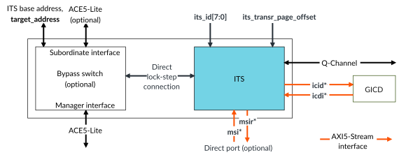
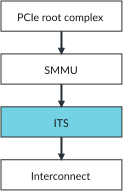

# Interrupt Translation Service

Source: <https://developer.arm.com/documentation/102666/0201/Components-in-GIC-720AE/Interrupt-Translation-Service>

### Interrupt Translation Service

The Interrupt Translation Service (ITS) provides a software mechanism for translating message-based interrupts into LPIs or vLPIs.

The following figure shows the ITS block, when the GIC is configured to include the optional bypass switch and the optional direct port. The figure does not show the protection signals that a configuration can include.

Figure 1. ITS block

The ITS is an implementation of the GICv3 and GICv4 Interrupt Translation Service as described in the [Arm® Generic Interrupt Controller Architecture Specification, GIC architecture version 3 and version 4](https://developer.arm.com/documentation/ihi0069/hb). The ITS translates MSI requests to the required LPI and target. It also has a set of commands for managing LPIs for core power management and load balancing.

A main use of the ITS is the translation of MSI/MSIx messages from a PCIe Root Complex (RC). To complete the translation, the ITS must be supplied with a DeviceID that is derived from the PCIe RequestorID. To reduce the distance that the DeviceID is transferred and to enable better compartmentalization between RCs, the ITS is best placed next to the RC. To ease integration, the ITS has an optional bypass switch as shown in the ITS block diagram. If the bypass switch is not configured, the ACE5-Lite subordinate port connects to the ITS directly. See [ITS ACE5-Lite subordinate interface](https://developer.arm.com/documentation/102666/0201/Components-in-GIC-720AE/Interrupt-Translation-Service/ITS-ACE5-Lite-subordinate-interface?lang=en "The ITS AMBA ACE5-Lite subordinate interface has a configurable data width of 64 bits, 128 bits, 256 bits, 512 bits, or 1024 bits.").

See [ITS](https://developer.arm.com/documentation/102666/0201/Operation-of-GIC-720AE/ITS?lang=en "The GIC-720AE supports up to 32 Interrupt Translation Services (ITSs) for each chip. Each ITS is responsible for translating message-based interrupts from peripherals into LPIs or vLPIs.") for more information.

The following figure provides an example of the ITS integration process.

Figure 2. ITS integration

An ITS can be placed anywhere in the system so that it is seen by devices that want to send MSIs. However, the system is responsible for ensuring that the DeviceID reaching each ITS, is not spoofed by rogue software using a<x>user signals or the direct MSI-64 port. See [MSI-64 Encapsulator](https://developer.arm.com/documentation/102666/0201/Components-in-GIC-720AE/MSI-64-Encapsulator?lang=en "The MSI-64 Encapsulator reduces system wiring by combining the DeviceID onto the data bus for writes to the GITS_TRANSLATER register.").

> ### CAUTION
>
> If the ITS is placed downstream of an interconnect, care must be taken to avoid system deadlock. For more information, see the
> Functional integration guidelines chapter in the
> Arm® CoreLink™ GIC-720AE Generic Interrupt Controller Configuration and Integration Manual.
