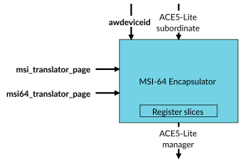

# MSI-64 Encapsulator

Source: <https://developer.arm.com/documentation/102666/0201/Components-in-GIC-720AE/MSI-64-Encapsulator>

### MSI-64 Encapsulator

The MSI-64 Encapsulator reduces system wiring by combining the DeviceID onto the data bus for writes to the GITS\_TRANSLATER register.

The following figure shows an overview of the MSI-64 Encapsulator process. The figure does not show the protection signals that a configuration can include.

Figure 1. MSI-64 Encapsulator

The MSI-64 Encapsulator detects translations that target the page address of the GITS\_TRANSLATER register, which is set by the msi\_translator\_page tie-off signal. It then converts accesses to 64-bit writes, with the awdeviceid signal value in the upper 32 bits of the data and retargets them to the msi64\_translator\_page signal. This avoids having to use wires to transfer a DeviceID to the GITS\_TRANSLATER register for translation.

> ### Note
>
> When you use the MSI-64 Encapsulator, the manager restricts the following attributes to update GITS\_TRANSLATER:
>
> - awsize\_s must be greater than or equal to 3'b001 to support sparse writes with a size greater than 32 bits
>
> - awaddr\_s[15:0] must equal 16'h0040
>
> - awlen\_s must equal 0

See [MSI-64](https://developer.arm.com/documentation/102666/0201/Operation-of-GIC-720AE/ITS/MSI-64?lang=en "The MSI-64 Encapsulator can be used to combine the DeviceID into single memory access writes to the GITS_TRANSLATER register in the ITS.") for more information.

The silicon rendering process produces two versions of the MSI-64. One version includes the \_chk signals and the other version excludes the \_chk signals.
