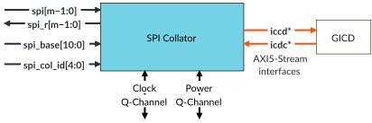

# SPI Collator

Source: <https://developer.arm.com/documentation/102666/0201/Components-in-GIC-720AE/SPI-Collator>

### SPI Collator

The SPI Collator converts SPI wires into messages to be sent to the Distributor. The GIC can be configured to provide up to 32 SPI Collators.

The following figure shows an SPI Collator block. The figure does not show the protection signals that a configuration can include.

Figure 1. SPI Collator

Individual SPIs can be synchronized into the SPI Collator, or an SPI Collator can be placed in the same clock domain as the interrupt sources and the messages that are synchronized into the Distributor.

Placing the SPI Collators in clock domains that are always on and remote from the GIC Distributor, enables more aggressive power saving because the Distributor can be clock gated hierarchically.
