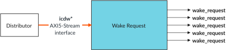

# Wake Request

Source: <https://developer.arm.com/documentation/102666/0201/Components-in-GIC-720AE/Wake-Request>

### Wake Request

The Wake Request block converts AXI5-Stream wake requests into one wake\_request signal for each core. Each wake\_request signal connects to the system power controller.

The following figure shows the Wake Request block. The figure does not show the protection signals that a configuration can include.

Figure 1. Wake Request

A wake\_request signal wakes a powered-down core when one of the following conditions is true:

- An interrupt that targets only that specific core is pending.
- [GICD\_CTLR](https://developer.arm.com/documentation/102666/0201/Programmers-model-for-GIC-720AE/Distributor-registers--GICD-GICDA--summary/GICD-CTLR--Distributor-Control-Register?lang=en "This register enables interrupts for Group 0 and Group 1. It also indicates whether the Distributor supports 1 or 2 security states, and whether a register write is in progress.").E1NWF is set, and a 1 of N SPI selects that core as its target.

The GIC-720AE does not know whether a core is powered up or down. It only knows whether software has enabled sending transactions on the AXI5-Stream interface. Therefore, a wake\_request signal remains asserted after a core has powered up. A wake\_request signal deasserts when software clears [GICR\_WAKER](https://developer.arm.com/documentation/102666/0201/Programmers-model-for-GIC-720AE/Redistributor-registers-for-control-and-physical-LPIs-summary/GICR-WAKER--Power-Management-Control-Register?lang=en "This register controls whether the GIC-720AE can be powered down.").ProcessorSleep and the GIC-720AE clears the [GICR\_WAKER](https://developer.arm.com/documentation/102666/0201/Programmers-model-for-GIC-720AE/Redistributor-registers-for-control-and-physical-LPIs-summary/GICR-WAKER--Power-Management-Control-Register?lang=en "This register controls whether the GIC-720AE can be powered down.").ChildrenAsleep bit.

If there are pending interrupts, either targeted or 1 of N, when [GICR\_WAKER](https://developer.arm.com/documentation/102666/0201/Programmers-model-for-GIC-720AE/Redistributor-registers-for-control-and-physical-LPIs-summary/GICR-WAKER--Power-Management-Control-Register?lang=en "This register controls whether the GIC-720AE can be powered down.").ProcessorSleep is set, the wake\_request signal might assert during the powerdown sequence. The power controller must ignore the wake\_request signal until the core is powered down.

An asserted wake\_request[<cpus>−1:0] signal deasserts only when:

- The Distributor exits reset, which causes it to send a clear message to the Wake Request block.
- The core is woken and software clears the [GICR\_WAKER](https://developer.arm.com/documentation/102666/0201/Programmers-model-for-GIC-720AE/Redistributor-registers-for-control-and-physical-LPIs-summary/GICR-WAKER--Power-Management-Control-Register?lang=en "This register controls whether the GIC-720AE can be powered down.").ProcessorSleep bit, which indicates that the core is able to communicate with the GIC.
- The Wake Request block is reset. If the system resets the Wake Request block, then it must also reset the Distributor.

### Core removal support

If a GIC configuration supports the removal of cores, then it is possible to modify how the GIC drives the wake\_request bus. The `wake_compress` configuration parameter controls how the bus is driven as follows:

`wake_compress` == 0
:   The GIC drives the
    wake\_request bus by using a fixed mapping between a core and its corresponding
    wake\_request signal. Use this setting when each core has its own power control logic.

`wake_compress` == 1
:   The GIC only uses the lower bits of the
    wake\_request bus when either Secure software or the
    gicd\_pe\_off[max\_pe\_on\_chip − 1:0] signal removes some cores from the configuration.
     For example, if a configuration supports 16 cores and software or hardware removes 12 cores, then the GIC only uses the wake\_request[3:0] signals. Use this setting when a centralized processor controls the power logic of the cores that remain.

See [Removing cores from a preconfigured GIC](https://developer.arm.com/documentation/102666/0201/Getting-started-with-GIC-720AE/Removing-cores-from-a-preconfigured-GIC?lang=en "The GIC can be configured to either enable Secure software or a tie-off signal to remove cores from a GIC configuration. This feature enables you to use a single GIC configuration in multiple products that contain a different number of cores.") for more information.
