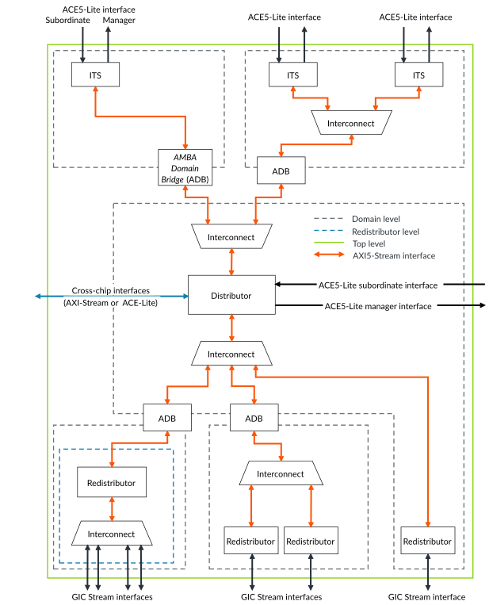

# Hierarchy

Source: <https://developer.arm.com/documentation/102666/0201/Components-in-GIC-720AE/Hierarchy>

### Hierarchy

The hierarchy of the GIC components can be selected using the `structure` configuration parameter.

The `structure` configuration parameter has the following options:

wrap
:   This option provides the lowest level of structure, and wraps the following blocks:

    - The Redistributor is wrapped with interconnect components between the Redistributor and the cores. The components that are wrapped at this level are shown within the blue dashed lines in the following figure. If the core is in a different clock domain, in accordance with the domain tags, then half of the CoreLink™ ADB-400 domain bridge is included in the `fainlight_ppi_wrap_<n>_<usrcfg>.v` stitched file.
    - The ITS is wrapped (along with any selected bypass switch) in the `fainlight_its_wrap_<n>_<usrcfg>.v` file.
    - The GICD is wrapped, including an ITS if the `monolithic` parameter is set to 1,  in the `fainlight_gicd_wrap_<usrcfg>.v` file.

domain
:   All blocks and wrapped components that are in the same domain are stitched together in a file that is called
    `fainlight_domain_<name>_<usrcfg>.v` and includes ADB-400 domain bridges and collated low-power interfaces.
     Blocks and components at this level are shown within the red dashed lines in the following figure.

full
:   All domains are stitched together to create a single top-level
    GIC-720AE file,
    `fainlight_<usrcfg>.v`.

The following figure shows the top-level options.

Figure 1. GIC top-level structure options

