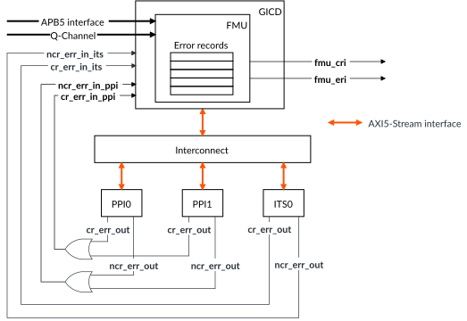

# Fault Management Unit

Source: <https://developer.arm.com/documentation/102666/0201/Functional-safety-in-GIC-720AE/Fault-Management-Unit>

### Fault Management Unit

The FMU is part of the GIC Distributor (GICD) component.

The FMU implements the following functionality in GIC-720AE:

- Dedicated APB5 interface to access error records and other registers.
- Routes all errors to the Safety Island, if enabled.
- Provides software the means to enable or disable a protection mechanism within a GIC block.
- Receives error signaling from all protection mechanisms within other GIC blocks.
- Maintains error records for each GIC block type, for software inspection and provides information on the source of the error.
- Retains error records across functional reset.
- Enables software error recovery testing by providing error injection capabilities in a protection mechanism.

The following figure shows the FMU and its interconnections.

Figure 1. FMU interconnections

