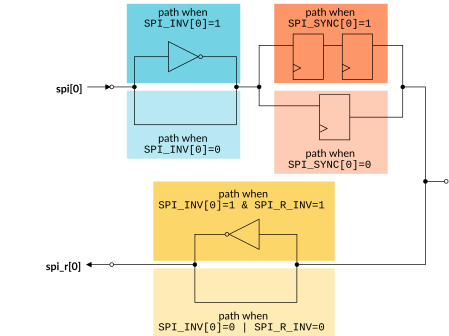

# SPI Collator wires

Source: <https://developer.arm.com/documentation/102666/0201/Components-in-GIC-720AE/SPI-Collator/SPI-Collator-wires>

### SPI Collator wires

The SPI Collator wires can be extended to create other functions.

By default, the asserted level of an SPI is active-HIGH, as with previous Arm GIC implementations. However, each SPI can be either inverted, synchronized, or both, using the `SPI_INV[n]` and `SPI_SYNC[n]` build-time options, where:

- `SPI_INV[n]` == 1 indicates that the inverter is enabled.
- `SPI_SYNC[n]` == 1 indicates that the synchronizer is enabled.
- `[n]` = SPI\_ID − 32.

Each SPI input wire, spi, has a corresponding spi\_r wire after the synchronizer or capture flop that can be used to create interrupt pulse extension for edge-triggered interrupts that cross clock domains. If `SPI_INV[n]` is set to 1, then the wire after the synchronizer is inverted with respect to the input unless the `SPI_R_INV` option is set to 1. If the `SPI_R_INV` option is set to 1, then it removes any inversion that `SPI_INV[n]` applies to individual SPIs on that SPI Collator.

The following figure shows the effect of the `SPI_INV[0]`, `SPI_SYNC[0]`, and `SPI_R_INV` build-time options on the spi[0] signal.

Figure 1. SPI parameters and signal conditioning

