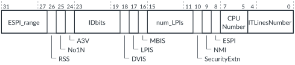

# GICD_TYPER, Interrupt Controller Type Register

Source: <https://developer.arm.com/documentation/102666/0201/Programmers-model-for-GIC-720AE/Distributor-registers--GICD-GICDA--summary/GICD-TYPER--Interrupt-Controller-Type-Register>

### GICD\_TYPER, Interrupt Controller Type Register

This register returns information about the configuration of the GIC-720AE. You can use this register to determine the number of Security states, the number of INTIDs, and the number of processor cores that the GIC supports.

For GIC configurations that support multi view, that is when [GICD\_CFGID](https://developer.arm.com/documentation/102666/0201/Programmers-model-for-GIC-720AE/Distributor-registers--GICD-GICDA--summary/GICD-CFGID--Configuration-ID-Register?lang=en "This register contains information that enables test software to determine if the GIC-720AE system is compatible.").VIEW == 1, this register is banked for each of the views.

### Configurations

This register is available in all configurations.

### Attributes

Width
:   32-bit

Functional group
:   See
    [Distributor registers (GICD/GICDA) summary](https://developer.arm.com/documentation/102666/0201/Programmers-model-for-GIC-720AE/Distributor-registers--GICD-GICDA--summary?lang=en "The GIC-720AE Distributor functions are controlled through the Distributor registers identified with the prefix GICD. The Distributor Alias registers are identified with the prefix GICDA.") for the address offset, type, and reset value of this register.

### Usage constraints

There are no usage constraints.

### Bit descriptions

Figure 1. GICD\_TYPER bit assignments

<table id="col1468410975595__tbl.gicd_typer_bit_assignments">
<caption>
Table 1. GICD_TYPER bit assignments
</caption>
<colgroup>
<col span="1"/>
<col span="1"/>
<col span="1"/>
</colgroup>
<thead>
<tr>
<th class="documents-nocellnorowborder" colspan="1" id="d87687e149" rowspan="1">Bits</th>
<th class="documents-nocellnorowborder" colspan="1" id="d87687e152" rowspan="1">Name</th>
<th class="documents-cell-norowborder" colspan="1" id="d87687e155" rowspan="1">Description</th>
</tr>
</thead>
<tbody>
<tr>
<td class="documents-nocellnorowborder" colspan="1" rowspan="1">[31:27]</td>
<td class="documents-nocellnorowborder" colspan="1" rowspan="1">ESPI_Range</td>
<td class="documents-cell-norowborder" colspan="1" rowspan="1">Returns the number of extended SPIs that GIC-720AE supports, and is given by 32×<code class="documents-parmname">spi_blocks</code> − 960. The <code class="documents-parmname">spi_blocks</code> parameter is set when the GIC is configured.</td>
</tr>
<tr>
<td class="documents-nocellnorowborder" colspan="1" rowspan="1">[26]</td>
<td class="documents-nocellnorowborder" colspan="1" rowspan="1">RSS</td>
<td class="documents-cell-norowborder" colspan="1" rowspan="1">Range selector support. Returns:

          <dl>
<dt class="documents-dlterm">
             0

           </dt>
<dd>
             The GIC supports targeted SGIs with affinity level 0 values of 0-15.

           </dd>
</dl> </td>
</tr>
<tr>
<td class="documents-nocellnorowborder" colspan="1" rowspan="1">[25]</td>
<td class="documents-nocellnorowborder" colspan="1" rowspan="1">No1N</td>
<td class="documents-cell-norowborder" colspan="1" rowspan="1">1 of N SPI:

          <dl>
<dt class="documents-dlterm">
             0

           </dt>
<dd>
             The

            GIC-720AE supports 1 of N SPI interrupts.

             This value occurs when <code class="documents-parmname">spi_1ofn_support</code> == 1.
</dd>
<dt class="documents-dlterm">
             1

           </dt>
<dd>
             The

            GIC-720AE does not support 1 of N SPI interrupts. This value occurs when

            <code class="documents-parmname">spi_1ofn_support</code> == 0.

           </dd>
</dl> </td>
</tr>
<tr>
<td class="documents-nocellnorowborder" colspan="1" rowspan="1">[24]</td>
<td class="documents-nocellnorowborder" colspan="1" rowspan="1">A3V</td>
<td class="documents-cell-norowborder" colspan="1" rowspan="1">Affinity level 3 values. Depending on the configuration, returns either:

          <dl>
<dt class="documents-dlterm">
             0

           </dt>
<dd>
             The

            GIC-720AE Distributor supports only zero values of affinity level 3.

           </dd>
<dt class="documents-dlterm">
             1

           </dt>
<dd>
             The

            GIC-720AE Distributor supports nonzero values of affinity level 3.

           </dd>
</dl> </td>
</tr>
<tr>
<td class="documents-nocellnorowborder" colspan="1" rowspan="1">[23:19]</td>
<td class="documents-nocellnorowborder" colspan="1" rowspan="1">IDbits</td>
<td class="documents-cell-norowborder" colspan="1" rowspan="1">Interrupt identifier bits:

          <dl>
<dt class="documents-dlterm">
0b01111
</dt>
<dd>
             The

            GIC-720AE supports 16 interrupt identifier bits.

           </dd>
</dl> </td>
</tr>
<tr>
<td class="documents-nocellnorowborder" colspan="1" rowspan="1">[18]</td>
<td class="documents-nocellnorowborder" colspan="1" rowspan="1">DVIS</td>
<td class="documents-cell-norowborder" colspan="1" rowspan="1">Direct virtual LPI injection support:

          <dl>
<dt class="documents-dlterm">
             0

           </dt>
<dd>
             The

            GIC-720AE does not support direct virtual LPI injection.

           </dd>
<dt class="documents-dlterm">
             1

           </dt>
<dd>
             The

            GIC-720AE does support direct virtual LPI injection.

           </dd>
</dl> 
See the <a href="https://developer.arm.com/documentation/107627/latest" target="_blank"><cite>Learn the architecture - Generic Interrupt Controller v3 and v4, Virtualization</cite></a>.
 </td>
</tr>
<tr>
<td class="documents-nocellnorowborder" colspan="1" rowspan="1">[17]</td>
<td class="documents-nocellnorowborder" colspan="1" rowspan="1">LPIS</td>
<td class="documents-cell-norowborder" colspan="1" rowspan="1">Indicates whether the GIC supports LPIs. Depending on the configuration, returns either:

          <dl>
<dt class="documents-dlterm">
             0

           </dt>
<dd>
             LPIs are not supported.

           </dd>
<dt class="documents-dlterm">
             1

           </dt>
<dd>
             LPIs are supported.

           </dd>
</dl> </td>
</tr>
<tr>
<td class="documents-nocellnorowborder" colspan="1" rowspan="1">[16]</td>
<td class="documents-nocellnorowborder" colspan="1" rowspan="1">MBIS</td>
<td class="documents-cell-norowborder" colspan="1" rowspan="1">Message-based interrupt support:

          <dl>
<dt class="documents-dlterm">
             1

           </dt>
<dd>
             The

            GIC-720AE supports message-based interrupts.

           </dd>
</dl> </td>
</tr>
<tr>
<td class="documents-nocellnorowborder" colspan="1" rowspan="1">[15:11]</td>
<td class="documents-nocellnorowborder" colspan="1" rowspan="1">num_LPIs</td>
<td class="documents-cell-norowborder" colspan="1" rowspan="1">Returns 0b00000 because GICD_TYPER.IDbits indicates the number of LPIs that the GIC supports.</td>
</tr>
<tr>
<td class="documents-nocellnorowborder" colspan="1" rowspan="1">[10]</td>
<td class="documents-nocellnorowborder" colspan="1" rowspan="1">SecurityExtn</td>
<td class="documents-cell-norowborder" colspan="1" rowspan="1">Security state support. Depending on the gicd_ctlr_ds signal as the GIC exits reset, returns either:

          <dl>
<dt class="documents-dlterm">
             0

           </dt>
<dd>
gicd_ctlr_ds signal was HIGH during reset, so the

            GIC-720AE supports only a single Security state.

           </dd>
<dt class="documents-dlterm">
             1

           </dt>
<dd>
gicd_ctlr_ds signal was LOW during reset, so the

            GIC-720AE supports 2 Security states.

           </dd>
</dl> </td>
</tr>
<tr>
<td class="documents-nocellnorowborder" colspan="1" rowspan="1">[9]</td>
<td class="documents-nocellnorowborder" colspan="1" rowspan="1">NMI</td>
<td class="documents-cell-norowborder" colspan="1" rowspan="1">Indicates whether the GIC supports non-maskable interrupts (NMIs). Depending on the configuration, returns either:

          <dl>
<dt class="documents-dlterm">
             0

           </dt>
<dd>
             NMIs are not supported. This value occurs when

            <code class="documents-parmname">nmi_support</code> == 0.

           </dd>
<dt class="documents-dlterm">
             1

           </dt>
<dd>
             NMIs are supported. This value occurs when

            <code class="documents-parmname">nmi_support</code> == 1.

           </dd>
</dl> </td>
</tr>
<tr>
<td class="documents-nocellnorowborder" colspan="1" rowspan="1">[8]</td>
<td class="documents-nocellnorowborder" colspan="1" rowspan="1">ESPI</td>
<td class="documents-cell-norowborder" colspan="1" rowspan="1">Extended SPI:

          <dl>
<dt class="documents-dlterm">
             0

           </dt>
<dd>
             The GIC is configured to support ≤960 SPIs.

           </dd>
<dt class="documents-dlterm">
             1

           </dt>
<dd>
             The GIC is configured to support &gt;960 SPIs.

           </dd>
</dl> </td>
</tr>
<tr>
<td class="documents-nocellnorowborder" colspan="1" rowspan="1">[7:5]</td>
<td class="documents-nocellnorowborder" colspan="1" rowspan="1">CPUNumber</td>
<td class="documents-cell-norowborder" colspan="1" rowspan="1">Returns 0b000 because <a class="document-topic" document-topic-path="/102666/0201/Programmers-model-for-GIC-720AE/Distributor-registers--GICD-GICDA--summary/GICD-CTLR--Distributor-Control-Register?lang=en" href="https://developer.arm.com/documentation/102666/0201/Programmers-model-for-GIC-720AE/Distributor-registers--GICD-GICDA--summary/GICD-CTLR--Distributor-Control-Register?lang=en" title="This register enables interrupts for Group 0 and Group 1. It also indicates whether the Distributor supports 1 or 2 security states, and whether a register write is in progress.">GICD_CTLR</a>.ARE==1 (ARE_NS &amp; ARE_S).</td>
</tr>
<tr>
<td class="documents-row-nocellborder" colspan="1" rowspan="1">[4:0]</td>
<td class="documents-row-nocellborder" colspan="1" rowspan="1">ITLinesNumber</td>
<td class="documents-cellrowborder" colspan="1" rowspan="1">Returns the maximum SPI INTID that this GIC-720AE implementation supports, and is given by 32×(ITLinesNumber + 1) − 1. If GICD_TYPER.ESPI ==1, then this field returns 0x1E.</td>
</tr>
</tbody>
</table>
