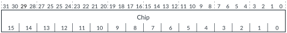

# GICD_CCCGR, Cross-Chip Control Group Register

Source: <https://developer.arm.com/documentation/102666/0201/Programmers-model-for-GIC-720AE/Distributor-registers--GICD-GICDA--summary/GICD-CCCGR--Cross-Chip-Control-Group-Register>

### GICD\_CCCGR, Cross-Chip Control Group Register

This register enables software to assign each chip to 1 of 4 credit groups. A credit group sets the number of outstanding AXI5-Stream transactions that can be sent to that group of chips.

### Configurations

This register is available in multichip configurations when [GICD\_CFGID](https://developer.arm.com/documentation/102666/0201/Programmers-model-for-GIC-720AE/Distributor-registers--GICD-GICDA--summary/GICD-CFGID--Configuration-ID-Register?lang=en "This register contains information that enables test software to determine if the GIC-720AE system is compatible.").ACE\_CC == 0 and [GICD\_CFGID](https://developer.arm.com/documentation/102666/0201/Programmers-model-for-GIC-720AE/Distributor-registers--GICD-GICDA--summary/GICD-CFGID--Configuration-ID-Register?lang=en "This register contains information that enables test software to determine if the GIC-720AE system is compatible.").CHIPS\_UPPER == 0, that is, there are ≤ 16 chips.

RES0 when either:

- [GICD\_CFGID](https://developer.arm.com/documentation/102666/0201/Programmers-model-for-GIC-720AE/Distributor-registers--GICD-GICDA--summary/GICD-CFGID--Configuration-ID-Register?lang=en "This register contains information that enables test software to determine if the GIC-720AE system is compatible.").ACE\_CC == 1
- [GICD\_CFGID](https://developer.arm.com/documentation/102666/0201/Programmers-model-for-GIC-720AE/Distributor-registers--GICD-GICDA--summary/GICD-CFGID--Configuration-ID-Register?lang=en "This register contains information that enables test software to determine if the GIC-720AE system is compatible.").ACE\_CC == 0 and [GICD\_CFGID](https://developer.arm.com/documentation/102666/0201/Programmers-model-for-GIC-720AE/Distributor-registers--GICD-GICDA--summary/GICD-CFGID--Configuration-ID-Register?lang=en "This register contains information that enables test software to determine if the GIC-720AE system is compatible.").CHIPS\_UPPER ≠ 0, that is, there are > 16 chips.

### Attributes

Width
:   32-bit

Functional group
:   See
    [Distributor registers (GICD/GICDA) summary](https://developer.arm.com/documentation/102666/0201/Programmers-model-for-GIC-720AE/Distributor-registers--GICD-GICDA--summary?lang=en "The GIC-720AE Distributor functions are controlled through the Distributor registers identified with the prefix GICD. The Distributor Alias registers are identified with the prefix GICDA.") for the address offset, type, and reset value of this register.

### Usage constraints

There are no usage constraints.

### Bit descriptions

Figure 1. GICD\_CCCGR bit assignments

<table id="oco1474357794317__tbl.gicd_cccgr">
<caption>
Table 1. GICD_CCCGR bit descriptions
</caption>
<colgroup>
<col span="1"/>
<col span="1"/>
<col span="1"/>
</colgroup>
<thead>
<tr>
<th class="documents-nocellnorowborder" colspan="1" id="d156420e192" rowspan="1">Bits</th>
<th class="documents-nocellnorowborder" colspan="1" id="d156420e195" rowspan="1">Name</th>
<th class="documents-cell-norowborder" colspan="1" id="d156420e198" rowspan="1">Description</th>
</tr>
</thead>
<tbody>
<tr>
<td class="documents-row-nocellborder" colspan="1" rowspan="1">[31:0]
Bits[2<code class="documents-option">n</code>+1:2<code class="documents-option">n</code>], for <code class="documents-option">n</code> = 0 to 15
 </td>
<td class="documents-row-nocellborder" colspan="1" rowspan="1">Chip&lt;n&gt;</td>
<td class="documents-cellrowborder" colspan="1" rowspan="1">Controls the credit group that software assigns to chip <code class="documents-option">n</code>:

          <dl>
<dt class="documents-dlterm">
0b00
</dt>
<dd>
             Chip

            <code class="documents-option">n</code> is in credit group 0, which supports

            <a class="document-topic" document-topic-path="/102666/0201/Programmers-model-for-GIC-720AE/Distributor-registers--GICD-GICDA--summary/GICD-CCCCR--Cross-Chip-Control-Credit-Register?lang=en" href="https://developer.arm.com/documentation/102666/0201/Programmers-model-for-GIC-720AE/Distributor-registers--GICD-GICDA--summary/GICD-CCCCR--Cross-Chip-Control-Credit-Register?lang=en" title="This register controls the number of outstanding AXI5-Stream transactions to a set of remote chips that are assigned to the same credit group. The GICD_CCCGR register controls the assignment of chips to a credit group.">GICD_CCCCR</a>.Group0 outstanding

            AXI5-Stream transactions.

           </dd>
<dt class="documents-dlterm">
0b01
</dt>
<dd>
             Chip

            <code class="documents-option">n</code> is in credit group 1, which supports

            <a class="document-topic" document-topic-path="/102666/0201/Programmers-model-for-GIC-720AE/Distributor-registers--GICD-GICDA--summary/GICD-CCCCR--Cross-Chip-Control-Credit-Register?lang=en" href="https://developer.arm.com/documentation/102666/0201/Programmers-model-for-GIC-720AE/Distributor-registers--GICD-GICDA--summary/GICD-CCCCR--Cross-Chip-Control-Credit-Register?lang=en" title="This register controls the number of outstanding AXI5-Stream transactions to a set of remote chips that are assigned to the same credit group. The GICD_CCCGR register controls the assignment of chips to a credit group.">GICD_CCCCR</a>.Group1 outstanding

            AXI5-Stream transactions.

           </dd>
<dt class="documents-dlterm">
0b10
</dt>
<dd>
             Chip

            <code class="documents-option">n</code> is in credit group 2, which supports

            <a class="document-topic" document-topic-path="/102666/0201/Programmers-model-for-GIC-720AE/Distributor-registers--GICD-GICDA--summary/GICD-CCCCR--Cross-Chip-Control-Credit-Register?lang=en" href="https://developer.arm.com/documentation/102666/0201/Programmers-model-for-GIC-720AE/Distributor-registers--GICD-GICDA--summary/GICD-CCCCR--Cross-Chip-Control-Credit-Register?lang=en" title="This register controls the number of outstanding AXI5-Stream transactions to a set of remote chips that are assigned to the same credit group. The GICD_CCCGR register controls the assignment of chips to a credit group.">GICD_CCCCR</a>.Group2 outstanding

            AXI5-Stream transactions.

           </dd>
<dt class="documents-dlterm">
0b11
</dt>
<dd>
             Chip

            <code class="documents-option">n</code> is in credit group 3, which supports

            <a class="document-topic" document-topic-path="/102666/0201/Programmers-model-for-GIC-720AE/Distributor-registers--GICD-GICDA--summary/GICD-CCCCR--Cross-Chip-Control-Credit-Register?lang=en" href="https://developer.arm.com/documentation/102666/0201/Programmers-model-for-GIC-720AE/Distributor-registers--GICD-GICDA--summary/GICD-CCCCR--Cross-Chip-Control-Credit-Register?lang=en" title="This register controls the number of outstanding AXI5-Stream transactions to a set of remote chips that are assigned to the same credit group. The GICD_CCCGR register controls the assignment of chips to a credit group.">GICD_CCCCR</a>.Group3 outstanding

            AXI5-Stream transactions.

           </dd>
</dl> 
The chip_id tie-off signal sets the value of <code class="documents-option">n</code> for each chip.
 </td>
</tr>
</tbody>
</table>

### Accessibility

GICD\_CCCGR is accessible only by Secure accesses.
