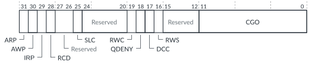

# GICD_FCTLR2, Function Control Register 2

Source: <https://developer.arm.com/documentation/102666/0201/Programmers-model-for-GIC-720AE/Distributor-registers--GICD-GICDA--summary/GICD-FCTLR2--Function-Control-Register-2>

### GICD\_FCTLR2, Function Control Register 2

This register controls clock gating and other non-architectural controls in the local Distributor. The register is not distributed and acts only on the local chip.

### Configurations

This register is available in all configurations.

### Attributes

Width
:   32-bit

Functional group
:   See
    [Distributor registers (GICD/GICDA) summary](https://developer.arm.com/documentation/102666/0201/Programmers-model-for-GIC-720AE/Distributor-registers--GICD-GICDA--summary?lang=en "The GIC-720AE Distributor functions are controlled through the Distributor registers identified with the prefix GICD. The Distributor Alias registers are identified with the prefix GICDA.") for the address offset, type, and reset value of this register.

### Usage constraints

There are no usage constraints.

### Bit descriptions

Figure 1. GICD\_FCTLR2 bit assignments

In the following table, the View column is applicable only for GIC configurations that support multi view, that is when [GICD\_CFGID](https://developer.arm.com/documentation/102666/0201/Programmers-model-for-GIC-720AE/Distributor-registers--GICD-GICDA--summary/GICD-CFGID--Configuration-ID-Register?lang=en "This register contains information that enables test software to determine if the GIC-720AE system is compatible.").VIEW == 1.

<table>
<caption>
Table 1. GICD_FCTLR2 bit assignments
</caption>
<colgroup>
<col span="1"/>
<col span="1"/>
<col span="1"/>
<col span="1"/>
</colgroup>
<thead>
<tr>
<th class="documents-nocellnorowborder" colspan="1" id="d53597e149" rowspan="1">Bits</th>
<th class="documents-nocellnorowborder" colspan="1" id="d53597e152" rowspan="1">Name</th>
<th class="documents-nocellnorowborder" colspan="1" id="d53597e155" rowspan="1">Description</th>
<th class="documents-cell-norowborder" colspan="1" id="d53597e158" rowspan="1">View</th>
</tr>
</thead>
<tbody>
<tr>
<td class="documents-nocellnorowborder" colspan="1" rowspan="1">[31]</td>
<td class="documents-nocellnorowborder" colspan="1" rowspan="1">ARP</td>
<td class="documents-nocellnorowborder" colspan="1" rowspan="1">Report read poison if corrupted data from a RAM is read.</td>
<td class="documents-cell-norowborder" colspan="1" rowspan="1">0</td>
</tr>
<tr>
<td class="documents-nocellnorowborder" colspan="1" rowspan="1">[30]</td>
<td class="documents-nocellnorowborder" colspan="1" rowspan="1">AWP</td>
<td class="documents-nocellnorowborder" colspan="1" rowspan="1">Report write poison. Reject poisoned writes on the subordinate interface.</td>
<td class="documents-cell-norowborder" colspan="1" rowspan="1">0</td>
</tr>
<tr>
<td class="documents-nocellnorowborder" colspan="1" rowspan="1">[29]</td>
<td class="documents-nocellnorowborder" colspan="1" rowspan="1">IRP</td>
<td class="documents-nocellnorowborder" colspan="1" rowspan="1">Ignore read poison from manager.</td>
<td class="documents-cell-norowborder" colspan="1" rowspan="1">0</td>
</tr>
<tr>
<td class="documents-nocellnorowborder" colspan="1" rowspan="1">[28]</td>
<td class="documents-nocellnorowborder" colspan="1" rowspan="1">RCD</td>
<td class="documents-nocellnorowborder" colspan="1" rowspan="1">Read chunking disable.</td>
<td class="documents-cell-norowborder" colspan="1" rowspan="1">0</td>
</tr>
<tr>
<td class="documents-nocellnorowborder" colspan="1" rowspan="1">[27:26]</td>
<td class="documents-nocellnorowborder" colspan="1" rowspan="1">-</td>
<td class="documents-nocellnorowborder" colspan="1" rowspan="1">Reserved, RES0</td>
<td class="documents-cell-norowborder" colspan="1" rowspan="1">0</td>
</tr>
<tr>
<td class="documents-nocellnorowborder" colspan="1" rowspan="1">[25]</td>
<td class="documents-nocellnorowborder" colspan="1" rowspan="1">SLC</td>
<td class="documents-nocellnorowborder" colspan="1" rowspan="1">Strict LPI caching:

          <dl>
<dt class="documents-dlterm">
             0

           </dt>
<dd>
             Use fully associative caching in the LPI caches. We recommend that SLC == 0, to use fully associative caching for LPIs.

           </dd>
<dt class="documents-dlterm">
             1

           </dt>
<dd>
             Use 2-way set associative caching in the LPI caches.

           </dd>
</dl> </td>
<td class="documents-cell-norowborder" colspan="1" rowspan="1">0, 1</td>
</tr>
<tr>
<td class="documents-nocellnorowborder" colspan="1" rowspan="1">[24:20]</td>
<td class="documents-nocellnorowborder" colspan="1" rowspan="1">-</td>
<td class="documents-nocellnorowborder" colspan="1" rowspan="1">Reserved, RES0</td>
<td class="documents-cell-norowborder" colspan="1" rowspan="1">-</td>
</tr>
<tr>
<td class="documents-nocellnorowborder" colspan="1" rowspan="1">[19]</td>
<td class="documents-nocellnorowborder" colspan="1" rowspan="1">RWC</td>
<td class="documents-nocellnorowborder" colspan="1" rowspan="1">Residency wait on command. See <a class="document-topic" document-topic-path="/102666/0201/Operation-of-GIC-720AE/Direct-injection/Residency-and-VMOVP?lang=en" href="https://developer.arm.com/documentation/102666/0201/Operation-of-GIC-720AE/Direct-injection/Residency-and-VMOVP?lang=en" title="Software freely moves vPEs around between PEs on both the local and remote chips, using the ITS VMOVP command.">Residency and VMOVP</a> for more information.</td>
<td class="documents-cell-norowborder" colspan="1" rowspan="1">0, 1</td>
</tr>
<tr>
<td class="documents-nocellnorowborder" colspan="1" rowspan="1">[18]</td>
<td class="documents-nocellnorowborder" colspan="1" rowspan="1">QDENY</td>
<td class="documents-nocellnorowborder" colspan="1" rowspan="1">Q-Channel deny.
Overrides the Q-Channel logic and forces the Distributor to reject powerdown requests.
 </td>
<td class="documents-cell-norowborder" colspan="1" rowspan="1">0</td>
</tr>
<tr>
<td class="documents-nocellnorowborder" colspan="1" rowspan="1">[17]</td>
<td class="documents-nocellnorowborder" colspan="1" rowspan="1">DCC</td>
<td class="documents-nocellnorowborder" colspan="1" rowspan="1">Do not correct cache.
Modifies the a&lt;x&gt;cache output signal from the Distributor.
 
See <a class="document-topic" document-topic-path="/102666/0201/Operation-of-GIC-720AE/Memory-access-and-attributes?lang=en" href="https://developer.arm.com/documentation/102666/0201/Operation-of-GIC-720AE/Memory-access-and-attributes?lang=en" title="The LPI and ITS translations and properties are located in memory tables whose locations are defined in registers that specify their base address, size, and access attributes.">Memory access and attributes</a>.
 </td>
<td class="documents-cell-norowborder" colspan="1" rowspan="1">0, 1</td>
</tr>
<tr>
<td class="documents-nocellnorowborder" colspan="1" rowspan="1">[16]</td>
<td class="documents-nocellnorowborder" colspan="1" rowspan="1">RWS</td>
<td class="documents-nocellnorowborder" colspan="1" rowspan="1">Residency wait on Pending Table System (PTS) RAM search. See <a class="document-topic" document-topic-path="/102666/0201/Operation-of-GIC-720AE/Direct-injection/Residency-and-VMOVP?lang=en" href="https://developer.arm.com/documentation/102666/0201/Operation-of-GIC-720AE/Direct-injection/Residency-and-VMOVP?lang=en" title="Software freely moves vPEs around between PEs on both the local and remote chips, using the ITS VMOVP command.">Residency and VMOVP</a> for more information.</td>
<td class="documents-cell-norowborder" colspan="1" rowspan="1">0, 1</td>
</tr>
<tr>
<td class="documents-nocellnorowborder" colspan="1" rowspan="1">[15:12]</td>
<td class="documents-nocellnorowborder" colspan="1" rowspan="1">-</td>
<td class="documents-nocellnorowborder" colspan="1" rowspan="1">Reserved, RES0</td>
<td class="documents-cell-norowborder" colspan="1" rowspan="1">-</td>
</tr>
<tr>
<td class="documents-row-nocellborder" colspan="1" rowspan="1">[11:0]</td>
<td class="documents-row-nocellborder" colspan="1" rowspan="1">CGO</td>
<td class="documents-row-nocellborder" colspan="1" rowspan="1">Clock gate override. One bit for each clock gate:

          <dl>
<dt class="documents-dlterm">
             0

           </dt>
<dd>
             Use full clock gating.

           </dd>
<dt class="documents-dlterm">
             1

           </dt>
<dd>
             Leave clock running. If clock gates are not implemented, then you must use this value.

           </dd>
</dl> 
The clock gate bit assignments are:

<dl>
<dt class="documents-dlterm">
             Bit[11], CGO[11]

           </dt>
<dd>
             Real-time (RLT) block

           </dd>
<dt class="documents-dlterm">
             Bit[10], CGO[10]

           </dt>
<dd>
             Virtual residency control

           </dd>
<dt class="documents-dlterm">
             Bit[9], CGO[9]

           </dt>
<dd>
             Virtual CPU communications block

           </dd>
<dt class="documents-dlterm">
             Bit[8], CGO[8]

           </dt>
<dd>
             ITS communications block

           </dd>
<dt class="documents-dlterm">
             Bit[7], CGO[7]

           </dt>
<dd>
             Pending table search and control

           </dd>
<dt class="documents-dlterm">
             Bit[6], CGO[6]

           </dt>
<dd>
             Trace and debug

           </dd>
<dt class="documents-dlterm">
             Bit[5], CGO[5]

           </dt>
<dd>
             SGI and GICR registers

           </dd>
<dt class="documents-dlterm">
             Bit[4], CGO[4]

           </dt>
<dd>
             LPI cache and search

           </dd>
<dt class="documents-dlterm">
             Bit[3], CGO[3]

           </dt>
<dd>
             ACE5-Lite manager interface

           </dd>
<dt class="documents-dlterm">
             Bit[2], CGO[2]

           </dt>
<dd>
             ACE5-Lite subordinate interface

           </dd>
<dt class="documents-dlterm">
             Bit[1], CGO[1]

           </dt>
<dd>
             SPI registers and search

           </dd>
<dt class="documents-dlterm">
             Bit[0], CGO[0]

           </dt>
<dd>
             CPU communications block

           </dd>
</dl> </td>
<td class="documents-cellrowborder" colspan="1" rowspan="1">0</td>
</tr>
</tbody>
</table>

### Accessibility

GICD\_FCTLR2 is accessible only by Secure accesses.
