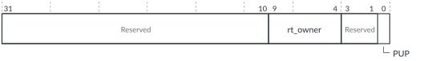

# GICD_DCHIPR, Default Chip Register

Source: <https://developer.arm.com/documentation/102666/0201/Programmers-model-for-GIC-720AE/Distributor-registers--GICD-GICDA--summary/GICD-DCHIPR--Default-Chip-Register>

### GICD\_DCHIPR, Default Chip Register

This register allows Secure software to access the status of a chip in a multichip system. A single copy of this register exists on each chip in a multichip configuration.

### Configurations

This register is available in all multichip configurations.

### Attributes

Width
:   32-bit

Functional group
:   See
    [Distributor registers (GICD/GICDA) summary](https://developer.arm.com/documentation/102666/0201/Programmers-model-for-GIC-720AE/Distributor-registers--GICD-GICDA--summary?lang=en "The GIC-720AE Distributor functions are controlled through the Distributor registers identified with the prefix GICD. The Distributor Alias registers are identified with the prefix GICDA.") for the address offset, type, and reset value of this register.

### Usage constraints

There are no usage constraints.

### Bit descriptions

Figure 1. GICD\_DCHIPR bit assignments

<table id="aba1434632065115__tbl.gicd_dchipr">
<caption>
Table 1. GICD_DCHIPR bit assignments
</caption>
<colgroup>
<col span="1"/>
<col span="1"/>
<col span="1"/>
<col span="1"/>
</colgroup>
<thead>
<tr>
<th class="documents-nocellnorowborder" colspan="1" id="d57713e131" rowspan="1">Bits</th>
<th class="documents-nocellnorowborder" colspan="1" id="d57713e134" rowspan="1">Name</th>
<th class="documents-nocellnorowborder" colspan="1" id="d57713e137" rowspan="1">Description</th>
<th class="documents-cell-norowborder" colspan="1" id="d57713e140" rowspan="1">Type</th>
</tr>
</thead>
<tbody>
<tr>
<td class="documents-nocellnorowborder" colspan="1" rowspan="1">[31:10]</td>
<td class="documents-nocellnorowborder" colspan="1" rowspan="1">-</td>
<td class="documents-nocellnorowborder" colspan="1" rowspan="1">Reserved</td>
<td class="documents-cell-norowborder" colspan="1" rowspan="1">-</td>
</tr>
<tr>
<td class="documents-nocellnorowborder" colspan="1" rowspan="1">[9:4]</td>
<td class="documents-nocellnorowborder" colspan="1" rowspan="1">rt_owner</td>
<td class="documents-nocellnorowborder" colspan="1" rowspan="1">Routing table owner:
Value = 0-maximum chip, in the configuration.
 </td>
<td class="documents-cell-norowborder" colspan="1" rowspan="1">RW</td>
</tr>
<tr>
<td class="documents-nocellnorowborder" colspan="1" rowspan="1">[3:1]</td>
<td class="documents-nocellnorowborder" colspan="1" rowspan="1">-</td>
<td class="documents-nocellnorowborder" colspan="1" rowspan="1">Reserved</td>
<td class="documents-cell-norowborder" colspan="1" rowspan="1">-</td>
</tr>
<tr>
<td class="documents-row-nocellborder" colspan="1" rowspan="1">[0]</td>
<td class="documents-row-nocellborder" colspan="1" rowspan="1">PUP</td>
<td class="documents-row-nocellborder" colspan="1" rowspan="1">Power update in progress:

          <dl>
<dt class="documents-dlterm">
             0

           </dt>
<dd>
             PUP not in progress.

           </dd>
<dt class="documents-dlterm">
             1

           </dt>
<dd>
             PUP in progress.

           </dd>
</dl> </td>
<td class="documents-cellrowborder" colspan="1" rowspan="1">RO</td>
</tr>
</tbody>
</table>

### Accessibility

GICD\_DCHIPR is accessible only by Secure accesses.
