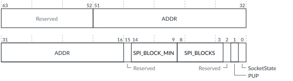

# GICD_CHIPR<n>, Chip Registers

Source: <https://developer.arm.com/documentation/102666/0201/Programmers-model-for-GIC-720AE/Distributor-registers--GICD-GICDA--summary/GICD-CHIPR-n---Chip-Registers>

### GICD\_CHIPR<n>, Chip Registers

Each register controls the configuration of the chip in a multichip system. This register exists on each chip in a multichip configuration and is identified by the chip number.

### Configurations

This register is available in all multichip configurations.

### Attributes

Width
:   64-bit

Functional group
:   See
    [Distributor registers (GICD/GICDA) summary](https://developer.arm.com/documentation/102666/0201/Programmers-model-for-GIC-720AE/Distributor-registers--GICD-GICDA--summary?lang=en "The GIC-720AE Distributor functions are controlled through the Distributor registers identified with the prefix GICD. The Distributor Alias registers are identified with the prefix GICDA.") for the address offset, type, and reset value of this register.

### Usage constraints

Ignores writes if any interrupt group enable is set, that is, [GICD\_CTLR](https://developer.arm.com/documentation/102666/0201/Programmers-model-for-GIC-720AE/Distributor-registers--GICD-GICDA--summary/GICD-CTLR--Distributor-Control-Register?lang=en "This register enables interrupts for Group 0 and Group 1. It also indicates whether the Distributor supports 1 or 2 security states, and whether a register write is in progress.").EnableGrp0 == 1, or EnableGrp1NS == 1, or EnableGrp1S == 1.

### Bit descriptions

Figure 1. GICD\_CHIPR<n> bit assignments

<table id="col1468502981738__tbl.gicd_chipr_n">
<caption>
Table 1. GICD_CHIPR&lt;n&gt; bit assignments
</caption>
<colgroup>
<col span="1"/>
<col span="1"/>
<col span="1"/>
<col span="1"/>
</colgroup>
<thead>
<tr>
<th class="documents-nocellnorowborder" colspan="1" id="d12136e138" rowspan="1">Bits</th>
<th class="documents-nocellnorowborder" colspan="1" id="d12136e141" rowspan="1">Name</th>
<th class="documents-nocellnorowborder" colspan="1" id="d12136e144" rowspan="1">Description</th>
<th class="documents-cell-norowborder" colspan="1" id="d12136e147" rowspan="1">Type</th>
</tr>
</thead>
<tbody>
<tr>
<td class="documents-nocellnorowborder" colspan="1" rowspan="1">[63:52]</td>
<td class="documents-nocellnorowborder" colspan="1" rowspan="1">-</td>
<td class="documents-nocellnorowborder" colspan="1" rowspan="1">Reserved</td>
<td class="documents-cell-norowborder" colspan="1" rowspan="1">-</td>
</tr>
<tr>
<td class="documents-nocellnorowborder" colspan="1" rowspan="1">[51:16]</td>
<td class="documents-nocellnorowborder" colspan="1" rowspan="1">ADDR</td>
<td class="documents-nocellnorowborder" colspan="1" rowspan="1">When routing messages to the remote chip, this field controls:

          <ul>
<li>The value of the icdrtdest signal for an AXI5-Stream cross-chip interface.</li>
<li>The value of the awaddr[AXIM_ADDR_WIDTH−1:16] signal for an ACE5-Lite cross-chip interface.</li>
</ul> 
The <code class="documents-parmname">chip_addr_width</code> configuration parameter controls the width of this field, so the field spans from bit[16] upwards.
 
If <a class="document-topic" document-topic-path="/102666/0201/Programmers-model-for-GIC-720AE/Distributor-registers--GICD-GICDA--summary/GICD-CFGID--Configuration-ID-Register?lang=en" href="https://developer.arm.com/documentation/102666/0201/Programmers-model-for-GIC-720AE/Distributor-registers--GICD-GICDA--summary/GICD-CFGID--Configuration-ID-Register?lang=en" title="This register contains information that enables test software to determine if the GIC-720AE system is compatible.">GICD_CFGID</a>.ACRC == 1, then bit[16] is RES0.
 </td>
<td class="documents-cell-norowborder" colspan="1" rowspan="1">RW</td>
</tr>
<tr>
<td class="documents-nocellnorowborder" colspan="1" rowspan="1">[15]</td>
<td class="documents-nocellnorowborder" colspan="1" rowspan="1">-</td>
<td class="documents-nocellnorowborder" colspan="1" rowspan="1">Reserved</td>
<td class="documents-cell-norowborder" colspan="1" rowspan="1">-</td>
</tr>
<tr>
<td class="documents-nocellnorowborder" colspan="1" rowspan="1">[14:9]</td>
<td class="documents-nocellnorowborder" colspan="1" rowspan="1">SPI_BLOCK_MIN</td>
<td class="documents-nocellnorowborder" colspan="1" rowspan="1">Controls the lowest number SPI block that is assigned to the chip.
If the lowest SPI ID (SPI_ID) to be assigned to a chip is in the 32-991 range, calculate the value using (SPI_ID − 32)/32.
 
If the lowest SPI_ID is in the 4096-5119 extended range, calculate the value using (SPI_ID − 4096)/32 + 30. SPIs in the 992-1023 range cannot be used as deliverable SPIs.
 </td>
<td class="documents-cell-norowborder" colspan="1" rowspan="1">RW</td>
</tr>
<tr>
<td class="documents-nocellnorowborder" colspan="1" rowspan="1">[8:3]</td>
<td class="documents-nocellnorowborder" colspan="1" rowspan="1">SPI_BLOCKS</td>
<td class="documents-nocellnorowborder" colspan="1" rowspan="1">Controls the number of SPI blocks that are allocated to the chip. The permitted values are 0-62.</td>
<td class="documents-cell-norowborder" colspan="1" rowspan="1">RW</td>
</tr>
<tr>
<td class="documents-nocellnorowborder" colspan="1" rowspan="1">[2]</td>
<td class="documents-nocellnorowborder" colspan="1" rowspan="1">-</td>
<td class="documents-nocellnorowborder" colspan="1" rowspan="1">Reserved</td>
<td class="documents-cell-norowborder" colspan="1" rowspan="1">-</td>
</tr>
<tr>
<td class="documents-nocellnorowborder" colspan="1" rowspan="1">[1]</td>
<td class="documents-nocellnorowborder" colspan="1" rowspan="1">PUP</td>
<td class="documents-nocellnorowborder" colspan="1" rowspan="1">This bit returns the power update status:

          <dl>
<dt class="documents-dlterm">
             0

           </dt>
<dd>
             Power update is complete.

           </dd>
<dt class="documents-dlterm">
             1

           </dt>
<dd>
             Power update in progress.

           </dd>
</dl> </td>
<td class="documents-cell-norowborder" colspan="1" rowspan="1">RO</td>
</tr>
<tr>
<td class="documents-row-nocellborder" colspan="1" rowspan="1">[0]</td>
<td class="documents-row-nocellborder" colspan="1" rowspan="1">SocketState</td>
<td class="documents-row-nocellborder" colspan="1" rowspan="1">This bit controls the state of the chip:

          <dl>
<dt class="documents-dlterm">
             0

           </dt>
<dd>
             Chip is offline.

           </dd>
<dt class="documents-dlterm">
             1

           </dt>
<dd>
             Chip is online.

           </dd>
</dl> </td>
<td class="documents-cellrowborder" colspan="1" rowspan="1">RW</td>
</tr>
</tbody>
</table>

### Accessibility

GICD\_CHIPR<n> is accessible only by Secure accesses.
