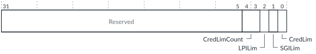

# GICD_VFCTLR, Virtual Function Control Register

Source: <https://developer.arm.com/documentation/102666/0201/Programmers-model-for-GIC-720AE/Distributor-registers--GICD-GICDA--summary/GICD-VFCTLR--Virtual-Function-Control-Register>

### GICD\_VFCTLR, Virtual Function Control Register

This register controls the chicken bit functionality in the vICM. You can use GICD\_VFCTLR to restrict the vLPI and vSGI buffer size to 1, and restrict the number of cross-chip vSGI tokens.

### Configurations

This register is available in all configurations when `ppi_count` == 0, that is, there are zero GCIs.

### Attributes

Width
:   32-bit

Functional group
:   See
    [Distributor registers (GICD/GICDA) summary](https://developer.arm.com/documentation/102666/0201/Programmers-model-for-GIC-720AE/Distributor-registers--GICD-GICDA--summary?lang=en "The GIC-720AE Distributor functions are controlled through the Distributor registers identified with the prefix GICD. The Distributor Alias registers are identified with the prefix GICDA.") for the address offset, type, and reset value of this register.

### Usage constraints

There are no usage constraints.

### Bit descriptions

Figure 1. GICD\_VFCTLR bit assignments

<table id="wfd1517414286643__tbl.GICD_VFCTLR">
<caption>
Table 1. GICD_VFCTLR bit descriptions
</caption>
<colgroup>
<col span="1"/>
<col span="1"/>
<col span="1"/>
</colgroup>
<thead>
<tr>
<th class="documents-nocellnorowborder" colspan="1" id="d7523e139" rowspan="1">Bits</th>
<th class="documents-nocellnorowborder" colspan="1" id="d7523e142" rowspan="1">Name</th>
<th class="documents-cell-norowborder" colspan="1" id="d7523e145" rowspan="1">Description</th>
</tr>
</thead>
<tbody>
<tr>
<td class="documents-nocellnorowborder" colspan="1" rowspan="1">[31:5]</td>
<td class="documents-nocellnorowborder" colspan="1" rowspan="1">-</td>
<td class="documents-cell-norowborder" colspan="1" rowspan="1">Reserved, RES0</td>
</tr>
<tr>
<td class="documents-nocellnorowborder" colspan="1" rowspan="1">[4:3]</td>
<td class="documents-nocellnorowborder" colspan="1" rowspan="1">CredLimCount</td>
<td class="documents-cell-norowborder" colspan="1" rowspan="1">When CredLim == 1, this field can reduce the number of vSGIs that can be sent to each chip:

          <dl>
<dt class="documents-dlterm">
             0

           </dt>
<dd>
             1 vSGI can be outstanding to each chip.

           </dd>
<dt class="documents-dlterm">
             1

           </dt>
<dd>
             2 vSGIs can be outstanding to each chip.

           </dd>
<dt class="documents-dlterm">
             2

           </dt>
<dd>
             3 vSGIs can be outstanding to each chip.

           </dd>
<dt class="documents-dlterm">
             3

           </dt>
<dd>
             4 vSGIs can be outstanding to each chip.

           </dd>
</dl> 
If you set a value that is greater than <code class="documents-parmname">vsgi_cc_tokens</code> − 1, then the GIC behaves as if CredLim == 0.
 </td>
</tr>
<tr>
<td class="documents-nocellnorowborder" colspan="1" rowspan="1">[2]</td>
<td class="documents-nocellnorowborder" colspan="1" rowspan="1">LPILim</td>
<td class="documents-cell-norowborder" colspan="1" rowspan="1">When set to 1, limits vLPI buffer size to 1.</td>
</tr>
<tr>
<td class="documents-nocellnorowborder" colspan="1" rowspan="1">[1]</td>
<td class="documents-nocellnorowborder" colspan="1" rowspan="1">SGILim</td>
<td class="documents-cell-norowborder" colspan="1" rowspan="1">When set to 1, limits vSGI buffer size to 1.</td>
</tr>
<tr>
<td class="documents-row-nocellborder" colspan="1" rowspan="1">[0]</td>
<td class="documents-row-nocellborder" colspan="1" rowspan="1">CredLim</td>
<td class="documents-cellrowborder" colspan="1" rowspan="1">This bit enables you to reduce the number of vSGIs that can be sent to each chip:

          <dl>
<dt class="documents-dlterm">
             0

           </dt>
<dd>
             The

            <code class="documents-parmname">vsgi_cc_tokens</code> configuration parameter sets the number of vSGIs that can be sent to each chip.

           </dd>
<dt class="documents-dlterm">
             1

           </dt>
<dd>
             The CredLimCount field sets the number of vSGIs that can be sent to each chip.

           </dd>
</dl> </td>
</tr>
</tbody>
</table>

### Accessibility

GICD\_VFCTLR is accessible only by Secure accesses.
