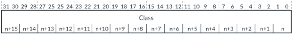

# GICD_ICLARnE, Interrupt Class Registers Extended

Source: <https://developer.arm.com/documentation/102666/0201/Programmers-model-for-GIC-720AE/Distributor-registers--GICD-GICDA--summary/GICD-ICLARnE--Interrupt-Class-Registers-Extended>

### GICD\_ICLARnE, Interrupt Class Registers Extended

These registers control whether a 1 of N SPI can target a core that is assigned to class 0 or class 1 group. Each register controls 16 SPIs and the GIC-720AE has 64 registers, GICD\_ICLAR0E-GICD\_ICLAR63E.

### Configurations

This register is available in all configurations with > 960 SPIs.

### Attributes

Width
:   32-bit

Functional group
:   See
    [Distributor registers (GICD/GICDA) summary](https://developer.arm.com/documentation/102666/0201/Programmers-model-for-GIC-720AE/Distributor-registers--GICD-GICDA--summary?lang=en "The GIC-720AE Distributor functions are controlled through the Distributor registers identified with the prefix GICD. The Distributor Alias registers are identified with the prefix GICDA.") for the address offset, type, and reset value of this register.

### Usage constraints

The Distributor provides up to 64 registers to support the extended SPIs, 961-1984. If you configure the GIC-720AE to use fewer than 1984 SPIs, then it reduces the number of registers accordingly. For locations where interrupts are not implemented, the register is RAZ/WI.

### Bit descriptions

Figure 1. GICD\_ICLARnE bit assignments

<table id="fci1496647731098__tbl.gicd_iclar_n_e">
<caption>
Table 1. GICD_ICLARnE bit descriptions
</caption>
<colgroup>
<col span="1"/>
<col span="1"/>
<col span="1"/>
</colgroup>
<thead>
<tr>
<th class="documents-nocellnorowborder" colspan="1" id="d56675e136" rowspan="1">Bits</th>
<th class="documents-nocellnorowborder" colspan="1" id="d56675e139" rowspan="1">Name</th>
<th class="documents-cell-norowborder" colspan="1" id="d56675e142" rowspan="1">Description</th>
</tr>
</thead>
<tbody>
<tr>
<td class="documents-row-nocellborder" colspan="1" rowspan="1">[31:0]
Bits[2<code class="documents-option">x</code>+1:2<code class="documents-option">x</code>], for <code class="documents-option">x</code> = 0 to 15
 </td>
<td class="documents-row-nocellborder" colspan="1" rowspan="1">Class&lt;x&gt;</td>
<td class="documents-cellrowborder" colspan="1" rowspan="1">Controls whether the 1 of N SPI can target a core, depending on the class group that the core is assigned to:

          <dl>
<dt class="documents-dlterm">
0b00
</dt>
<dd>
             The SPI can target a core that is assigned to class 0 or class 1

           </dd>
<dt class="documents-dlterm">
0b01
</dt>
<dd>
             The SPI can target a core that is assigned to class 1

           </dd>
<dt class="documents-dlterm">
0b10
</dt>
<dd>
             The SPI can target a core that is assigned to class 0

           </dd>
<dt class="documents-dlterm">
0b11
</dt>
<dd>
             The SPI cannot target a core that is assigned to class 0 or class 1

           </dd>
</dl> 
The SPI that a bit refers to, depends on its bit position and the base address offset of the GICD_ICLAR<code class="documents-option">n</code>E, that is, SPI = 960 + 16×<code class="documents-option">n</code> + bit[number]/2.
 </td>
</tr>
</tbody>
</table>
