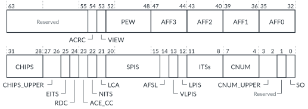

# GICD_CFGID, Configuration ID Register

Source: <https://developer.arm.com/documentation/102666/0201/Programmers-model-for-GIC-720AE/Distributor-registers--GICD-GICDA--summary/GICD-CFGID--Configuration-ID-Register>

### GICD\_CFGID, Configuration ID Register

This register contains information that enables test software to determine if the GIC-720AE system is compatible.

### Configurations

This register is available in all configurations.

### Attributes

Width
:   64-bit

Functional group
:   See
    [Distributor registers (GICD/GICDA) summary](https://developer.arm.com/documentation/102666/0201/Programmers-model-for-GIC-720AE/Distributor-registers--GICD-GICDA--summary?lang=en "The GIC-720AE Distributor functions are controlled through the Distributor registers identified with the prefix GICD. The Distributor Alias registers are identified with the prefix GICDA.") for the address offset, type, and reset value of this register.

### Usage constraints

There are no usage constraints.

### Bit descriptions

Figure 1. GICD\_CFGID bit assignments

In the following table, the View column is applicable only for GIC configurations that support multi view, that is when GICD\_CFGID.VIEW == 1.

<table id="col1468512211793__tbl.gicd_cfgid_with_view_column">
<caption>
Table 1. GICD_CFGID bit assignments
</caption>
<colgroup>
<col span="1"/>
<col span="1"/>
<col span="1"/>
<col span="1"/>
</colgroup>
<thead>
<tr>
<th class="documents-nocellnorowborder" colspan="1" id="d112984e137" rowspan="1">Bits</th>
<th class="documents-nocellnorowborder" colspan="1" id="d112984e140" rowspan="1">Name</th>
<th class="documents-nocellnorowborder" colspan="1" id="d112984e143" rowspan="1">Description</th>
<th class="documents-cell-norowborder" colspan="1" id="d112984e146" rowspan="1">View</th>
</tr>
</thead>
<tbody>
<tr>
<td class="documents-nocellnorowborder" colspan="1" rowspan="1">[63:55]</td>
<td class="documents-nocellnorowborder" colspan="1" rowspan="1">-</td>
<td class="documents-nocellnorowborder" colspan="1" rowspan="1">Reserved, returns zero</td>
<td class="documents-cell-norowborder" colspan="1" rowspan="1">-</td>
</tr>
<tr>
<td class="documents-nocellnorowborder" colspan="1" rowspan="1">[54]</td>
<td class="documents-nocellnorowborder" colspan="1" rowspan="1">ACRC</td>
<td class="documents-nocellnorowborder" colspan="1" rowspan="1">Indicates whether the GIC has ACE5-Lite cross-chip interface that includes CRC protection:

          <dl>
<dt class="documents-dlterm">
             0

           </dt>
<dd>
             The GIC configuration does not have a

            ACE5-Lite cross-chip interface with cross-chip stream CRC protection.

           </dd>
<dt class="documents-dlterm">
             1

           </dt>
<dd>
             The GIC configuration has a

            ACE5-Lite cross-chip interface with cross-chip CRC protection. This value occurs when all the following are true:

            <ul>
<li>The ACE_CC bit is set to 1.</li>
<li>The <code class="documents-parmname">cc_stream_protection_type</code> configuration parameter is set to 2 or 3.</li>
</ul>
</dd>
</dl> </td>
<td class="documents-cell-norowborder" colspan="1" rowspan="1">0</td>
</tr>
<tr>
<td class="documents-nocellnorowborder" colspan="1" rowspan="1">[53]</td>
<td class="documents-nocellnorowborder" colspan="1" rowspan="1">VIEW</td>
<td class="documents-nocellnorowborder" colspan="1" rowspan="1">Indicates whether the GIC supports multi view:

          <dl>
<dt class="documents-dlterm">
             0

           </dt>
<dd>
             The GIC does not support multi view.

           </dd>
<dt class="documents-dlterm">
             1

           </dt>
<dd>
             The GIC supports multi view. This value occurs when the

            <code class="documents-parmname">multi_view_support</code> configuration parameter is set to 1.

           </dd>
</dl> </td>
<td class="documents-cell-norowborder" colspan="1" rowspan="1">0, 1, 2, 3</td>
</tr>
<tr>
<td class="documents-nocellnorowborder" colspan="1" rowspan="1">[52:48]</td>
<td class="documents-nocellnorowborder" colspan="1" rowspan="1">PEW</td>
<td class="documents-nocellnorowborder" colspan="1" rowspan="1">Width of lower part of on-chip core number field, ceil[log2(max_pe_on_chip)]. <code class="documents-parmname">max_pe_on_chip</code> is a configuration option that is set during system integration, which defines the maximum number of cores on a single chip in the system. See <a class="document-topic" document-topic-path="/102666/0201/Operation-of-GIC-720AE/LPIs/LPI-multichip-operation?lang=en" href="https://developer.arm.com/documentation/102666/0201/Operation-of-GIC-720AE/LPIs/LPI-multichip-operation?lang=en" title="The GIC-720AE does not use physical target addresses, so GITS_TYPER.PTA == 0. Therefore, GIC-720AE uses the value of GICR_TYPER.ProcessorNumber to route all LPIs and commands to their targets.">LPI multichip operation</a> for more information.</td>
<td class="documents-cell-norowborder" colspan="1" rowspan="1">0, 1, 2, 3</td>
</tr>
<tr>
<td class="documents-nocellnorowborder" colspan="1" rowspan="1">[47:44]</td>
<td class="documents-nocellnorowborder" colspan="1" rowspan="1">AFF3</td>
<td class="documents-nocellnorowborder" colspan="1" rowspan="1">Returns the Affinity3 bits.</td>
<td class="documents-cell-norowborder" colspan="1" rowspan="1">0, 1, 2, 3</td>
</tr>
<tr>
<td class="documents-nocellnorowborder" colspan="1" rowspan="1">[43:40]</td>
<td class="documents-nocellnorowborder" colspan="1" rowspan="1">AFF2</td>
<td class="documents-nocellnorowborder" colspan="1" rowspan="1">Returns the Affinity2 bits.</td>
<td class="documents-cell-norowborder" colspan="1" rowspan="1">0, 1, 2, 3</td>
</tr>
<tr>
<td class="documents-nocellnorowborder" colspan="1" rowspan="1">[39:36]</td>
<td class="documents-nocellnorowborder" colspan="1" rowspan="1">AFF1</td>
<td class="documents-nocellnorowborder" colspan="1" rowspan="1">Returns the Affinity1 bits.</td>
<td class="documents-cell-norowborder" colspan="1" rowspan="1">0, 1, 2, 3</td>
</tr>
<tr>
<td class="documents-nocellnorowborder" colspan="1" rowspan="1">[35:32]</td>
<td class="documents-nocellnorowborder" colspan="1" rowspan="1">AFF0</td>
<td class="documents-nocellnorowborder" colspan="1" rowspan="1">Returns the Affinity0 bits.</td>
<td class="documents-cell-norowborder" colspan="1" rowspan="1">0, 1, 2, 3</td>
</tr>
<tr>
<td class="documents-nocellnorowborder" colspan="1" rowspan="1">[31:28]</td>
<td class="documents-nocellnorowborder" colspan="1" rowspan="1">CHIPS</td>
<td class="documents-nocellnorowborder" colspan="1" rowspan="1">Returns the number of supported chips − 1[3:0].</td>
<td class="documents-cell-norowborder" colspan="1" rowspan="1">0, 1, 2, 3</td>
</tr>
<tr>
<td class="documents-nocellnorowborder" colspan="1" rowspan="1">[27:26]</td>
<td class="documents-nocellnorowborder" colspan="1" rowspan="1">CHIPS_UPPER</td>
<td class="documents-nocellnorowborder" colspan="1" rowspan="1">Returns the number of supported chips − 1[5:4].</td>
<td class="documents-cell-norowborder" colspan="1" rowspan="1">0, 1, 2, 3</td>
</tr>
<tr>
<td class="documents-nocellnorowborder" colspan="1" rowspan="1">[25]</td>
<td class="documents-nocellnorowborder" colspan="1" rowspan="1">EITS</td>
<td class="documents-nocellnorowborder" colspan="1" rowspan="1">Returns 1 when the GIC supports more than 16 ITSs.</td>
<td class="documents-cell-norowborder" colspan="1" rowspan="1">0, 1.
Returns zero for views 2 and 3.
 </td>
</tr>
<tr>
<td class="documents-nocellnorowborder" colspan="1" rowspan="1">[24]</td>
<td class="documents-nocellnorowborder" colspan="1" rowspan="1">RDC</td>
<td class="documents-nocellnorowborder" colspan="1" rowspan="1">Redistributor collapse. A Secure read indicates whether the GIC enables Secure software to program the core numbering:

          <dl>
<dt class="documents-dlterm">
             0

           </dt>
<dd>
             Secure software cannot program the core numbering.

           </dd>
<dt class="documents-dlterm">
             1

           </dt>
<dd>
             Secure software can program the core numbering by programming

            <a class="document-topic" document-topic-path="/102666/0201/Programmers-model-for-GIC-720AE/Distributor-registers--GICD-GICDA--summary/GICD-RDOFFR-n---Redistributor-Off-Registers?lang=en" href="https://developer.arm.com/documentation/102666/0201/Programmers-model-for-GIC-720AE/Distributor-registers--GICD-GICDA--summary/GICD-RDOFFR-n---Redistributor-Off-Registers?lang=en" title="Each register allows Secure software to remove up to 64 cores from the GIC.">GICD_RDOFFRn</a> and

            <a class="document-topic" document-topic-path="/102666/0201/Programmers-model-for-GIC-720AE/Redistributor-registers-for-control-and-physical-LPIs-summary/GICR-MPIDR--MPIDR-Register?lang=en" href="https://developer.arm.com/documentation/102666/0201/Programmers-model-for-GIC-720AE/Redistributor-registers-for-control-and-physical-LPIs-summary/GICR-MPIDR--MPIDR-Register?lang=en" title="This register allows Secure software to write the affinity values of a Redistributor.">GICR_MPIDR</a>. This bit is set to 1 when

            <code class="documents-parmname">prog_mpidr</code>
<code> == prog</code>. The

            <code class="documents-parmname">prog_mpidr</code> parameter is set during configuration of the GIC. See

            <a class="document-topic" document-topic-path="/102666/0201/Getting-started-with-GIC-720AE/Removing-cores-from-a-preconfigured-GIC?lang=en" href="https://developer.arm.com/documentation/102666/0201/Getting-started-with-GIC-720AE/Removing-cores-from-a-preconfigured-GIC?lang=en" title="The GIC can be configured to either enable Secure software or a tie-off signal to remove cores from a GIC configuration. This feature enables you to use a single GIC configuration in multiple products that contain a different number of cores.">Removing cores from a preconfigured GIC</a> for more information.

           </dd>
</dl> </td>
<td class="documents-cell-norowborder" colspan="1" rowspan="1">0.
Returns zero for views 1, 2 and 3.
 </td>
</tr>
<tr>
<td class="documents-nocellnorowborder" colspan="1" rowspan="1">[23]</td>
<td class="documents-nocellnorowborder" colspan="1" rowspan="1">ACE_CC</td>
<td class="documents-nocellnorowborder" colspan="1" rowspan="1">Indicates the AMBA® protocol that the cross-chip interface uses:

          <dl>
<dt class="documents-dlterm">
             0

           </dt>
<dd>
             The cross-chip interface uses the

            AXI5-Stream protocol.

           </dd>
<dt class="documents-dlterm">
             1

           </dt>
<dd>
             The cross-chip interface uses the

            ACE5-Lite protocol.

           </dd>
</dl> 
The cross-chip interface is not present when CHIPS == CHIPS_UPPER == 0.
 </td>
<td class="documents-cell-norowborder" colspan="1" rowspan="1">0.
Returns zero for views 1, 2 and 3.
 </td>
</tr>
<tr>
<td class="documents-nocellnorowborder" colspan="1" rowspan="1">[22]</td>
<td class="documents-nocellnorowborder" colspan="1" rowspan="1">NITS</td>
<td class="documents-nocellnorowborder" colspan="1" rowspan="1">No ITS present. Indicates whether a local ITS is present:

          <dl>
<dt class="documents-dlterm">
             0

           </dt>
<dd>
             The chip contains a local ITS.

           </dd>
<dt class="documents-dlterm">
             1

           </dt>
<dd>
             The chip has no local ITS.

           </dd>
</dl> 
Returns zero if LPIS == 0 (no LPI support).
 </td>
<td class="documents-cell-norowborder" colspan="1" rowspan="1">0, 1.
Returns zero for views 2 and 3.
 </td>
</tr>
<tr>
<td class="documents-nocellnorowborder" colspan="1" rowspan="1">[21]</td>
<td class="documents-nocellnorowborder" colspan="1" rowspan="1">LCA</td>
<td class="documents-nocellnorowborder" colspan="1" rowspan="1">Local chip addressing:

          <dl>
<dt class="documents-dlterm">
             0

           </dt>
<dd>
             All chips use the same addressing scheme to communicate with another chip.

           </dd>
<dt class="documents-dlterm">
             1

           </dt>
<dd>
             Each chip can use its own local addressing scheme when it communicates with another chip.

           </dd>
</dl> 
See <a class="document-topic" document-topic-path="/102666/0201/Operation-of-GIC-720AE/Multichip-operation?lang=en#rcq1497616721050__section.local_chip_addressing" href="https://developer.arm.com/documentation/102666/0201/Operation-of-GIC-720AE/Multichip-operation?lang=en#rcq1497616721050__section.local_chip_addressing">Local cross-chip addressing</a> for more information.
 </td>
<td class="documents-cell-norowborder" colspan="1" rowspan="1">0.
Returns zero for views 1, 2 and 3.
 </td>
</tr>
<tr>
<td class="documents-nocellnorowborder" colspan="1" rowspan="1">[20:15]</td>
<td class="documents-nocellnorowborder" colspan="1" rowspan="1">SPIS</td>
<td class="documents-nocellnorowborder" colspan="1" rowspan="1">Number of SPI blocks supported.</td>
<td class="documents-cell-norowborder" colspan="1" rowspan="1">0, 1, 2, 3</td>
</tr>
<tr>
<td class="documents-nocellnorowborder" colspan="1" rowspan="1">[14]</td>
<td class="documents-nocellnorowborder" colspan="1" rowspan="1">AFSL</td>
<td class="documents-nocellnorowborder" colspan="1" rowspan="1">Chip affinity selection level.</td>
<td class="documents-cell-norowborder" colspan="1" rowspan="1">0, 1, 2, 3</td>
</tr>
<tr>
<td class="documents-nocellnorowborder" colspan="1" rowspan="1">[13]</td>
<td class="documents-nocellnorowborder" colspan="1" rowspan="1">VLPIS</td>
<td class="documents-nocellnorowborder" colspan="1" rowspan="1">GICv4.1 supported</td>
<td class="documents-cell-norowborder" colspan="1" rowspan="1">0, 1.
Returns zero for views 2 and 3.
 </td>
</tr>
<tr>
<td class="documents-nocellnorowborder" colspan="1" rowspan="1">[12]</td>
<td class="documents-nocellnorowborder" colspan="1" rowspan="1">LPIS</td>
<td class="documents-nocellnorowborder" colspan="1" rowspan="1">LPI supported</td>
<td class="documents-cell-norowborder" colspan="1" rowspan="1">0, 1.
Returns zero for views 2 and 3.
 </td>
</tr>
<tr>
<td class="documents-nocellnorowborder" colspan="1" rowspan="1">[11:8]</td>
<td class="documents-nocellnorowborder" colspan="1" rowspan="1">ITSs</td>
<td class="documents-nocellnorowborder" colspan="1" rowspan="1">The number of supported ITSs minus 1. When:

          <ul>
<li>EITS == 0, then the ITSs field represents 0-15.</li>
<li>EITS == 1, then the ITSs field represents 16-31.</li>
</ul> 
Returns zero if LPIS == 0 (no LPI support).
 </td>
<td class="documents-cell-norowborder" colspan="1" rowspan="1">0, 1.
Returns zero for views 2 and 3.
 </td>
</tr>
<tr>
<td class="documents-nocellnorowborder" colspan="1" rowspan="1">[7:4]</td>
<td class="documents-nocellnorowborder" colspan="1" rowspan="1">CNUM</td>
<td class="documents-nocellnorowborder" colspan="1" rowspan="1">Chip number[3:0]</td>
<td class="documents-cell-norowborder" colspan="1" rowspan="1">0, 1, 2, 3</td>
</tr>
<tr>
<td class="documents-nocellnorowborder" colspan="1" rowspan="1">[3:2]</td>
<td class="documents-nocellnorowborder" colspan="1" rowspan="1">CNUM_UPPER</td>
<td class="documents-nocellnorowborder" colspan="1" rowspan="1">Chip number[5:4]</td>
<td class="documents-cell-norowborder" colspan="1" rowspan="1">0, 1, 2, 3</td>
</tr>
<tr>
<td class="documents-nocellnorowborder" colspan="1" rowspan="1">[1]</td>
<td class="documents-nocellnorowborder" colspan="1" rowspan="1">-</td>
<td class="documents-nocellnorowborder" colspan="1" rowspan="1">Reserved, returns zero</td>
<td class="documents-cell-norowborder" colspan="1" rowspan="1">-</td>
</tr>
<tr>
<td class="documents-row-nocellborder" colspan="1" rowspan="1">[0]</td>
<td class="documents-row-nocellborder" colspan="1" rowspan="1">SO</td>
<td class="documents-row-nocellborder" colspan="1" rowspan="1">Socket online status:

          <dl>
<dt class="documents-dlterm">
             0

           </dt>
<dd>
             Chip is offline.

           </dd>
<dt class="documents-dlterm">
             1

           </dt>
<dd>
             Chip is online.

           </dd>
</dl> </td>
<td class="documents-cellrowborder" colspan="1" rowspan="1">0, 1, 2, 3</td>
</tr>
</tbody>
</table>

### Accessibility

The RDC bit is accessible only by Secure accesses.
