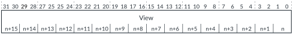

# GICD_IVIEWRn, Interrupt View Registers

Source: <https://developer.arm.com/documentation/102666/0201/Programmers-model-for-GIC-720AE/Distributor-registers--GICD-GICDA--summary/GICD-IVIEWRn--Interrupt-View-Registers>

### GICD\_IVIEWRn, Interrupt View Registers

These registers control whether an SPI is assigned to view 0, view 1, view 2, or view 3. Each register controls 16 SPIs and the GIC-720AE has 60 registers, GICD\_IVIEWR2-GICD\_IVIEWR61.

### Configurations

This register is available in configurations that support multi view, that is, when [GICD\_CFGID](https://developer.arm.com/documentation/102666/0201/Programmers-model-for-GIC-720AE/Distributor-registers--GICD-GICDA--summary/GICD-CFGID--Configuration-ID-Register?lang=en "This register contains information that enables test software to determine if the GIC-720AE system is compatible.").VIEW == 1.

### Attributes

Width
:   32-bit

Functional group
:   See
    [Distributor registers (GICD/GICDA) summary](https://developer.arm.com/documentation/102666/0201/Programmers-model-for-GIC-720AE/Distributor-registers--GICD-GICDA--summary?lang=en "The GIC-720AE Distributor functions are controlled through the Distributor registers identified with the prefix GICD. The Distributor Alias registers are identified with the prefix GICDA.") for the address offset, type, and reset value of this register.

### Usage constraints

The Distributor provides up to 60 registers to support the first 960 SPIs. If you configure the GIC-720AE to use fewer than 960 SPIs, then it reduces the number of registers accordingly. For locations where interrupts are not implemented, the register is RAZ/WI. See also [GICD\_IVIEWRnE](https://developer.arm.com/documentation/102666/0201/Programmers-model-for-GIC-720AE/Distributor-registers--GICD-GICDA--summary/GICD-IVIEWRnE--Interrupt-View-Registers-Extended?lang=en "These registers control whether an SPI is assigned to view 0, view 1, view 2, or view 3. Each register controls 16 SPIs and the GIC-720AE has 64 registers, GICD_IVIEWR0E-GICD_IVIEWR63E.").

### Bit descriptions

Figure 1. GICD\_IVIEWRn bit assignments

<table id="hjy1497882429819__tbl.gicd_iviewr_n">
<caption>
Table 1. GICD_IVIEWRn bit descriptions
</caption>
<colgroup>
<col span="1"/>
<col span="1"/>
<col span="1"/>
</colgroup>
<thead>
<tr>
<th class="documents-nocellnorowborder" colspan="1" id="d338e156" rowspan="1">Bits</th>
<th class="documents-nocellnorowborder" colspan="1" id="d338e159" rowspan="1">Name</th>
<th class="documents-cell-norowborder" colspan="1" id="d338e162" rowspan="1">Description</th>
</tr>
</thead>
<tbody>
<tr>
<td class="documents-row-nocellborder" colspan="1" rowspan="1">[31:0]
Bits[2<code class="documents-option">x</code>+1:2<code class="documents-option">x</code>], for <code class="documents-option">x</code> = 0 to 15
 </td>
<td class="documents-row-nocellborder" colspan="1" rowspan="1">View&lt;x&gt;</td>
<td class="documents-cellrowborder" colspan="1" rowspan="1">Controls the allocation of SPIs to a view:

          <dl>
<dt class="documents-dlterm">
0b00
</dt>
<dd>
             The SPI is assigned to view 0.

           </dd>
<dt class="documents-dlterm">
0b01
</dt>
<dd>
             The SPI is assigned to view 1.

           </dd>
<dt class="documents-dlterm">
0b10
</dt>
<dd>
             The SPI is assigned to view 2.

           </dd>
<dt class="documents-dlterm">
0b11
</dt>
<dd>
             The SPI is assigned to view 3.

           </dd>
</dl> 
The SPI that a bit refers to, depends on its bit position and the base address offset of the GICD_IVIEWR<code class="documents-option">n</code>, that is, SPI = 16×<code class="documents-option">n</code> + bit[number]/2.
 </td>
</tr>
</tbody>
</table>

### Accessibility

GICD\_IVIEWRn is accessible only for view 0.
