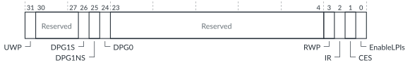

# GICR_CTLR, Redistributor Control Register

Source: <https://developer.arm.com/documentation/102666/0201/Programmers-model-for-GIC-720AE/Redistributor-registers-for-control-and-physical-LPIs-summary/GICR-CTLR--Redistributor-Control-Register>

### GICR\_CTLR, Redistributor Control Register

This register controls the operation of a Redistributor, and enables the signaling of LPIs by the Redistributor to the connected core.

### Configurations

This register is available in all configurations.

### Attributes

Width
:   32-bit

Functional group
:   See
    [Redistributor registers for control and physical LPIs summary](https://developer.arm.com/documentation/102666/0201/Programmers-model-for-GIC-720AE/Redistributor-registers-for-control-and-physical-LPIs-summary?lang=en "The functions for the GIC-720AE physical LPIs are controlled through the Redistributor registers identified with the prefix GICR. These registers start from the base address of the Redistributor.") for the address offset, type, and reset value of this register.

### Usage constraints

There are no usage constraints.

### Bit descriptions

Figure 1. GICR\_CTLR bit assignments

<table>
<caption>
Table 1. GICR_CTLR bit descriptions
</caption>
<colgroup>
<col span="1"/>
<col span="1"/>
<col span="1"/>
<col span="1"/>
</colgroup>
<thead>
<tr>
<th class="documents-nocellnorowborder" colspan="1" id="d39129e136" rowspan="1">Bits</th>
<th class="documents-nocellnorowborder" colspan="1" id="d39129e139" rowspan="1">Name</th>
<th class="documents-nocellnorowborder" colspan="1" id="d39129e142" rowspan="1">Description</th>
<th class="documents-cell-norowborder" colspan="1" id="d39129e145" rowspan="1">Type</th>
</tr>
</thead>
<tbody>
<tr>
<td class="documents-nocellnorowborder" colspan="1" rowspan="1">[31]</td>
<td class="documents-nocellnorowborder" colspan="1" rowspan="1">UWP</td>
<td class="documents-nocellnorowborder" colspan="1" rowspan="1">Upstream write pending. Indicates whether all upstream writes have been communicated to the Distributor:

          <dl>
<dt class="documents-dlterm">
             0

           </dt>
<dd>
             The effects of all upstream writes have been communicated to the Distributor.

           </dd>
<dt class="documents-dlterm">
             1

           </dt>
<dd>
             Not all the effects of upstream writes have been communicated to the Distributor.

           </dd>
</dl> </td>
<td class="documents-cell-norowborder" colspan="1" rowspan="1">RO</td>
</tr>
<tr>
<td class="documents-nocellnorowborder" colspan="1" rowspan="1">[30:27]</td>
<td class="documents-nocellnorowborder" colspan="1" rowspan="1">-</td>
<td class="documents-nocellnorowborder" colspan="1" rowspan="1">Reserved, RAZ</td>
<td class="documents-cell-norowborder" colspan="1" rowspan="1">-</td>
</tr>
<tr>
<td class="documents-nocellnorowborder" colspan="1" rowspan="1">[26]</td>
<td class="documents-nocellnorowborder" colspan="1" rowspan="1">DPG1S</td>
<td class="documents-nocellnorowborder" colspan="1" rowspan="1">Disable processor selection for Group 1 Secure interrupts.</td>
<td class="documents-cell-norowborder" colspan="1" rowspan="3">RW when <a class="document-topic" document-topic-path="/102666/0201/Programmers-model-for-GIC-720AE/Distributor-registers--GICD-GICDA--summary/GICD-TYPER--Interrupt-Controller-Type-Register?lang=en" href="https://developer.arm.com/documentation/102666/0201/Programmers-model-for-GIC-720AE/Distributor-registers--GICD-GICDA--summary/GICD-TYPER--Interrupt-Controller-Type-Register?lang=en" title="This register returns information about the configuration of the GIC-720AE. You can use this register to determine the number of Security states, the number of INTIDs, and the number of processor cores that the GIC supports.">GICD_TYPER</a>.No1N == 0.
RES0 when <a class="document-topic" document-topic-path="/102666/0201/Programmers-model-for-GIC-720AE/Distributor-registers--GICD-GICDA--summary/GICD-TYPER--Interrupt-Controller-Type-Register?lang=en" href="https://developer.arm.com/documentation/102666/0201/Programmers-model-for-GIC-720AE/Distributor-registers--GICD-GICDA--summary/GICD-TYPER--Interrupt-Controller-Type-Register?lang=en" title="This register returns information about the configuration of the GIC-720AE. You can use this register to determine the number of Security states, the number of INTIDs, and the number of processor cores that the GIC supports.">GICD_TYPER</a>.No1N == 1.
 </td>
</tr>
<tr>
<td class="documents-nocellnorowborder" colspan="1" rowspan="1">[25]</td>
<td class="documents-nocellnorowborder" colspan="1" rowspan="1">DPG1NS</td>
<td class="documents-cell-norowborder" colspan="1" rowspan="1">Disable processor selection for Group 1 Non-secure interrupts.</td>
</tr>
<tr>
<td class="documents-nocellnorowborder" colspan="1" rowspan="1">[24]</td>
<td class="documents-nocellnorowborder" colspan="1" rowspan="1">DPG0</td>
<td class="documents-cell-norowborder" colspan="1" rowspan="1">Disable processor selection for Group 0 interrupts.</td>
</tr>
<tr>
<td class="documents-nocellnorowborder" colspan="1" rowspan="1">[23:4]</td>
<td class="documents-nocellnorowborder" colspan="1" rowspan="1">-</td>
<td class="documents-nocellnorowborder" colspan="1" rowspan="1">Reserved, RAZ</td>
<td class="documents-cell-norowborder" colspan="1" rowspan="1">-</td>
</tr>
<tr>
<td class="documents-nocellnorowborder" colspan="1" rowspan="1">[3]</td>
<td class="documents-nocellnorowborder" colspan="1" rowspan="1">RWP</td>
<td class="documents-nocellnorowborder" colspan="1" rowspan="1">Register write pending:

          <dl>
<dt class="documents-dlterm">
             0

           </dt>
<dd>
             No register write in progress.

           </dd>
<dt class="documents-dlterm">
             1

           </dt>
<dd>
             Register write in progress.

           </dd>
</dl> </td>
<td class="documents-cell-norowborder" colspan="1" rowspan="1">RO</td>
</tr>
<tr>
<td class="documents-nocellnorowborder" colspan="1" rowspan="1">[2]</td>
<td class="documents-nocellnorowborder" colspan="1" rowspan="1">IR</td>
<td class="documents-nocellnorowborder" colspan="1" rowspan="1">Returns 1 if LPIs are supported, indicating that GICR_INVLPIR and GICR_INVALLR are implemented, else returns 0.</td>
<td class="documents-cell-norowborder" colspan="1" rowspan="1">RO</td>
</tr>
<tr>
<td class="documents-nocellnorowborder" colspan="1" rowspan="1">[1]</td>
<td class="documents-nocellnorowborder" colspan="1" rowspan="1">CES</td>
<td class="documents-nocellnorowborder" colspan="1" rowspan="1">Clear enable supported. Returns 1 to indicate that software can change GICR_CTLR.EnableLPIs from 1 to 0.</td>
<td class="documents-cell-norowborder" colspan="1" rowspan="1">RO</td>
</tr>
<tr>
<td class="documents-row-nocellborder" colspan="1" rowspan="1">[0]</td>
<td class="documents-row-nocellborder" colspan="1" rowspan="1">EnableLPIs</td>
<td class="documents-row-nocellborder" colspan="1" rowspan="1">Controls whether LPI support is enabled:

          <dl>
<dt class="documents-dlterm">
             0

           </dt>
<dd>
             LPI support is disabled.

           </dd>
<dt class="documents-dlterm">
             1

           </dt>
<dd>
             LPI support is enabled.

           </dd>
</dl> 
If EnableLPIs changes from 1 to 0, then the GIC flushes out all LPIs on the PE. When GICR_CTLR.RWP becomes zero, the GIC no longer accesses the Pending table of this PE. After all EnableLPIs (and RWP bits) are clear, then the GIC no longer accesses the LPI Property table.
 </td>
<td class="documents-cellrowborder" colspan="1" rowspan="1">RW</td>
</tr>
</tbody>
</table>
