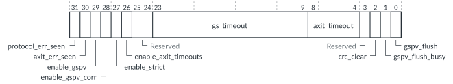

# GICR_FLUSHR, Flush Register

Source: <https://developer.arm.com/documentation/102666/0201/Programmers-model-for-GIC-720AE/Redistributor-registers-for-control-and-physical-LPIs-summary/GICR-FLUSHR--Flush-Register>

### GICR\_FLUSHR, Flush Register

This register controls the recovery mode for the GIC Stream Protocol Validator (GSPV) in the GCI.

### Configurations

This register is available in all configurations.

### Attributes

Width
:   32-bit

Functional group
:   See
    [Redistributor registers for control and physical LPIs summary](https://developer.arm.com/documentation/102666/0201/Programmers-model-for-GIC-720AE/Redistributor-registers-for-control-and-physical-LPIs-summary?lang=en "The functions for the GIC-720AE physical LPIs are controlled through the Redistributor registers identified with the prefix GICR. These registers start from the base address of the Redistributor.") for the address offset, type, and reset value of this register.

### Usage constraints

Software must only change bits[29:26] when all PEs are asleep for this GCI, otherwise unpredictable behavior might occur.

### Bit descriptions

Figure 1. GICR\_FLUSHR bit assignments

<table id="lpz1516977697778__tbl.gicr_flushr">
<caption>
Table 1. GICR_FLUSHR bit descriptions
</caption>
<colgroup>
<col span="1"/>
<col span="1"/>
<col span="1"/>
<col span="1"/>
</colgroup>
<thead>
<tr>
<th class="documents-nocellnorowborder" colspan="1" id="d165817e142" rowspan="1">Bits</th>
<th class="documents-nocellnorowborder" colspan="1" id="d165817e145" rowspan="1">Name</th>
<th class="documents-nocellnorowborder" colspan="1" id="d165817e148" rowspan="1">Description</th>
<th class="documents-cell-norowborder" colspan="1" id="d165817e151" rowspan="1">Type</th>
</tr>
</thead>
<tbody>
<tr>
<td class="documents-nocellnorowborder" colspan="1" rowspan="1">[31]</td>
<td class="documents-nocellnorowborder" colspan="1" rowspan="1">protocol_err_seen</td>
<td class="documents-nocellnorowborder" colspan="1" rowspan="1">For each core, indicates whether the GSPV has detected a GIC Stream protocol violation:

          

<dl>
<dt class="documents-dlterm">
              0

            </dt>
<dd>
              The GSPV has not detected a GIC Stream protocol violation.

            </dd>
<dt class="documents-dlterm">
              1

            </dt>
<dd>
              The GSPV has detected a GIC Stream protocol violation.

            </dd>
</dl>

 </td>
<td class="documents-cell-norowborder" colspan="1" rowspan="1">R/W1C</td>
</tr>
<tr>
<td class="documents-nocellnorowborder" colspan="1" rowspan="1">[30]</td>
<td class="documents-nocellnorowborder" colspan="1" rowspan="1">axit_err_seen</td>
<td class="documents-nocellnorowborder" colspan="1" rowspan="1">For each core, indicates whether the GSPV has detected an AXI5-Stream protocol violation, which includes AXI5-Stream interbeat timeout checks using axit_timeout, and iritready timeouts using gs_timeout:

          <dl>
<dt class="documents-dlterm">
             0

           </dt>
<dd>
             The GSPV has not detected an

            AXI5-Stream protocol violation.

           </dd>
<dt class="documents-dlterm">
             1

           </dt>
<dd>
             The GSPV has detected an

            AXI5-Stream protocol violation.

           </dd>
</dl> </td>
<td class="documents-cell-norowborder" colspan="1" rowspan="1">R/W1C</td>
</tr>
<tr>
<td class="documents-nocellnorowborder" colspan="1" rowspan="1">[29]</td>
<td class="documents-nocellnorowborder" colspan="1" rowspan="1">enable_gspv</td>
<td class="documents-nocellnorowborder" colspan="1" rowspan="1">For this GCI, this bit enables or disables the GSPV:

          <dl>
<dt class="documents-dlterm">
             0

           </dt>
<dd>
             The GSPV is not enabled.

           </dd>
<dt class="documents-dlterm">
             1

           </dt>
<dd>
             The GSPV is enabled. This value occurs at reset.

           </dd>
</dl> </td>
<td class="documents-cell-norowborder" colspan="1" rowspan="1">R/W</td>
</tr>
<tr>
<td class="documents-nocellnorowborder" colspan="1" rowspan="1">[28]</td>
<td class="documents-nocellnorowborder" colspan="1" rowspan="1">enable_gspv_corr</td>
<td class="documents-nocellnorowborder" colspan="1" rowspan="1">For this GCI, this bit enables or disables the protocol correction in the GSPV:

          <dl>
<dt class="documents-dlterm">
             0

           </dt>
<dd>
             The GSPV protocol correction is not enabled.

           </dd>
<dt class="documents-dlterm">
             1

           </dt>
<dd>
             The GSPV protocol correction is enabled. This value occurs at reset.

           </dd>
</dl> 
To protect against lower safety-level cores in a mixed criticality use case, software must set both the enable_gspv and enable_gspv_corr bits to 1.
 </td>
<td class="documents-cell-norowborder" colspan="1" rowspan="1">R/W</td>
</tr>
<tr>
<td class="documents-nocellnorowborder" colspan="1" rowspan="1">[27]</td>
<td class="documents-nocellnorowborder" colspan="1" rowspan="1">enable_strict</td>
<td class="documents-nocellnorowborder" colspan="1" rowspan="1">Controls whether the GSPV detects protocol violations that indicate hardware errors that would not affect other PEs on the GIC, but do indicate a hardware issue with the issuing PE:

          <dl>
<dt class="documents-dlterm">
             0

           </dt>
<dd>
             Strict checks are not enabled.

           </dd>
<dt class="documents-dlterm">
             1

           </dt>
<dd>
             Strict checks are enabled. This value occurs at reset.

           </dd>
</dl> </td>
<td class="documents-cell-norowborder" colspan="1" rowspan="1">R/W</td>
</tr>
<tr>
<td class="documents-nocellnorowborder" colspan="1" rowspan="1">[26]</td>
<td class="documents-nocellnorowborder" colspan="1" rowspan="1">enable_axit_timeouts</td>
<td class="documents-nocellnorowborder" colspan="1" rowspan="1">Controls whether timeouts on the iritready signal and the interbeat timings are tracked:

          <dl>
<dt class="documents-dlterm">
             0

           </dt>
<dd>
             The GSPV does not monitor any timeouts of the

            iritready signal and the interbeat timings.

           </dd>
<dt class="documents-dlterm">
             1

           </dt>
<dd>
             The GSPV monitors for any timeouts of the

            iritready signal and the interbeat timings. This value occurs at reset.

           </dd>
</dl> </td>
<td class="documents-cell-norowborder" colspan="1" rowspan="1">R/W</td>
</tr>
<tr>
<td class="documents-nocellnorowborder" colspan="1" rowspan="1">[25:24]</td>
<td class="documents-nocellnorowborder" colspan="1" rowspan="1">-</td>
<td class="documents-nocellnorowborder" colspan="1" rowspan="1">Reserved</td>
<td class="documents-cell-norowborder" colspan="1" rowspan="1">-</td>
</tr>
<tr>
<td class="documents-nocellnorowborder" colspan="1" rowspan="1">[23:9]</td>
<td class="documents-nocellnorowborder" colspan="1" rowspan="1">gs_timeout</td>
<td class="documents-nocellnorowborder" colspan="1" rowspan="1"> 
Sets the timeout value for the GIC Stream and the iritready signal checks on this GCI. The timeout is 8192 × (gs_timeout + 1) − 1 cycles. The value at reset is 0xEFF.
 
Timeout checks that use gs_timeout report in protocol_err_seen, except for iritready timeouts, which report in axit_err_seen.
 </td>
<td class="documents-cell-norowborder" colspan="1" rowspan="1">R/W</td>
</tr>
<tr>
<td class="documents-nocellnorowborder" colspan="1" rowspan="1">[8:4]</td>
<td class="documents-nocellnorowborder" colspan="1" rowspan="1">axit_timeout</td>
<td class="documents-nocellnorowborder" colspan="1" rowspan="1"> 
Sets the timeout value for the AXI5-Stream interbeat timing checks on this GCI. The timeout is 256 × (axit_timeout + 1) − 1 cycles. The value at reset is 0x1F. 
 </td>
<td class="documents-cell-norowborder" colspan="1" rowspan="1">R/W</td>
</tr>
<tr>
<td class="documents-nocellnorowborder" colspan="1" rowspan="1">[3]</td>
<td class="documents-nocellnorowborder" colspan="1" rowspan="1">-</td>
<td class="documents-nocellnorowborder" colspan="1" rowspan="1">Reserved</td>
<td class="documents-cell-norowborder" colspan="1" rowspan="1">-</td>
</tr>
<tr>
<td class="documents-nocellnorowborder" colspan="1" rowspan="1">[2]</td>
<td class="documents-nocellnorowborder" colspan="1" rowspan="1">crc_clear</td>
<td class="documents-nocellnorowborder" colspan="1" rowspan="1">Set to 1 to reset the GIC Stream protection CRC state on this GCI.</td>
<td class="documents-cell-norowborder" colspan="1" rowspan="1">WO</td>
</tr>
<tr>
<td class="documents-nocellnorowborder" colspan="1" rowspan="1">[1]</td>
<td class="documents-nocellnorowborder" colspan="1" rowspan="1">gspv_flush_busy</td>
<td class="documents-nocellnorowborder" colspan="1" rowspan="1">For this GCI, indicates whether a flush is occurring on any core:

          <dl>
<dt class="documents-dlterm">
             0

           </dt>
<dd>
             No flush is occuring on a core that connects to this

            GCI.

           </dd>
<dt class="documents-dlterm">
             1

           </dt>
<dd>
             A flush is occuring on a core that connects to this

            GCI.

           </dd>
</dl> </td>
<td class="documents-cell-norowborder" colspan="1" rowspan="1">RO</td>
</tr>
<tr>
<td class="documents-row-nocellborder" colspan="1" rowspan="1">[0]</td>
<td class="documents-row-nocellborder" colspan="1" rowspan="1">gspv_flush</td>
<td class="documents-row-nocellborder" colspan="1" rowspan="1">For this core, starts a flush or returns the flush status:

          <dl>
<dt class="documents-dlterm">
             0

           </dt>
<dd>
             No flush is occuring on this core.

           </dd>
<dt class="documents-dlterm">
             1

           </dt>
<dd>
             A flush is occuring on this core.

           </dd>
</dl> </td>
<td class="documents-cellrowborder" colspan="1" rowspan="1">RW</td>
</tr>
</tbody>
</table>

### Accessibility

GICR\_FLUSHR is accessible only by Secure accesses.

If [GICD\_CFGID](https://developer.arm.com/documentation/102666/0201/Programmers-model-for-GIC-720AE/Distributor-registers--GICD-GICDA--summary/GICD-CFGID--Configuration-ID-Register?lang=en "This register contains information that enables test software to determine if the GIC-720AE system is compatible.").VIEW == 1, then GICR\_FLUSHR is accessible only for view 0.
