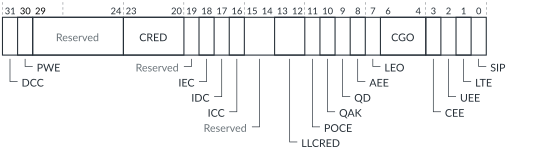

# GITS_FCTLR, Function Control Register

Source: <https://developer.arm.com/documentation/102666/0201/Programmers-model-for-GIC-720AE/ITS-control-register-summary/GITS-FCTLR--Function-Control-Register>

### GITS\_FCTLR, Function Control Register

This register controls many functions in the ITS such as cache invalidation, clock gating, and the scrubbing of all RAMs. The register is not distributed and only acts on the local chip.

### Configurations

This register is available in all configurations that have one or more ITS blocks.

### Attributes

Width
:   32-bit

Functional group
:   See
    [ITS control register summary](https://developer.arm.com/documentation/102666/0201/Programmers-model-for-GIC-720AE/ITS-control-register-summary?lang=en "The GIC-720AE Interrupt Translation Service (ITS) functions are controlled through registers that are identified with the prefix GITS.") for the address offset, type, and reset value of this register.

### Usage constraints

If the ITS is not quiescent, then the GIC ignores writes to some fields. The ITS is quiescent when GITS\_CTLR.Quiescent == 1.

### Bit descriptions

Figure 1. GITS\_FCTLR bit assignments

<table id="leq1469445470902__tbl.gits_fctlr">
<caption>
Table 1. GITS_FCTLR bit descriptions
</caption>
<colgroup>
<col span="1"/>
<col span="1"/>
<col span="1"/>
<col span="1"/>
</colgroup>
<thead>
<tr>
<th class="documents-nocellnorowborder" colspan="1" id="d46707e139" rowspan="1">Bits</th>
<th class="documents-nocellnorowborder" colspan="1" id="d46707e142" rowspan="1">Name</th>
<th class="documents-nocellnorowborder" colspan="1" id="d46707e145" rowspan="1">Description</th>
<th class="documents-cell-norowborder" colspan="1" id="d46707e148" rowspan="1">Type</th>
</tr>
</thead>
<tbody>
<tr>
<td class="documents-nocellnorowborder" colspan="1" rowspan="1">[31]</td>
<td class="documents-nocellnorowborder" colspan="1" rowspan="1">DCC</td>
<td class="documents-nocellnorowborder" colspan="1" rowspan="1">Disable cache conversion:

          <dl>
<dt class="documents-dlterm">
             0

           </dt>
<dd>
             Use SMMU attribute for AMBA mapping.

           </dd>
<dt class="documents-dlterm">
             1

           </dt>
<dd>
             Use Direct attribute for AMBA mapping.

           </dd>
</dl> 
Writes ignored if the ITS is not quiescent.
 </td>
<td class="documents-cell-norowborder" colspan="1" rowspan="1">RW</td>
</tr>
<tr>
<td class="documents-nocellnorowborder" colspan="1" rowspan="1">[30]</td>
<td class="documents-nocellnorowborder" colspan="1" rowspan="1">PWE</td>
<td class="documents-nocellnorowborder" colspan="1" rowspan="1">Powerdown when enabled:

          <dl>
<dt class="documents-dlterm">
             0

           </dt>
<dd>
             Requests GITS_CTLR.Quiescent to indicate that the ITS is quiescent and can be powered down.

           </dd>
<dt class="documents-dlterm">
             1

           </dt>
<dd>
             Do not request GITS_CTLR.Quiescent to indicate that the ITS is quiescent.

           </dd>
</dl> </td>
<td class="documents-cell-norowborder" colspan="1" rowspan="1">RW</td>
</tr>
<tr>
<td class="documents-nocellnorowborder" colspan="1" rowspan="1">[29:24]</td>
<td class="documents-nocellnorowborder" colspan="1" rowspan="1">-</td>
<td class="documents-nocellnorowborder" colspan="1" rowspan="1">Reserved, RAZ/WI</td>
<td class="documents-cell-norowborder" colspan="1" rowspan="1">-</td>
</tr>
<tr>
<td class="documents-nocellnorowborder" colspan="1" rowspan="1">[23:20]</td>
<td class="documents-nocellnorowborder" colspan="1" rowspan="1">CRED</td>
<td class="documents-nocellnorowborder" colspan="1" rowspan="1">LPI credit initialization:

          <dl>
<dt class="documents-dlterm">
0x0
</dt>
<dd>
             Default to the configured credit value of

            <a class="document-topic" document-topic-path="/102666/0201/Programmers-model-for-GIC-720AE/ITS-control-register-summary/GITS-CFGID--Configuration-ID-Register?lang=en" href="https://developer.arm.com/documentation/102666/0201/Programmers-model-for-GIC-720AE/ITS-control-register-summary/GITS-CFGID--Configuration-ID-Register?lang=en" title="This register returns information about the configuration of the ITS block such as its ID number.">GITS_CFGID</a>.LPI_Credit_Count + 1.

           </dd>
<dt class="documents-dlterm">
0x1
</dt>
<dd>
             1 credit

           </dd>
<dt class="documents-dlterm">
0x2
</dt>
<dd>
             2 credits

           </dd>
<dt class="documents-dlterm">
             …

           </dt>
<dd>
             …

           </dd>
<dt class="documents-dlterm">
0xE
</dt>
<dd>
             14 credits

           </dd>
<dt class="documents-dlterm">
0xF
</dt>
<dd>
             15 credits

           </dd>
</dl> </td>
<td class="documents-cell-norowborder" colspan="1" rowspan="1">RW</td>
</tr>
<tr>
<td class="documents-nocellnorowborder" colspan="1" rowspan="1">[19]</td>
<td class="documents-nocellnorowborder" colspan="1" rowspan="1">-</td>
<td class="documents-nocellnorowborder" colspan="1" rowspan="1">Reserved, RAZ/WI</td>
<td class="documents-cell-norowborder" colspan="1" rowspan="1">-</td>
</tr>
<tr>
<td class="documents-nocellnorowborder" colspan="1" rowspan="1">[18]</td>
<td class="documents-nocellnorowborder" colspan="1" rowspan="1">IEC</td>
<td class="documents-nocellnorowborder" colspan="1" rowspan="1">Invalidate Event cache:
When written:

<dl>
<dt class="documents-dlterm">
             0

           </dt>
<dd>
             No effect.

           </dd>
<dt class="documents-dlterm">
             1

           </dt>
<dd>
             Invalidate Event cache.

           </dd>
</dl> 
When read:

<dl>
<dt class="documents-dlterm">
             0

           </dt>
<dd>
             Invalidation complete.

           </dd>
<dt class="documents-dlterm">
             1

           </dt>
<dd>
             Event cache invalidation in progress, including the BASER0 write-initiated invalidate.

           </dd>
</dl> </td>
<td class="documents-cell-norowborder" colspan="1" rowspan="1">RW</td>
</tr>
<tr>
<td class="documents-nocellnorowborder" colspan="1" rowspan="1">[17]</td>
<td class="documents-nocellnorowborder" colspan="1" rowspan="1">IDC</td>
<td class="documents-nocellnorowborder" colspan="1" rowspan="1">Invalidate Device cache:
When written:

<dl>
<dt class="documents-dlterm">
             0

           </dt>
<dd>
             No effect.

           </dd>
<dt class="documents-dlterm">
             1

           </dt>
<dd>
             Invalidate Device cache.

           </dd>
</dl> 
When read:

<dl>
<dt class="documents-dlterm">
             0

           </dt>
<dd>
             Invalidation complete.

           </dd>
<dt class="documents-dlterm">
             1

           </dt>
<dd>
             Device cache invalidation in progress, including the BASER0 write-initiated invalidate.

           </dd>
</dl> </td>
<td class="documents-cell-norowborder" colspan="1" rowspan="1">RW</td>
</tr>
<tr>
<td class="documents-nocellnorowborder" colspan="1" rowspan="1">[16]</td>
<td class="documents-nocellnorowborder" colspan="1" rowspan="1">ICC</td>
<td class="documents-nocellnorowborder" colspan="1" rowspan="1">Invalidate Collection cache:
When written:

<dl>
<dt class="documents-dlterm">
             0

           </dt>
<dd>
             No effect.

           </dd>
<dt class="documents-dlterm">
             1

           </dt>
<dd>
             Invalidate Collection cache.

           </dd>
</dl> 
When read:

<dl>
<dt class="documents-dlterm">
             0

           </dt>
<dd>
             Invalidation complete.

           </dd>
<dt class="documents-dlterm">
             1

           </dt>
<dd>
             Collection cache invalidation in progress, including the BASER1 write-initiated invalidate.

           </dd>
</dl> </td>
<td class="documents-cell-norowborder" colspan="1" rowspan="1">RW</td>
</tr>
<tr>
<td class="documents-nocellnorowborder" colspan="1" rowspan="1">[15:14]</td>
<td class="documents-nocellnorowborder" colspan="1" rowspan="1">-</td>
<td class="documents-nocellnorowborder" colspan="1" rowspan="1">Reserved, RAZ/WI</td>
<td class="documents-cell-norowborder" colspan="1" rowspan="1">-</td>
</tr>
<tr>
<td class="documents-nocellnorowborder" colspan="1" rowspan="1">[13:12]</td>
<td class="documents-nocellnorowborder" colspan="1" rowspan="1">LLCRED</td>
<td class="documents-nocellnorowborder" colspan="1" rowspan="1">Low-latency LPI credit:

          <dl>
<dt class="documents-dlterm">
0b00
</dt>
<dd>
             Default to the configured credit value of

            <a class="document-topic" document-topic-path="/102666/0201/Programmers-model-for-GIC-720AE/ITS-control-register-summary/GITS-CFGID--Configuration-ID-Register?lang=en" href="https://developer.arm.com/documentation/102666/0201/Programmers-model-for-GIC-720AE/ITS-control-register-summary/GITS-CFGID--Configuration-ID-Register?lang=en" title="This register returns information about the configuration of the ITS block such as its ID number.">GITS_CFGID</a>.Low_Latency_LPI_Credit_Count.

           </dd>
<dt class="documents-dlterm">
0b01
</dt>
<dd>
             1 credit

           </dd>
<dt class="documents-dlterm">
0b10
</dt>
<dd>
             2 credits

           </dd>
<dt class="documents-dlterm">
0b11
</dt>
<dd>
             3 credits

           </dd>
</dl> </td>
<td class="documents-cell-norowborder" colspan="1" rowspan="1">RW</td>
</tr>
<tr>
<td class="documents-nocellnorowborder" colspan="1" rowspan="1">[11]</td>
<td class="documents-nocellnorowborder" colspan="1" rowspan="1">POCE</td>
<td class="documents-nocellnorowborder" colspan="1" rowspan="1">Poison check enable:

          <dl>
<dt class="documents-dlterm">
             0

           </dt>
<dd>
             Disable poison checking on the ACE5-Lite subordinate port.

           </dd>
<dt class="documents-dlterm">
             1

           </dt>
<dd>
             Enable poison checking on the ACE5-Lite subordinate port.

           </dd>
</dl> </td>
<td class="documents-cell-norowborder" colspan="1" rowspan="1">RW</td>
</tr>
<tr>
<td class="documents-nocellnorowborder" colspan="1" rowspan="1">[10]</td>
<td class="documents-nocellnorowborder" colspan="1" rowspan="1">QAK</td>
<td class="documents-nocellnorowborder" colspan="1" rowspan="1">Quiescent ACK override:

          <dl>
<dt class="documents-dlterm">
             0

           </dt>
<dd>
             Disable quiescent ACK override.

           </dd>
<dt class="documents-dlterm">
             1

           </dt>
<dd>
             Enable quiescent ACK override.

           </dd>
</dl> </td>
<td class="documents-cell-norowborder" colspan="1" rowspan="1">RW</td>
</tr>
<tr>
<td class="documents-nocellnorowborder" colspan="1" rowspan="1">[9]</td>
<td class="documents-nocellnorowborder" colspan="1" rowspan="1">QD</td>
<td class="documents-nocellnorowborder" colspan="1" rowspan="1">Q-Channel deny:

          <dl>
<dt class="documents-dlterm">
             0

           </dt>
<dd>
             Do not deny Q-Channel requests.

           </dd>
<dt class="documents-dlterm">
             1

           </dt>
<dd>
             Always deny Q-Channel requests.

           </dd>
</dl> </td>
<td class="documents-cell-norowborder" colspan="1" rowspan="1">RW</td>
</tr>
<tr>
<td class="documents-nocellnorowborder" colspan="1" rowspan="1">[8]</td>
<td class="documents-nocellnorowborder" colspan="1" rowspan="1">AEE</td>
<td class="documents-nocellnorowborder" colspan="1" rowspan="1">Access error enable:

          <dl>
<dt class="documents-dlterm">
             0

           </dt>
<dd>
             Do not enable reporting of subordinate access errors.

           </dd>
<dt class="documents-dlterm">
             1

           </dt>
<dd>
             Enable reporting of subordinate access errors.

           </dd>
</dl> 
Writes ignored if the ITS is not quiescent.
 </td>
<td class="documents-cell-norowborder" colspan="1" rowspan="1">RW</td>
</tr>
<tr>
<td class="documents-nocellnorowborder" colspan="1" rowspan="1">[7]</td>
<td class="documents-nocellnorowborder" colspan="1" rowspan="1">LEO</td>
<td class="documents-nocellnorowborder" colspan="1" rowspan="1">LPI error overflow.

          <dl>
<dt class="documents-dlterm">
             0

           </dt>
<dd>
             LPI errors are always sent.

           </dd>
<dt class="documents-dlterm">
             1

           </dt>
<dd>
             To prevent excessive debug messages, LPI errors set the overflow bit in debug messages.

           </dd>
</dl> 
Writes ignored if the ITS is not quiescent.
 </td>
<td class="documents-cell-norowborder" colspan="1" rowspan="1">RW</td>
</tr>
<tr>
<td class="documents-nocellnorowborder" colspan="1" rowspan="1">[6:4]</td>
<td class="documents-nocellnorowborder" colspan="1" rowspan="1">CGO</td>
<td class="documents-nocellnorowborder" colspan="1" rowspan="1">Clock gate override. One bit for each clock gate:

          <dl>
<dt class="documents-dlterm">
             0

           </dt>
<dd>
             Use full clock gating.

           </dd>
<dt class="documents-dlterm">
             1

           </dt>
<dd>
             Leave clock running. If clock gates are not implemented, then you must use this value.

           </dd>
</dl> 
The clock gate bit assignments are:

<dl>
<dt class="documents-dlterm">
             Bit[6], CGO[2]

           </dt>
<dd>
             Debug clock

           </dd>
<dt class="documents-dlterm">
             Bit[5], CGO[1]

           </dt>
<dd>
             Command clock

           </dd>
<dt class="documents-dlterm">
             Bit[4], CGO[0]

           </dt>
<dd>
             ITU clock

           </dd>
</dl> </td>
<td class="documents-cell-norowborder" colspan="1" rowspan="1">RW</td>
</tr>
<tr>
<td class="documents-nocellnorowborder" colspan="1" rowspan="1">[3]</td>
<td class="documents-nocellnorowborder" colspan="1" rowspan="1">CEE</td>
<td class="documents-nocellnorowborder" colspan="1" rowspan="1">Command error enable:

          <dl>
<dt class="documents-dlterm">
             0

           </dt>
<dd>
             Do not enable reporting of command errors and errors from

            <a class="document-topic" document-topic-path="/102666/0201/Programmers-model-for-GIC-720AE/ITS-control-register-summary/GITS-OPR--Operations-Register?lang=en" href="https://developer.arm.com/documentation/102666/0201/Programmers-model-for-GIC-720AE/ITS-control-register-summary/GITS-OPR--Operations-Register?lang=en" title="This register controls cache lock.">GITS_OPR</a> operations.

           </dd>
<dt class="documents-dlterm">
             1

           </dt>
<dd>
             Enable reporting of command errors and errors from

            <a class="document-topic" document-topic-path="/102666/0201/Programmers-model-for-GIC-720AE/ITS-control-register-summary/GITS-OPR--Operations-Register?lang=en" href="https://developer.arm.com/documentation/102666/0201/Programmers-model-for-GIC-720AE/ITS-control-register-summary/GITS-OPR--Operations-Register?lang=en" title="This register controls cache lock.">GITS_OPR</a> operations. See

            <a class="document-topic" document-topic-path="/102666/0201/Operation-of-GIC-720AE/Reliability--Accessibility--and-Serviceability/Error-handling-records/ITS-command-and-translation-error-records-27-?lang=en" href="https://developer.arm.com/documentation/102666/0201/Operation-of-GIC-720AE/Reliability--Accessibility--and-Serviceability/Error-handling-records/ITS-command-and-translation-error-records-27-?lang=en" title="The ITS command and translation error records 27+ record uncorrectable command and translation errors from each configured ITS.">ITS command and translation error records 27+</a>.

           </dd>
</dl> 
Writes ignored if the ITS is not quiescent.
 </td>
<td class="documents-cell-norowborder" colspan="1" rowspan="1">RW</td>
</tr>
<tr>
<td class="documents-nocellnorowborder" colspan="1" rowspan="1">[2]</td>
<td class="documents-nocellnorowborder" colspan="1" rowspan="1">UEE</td>
<td class="documents-nocellnorowborder" colspan="1" rowspan="1">Unmapped error enable:

          <dl>
<dt class="documents-dlterm">
             0

           </dt>
<dd>
             Do not enable reporting of unmapped interrupt errors.

           </dd>
<dt class="documents-dlterm">
             1

           </dt>
<dd>
             Enable reporting of unmapped interrupt errors.

           </dd>
</dl> 
Writes ignored if the ITS is not quiescent.
 </td>
<td class="documents-cell-norowborder" colspan="1" rowspan="1">RW</td>
</tr>
<tr>
<td class="documents-nocellnorowborder" colspan="1" rowspan="1">[1]</td>
<td class="documents-nocellnorowborder" colspan="1" rowspan="1">LTE</td>
<td class="documents-nocellnorowborder" colspan="1" rowspan="1">Latency tracking enable:

          <dl>
<dt class="documents-dlterm">
             0

           </dt>
<dd>
             Disable latency tracking of interrupts.

           </dd>
<dt class="documents-dlterm">
             1

           </dt>
<dd>
             Enable latency tracking of interrupts.

           </dd>
</dl> 
Writes ignored if the ITS is not quiescent.
 </td>
<td class="documents-cell-norowborder" colspan="1" rowspan="1">RW</td>
</tr>
<tr>
<td class="documents-row-nocellborder" colspan="1" rowspan="1">[0]</td>
<td class="documents-row-nocellborder" colspan="1" rowspan="1">SIP</td>
<td class="documents-row-nocellborder" colspan="1" rowspan="1">Scrub in progress.
When read:

<dl>
<dt class="documents-dlterm">
             0

           </dt>
<dd>
             No scrub in progress.

           </dd>
<dt class="documents-dlterm">
             1

           </dt>
<dd>
             Scrub in progress.

           </dd>
</dl> 
When written:

<dl>
<dt class="documents-dlterm">
             0

           </dt>
<dd>
             Abort the scrub.

           </dd>
<dt class="documents-dlterm">
             1

           </dt>
<dd>
             Start a scrub.

           </dd>
</dl> 
When a scrub is complete, the GIC clears the bit to 0.
 </td>
<td class="documents-cellrowborder" colspan="1" rowspan="1">RW</td>
</tr>
</tbody>
</table>
