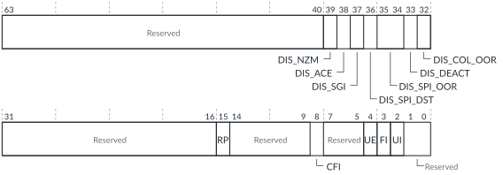

# GICT_ERR<n>CTLR, Error Record Control Register

Source: <https://developer.arm.com/documentation/102666/0201/Programmers-model-for-GIC-720AE/GICT-register-summary/GICT-ERR-n-CTLR--Error-Record-Control-Register>

### GICT\_ERR<n>CTLR, Error Record Control Register

This register controls how interrupts are handled.

### Configurations

This register is available in all configurations.

### Attributes

Width
:   64-bit

Functional group
:   See
    [GICT register summary](https://developer.arm.com/documentation/102666/0201/Programmers-model-for-GIC-720AE/GICT-register-summary?lang=en "The GIC-720AE trace and debug functions are controlled through registers that are identified with the prefix GICT.") for the address offset, type, and reset value of this register.

### Usage constraints

There are no usage constraints.

### Bit descriptions

Figure 1. GICT\_ERR<n>CTLR bit assignments

<table id="col1468591485644__tbl.gict_err_n_ctlr">
<caption>
Table 1. GICT_ERR&lt;n&gt;CTLR bit descriptions
</caption>
<colgroup>
<col span="1"/>
<col span="1"/>
<col span="1"/>
</colgroup>
<thead>
<tr>
<th class="documents-nocellnorowborder" colspan="1" id="d8003e130" rowspan="1">Bits</th>
<th class="documents-nocellnorowborder" colspan="1" id="d8003e133" rowspan="1">Name</th>
<th class="documents-cell-norowborder" colspan="1" id="d8003e136" rowspan="1">Description</th>
</tr>
</thead>
<tbody>
<tr>
<td class="documents-nocellnorowborder" colspan="1" rowspan="1">[63:40]</td>
<td class="documents-nocellnorowborder" colspan="1" rowspan="1">-</td>
<td class="documents-cell-norowborder" colspan="1" rowspan="1">Reserved, RAZ</td>
</tr>
<tr>
<td class="documents-nocellnorowborder" colspan="1" rowspan="1">[39]</td>
<td class="documents-nocellnorowborder" colspan="1" rowspan="1">DIS_NZM</td>
<td class="documents-cell-norowborder" colspan="1" rowspan="1">This bit can disable the reporting of errors in views 1-3:

          <dl>
<dt class="documents-dlterm">
             0

           </dt>
<dd>
             Reporting of errors occurs in all views, that is, views 0, 1, 2, and 3.

           </dd>
<dt class="documents-dlterm">
             1

           </dt>
<dd>
             Reporting of errors occurs in view 0 only.

           </dd>
</dl> </td>
</tr>
<tr>
<td class="documents-nocellnorowborder" colspan="1" rowspan="1">[38]</td>
<td class="documents-nocellnorowborder" colspan="1" rowspan="1">DIS_ACE</td>
<td class="documents-cell-norowborder" colspan="1" rowspan="1">RAZ/WI for all records except GICD error record 0.

          

            For GICD error record 0, this bit can disable the reporting of illegal ACE accesses:

           <dl>
<dt class="documents-dlterm">
              0

            </dt>
<dd>
              Illegal ACE accesses are treated as errors, which generate the SYN_ACE_BAD syndrome.

            </dd>
<dt class="documents-dlterm">
              1

            </dt>
<dd>
              Reporting of illegal ACE accesses is disabled.

            </dd>
</dl>

 </td>
</tr>
<tr>
<td class="documents-nocellnorowborder" colspan="1" rowspan="1">[37]</td>
<td class="documents-nocellnorowborder" colspan="1" rowspan="1">DIS_SGI</td>
<td class="documents-cell-norowborder" colspan="1" rowspan="1">RAZ/WI for all records except GICD error record 0.

          

            For GICD error record 0, this bit can disable the reporting of SGIs that are sent with no valid destinations:

           <dl>
<dt class="documents-dlterm">
              0

            </dt>
<dd>
              Out-of-range SGI destinations are treated as errors, which generate the SYN_SGI_NO_TGT syndrome.

            </dd>
<dt class="documents-dlterm">
              1

            </dt>
<dd>
              Reporting of out-of-range SGI destinations is disabled.

            </dd>
</dl>

 </td>
</tr>
<tr>
<td class="documents-nocellnorowborder" colspan="1" rowspan="1">[36]</td>
<td class="documents-nocellnorowborder" colspan="1" rowspan="1">DIS_SPI_DST</td>
<td class="documents-cell-norowborder" colspan="1" rowspan="1">RAZ/WI for all records except GICD error record 0.

          

            For GICD error record 0, this bit can disable the reporting of SPI destination errors:

           <dl>
<dt class="documents-dlterm">
              0

            </dt>
<dd>
              SPIs with no available destination are treated as errors, which generate either a SYN_SPI_NO_DEST_1OFN or SYN_SPI_NO_DEST_TGT syndrome.

            </dd>
<dt class="documents-dlterm">
              1

            </dt>
<dd>
              Reporting of SPIs with no available destination is disabled.

            </dd>
</dl>

 </td>
</tr>
<tr>
<td class="documents-nocellnorowborder" colspan="1" rowspan="1">[35:34]</td>
<td class="documents-nocellnorowborder" colspan="1" rowspan="1">DIS_SPI_OOR</td>
<td class="documents-cell-norowborder" colspan="1" rowspan="1">RAZ/WI for all records except GICD error record 0.

          

            For GICD error record 0, this field can disable the reporting of accesses to out-of-range SPIs:

           <dl>
<dt class="documents-dlterm">
0b00
</dt>
<dd>
              SPI register accesses to nonexisting blocks are treated as errors, which generate either a SYN_SPI_BLOCK or SYN_SPI_OOR syndrome.

            </dd>
<dt class="documents-dlterm">
0b01
</dt>
<dd>
              Reporting of SPI register accesses to all nonexisting blocks is disabled.

            </dd>
<dt class="documents-dlterm">
0b10
</dt>
<dd>
              Reporting of SPI register accesses to SPIs 992-1023 is disabled.

            </dd>
</dl>

 </td>
</tr>
<tr>
<td class="documents-nocellnorowborder" colspan="1" rowspan="1">[33]</td>
<td class="documents-nocellnorowborder" colspan="1" rowspan="1">DIS_DEACT</td>
<td class="documents-cell-norowborder" colspan="1" rowspan="1">RAZ/WI for all records except GICD error record 0.

          

            For GICD error record 0, this bit can disable the reporting of deactivations to nonexistent SPIs:

           <dl>
<dt class="documents-dlterm">
              0

            </dt>
<dd>
              Out-of-range deactivate messages are treated as errors, which generate the SYN_DEACT_IN syndrome.

            </dd>
<dt class="documents-dlterm">
              1

            </dt>
<dd>
              Reporting of out-of-range deactivate messages is disabled.

            </dd>
</dl>

 </td>
</tr>
<tr>
<td class="documents-nocellnorowborder" colspan="1" rowspan="1">[32]</td>
<td class="documents-nocellnorowborder" colspan="1" rowspan="1">DIS_COL_OOR</td>
<td class="documents-cell-norowborder" colspan="1" rowspan="1">RAZ/WI for all records except GICD error record 0.

          

            For GICD error record 0, this bit can disable the reporting of an SPI Collator message for a non-implemented SPI:

           <dl>
<dt class="documents-dlterm">
              0

            </dt>
<dd>
              Out-of-range wired SPIs are treated as errors, which generate the SYN_COL_OOR syndrome.

            </dd>
<dt class="documents-dlterm">
              1

            </dt>
<dd>
              Reporting of out-of-range wired SPIs is disabled.

            </dd>
</dl>

 </td>
</tr>
<tr>
<td class="documents-nocellnorowborder" colspan="1" rowspan="1">[31:16]</td>
<td class="documents-nocellnorowborder" colspan="1" rowspan="1">-</td>
<td class="documents-cell-norowborder" colspan="1" rowspan="1">Reserved, RAZ</td>
</tr>
<tr>
<td class="documents-nocellnorowborder" colspan="1" rowspan="1">[15]</td>
<td class="documents-nocellnorowborder" colspan="1" rowspan="1">RP</td>
<td class="documents-cell-norowborder" colspan="1" rowspan="1">0 = An error response to a transaction is reported.</td>
</tr>
<tr>
<td class="documents-nocellnorowborder" colspan="1" rowspan="1">[14:9]</td>
<td class="documents-nocellnorowborder" colspan="1" rowspan="1">-</td>
<td class="documents-cell-norowborder" colspan="1" rowspan="1">Reserved, RAZ</td>
</tr>
<tr>
<td class="documents-nocellnorowborder" colspan="1" rowspan="1">[8]</td>
<td class="documents-nocellnorowborder" colspan="1" rowspan="1">CFI</td>
<td class="documents-cell-norowborder" colspan="1" rowspan="1">Controls whether a corrected error generates a fault handling interrupt.

          

            SBZ on non-correctable errors else:

           <dl>
<dt class="documents-dlterm">
              0

            </dt>
<dd>
              The

             GIC-720AE does not assert a fault handling interrupt for corrected errors.

            </dd>
<dt class="documents-dlterm">
              1

            </dt>
<dd>
              The

             GIC-720AE asserts a fault handling interrupt, the

             fault_int signal, when a corrected error occurs.

            </dd>
</dl>

 </td>
</tr>
<tr>
<td class="documents-nocellnorowborder" colspan="1" rowspan="1">[7:5]</td>
<td class="documents-nocellnorowborder" colspan="1" rowspan="1">-</td>
<td class="documents-cell-norowborder" colspan="1" rowspan="1">Reserved, RAZ</td>
</tr>
<tr>
<td class="documents-nocellnorowborder" colspan="1" rowspan="1">[4]</td>
<td class="documents-nocellnorowborder" colspan="1" rowspan="1">UE</td>
<td class="documents-cell-norowborder" colspan="1" rowspan="1">Uncorrected error.

          

            RAZ/WI for all records except GICT error record (0) else:

           <dl>
<dt class="documents-dlterm">
              0

            </dt>
<dd>
              Do not send External abort with transaction.

            </dd>
<dt class="documents-dlterm">
              1

            </dt>
<dd>
              Send External abort with transaction. See

             <a class="document-topic" document-topic-path="/102666/0201/Operation-of-GIC-720AE/Reliability--Accessibility--and-Serviceability/Bus-errors?lang=en" href="https://developer.arm.com/documentation/102666/0201/Operation-of-GIC-720AE/Reliability--Accessibility--and-Serviceability/Bus-errors?lang=en" title="ACE5-Lite bus error syndromes such as bad transactions, and corrupted RAM data reads can be made to report an ACE5-Lite external AXI Subordinate Error (SLVERR).">Bus errors</a>.

            </dd>
</dl>

 </td>
</tr>
<tr>
<td class="documents-nocellnorowborder" colspan="1" rowspan="1">[3]</td>
<td class="documents-nocellnorowborder" colspan="1" rowspan="1">FI</td>
<td class="documents-cell-norowborder" colspan="1" rowspan="1">Fault handling interrupt.

          

            SBZ on Correctable Error (CE) records else:

           <dl>
<dt class="documents-dlterm">
              0

            </dt>
<dd>
              Fault handling interrupt is not generated on any error.

            </dd>
<dt class="documents-dlterm">
              1

            </dt>
<dd>
              Fault handling interrupt,

             fault_int signal, is generated on all uncorrectable errors.

            </dd>
</dl>

 </td>
</tr>
<tr>
<td class="documents-nocellnorowborder" colspan="1" rowspan="1">[2]</td>
<td class="documents-nocellnorowborder" colspan="1" rowspan="1">UI</td>
<td class="documents-cell-norowborder" colspan="1" rowspan="1">Error recovery interrupt for uncorrected error.

          

            SBZ on CE records else:

           <dl>
<dt class="documents-dlterm">
              0

            </dt>
<dd>
              Error recovery interrupt is not generated on any error.

            </dd>
<dt class="documents-dlterm">
              1

            </dt>
<dd>
              Error recovery interrupt,

             err_int signal, is generated on all uncorrectable errors.

            </dd>
</dl>

 </td>
</tr>
<tr>
<td class="documents-row-nocellborder" colspan="1" rowspan="1">[1:0]</td>
<td class="documents-row-nocellborder" colspan="1" rowspan="1">-</td>
<td class="documents-cellrowborder" colspan="1" rowspan="1">Reserved, RAZ</td>
</tr>
</tbody>
</table>

### Accessibility

If [GICD\_SAC](https://developer.arm.com/documentation/102666/0201/Programmers-model-for-GIC-720AE/Distributor-registers--GICD-GICDA--summary/GICD-SAC--Secure-Access-Control-register?lang=en "This register allows Secure software to grant Non-secure software with access to some GIC-720AE Secure features. It also controls whether Secure PMU events are visible to Non-secure software. For configurations that support multi view, it controls which view can access the GICP registers.").GICTNS == 0, then GICT\_ERR<n>CTLR is accessible only by Secure accesses.
