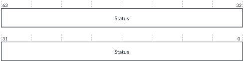

# GICT_ERRGSR, Error Group Status Register

Source: <https://developer.arm.com/documentation/102666/0201/Programmers-model-for-GIC-720AE/GICT-register-summary/GICT-ERRGSR--Error-Group-Status-Register>

### GICT\_ERRGSR, Error Group Status Register

This register shows the status of the GIC-720AE Armv8.2 RAS architecture-compliant error records for correctable and uncorrectable RAM ECC errors, ITS command and translation errors, and uncorrectable software errors.

### Configurations

This register is available in all configurations.

### Attributes

Width
:   64-bit

Functional group
:   See
    [GICT register summary](https://developer.arm.com/documentation/102666/0201/Programmers-model-for-GIC-720AE/GICT-register-summary?lang=en "The GIC-720AE trace and debug functions are controlled through registers that are identified with the prefix GICT.") for the address offset, type, and reset value of this register.

### Usage constraints

There are no usage constraints.

### Bit descriptions

Figure 1. GICT\_ERRGSR bit assignments

<table>
<caption>
Table 1. GICT_ERRGSR bit descriptions
</caption>
<colgroup>
<col span="1"/>
<col span="1"/>
<col span="1"/>
</colgroup>
<thead>
<tr>
<th class="documents-nocellnorowborder" colspan="1" id="d13569e139" rowspan="1">Bits</th>
<th class="documents-nocellnorowborder" colspan="1" id="d13569e142" rowspan="1">Name</th>
<th class="documents-cell-norowborder" colspan="1" id="d13569e145" rowspan="1">Description</th>
</tr>
</thead>
<tbody>
<tr>
<td class="documents-row-nocellborder" colspan="1" rowspan="1">[<code class="documents-option">n</code>]</td>
<td class="documents-row-nocellborder" colspan="1" rowspan="1">Status</td>
<td class="documents-cellrowborder" colspan="1" rowspan="1">Indicates the status of error record <code class="documents-option">n</code>, where <code class="documents-option">n</code> is 0-27+ depending on the configuration:

          <dl>
<dt class="documents-dlterm">
             0

           </dt>
<dd>
             The error record is not reporting any errors.

           </dd>
<dt class="documents-dlterm">
             1

           </dt>
<dd>
             The error record is reporting one or more errors.

           </dd>
</dl> </td>
</tr>
</tbody>
</table>

### Accessibility

If [GICD\_SAC](https://developer.arm.com/documentation/102666/0201/Programmers-model-for-GIC-720AE/Distributor-registers--GICD-GICDA--summary/GICD-SAC--Secure-Access-Control-register?lang=en "This register allows Secure software to grant Non-secure software with access to some GIC-720AE Secure features. It also controls whether Secure PMU events are visible to Non-secure software. For configurations that support multi view, it controls which view can access the GICP registers.").GICTNS == 0, then GICT\_ERRGSR is accessible only by Secure accesses.
