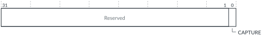

# GICP_CAPR, Counter Shadow Value Capture Register

Source: <https://developer.arm.com/documentation/102666/0201/Programmers-model-for-GIC-720AE/GICP-register-summary/GICP-CAPR--Counter-Shadow-Value-Capture-Register>

### GICP\_CAPR, Counter Shadow Value Capture Register

This register controls the counter shadow value capture mechanism.

### Configurations

This register is available in all configurations.

### Attributes

Width
:   32-bit

Functional group
:   See
    [GICP register summary](https://developer.arm.com/documentation/102666/0201/Programmers-model-for-GIC-720AE/GICP-register-summary?lang=en "The GIC-720AE Performance Monitoring Unit functions are controlled through registers that are identified with the prefix GICP.") for the address offset, type, and reset value of this register.

### Usage constraints

There are no usage constraints.

### Bit descriptions

Figure 1. GICP\_CAPR bit assignments

<table id="whr1469201838135__tbl.gicp_capr">
<caption>
Table 1. GICP_CAPR bit descriptions
</caption>
<colgroup>
<col span="1"/>
<col span="1"/>
<col span="1"/>
<col span="1"/>
</colgroup>
<thead>
<tr>
<th class="documents-nocellnorowborder" colspan="1" id="d95673e131" rowspan="1">Bits</th>
<th class="documents-nocellnorowborder" colspan="1" id="d95673e134" rowspan="1">Name</th>
<th class="documents-nocellnorowborder" colspan="1" id="d95673e137" rowspan="1">Description</th>
<th class="documents-cell-norowborder" colspan="1" id="d95673e140" rowspan="1">Type</th>
</tr>
</thead>
<tbody>
<tr>
<td class="documents-nocellnorowborder" colspan="1" rowspan="1">[31:1]</td>
<td class="documents-nocellnorowborder" colspan="1" rowspan="1">-</td>
<td class="documents-nocellnorowborder" colspan="1" rowspan="1">Reserved</td>
<td class="documents-cell-norowborder" colspan="1" rowspan="1">-</td>
</tr>
<tr>
<td class="documents-row-nocellborder" colspan="1" rowspan="1">[0]</td>
<td class="documents-row-nocellborder" colspan="1" rowspan="1">CAPTURE</td>
<td class="documents-row-nocellborder" colspan="1" rowspan="1">A write of 1 triggers a capture of all values within the PMU into their respective shadow registers.
A write of 0 has no effect.
 
See <a class="document-topic" document-topic-path="/102666/0201/Operation-of-GIC-720AE/Performance-Monitoring-Unit?lang=en#fpu1489160639895__sec.snapshot" href="https://developer.arm.com/documentation/102666/0201/Operation-of-GIC-720AE/Performance-Monitoring-Unit?lang=en#fpu1489160639895__sec.snapshot">Snapshot</a> for information about other snapshot event triggers.
 </td>
<td class="documents-cellrowborder" colspan="1" rowspan="1">WO</td>
</tr>
</tbody>
</table>

### Accessibility

If [GICD\_SAC](https://developer.arm.com/documentation/102666/0201/Programmers-model-for-GIC-720AE/Distributor-registers--GICD-GICDA--summary/GICD-SAC--Secure-Access-Control-register?lang=en "This register allows Secure software to grant Non-secure software with access to some GIC-720AE Secure features. It also controls whether Secure PMU events are visible to Non-secure software. For configurations that support multi view, it controls which view can access the GICP registers.").GICPNS == 0, then GICP\_CAPR is accessible only by Secure accesses.
