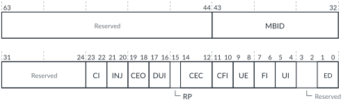

# FMU_ERR<n>FR, Error Record <n> Feature Register

Source: <https://developer.arm.com/documentation/102666/0201/Programmers-model-for-GIC-720AE/FMU-register-summary/FMU-ERR-n-FR--Error-Record--n--Feature-Register>

### FMU\_ERR<n>FR, Error Record <n> Feature Register

This register defines which of the common architecturally defined features are implemented and, of the implemented features, which are software programmable. GIC-720AE supports 12 error records, `n` = 0-11.

The value of
`n` maps to the following error records:

n=0
:   GICD, critical error record

n=1
:   GICD, non-critical error record

n=2
:   Wake Request, critical error record

n=3
:   Wake Request, non-critical error record

n=4
:   SPI Collator, critical error record

n=5
:   SPI Collator, non-critical error record

n=6
:   GCI, critical error record

n=7
:   GCI, non-critical error record

n=8
:   ITS, critical error record

n=9
:   ITS, non-critical error record

n=10
:   FMU, critical error record

n=11
:   FMU, non-critical error record

If a record is not implemented because the block type does not exist in the configuration, then this register is RAZ/WI.

If a GIC configuration contains a Wake Request block and the `wake_local` configuration parameter is set to 1, then the Wake Request is an integral part of the GICD. Therefore, the n=2 and n=3 records are not implemented.

### Configurations

This register is available in all configurations.

### Attributes

Width
:   64-bit

Functional group
:   See
    [FMU register summary](https://developer.arm.com/documentation/102666/0201/Programmers-model-for-GIC-720AE/FMU-register-summary?lang=en "The GIC-720AE Fault Management Unit (FMU) functions are controlled through registers that are identified with the prefix FMU.") for the address offset, type, and reset value of this register.

### Usage constraints

There are no usage constraints.

### Bit descriptions

Figure 1. FMU\_ERR<n>FR bit descriptions

<table>
<caption>
Table 1. FMU_ERR&lt;n&gt;FR bit assignments
</caption>
<colgroup>
<col span="1"/>
<col span="1"/>
<col span="1"/>
</colgroup>
<thead>
<tr>
<th class="documents-nocellnorowborder" colspan="1" id="d178745e278" rowspan="1">Bits</th>
<th class="documents-nocellnorowborder" colspan="1" id="d178745e281" rowspan="1">Name</th>
<th class="documents-cell-norowborder" colspan="1" id="d178745e284" rowspan="1">Description</th>
</tr>
</thead>
<tbody>
<tr>
<td class="documents-nocellnorowborder" colspan="1" rowspan="1">[63:44]</td>
<td class="documents-nocellnorowborder" colspan="1" rowspan="1">-</td>
<td class="documents-cell-norowborder" colspan="1" rowspan="1">Reserved, RAZ</td>
</tr>
<tr>
<td class="documents-nocellnorowborder" colspan="1" rowspan="1">[43:32]</td>
<td class="documents-nocellnorowborder" colspan="1" rowspan="1">MBID</td>
<td class="documents-cell-norowborder" colspan="1" rowspan="1">The maximum block ID, which is the number of configured blocks minus 1.</td>
</tr>
<tr>
<td class="documents-nocellnorowborder" colspan="1" rowspan="1">[31:24]</td>
<td class="documents-nocellnorowborder" colspan="1" rowspan="1">-</td>
<td class="documents-cell-norowborder" colspan="1" rowspan="1">Reserved, RAZ</td>
</tr>
<tr>
<td class="documents-nocellnorowborder" colspan="1" rowspan="1">[23:22]</td>
<td class="documents-nocellnorowborder" colspan="1" rowspan="1">CI</td>
<td class="documents-cell-norowborder" colspan="1" rowspan="1">Critical error interrupt. Returns:

          <dl>
<dt class="documents-dlterm">
0b00
</dt>
<dd>
             Critical error interrupt is not supported. This value occurs for odd records.

           </dd>
<dt class="documents-dlterm">
0b10
</dt>
<dd>
             Critical error interrupt is supported and controllable using

            <a class="document-topic" document-topic-path="/102666/0201/Programmers-model-for-GIC-720AE/FMU-register-summary/FMU-ERR-n-CTLR--Error-Record--n--Control-Register?lang=en" href="https://developer.arm.com/documentation/102666/0201/Programmers-model-for-GIC-720AE/FMU-register-summary/FMU-ERR-n-CTLR--Error-Record--n--Control-Register?lang=en" title="For even error records, this register controls whether the FMU can generate a critical error interrupt. For odd error records, this register controls whether the FMU can generate an error recovery interrupt. GIC-720AE supports 12 error records, n = 0-11.">FMU_ERR&lt;n&gt;CTLR</a>.CI. This value occurs for even records.

           </dd>
</dl> </td>
</tr>
<tr>
<td class="documents-nocellnorowborder" colspan="1" rowspan="1">[21:20]</td>
<td class="documents-nocellnorowborder" colspan="1" rowspan="1">INJ</td>
<td class="documents-cell-norowborder" colspan="1" rowspan="1">Fault injection extension. Returns:

          <dl>
<dt class="documents-dlterm">
0b00
</dt>
<dd>
             The FMU does not implement the RAS Common Fault Injection Model Extension.

           </dd>
</dl> </td>
</tr>
<tr>
<td class="documents-nocellnorowborder" colspan="1" rowspan="1">[19:18]</td>
<td class="documents-nocellnorowborder" colspan="1" rowspan="1">CEO</td>
<td class="documents-cell-norowborder" colspan="1" rowspan="1">Corrected error overwrite. This field is RES0 because CEC == 0b000.</td>
</tr>
<tr>
<td class="documents-nocellnorowborder" colspan="1" rowspan="1">[17:16]</td>
<td class="documents-nocellnorowborder" colspan="1" rowspan="1">DUI</td>
<td class="documents-cell-norowborder" colspan="1" rowspan="1">Error recovery interrupt for deferred errors control. Returns:

          <dl>
<dt class="documents-dlterm">
0b00
</dt>
<dd>
             The control for enabling error recovery interrupts on deferred errors is not supported.

           </dd>
</dl> </td>
</tr>
<tr>
<td class="documents-nocellnorowborder" colspan="1" rowspan="1">[15]</td>
<td class="documents-nocellnorowborder" colspan="1" rowspan="1">RP</td>
<td class="documents-cell-norowborder" colspan="1" rowspan="1">Repeat counter. Returns:

          <dl>
<dt class="documents-dlterm">
0b0
</dt>
<dd>
             The FMU does not implement the repeat Corrected error counter.

           </dd>
</dl> </td>
</tr>
<tr>
<td class="documents-nocellnorowborder" colspan="1" rowspan="1">[14:12]</td>
<td class="documents-nocellnorowborder" colspan="1" rowspan="1">CEC</td>
<td class="documents-cell-norowborder" colspan="1" rowspan="1">Corrected error counter. Returns:

          <dl>
<dt class="documents-dlterm">
0b000
</dt>
<dd>
             The FMU does not implement the standard Corrected error counter mechanism.

           </dd>
</dl> </td>
</tr>
<tr>
<td class="documents-nocellnorowborder" colspan="1" rowspan="1">[11:10]</td>
<td class="documents-nocellnorowborder" colspan="1" rowspan="1">CFI</td>
<td class="documents-cell-norowborder" colspan="1" rowspan="1">Fault handling interrupt for corrected errors control. Returns:

          <dl>
<dt class="documents-dlterm">
0b00
</dt>
<dd>
             Fault handling interrupts on corrected errors is not supported.

           </dd>
</dl> </td>
</tr>
<tr>
<td class="documents-nocellnorowborder" colspan="1" rowspan="1">[9:8]</td>
<td class="documents-nocellnorowborder" colspan="1" rowspan="1">UE</td>
<td class="documents-cell-norowborder" colspan="1" rowspan="1">Indicates whether the in-band error response (External Abort) and associated controls are implemented. Returns:

          <dl>
<dt class="documents-dlterm">
0b00
</dt>
<dd>
             In-band error response (External Abort) is not supported.

           </dd>
</dl> </td>
</tr>
<tr>
<td class="documents-nocellnorowborder" colspan="1" rowspan="1">[7:6]</td>
<td class="documents-nocellnorowborder" colspan="1" rowspan="1">FI</td>
<td class="documents-cell-norowborder" colspan="1" rowspan="1">Fault handling interrupt. Returns:

          <dl>
<dt class="documents-dlterm">
0b00
</dt>
<dd>
             Fault handling interrupt is not supported.

           </dd>
</dl> </td>
</tr>
<tr>
<td class="documents-nocellnorowborder" colspan="1" rowspan="1">[5:4]</td>
<td class="documents-nocellnorowborder" colspan="1" rowspan="1">UI</td>
<td class="documents-cell-norowborder" colspan="1" rowspan="1">Error recovery interrupt for uncorrected errors. Returns:

          <dl>
<dt class="documents-dlterm">
0b00
</dt>
<dd>
             Error recovery interrupt is not supported. This value occurs for even records.

           </dd>
<dt class="documents-dlterm">
0b10
</dt>
<dd>
             Error recovery interrupt is supported and controllable using

            <a class="document-topic" document-topic-path="/102666/0201/Programmers-model-for-GIC-720AE/FMU-register-summary/FMU-ERR-n-CTLR--Error-Record--n--Control-Register?lang=en" href="https://developer.arm.com/documentation/102666/0201/Programmers-model-for-GIC-720AE/FMU-register-summary/FMU-ERR-n-CTLR--Error-Record--n--Control-Register?lang=en" title="For even error records, this register controls whether the FMU can generate a critical error interrupt. For odd error records, this register controls whether the FMU can generate an error recovery interrupt. GIC-720AE supports 12 error records, n = 0-11.">FMU_ERR&lt;n&gt;CTLR</a>.UI. This value occurs for odd records.

           </dd>
</dl> </td>
</tr>
<tr>
<td class="documents-nocellnorowborder" colspan="1" rowspan="1">[3:2]</td>
<td class="documents-nocellnorowborder" colspan="1" rowspan="1">-</td>
<td class="documents-cell-norowborder" colspan="1" rowspan="1">Reserved, RAZ</td>
</tr>
<tr>
<td class="documents-row-nocellborder" colspan="1" rowspan="1">[1:0]</td>
<td class="documents-row-nocellborder" colspan="1" rowspan="1">ED</td>
<td class="documents-cellrowborder" colspan="1" rowspan="1">Error reporting and logging. Returns:

          <dl>
<dt class="documents-dlterm">
0b10
</dt>
<dd>
             Error reporting and logging is controllable using

            <a class="document-topic" document-topic-path="/102666/0201/Programmers-model-for-GIC-720AE/FMU-register-summary/FMU-ERR-n-CTLR--Error-Record--n--Control-Register?lang=en" href="https://developer.arm.com/documentation/102666/0201/Programmers-model-for-GIC-720AE/FMU-register-summary/FMU-ERR-n-CTLR--Error-Record--n--Control-Register?lang=en" title="For even error records, this register controls whether the FMU can generate a critical error interrupt. For odd error records, this register controls whether the FMU can generate an error recovery interrupt. GIC-720AE supports 12 error records, n = 0-11.">FMU_ERR&lt;n&gt;CTLR</a>.ED.

           </dd>
</dl> </td>
</tr>
</tbody>
</table>

### Accessibility

FMU\_ERR<n>FR is accessible only by Secure accesses.
