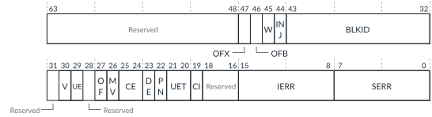

# FMU_ERR<n>STATUS, Error Record <n> Primary Status register

Source: <https://developer.arm.com/documentation/102666/0201/Programmers-model-for-GIC-720AE/FMU-register-summary/FMU-ERR-n-STATUS--Error-Record--n--Primary-Status-register>

### FMU\_ERR<n>STATUS, Error Record <n> Primary Status register

This register indicates information relating to the recorded errors in FMU error record <n>, where `n` = 0-11.

Software can write to this register to clear the FMU error records that [FMU\_ERRGSR](https://developer.arm.com/documentation/102666/0201/Programmers-model-for-GIC-720AE/FMU-register-summary/FMU-ERRGSR--Error-Group-Status-Register?lang=en "This register shows the status of all FMU_ERR<n>STATUS.V bits.") reports.

The value of
`n` maps to the following FMU error records:

n=0
:   GICD, critical error record

n=1
:   GICD, non-critical error record

n=2
:   Wake Request, critical error record

n=3
:   Wake Request, non-critical error record

n=4
:   SPI Collator, critical error record

n=5
:   SPI Collator, non-critical error record

n=6
:   GCI, critical error record

n=7
:   GCI, non-critical error record

n=8
:   ITS, critical error record

n=9
:   ITS, non-critical error record

n=10
:   FMU, critical error record

n=11
:   FMU, non-critical error record

If the error record <`n`> input error signal asserts or if an error\_report message is received, then the Valid (V) bit is set and the other information fields are updated for the new error. The cr\_err\_in\_\* and ncr\_err\_in\_\* signals are the error record <`n`> input error signals, where \* is ci, its, wake, or spicol. The error record <`n`> input error signals for the GICD and FMU are not externally accessible.

If a write to FMU\_ERR<n>STATUS causes an access to a powered-down block, then when the FMU sets [FMU\_STATUS](https://developer.arm.com/documentation/102666/0201/Programmers-model-for-GIC-720AE/FMU-register-summary/FMU-STATUS--FMU-Status-Register?lang=en "This register monitors whether there are any outstanding AXI5-Stream messages waiting for responses.").BUSY=0 it also sets [FMU\_STATUS](https://developer.arm.com/documentation/102666/0201/Programmers-model-for-GIC-720AE/FMU-register-summary/FMU-STATUS--FMU-Status-Register?lang=en "This register monitors whether there are any outstanding AXI5-Stream messages waiting for responses.").BLKID\_PWROFF=1.

If a GIC configuration contains a Wake Request block and the `wake_local` configuration parameter is set to 1, then the Wake Request is an integral part of the GICD. Therefore, the n=2 and n=3 records are not implemented.

### Configurations

This register is available in all configurations.

### Attributes

Width
:   64-bit

Functional group
:   See
    [FMU register summary](https://developer.arm.com/documentation/102666/0201/Programmers-model-for-GIC-720AE/FMU-register-summary?lang=en "The GIC-720AE Fault Management Unit (FMU) functions are controlled through registers that are identified with the prefix FMU.") for the address offset, type, and reset value of this register. This register is reset only by the
    fmu\_reset\_n signal.

### Usage constraints

- After a write to this register, poll the [FMU\_STATUS](https://developer.arm.com/documentation/102666/0201/Programmers-model-for-GIC-720AE/FMU-register-summary/FMU-STATUS--FMU-Status-Register?lang=en "This register monitors whether there are any outstanding AXI5-Stream messages waiting for responses.") register to ensure that the effect of the write is complete. Until the write takes effect, that is, [FMU\_STATUS](https://developer.arm.com/documentation/102666/0201/Programmers-model-for-GIC-720AE/FMU-register-summary/FMU-STATUS--FMU-Status-Register?lang=en "This register monitors whether there are any outstanding AXI5-Stream messages waiting for responses.").BUSY==0 then:
  - The corresponding bit of [FMU\_ERRGSR](https://developer.arm.com/documentation/102666/0201/Programmers-model-for-GIC-720AE/FMU-register-summary/FMU-ERRGSR--Error-Group-Status-Register?lang=en "This register shows the status of all FMU_ERR<n>STATUS.V bits.") might still report as 1.
  - Any interrupts caused by this record might still be asserted.
  - Any error that arrives, sets FMU\_ERR<n>STATUS in the same way that a new error does.
  - Any read of this register, returns the new error if a new error occurs.
- If software reads V=1, UE=1, and OF=0, then to clear the V and UE bits software must write V=1 and UE=1. If OF=0, then the FMU clears the V and UE bits.

  However, if V=1, UE=1, and OF=1 and software clears V and UE only, then the FMU does not update FMU\_ERR<n>STATUS, in accordance with RAS architecture v1.1, leaving V=1, UE=1, and OF=1. Therefore, after attempting a clear, another read is required to determine if V clears. If it did not clear and OF is now 1, clear again with OF set to 1.
- If software reads V=1, UE=1, and OF=1 it is not possible to know the exact number of errors that occurred for the reported BLKID and PROTID, only that it was at least 2 errors.
- If software reads V=1, UE=1, and OFB=1, it must clear the error normally, and the fault collator in the GIC block that caused the OFB, resends the PROTID for the second error on receiving the clear message for the first error. As a result of the fault collator barrier behavior, resend of the second error is guaranteed to have been sent by the fault collator (and received in the FMU) before the FMU receives the clear acknowledge for the first error. Receipt of the clear acknowledge is indicated by polling [FMU\_STATUS](https://developer.arm.com/documentation/102666/0201/Programmers-model-for-GIC-720AE/FMU-register-summary/FMU-STATUS--FMU-Status-Register?lang=en "This register monitors whether there are any outstanding AXI5-Stream messages waiting for responses.").BUSY==0.
- If software reads V=1, UE=1, and OFX=1, it must clear the error normally, and it must then trigger an error resend by writing the record pair ID to [FMU\_ERRUPDATE](https://developer.arm.com/documentation/102666/0201/Programmers-model-for-GIC-720AE/FMU-register-summary/FMU-ERRUPDATE--Error-Update-register?lang=en "This register updates an error record pair FMU_ERR<n>STATUS and FMU_ERR<n+1>STATUS, with all the reported error states. If software clears the FMU_ERR<n>STATUS.OFX bit, then it can use FMU_ERRUPDATE to discover the source of the error that caused the OFX to resend its error."). This write causes V, UE, OF, BLKID, and IERR to update with any outstanding errors from other BLKIDs. UE is a copy of the V bit, so the values written to V and UE must be the same.
- In the FMU, one BLKID corresponds to one fault collator in the GIC system. If an FMU register access to a fault collator requires that one or more errors are sent, the fault collator barrier behavior ensures that updates to the corresponding FMU\_ERR<n>STATUS register occur before [FMU\_STATUS](https://developer.arm.com/documentation/102666/0201/Programmers-model-for-GIC-720AE/FMU-register-summary/FMU-STATUS--FMU-Status-Register?lang=en "This register monitors whether there are any outstanding AXI5-Stream messages waiting for responses.").BUSY==0. The fault collator barrier behavior applies both to real errors that actual faults cause and to inserted errors that writes to [FMU\_SMERR](https://developer.arm.com/documentation/102666/0201/Programmers-model-for-GIC-720AE/FMU-register-summary/FMU-SMERR--Safety-Mechanism-Inject-Error-register?lang=en "This register injects one error into the specified protection mechanism inside a GIC block. Writes to this register cause an FMU_CTRL_ACCESS message to be sent with err_insert=1.") cause.
- The V bit can only be cleared, when the error packet from the block with the error has been received, that is, IERR is nonzero, and when either:
  - The error wire has been received from the block with the error, that is, W=1.
  - The error wire for the error record is disabled in the FMU, that is, [FMU\_ERR<n>CTLR](https://developer.arm.com/documentation/102666/0201/Programmers-model-for-GIC-720AE/FMU-register-summary/FMU-ERR-n-CTLR--Error-Record--n--Control-Register?lang=en "For even error records, this register controls whether the FMU can generate a critical error interrupt. For odd error records, this register controls whether the FMU can generate an error recovery interrupt. GIC-720AE supports 12 error records, n = 0-11.").W\_EN=0.To enable or disable error wire reporting in a block, software must use PROTID 255 for that block. See [Enabling or disabling both error signals on a block](https://developer.arm.com/documentation/102666/0201/Functional-safety-in-GIC-720AE/Fault-Management-Unit/Protection-mechanism-IDs/Enabling-or-disabling-both-error-signals-on-a-block?lang=en "Each block has a critical error signal output and a non-critical error signal output. Software can enable or disable both output signals on a block.") for more information.

### Bit descriptions

Figure 1. FMU\_ERR<n>STATUS bit assignments

<table>
<caption>
Table 1. FMU_ERR&lt;n&gt;STATUS bit descriptions
</caption>
<colgroup>
<col span="1"/>
<col span="1"/>
<col span="1"/>
<col span="1"/>
</colgroup>
<thead>
<tr>
<th class="documents-nocellnorowborder" colspan="1" id="d173546e465" rowspan="1">Bits</th>
<th class="documents-nocellnorowborder" colspan="1" id="d173546e468" rowspan="1">Name</th>
<th class="documents-nocellnorowborder" colspan="1" id="d173546e471" rowspan="1">Description</th>
<th class="documents-cell-norowborder" colspan="1" id="d173546e474" rowspan="1">Type</th>
</tr>
</thead>
<tbody>
<tr>
<td class="documents-nocellnorowborder" colspan="1" rowspan="1">[63:48]</td>
<td class="documents-nocellnorowborder" colspan="1" rowspan="1">-</td>
<td class="documents-nocellnorowborder" colspan="1" rowspan="1">Reserved, RAZ</td>
<td class="documents-cell-norowborder" colspan="1" rowspan="1">-</td>
</tr>
<tr>
<td class="documents-nocellnorowborder" colspan="1" rowspan="1">[47]</td>
<td class="documents-nocellnorowborder" colspan="1" rowspan="1">OFX</td>
<td class="documents-nocellnorowborder" colspan="1" rowspan="1">When 1, indicates that one or more errors have been received from one or more different BLKIDs, compared to the block ID that BLKID reports.</td>
<td class="documents-cell-norowborder" colspan="1" rowspan="1">RO</td>
</tr>
<tr>
<td class="documents-nocellnorowborder" colspan="1" rowspan="1">[46]</td>
<td class="documents-nocellnorowborder" colspan="1" rowspan="1">OFB</td>
<td class="documents-nocellnorowborder" colspan="1" rowspan="1">When 1, indicates that the reported BLKID has one or more errors for a different PROTID compared to the PROTID that the IERR field reports. Software can clear this bit by setting V = 0.</td>
<td class="documents-cell-norowborder" colspan="1" rowspan="1">RO</td>
</tr>
<tr>
<td class="documents-nocellnorowborder" colspan="1" rowspan="1">[45]</td>
<td class="documents-nocellnorowborder" colspan="1" rowspan="1">W</td>
<td class="documents-nocellnorowborder" colspan="1" rowspan="1">When 1, indicates that the error record &lt;<code class="documents-option">n</code>&gt; input error signal is asserted.</td>
<td class="documents-cell-norowborder" colspan="1" rowspan="1">RO</td>
</tr>
<tr>
<td class="documents-nocellnorowborder" colspan="1" rowspan="1">[44]</td>
<td class="documents-nocellnorowborder" colspan="1" rowspan="1">INJ</td>
<td class="documents-nocellnorowborder" colspan="1" rowspan="1">When 1, indicates that <a class="document-topic" document-topic-path="/102666/0201/Programmers-model-for-GIC-720AE/FMU-register-summary/FMU-SMERR--Safety-Mechanism-Inject-Error-register?lang=en" href="https://developer.arm.com/documentation/102666/0201/Programmers-model-for-GIC-720AE/FMU-register-summary/FMU-SMERR--Safety-Mechanism-Inject-Error-register?lang=en" title="This register injects one error into the specified protection mechanism inside a GIC block. Writes to this register cause an FMU_CTRL_ACCESS message to be sent with err_insert=1.">FMU_SMERR</a> injected the reported error.
This bit is not valid when FMU_ERR&lt;n&gt;STATUS.V == 0.
 </td>
<td class="documents-cell-norowborder" colspan="1" rowspan="1">RO</td>
</tr>
<tr>
<td class="documents-nocellnorowborder" colspan="1" rowspan="1">[43:32]</td>
<td class="documents-nocellnorowborder" colspan="1" rowspan="1">BLKID</td>
<td class="documents-nocellnorowborder" colspan="1" rowspan="1">This field indicates the ID of the component block that is reporting an error.
This field is valid only when FMU_ERR&lt;n&gt;STATUS.V==1.
 
The BLKID that is used to access a GCI does not change, even if processors are removed from a pre-configured GIC. See <a class="document-topic" document-topic-path="/102666/0201/Getting-started-with-GIC-720AE/Removing-cores-from-a-preconfigured-GIC?lang=en" href="https://developer.arm.com/documentation/102666/0201/Getting-started-with-GIC-720AE/Removing-cores-from-a-preconfigured-GIC?lang=en" title="The GIC can be configured to either enable Secure software or a tie-off signal to remove cores from a GIC configuration. This feature enables you to use a single GIC configuration in multiple products that contain a different number of cores.">Removing cores from a preconfigured GIC</a>.
 
When BLKID is not known, this field becomes 0. The BLKID might be unknown when software clears V or when the error wire for record &lt;n&gt; is received.
 </td>
<td class="documents-cell-norowborder" colspan="1" rowspan="1">RO</td>
</tr>
<tr>
<td class="documents-nocellnorowborder" colspan="1" rowspan="1">[31]</td>
<td class="documents-nocellnorowborder" colspan="1" rowspan="1">-</td>
<td class="documents-nocellnorowborder" colspan="1" rowspan="1">Reserved, RAZ</td>
<td class="documents-cell-norowborder" colspan="1" rowspan="1">-</td>
</tr>
<tr>
<td class="documents-nocellnorowborder" colspan="1" rowspan="1">[30]</td>
<td class="documents-nocellnorowborder" colspan="1" rowspan="1">V</td>
<td class="documents-nocellnorowborder" colspan="1" rowspan="1">Indicates if this register is valid:

          <dl>
<dt class="documents-dlterm">
             0

           </dt>
<dd>
             FMU_ERR&lt;n&gt;STATUS is not valid.

           </dd>
<dt class="documents-dlterm">
             1

           </dt>
<dd>
             FMU_ERR&lt;n&gt;STATUS is valid. One or more errors are recorded.

           </dd>
</dl> 
Write 1 to clear. When clearing this bit, FMU_ERR&lt;n&gt;STATUS.UE must also be cleared.
 </td>
<td class="documents-cell-norowborder" colspan="1" rowspan="1">RW</td>
</tr>
<tr>
<td class="documents-nocellnorowborder" colspan="1" rowspan="1">[29]</td>
<td class="documents-nocellnorowborder" colspan="1" rowspan="1">UE</td>
<td class="documents-nocellnorowborder" colspan="1" rowspan="1">Uncorrected error bit. This bit value is the same as the V bit, because errors are always reported as uncorrected.
Software can read the IERR field to determine if the error is due to a RAM SEC error.
 
Write 1 to clear. When clearing this bit, FMU_ERR&lt;n&gt;STATUS.V must also be cleared.
 </td>
<td class="documents-cell-norowborder" colspan="1" rowspan="1">RW</td>
</tr>
<tr>
<td class="documents-nocellnorowborder" colspan="1" rowspan="1">[28]</td>
<td class="documents-nocellnorowborder" colspan="1" rowspan="1">-</td>
<td class="documents-nocellnorowborder" colspan="1" rowspan="1">Reserved, RAZ</td>
<td class="documents-cell-norowborder" colspan="1" rowspan="1">-</td>
</tr>
<tr>
<td class="documents-nocellnorowborder" colspan="1" rowspan="1">[27]</td>
<td class="documents-nocellnorowborder" colspan="1" rowspan="1">OF</td>
<td class="documents-nocellnorowborder" colspan="1" rowspan="1">Reported PROTID has overflowed:

          <dl>
<dt class="documents-dlterm">
             0

           </dt>
<dd>
             No overflow for the current PROTID.

           </dd>
<dt class="documents-dlterm">
             1

           </dt>
<dd>
             More than one error is recorded against the current PROTID.

           </dd>
</dl> 
To clear this bit, software writes OF = 1, V = 1, UE = 1 to this register.
 </td>
<td class="documents-cell-norowborder" colspan="1" rowspan="1">RW</td>
</tr>
<tr>
<td class="documents-nocellnorowborder" colspan="1" rowspan="1">[26]</td>
<td class="documents-nocellnorowborder" colspan="1" rowspan="1">MV</td>
<td class="documents-nocellnorowborder" colspan="1" rowspan="1">Miscellaneous registers valid bit is not supported, RAZ/WI.</td>
<td class="documents-cell-norowborder" colspan="1" rowspan="1">-</td>
</tr>
<tr>
<td class="documents-nocellnorowborder" colspan="1" rowspan="1">[25:24]</td>
<td class="documents-nocellnorowborder" colspan="1" rowspan="1">CE</td>
<td class="documents-nocellnorowborder" colspan="1" rowspan="1">Corrected error field is not supported, RAZ/WI.</td>
<td class="documents-cell-norowborder" colspan="1" rowspan="1">-</td>
</tr>
<tr>
<td class="documents-nocellnorowborder" colspan="1" rowspan="1">[23]</td>
<td class="documents-nocellnorowborder" colspan="1" rowspan="1">DE</td>
<td class="documents-nocellnorowborder" colspan="1" rowspan="1">Deferred error bit is not supported, RAZ/WI.</td>
<td class="documents-cell-norowborder" colspan="1" rowspan="1">-</td>
</tr>
<tr>
<td class="documents-nocellnorowborder" colspan="1" rowspan="1">[22]</td>
<td class="documents-nocellnorowborder" colspan="1" rowspan="1">PN</td>
<td class="documents-nocellnorowborder" colspan="1" rowspan="1">Poison bit is not supported, RAZ/WI.</td>
<td class="documents-cell-norowborder" colspan="1" rowspan="1">-</td>
</tr>
<tr>
<td class="documents-nocellnorowborder" colspan="1" rowspan="1">[21:20]</td>
<td class="documents-nocellnorowborder" colspan="1" rowspan="1">UET</td>
<td class="documents-nocellnorowborder" colspan="1" rowspan="1">Uncorrected error type. Returns:

          <dl>
<dt class="documents-dlterm">
0b11
</dt>
<dd>
             Uncorrected error, Signaled or Recoverable error (UER).

           </dd>
</dl> 
This field is not valid and reads as zero if either of the following conditions are true:

<ul>
<li>FMU_ERR&lt;n&gt;STATUS.V == 0</li>
<li>FMU_ERR&lt;n&gt;STATUS.UE == 0</li>
</ul> </td>
<td class="documents-cell-norowborder" colspan="1" rowspan="1">RO</td>
</tr>
<tr>
<td class="documents-nocellnorowborder" colspan="1" rowspan="1">[19]</td>
<td class="documents-nocellnorowborder" colspan="1" rowspan="1">CI</td>
<td class="documents-nocellnorowborder" colspan="1" rowspan="1">

            Indicates whether a critical error condition has been recorded:

           <dl>
<dt class="documents-dlterm">
              0

            </dt>
<dd>
              No critical error condition.

            </dd>
<dt class="documents-dlterm">
              1

            </dt>
<dd>
              Critical error condition recorded.

            </dd>
</dl>

 
This bit is not valid and reads as zero when FMU_ERR&lt;n&gt;STATUS.V == 0.
 For non-critical records (odd IDs), this field is always 0. For critical records (even IDs), this bit reports the same value as V and it does not need to be written when clearing V.</td>
<td class="documents-cell-norowborder" colspan="1" rowspan="1">RW</td>
</tr>
<tr>
<td class="documents-nocellnorowborder" colspan="1" rowspan="1">[18:16]</td>
<td class="documents-nocellnorowborder" colspan="1" rowspan="1">-</td>
<td class="documents-nocellnorowborder" colspan="1" rowspan="1">Reserved, RAZ</td>
<td class="documents-cell-norowborder" colspan="1" rowspan="1">-</td>
</tr>
<tr>
<td class="documents-nocellnorowborder" colspan="1" rowspan="1">[15:8]</td>
<td class="documents-nocellnorowborder" colspan="1" rowspan="1">IERR</td>
<td class="documents-nocellnorowborder" colspan="1" rowspan="1">Implementation-defined error code.
Contains the Protection Mechanism ID (PROTID), which indicates the protection mechanism reporting the error. If FMU_ERR&lt;n&gt;STATUS.V == 0, this field is not valid and reads as zero.
 
When V=1 but the PROTID is not yet known, this field is set to 0.
 </td>
<td class="documents-cell-norowborder" colspan="1" rowspan="1">RO</td>
</tr>
<tr>
<td class="documents-row-nocellborder" colspan="1" rowspan="1">[7:0]</td>
<td class="documents-row-nocellborder" colspan="1" rowspan="1">SERR</td>
<td class="documents-row-nocellborder" colspan="1" rowspan="1">Architecturally defined primary error code. If an error occurs, this field returns:

          <dl>
<dt class="documents-dlterm">
0x01
</dt>
<dd>
             Implementation-defined error.

           </dd>
</dl> </td>
<td class="documents-cellrowborder" colspan="1" rowspan="1">RO</td>
</tr>
</tbody>
</table>

### Accessibility

FMU\_ERR<n>STATUS is accessible only by Secure accesses.
