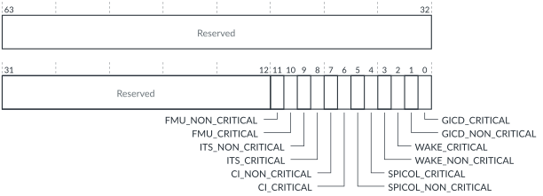

# FMU_ERRGSR, Error Group Status Register

Source: <https://developer.arm.com/documentation/102666/0201/Programmers-model-for-GIC-720AE/FMU-register-summary/FMU-ERRGSR--Error-Group-Status-Register>

### FMU\_ERRGSR, Error Group Status Register

This register shows the status of all FMU\_ERR<n>STATUS.V bits.

### Configurations

This register is available in all configurations.

### Attributes

Width
:   64-bit

Functional group
:   See
    [FMU register summary](https://developer.arm.com/documentation/102666/0201/Programmers-model-for-GIC-720AE/FMU-register-summary?lang=en "The GIC-720AE Fault Management Unit (FMU) functions are controlled through registers that are identified with the prefix FMU.") for the address offset, type, and reset value of this register.

### Usage constraints

There are no usage constraints.

### Bit descriptions

Figure 1. FMU\_ERRGSR bit assignments

<table>
<caption>
Table 1. FMU_ERRGSR bit descriptions
</caption>
<colgroup>
<col span="1"/>
<col span="1"/>
<col span="1"/>
</colgroup>
<thead>
<tr>
<th class="documents-nocellnorowborder" colspan="1" id="d171872e133" rowspan="1">Bits</th>
<th class="documents-nocellnorowborder" colspan="1" id="d171872e136" rowspan="1">Name</th>
<th class="documents-cell-norowborder" colspan="1" id="d171872e139" rowspan="1">Description</th>
</tr>
</thead>
<tbody>
<tr>
<td class="documents-nocellnorowborder" colspan="1" rowspan="1">[63:12]</td>
<td class="documents-nocellnorowborder" colspan="1" rowspan="1">-</td>
<td class="documents-cell-norowborder" colspan="1" rowspan="1">Reserved, RAZ</td>
</tr>
<tr>
<td class="documents-nocellnorowborder" colspan="1" rowspan="1">[11]</td>
<td class="documents-nocellnorowborder" colspan="1" rowspan="1">FMU_NON_CRITICAL</td>
<td class="documents-cell-norowborder" colspan="1" rowspan="1">Returns the status of the FMU non-critical error record:

          <dl>
<dt class="documents-dlterm">
             0

           </dt>
<dd>
             The error record is not reporting any errors.

           </dd>
<dt class="documents-dlterm">
             1

           </dt>
<dd>
             The error record is reporting one or more errors.

           </dd>
</dl> </td>
</tr>
<tr>
<td class="documents-nocellnorowborder" colspan="1" rowspan="1">[10]</td>
<td class="documents-nocellnorowborder" colspan="1" rowspan="1">FMU_CRITICAL</td>
<td class="documents-cell-norowborder" colspan="1" rowspan="1">Returns the status of the FMU critical error record:

          <dl>
<dt class="documents-dlterm">
             0

           </dt>
<dd>
             The error record is not reporting any errors.

           </dd>
<dt class="documents-dlterm">
             1

           </dt>
<dd>
             The error record is reporting one or more errors.

           </dd>
</dl> </td>
</tr>
<tr>
<td class="documents-nocellnorowborder" colspan="1" rowspan="1">[9]</td>
<td class="documents-nocellnorowborder" colspan="1" rowspan="1">ITS_NON_CRITICAL</td>
<td class="documents-cell-norowborder" colspan="1" rowspan="1">Returns the status of the combined ITS hardware non-critical error record:

          <dl>
<dt class="documents-dlterm">
             0

           </dt>
<dd>
             The error record is not reporting any errors.

           </dd>
<dt class="documents-dlterm">
             1

           </dt>
<dd>
             The error record is reporting one or more errors.

           </dd>
</dl> </td>
</tr>
<tr>
<td class="documents-nocellnorowborder" colspan="1" rowspan="1">[8]</td>
<td class="documents-nocellnorowborder" colspan="1" rowspan="1">ITS_CRITICAL</td>
<td class="documents-cell-norowborder" colspan="1" rowspan="1">Returns the status of the combined ITS hardware critical error record:

          <dl>
<dt class="documents-dlterm">
             0

           </dt>
<dd>
             The error record is not reporting any errors.

           </dd>
<dt class="documents-dlterm">
             1

           </dt>
<dd>
             The error record is reporting one or more errors.

           </dd>
</dl> </td>
</tr>
<tr>
<td class="documents-nocellnorowborder" colspan="1" rowspan="1">[7]</td>
<td class="documents-nocellnorowborder" colspan="1" rowspan="1">CI_NON_CRITICAL</td>
<td class="documents-cell-norowborder" colspan="1" rowspan="1">Returns the status of the combined CI hardware non-critical error record:

          <dl>
<dt class="documents-dlterm">
             0

           </dt>
<dd>
             The error record is not reporting any errors.

           </dd>
<dt class="documents-dlterm">
             1

           </dt>
<dd>
             The error record is reporting one or more errors.

           </dd>
</dl> </td>
</tr>
<tr>
<td class="documents-nocellnorowborder" colspan="1" rowspan="1">[6]</td>
<td class="documents-nocellnorowborder" colspan="1" rowspan="1">CI_CRITICAL</td>
<td class="documents-cell-norowborder" colspan="1" rowspan="1">Returns the status of the combined CI hardware critical error record:

          <dl>
<dt class="documents-dlterm">
             0

           </dt>
<dd>
             The error record is not reporting any errors.

           </dd>
<dt class="documents-dlterm">
             1

           </dt>
<dd>
             The error record is reporting one or more errors.

           </dd>
</dl> </td>
</tr>
<tr>
<td class="documents-nocellnorowborder" colspan="1" rowspan="1">[5]</td>
<td class="documents-nocellnorowborder" colspan="1" rowspan="1">SPICOL_NON_CRITICAL</td>
<td class="documents-cell-norowborder" colspan="1" rowspan="1">Returns the status of the combined SPI Collator hardware non-critical error record:

          <dl>
<dt class="documents-dlterm">
             0

           </dt>
<dd>
             The error record is not reporting any errors.

           </dd>
<dt class="documents-dlterm">
             1

           </dt>
<dd>
             The error record is reporting one or more errors.

           </dd>
</dl> </td>
</tr>
<tr>
<td class="documents-nocellnorowborder" colspan="1" rowspan="1">[4]</td>
<td class="documents-nocellnorowborder" colspan="1" rowspan="1">SPICOL_CRITICAL</td>
<td class="documents-cell-norowborder" colspan="1" rowspan="1">Returns the status of the combined SPI Collator hardware critical error record:

          <dl>
<dt class="documents-dlterm">
             0

           </dt>
<dd>
             The error record is not reporting any errors.

           </dd>
<dt class="documents-dlterm">
             1

           </dt>
<dd>
             The error record is reporting one or more errors.

           </dd>
</dl> </td>
</tr>
<tr>
<td class="documents-nocellnorowborder" colspan="1" rowspan="1">[3]</td>
<td class="documents-nocellnorowborder" colspan="1" rowspan="1">WAKE_NON_CRITICAL</td>
<td class="documents-cell-norowborder" colspan="1" rowspan="1">Returns the status of the Wake Request non-critical error record:

          <dl>
<dt class="documents-dlterm">
             0

           </dt>
<dd>
             The error record is not reporting any errors.

           </dd>
<dt class="documents-dlterm">
             1

           </dt>
<dd>
             The error record is reporting one or more errors.

           </dd>
</dl> </td>
</tr>
<tr>
<td class="documents-nocellnorowborder" colspan="1" rowspan="1">[2]</td>
<td class="documents-nocellnorowborder" colspan="1" rowspan="1">WAKE_CRITICAL</td>
<td class="documents-cell-norowborder" colspan="1" rowspan="1">Returns the status of the Wake Request critical error record:

          <dl>
<dt class="documents-dlterm">
             0

           </dt>
<dd>
             The error record is not reporting any errors.

           </dd>
<dt class="documents-dlterm">
             1

           </dt>
<dd>
             The error record is reporting one or more errors.

           </dd>
</dl> </td>
</tr>
<tr>
<td class="documents-nocellnorowborder" colspan="1" rowspan="1">[1]</td>
<td class="documents-nocellnorowborder" colspan="1" rowspan="1">GICD_NON_CRITICAL</td>
<td class="documents-cell-norowborder" colspan="1" rowspan="1">Returns the status of the GICD non-critical error record:

          <dl>
<dt class="documents-dlterm">
             0

           </dt>
<dd>
             The error record is not reporting any errors.

           </dd>
<dt class="documents-dlterm">
             1

           </dt>
<dd>
             The error record is reporting one or more errors.

           </dd>
</dl> </td>
</tr>
<tr>
<td class="documents-row-nocellborder" colspan="1" rowspan="1">[0]</td>
<td class="documents-row-nocellborder" colspan="1" rowspan="1">GICD_CRITICAL</td>
<td class="documents-cellrowborder" colspan="1" rowspan="1">Returns the status of the GICD critical error record:

          <dl>
<dt class="documents-dlterm">
             0

           </dt>
<dd>
             The error record is not reporting any errors.

           </dd>
<dt class="documents-dlterm">
             1

           </dt>
<dd>
             The error record is reporting one or more errors.

           </dd>
</dl> </td>
</tr>
</tbody>
</table>

### Accessibility

FMU\_ERRGSR is accessible only by Secure accesses.
