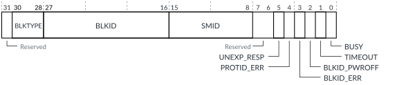

# FMU_STATUS, FMU Status Register

Source: <https://developer.arm.com/documentation/102666/0201/Programmers-model-for-GIC-720AE/FMU-register-summary/FMU-STATUS--FMU-Status-Register>

### FMU\_STATUS, FMU Status Register

This register monitors whether there are any outstanding AXI5-Stream messages waiting for responses.

### Configurations

This register is available in all configurations.

### Attributes

Width
:   32-bit

Functional group
:   See
    [FMU register summary](https://developer.arm.com/documentation/102666/0201/Programmers-model-for-GIC-720AE/FMU-register-summary?lang=en "The GIC-720AE Fault Management Unit (FMU) functions are controlled through registers that are identified with the prefix FMU.") for the address offset, type, and reset value of this register.

### Usage constraints

There are no usage constraints.

### Bit descriptions

Figure 1. FMU\_STATUS bit assignments

<table>
<caption>
Table 1. FMU_STATUS bit descriptions
</caption>
<colgroup>
<col span="1"/>
<col span="1"/>
<col span="1"/>
</colgroup>
<thead>
<tr>
<th class="documents-nocellnorowborder" colspan="1" id="d85943e136" rowspan="1">Bits</th>
<th class="documents-nocellnorowborder" colspan="1" id="d85943e139" rowspan="1">Name</th>
<th class="documents-cell-norowborder" colspan="1" id="d85943e142" rowspan="1">Description</th>
</tr>
</thead>
<tbody>
<tr>
<td class="documents-nocellnorowborder" colspan="1" rowspan="1">[31]</td>
<td class="documents-nocellnorowborder" colspan="1" rowspan="1">-</td>
<td class="documents-cell-norowborder" colspan="1" rowspan="1">Reserved, RAZ</td>
</tr>
<tr>
<td class="documents-nocellnorowborder" colspan="1" rowspan="1">[30:28]</td>
<td class="documents-nocellnorowborder" colspan="1" rowspan="1">BLKTYPE</td>
<td class="documents-cell-norowborder" colspan="1" rowspan="1">Block type identifier from the last response.</td>
</tr>
<tr>
<td class="documents-nocellnorowborder" colspan="1" rowspan="1">[27:16]</td>
<td class="documents-nocellnorowborder" colspan="1" rowspan="1">BLKID</td>
<td class="documents-cell-norowborder" colspan="1" rowspan="1">Block identifier from the last response.
However, during the ERRUPDATE mechanism, this field always indicates a valid block and has the following behavior:

<ul>
<li>If FMU_ERRUPDATE.MODE == 1 and the FMU receives a “block powered down” message, then this field contains the BLKID of the powered down block.</li>
<li>If the FMU receives an “invalid BLKID” message, then this field contains the last valid BLKID.</li>
<li>If the update process reaches the final BLKID and it receives a “Success” response, then this block is the last valid BLKID. The final BLKID is (2<code class="documents-parmname">BLKID_WIDTH</code>−1).</li>
</ul> </td>
</tr>
<tr>
<td class="documents-nocellnorowborder" colspan="1" rowspan="1">[15:8]</td>
<td class="documents-nocellnorowborder" colspan="1" rowspan="1">SMID</td>
<td class="documents-cell-norowborder" colspan="1" rowspan="1">Protection mechanism identifier (PROTID) from the last response. However, if BLKID_ERR == 1 or BLKID_PWROFF == 1, then the SMID is not valid.</td>
</tr>
<tr>
<td class="documents-nocellnorowborder" colspan="1" rowspan="1">[7:6]</td>
<td class="documents-nocellnorowborder" colspan="1" rowspan="1">-</td>
<td class="documents-cell-norowborder" colspan="1" rowspan="1">Reserved, RAZ</td>
</tr>
<tr>
<td class="documents-nocellnorowborder" colspan="1" rowspan="1">[5]</td>
<td class="documents-nocellnorowborder" colspan="1" rowspan="1">UNEXP_RESP</td>
<td class="documents-cell-norowborder" colspan="1" rowspan="1">Indicates whether the last command received an unexpected response:

          <dl>
<dt class="documents-dlterm">
             0

           </dt>
<dd>
             The previous command received a response that was expected.

           </dd>
<dt class="documents-dlterm">
             1

           </dt>
<dd>
             The previous command failed because the FMU received an unexpected response, possibly due to a timeout.

           </dd>
</dl> </td>
</tr>
<tr>
<td class="documents-nocellnorowborder" colspan="1" rowspan="1">[4]</td>
<td class="documents-nocellnorowborder" colspan="1" rowspan="1">PROTID_ERR</td>
<td class="documents-cell-norowborder" colspan="1" rowspan="1">Indicates whether the last read or write command failed because the PROTID and PAGEID values were not valid:

          <dl>
<dt class="documents-dlterm">
             0

           </dt>
<dd>
             The previous read or write command was sent using valid PROTID and PAGEID values.

           </dd>
<dt class="documents-dlterm">
             1

           </dt>
<dd>
             The previous read or write command failed because the PROTID or PAGEID fields specified were set to an invalid value. For reads, this value also indicates that

            <a class="document-topic" document-topic-path="/102666/0201/Programmers-model-for-GIC-720AE/FMU-register-summary/FMU-SMRDATA--Safety-Mechanism-Read-Data-register?lang=en" href="https://developer.arm.com/documentation/102666/0201/Programmers-model-for-GIC-720AE/FMU-register-summary/FMU-SMRDATA--Safety-Mechanism-Read-Data-register?lang=en" title="This register contains the data that is read during a page read access.">FMU_SMRDATA</a> is invalid.

            
Different protection mechanisms have a maximum PAGEID of 0, 1, or 2. Accessing a non-valid page causes the FMU to report an error.

</dd>
</dl> </td>
</tr>
<tr>
<td class="documents-nocellnorowborder" colspan="1" rowspan="1">[3]</td>
<td class="documents-nocellnorowborder" colspan="1" rowspan="1">BLKID_ERR</td>
<td class="documents-cell-norowborder" colspan="1" rowspan="1">Indicates whether the last command failed because the destination block did not exist:

          <dl>
<dt class="documents-dlterm">
             0

           </dt>
<dd>
             The previous command was sent to a valid destination block.

           </dd>
<dt class="documents-dlterm">
             1

           </dt>
<dd>
             The previous command failed because the block that the BLKID field specified was set to an invalid value.

           </dd>
</dl> </td>
</tr>
<tr>
<td class="documents-nocellnorowborder" colspan="1" rowspan="1">[2]</td>
<td class="documents-nocellnorowborder" colspan="1" rowspan="1">BLKID_PWROFF</td>
<td class="documents-cell-norowborder" colspan="1" rowspan="1">Indicates whether the last command failed because the destination block was powered down:

          <dl>
<dt class="documents-dlterm">
             0

           </dt>
<dd>
             The previous command was sent to a block that was powered up.

           </dd>
<dt class="documents-dlterm">
             1

           </dt>
<dd>
             The previous command failed because the block that the BLKID field specified was powered down.

           </dd>
</dl> </td>
</tr>
<tr>
<td class="documents-nocellnorowborder" colspan="1" rowspan="1">[1]</td>
<td class="documents-nocellnorowborder" colspan="1" rowspan="1">TIMEOUT</td>
<td class="documents-cell-norowborder" colspan="1" rowspan="1">Indicates whether the last AXI5-Stream response timed out:

          <dl>
<dt class="documents-dlterm">
             0

           </dt>
<dd>
             The FMU received the response for the previous

            AXI5-Stream message in ≤

            <a class="document-topic" document-topic-path="/102666/0201/Programmers-model-for-GIC-720AE/FMU-register-summary/FMU-TIMEOUT--Timeout-duration-register?lang=en" href="https://developer.arm.com/documentation/102666/0201/Programmers-model-for-GIC-720AE/FMU-register-summary/FMU-TIMEOUT--Timeout-duration-register?lang=en" title="When FMU_STATUS.BUSY == 1, this register controls the duration before the FMU sets FMU_STATUS.TIMEOUT = 1.">FMU_TIMEOUT</a>.DURATION clock cycles.

           </dd>
<dt class="documents-dlterm">
             1

           </dt>
<dd>
             The FMU did not receive the response for the previous

            AXI5-Stream message in ≤

            <a class="document-topic" document-topic-path="/102666/0201/Programmers-model-for-GIC-720AE/FMU-register-summary/FMU-TIMEOUT--Timeout-duration-register?lang=en" href="https://developer.arm.com/documentation/102666/0201/Programmers-model-for-GIC-720AE/FMU-register-summary/FMU-TIMEOUT--Timeout-duration-register?lang=en" title="When FMU_STATUS.BUSY == 1, this register controls the duration before the FMU sets FMU_STATUS.TIMEOUT = 1.">FMU_TIMEOUT</a>.DURATION clock cycles. This value causes the FMU to set BUSY = 0.

           </dd>
</dl> </td>
</tr>
<tr>
<td class="documents-row-nocellborder" colspan="1" rowspan="1">[0]</td>
<td class="documents-row-nocellborder" colspan="1" rowspan="1">BUSY</td>
<td class="documents-cellrowborder" colspan="1" rowspan="1">Indicates if the FMU is busy:

          <dl>
<dt class="documents-dlterm">
             0

           </dt>
<dd>
             FMU is not busy.

           </dd>
<dt class="documents-dlterm">
             1

           </dt>
<dd>
             FMU is busy processing the previous command.

           </dd>
</dl> </td>
</tr>
</tbody>
</table>

### Accessibility

FMU\_STATUS is accessible only by Secure accesses.
