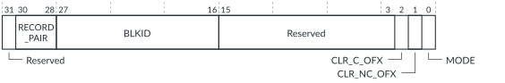

# FMU_ERRUPDATE, Error Update register

Source: <https://developer.arm.com/documentation/102666/0201/Programmers-model-for-GIC-720AE/FMU-register-summary/FMU-ERRUPDATE--Error-Update-register>

### FMU\_ERRUPDATE, Error Update register

This register updates an error record pair FMU\_ERR<n>STATUS and FMU\_ERR<n+1>STATUS, with all the reported error states. If software clears the FMU\_ERR<n>STATUS.OFX bit, then it can use FMU\_ERRUPDATE to discover the source of the error that caused the OFX to resend its error.

The update process sequentially sends an FMU\_CTRL\_ACCESS message that contains PROTID=255, to all fault collators on the error record pair. On receiving this message, the fault collator sends any pending errors, up to a maximum of two critical errors and two non-critical errors. When the FMU receives the errors it updates [FMU\_ERR<n>STATUS](https://developer.arm.com/documentation/102666/0201/Programmers-model-for-GIC-720AE/FMU-register-summary/FMU-ERR-n-STATUS--Error-Record--n--Primary-Status-register?lang=en "This register indicates information relating to the recorded errors in FMU error record <n>, where n = 0-11.") and FMU\_ERR<n+1>STATUS.

When the error update process starts, the FMU sets
[FMU\_STATUS](https://developer.arm.com/documentation/102666/0201/Programmers-model-for-GIC-720AE/FMU-register-summary/FMU-STATUS--FMU-Status-Register?lang=en "This register monitors whether there are any outstanding AXI5-Stream messages waiting for responses.").BUSY=1, and the bit remains set until completion. The
[FMU\_STATUS](https://developer.arm.com/documentation/102666/0201/Programmers-model-for-GIC-720AE/FMU-register-summary/FMU-STATUS--FMU-Status-Register?lang=en "This register monitors whether there are any outstanding AXI5-Stream messages waiting for responses.").BLKID indicates the progress of the update process. After the process completes, if:

- MODE==0, the [FMU\_STATUS](https://developer.arm.com/documentation/102666/0201/Programmers-model-for-GIC-720AE/FMU-register-summary/FMU-STATUS--FMU-Status-Register?lang=en "This register monitors whether there are any outstanding AXI5-Stream messages waiting for responses.").BLKID shows the last valid BLKID.
- MODE==1, the [FMU\_STATUS](https://developer.arm.com/documentation/102666/0201/Programmers-model-for-GIC-720AE/FMU-register-summary/FMU-STATUS--FMU-Status-Register?lang=en "This register monitors whether there are any outstanding AXI5-Stream messages waiting for responses.").BLKID shows the BLKID of the first powered-down block.

The error update process stops when:

- It receives a response packet with “BLKID invalid”.
- MODE=1, and it receives a response packet with “powered down block”.
- BLKTYPE is internal FMU, and it checks the only valid BLKID (0).
- It reaches the last possible BLKID based on the `BLKID_WIDTH` parameter.
- [FMU\_STATUS](https://developer.arm.com/documentation/102666/0201/Programmers-model-for-GIC-720AE/FMU-register-summary/FMU-STATUS--FMU-Status-Register?lang=en "This register monitors whether there are any outstanding AXI5-Stream messages waiting for responses.").BUSY==1 for a duration that causes a timeout to occur.

During the error update process, the FMU does not record any “powered down” or “invalid block” responses as errors, because the mechanism requires those responses. However, if the first BLKID receives a “powered down” or “invalid block” response, then the FMU reports that error. The first BLKID is the value that software wrote.

### Configurations

This register is available in all configurations.

### Attributes

Width
:   32-bit

Functional group
:   See
    [FMU register summary](https://developer.arm.com/documentation/102666/0201/Programmers-model-for-GIC-720AE/FMU-register-summary?lang=en "The GIC-720AE Fault Management Unit (FMU) functions are controlled through registers that are identified with the prefix FMU.") for the address offset, type, and reset value of this register.

### Usage constraints

There are no usage constraints.

### Bit descriptions

Figure 1. FMU\_ERRUPDATE bit assignments

<table>
<caption>
Table 1. FMU_ERRUPDATE bit descriptions
</caption>
<colgroup>
<col span="1"/>
<col span="1"/>
<col span="1"/>
</colgroup>
<thead>
<tr>
<th class="documents-nocellnorowborder" colspan="1" id="d46137e260" rowspan="1">Bits</th>
<th class="documents-nocellnorowborder" colspan="1" id="d46137e263" rowspan="1">Name</th>
<th class="documents-cell-norowborder" colspan="1" id="d46137e266" rowspan="1">Description</th>
</tr>
</thead>
<tbody>
<tr>
<td class="documents-nocellnorowborder" colspan="1" rowspan="1">[31]</td>
<td class="documents-nocellnorowborder" colspan="1" rowspan="1">-</td>
<td class="documents-cell-norowborder" colspan="1" rowspan="1">Reserved, RAZ</td>
</tr>
<tr>
<td class="documents-nocellnorowborder" colspan="1" rowspan="1">[30:28]</td>
<td class="documents-nocellnorowborder" colspan="1" rowspan="1">RECORD_PAIR</td>
<td class="documents-cell-norowborder" colspan="1" rowspan="1">This field contains the ID of the error record pair to update:

          <dl>
<dt class="documents-dlterm">
             0

           </dt>
<dd>
             GICD

           </dd>
<dt class="documents-dlterm">
             1

           </dt>
<dd>
             Wake Request

           </dd>
<dt class="documents-dlterm">
             2

           </dt>
<dd>
             SPI Collator

           </dd>
<dt class="documents-dlterm">
             3

           </dt>
<dd>
GIC Cluster Interface (GCI)
</dd>
<dt class="documents-dlterm">
             4

           </dt>
<dd>
             ITS

           </dd>
<dt class="documents-dlterm">
             5

           </dt>
<dd>
             FMU

           </dd>
<dt class="documents-dlterm">
             6, 7

           </dt>
<dd>
             Reserved

           </dd>
</dl> 
The updated error records are n and n+1, where n = 2 × RECORD_PAIR.
 </td>
</tr>
<tr>
<td class="documents-nocellnorowborder" colspan="1" rowspan="1">[27:16]</td>
<td class="documents-nocellnorowborder" colspan="1" rowspan="1">BLKID</td>
<td class="documents-cell-norowborder" colspan="1" rowspan="1">This field sets the starting block identifier for the error record pair update process.</td>
</tr>
<tr>
<td class="documents-nocellnorowborder" colspan="1" rowspan="1">[15:3]</td>
<td class="documents-nocellnorowborder" colspan="1" rowspan="1">-</td>
<td class="documents-cell-norowborder" colspan="1" rowspan="1">Reserved, RAZ</td>
</tr>
<tr>
<td class="documents-nocellnorowborder" colspan="1" rowspan="1">[2]</td>
<td class="documents-nocellnorowborder" colspan="1" rowspan="1">CLR_C_OFX</td>
<td class="documents-cell-norowborder" colspan="1" rowspan="1">Clears the <a class="document-topic" document-topic-path="/102666/0201/Programmers-model-for-GIC-720AE/FMU-register-summary/FMU-ERR-n-STATUS--Error-Record--n--Primary-Status-register?lang=en" href="https://developer.arm.com/documentation/102666/0201/Programmers-model-for-GIC-720AE/FMU-register-summary/FMU-ERR-n-STATUS--Error-Record--n--Primary-Status-register?lang=en" title="This register indicates information relating to the recorded errors in FMU error record &lt;n&gt;, where n = 0-11.">FMU_ERR&lt;n&gt;STATUS</a>.OFX bit of the critical error record (n = 2 × RECORD_PAIR).</td>
</tr>
<tr>
<td class="documents-nocellnorowborder" colspan="1" rowspan="1">[1]</td>
<td class="documents-nocellnorowborder" colspan="1" rowspan="1">CLR_NC_OFX</td>
<td class="documents-cell-norowborder" colspan="1" rowspan="1">Clears the <a class="document-topic" document-topic-path="/102666/0201/Programmers-model-for-GIC-720AE/FMU-register-summary/FMU-ERR-n-STATUS--Error-Record--n--Primary-Status-register?lang=en" href="https://developer.arm.com/documentation/102666/0201/Programmers-model-for-GIC-720AE/FMU-register-summary/FMU-ERR-n-STATUS--Error-Record--n--Primary-Status-register?lang=en" title="This register indicates information relating to the recorded errors in FMU error record &lt;n&gt;, where n = 0-11.">FMU_ERR&lt;n&gt;STATUS</a>.OFX bit of the non-critical error record (n = 2 × RECORD_PAIR + 1).</td>
</tr>
<tr>
<td class="documents-row-nocellborder" colspan="1" rowspan="1">[0]</td>
<td class="documents-row-nocellborder" colspan="1" rowspan="1">MODE</td>
<td class="documents-cellrowborder" colspan="1" rowspan="1">Controls whether the BLKID incrementation stops due to an invalid BLKID or a powered down block:

          <dl>
<dt class="documents-dlterm">
             0

           </dt>
<dd>
             Increment the BLKID value until either BLKID wraps or an invalid BLKID occurs, that is,

            <a class="document-topic" document-topic-path="/102666/0201/Programmers-model-for-GIC-720AE/FMU-register-summary/FMU-STATUS--FMU-Status-Register?lang=en" href="https://developer.arm.com/documentation/102666/0201/Programmers-model-for-GIC-720AE/FMU-register-summary/FMU-STATUS--FMU-Status-Register?lang=en" title="This register monitors whether there are any outstanding AXI5-Stream messages waiting for responses.">FMU_STATUS</a>.BLKID_ERR == 1.

           </dd>
<dt class="documents-dlterm">
             1

           </dt>
<dd>
             Increment the BLKID value until either BLKID wraps or the process encounters a powered down block, that is,

            <a class="document-topic" document-topic-path="/102666/0201/Programmers-model-for-GIC-720AE/FMU-register-summary/FMU-STATUS--FMU-Status-Register?lang=en" href="https://developer.arm.com/documentation/102666/0201/Programmers-model-for-GIC-720AE/FMU-register-summary/FMU-STATUS--FMU-Status-Register?lang=en" title="This register monitors whether there are any outstanding AXI5-Stream messages waiting for responses.">FMU_STATUS</a>.BLKID_PWROFF == 1.

           </dd>
</dl> </td>
</tr>
</tbody>
</table>

### Accessibility

FMU\_ERRUPDATE is accessible only by Secure accesses.
