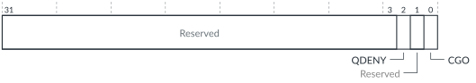

# FMU_FCTLR, Function Control Register

Source: <https://developer.arm.com/documentation/102666/0201/Programmers-model-for-GIC-720AE/FMU-register-summary/FMU-FCTLR--Function-Control-Register>

### FMU\_FCTLR, Function Control Register

This register controls clock gating of the FMU, and whether it always denies a Q-Channel quiescence request.

### Configurations

This register is available in all configurations.

### Attributes

Width
:   32-bit

Functional group
:   See
    [FMU register summary](https://developer.arm.com/documentation/102666/0201/Programmers-model-for-GIC-720AE/FMU-register-summary?lang=en "The GIC-720AE Fault Management Unit (FMU) functions are controlled through registers that are identified with the prefix FMU.") for the address offset, type, and reset value of this register.

### Usage constraints

There are no usage constraints.

### Bit descriptions

Figure 1. FMU\_FCTLR bit assignments

<table id="hif1540373738141__tbl.fmu_fctlr">
<caption>
Table 1. FMU_FCTLR bit assignments
</caption>
<colgroup>
<col span="1"/>
<col span="1"/>
<col span="1"/>
</colgroup>
<thead>
<tr>
<th class="documents-nocellnorowborder" colspan="1" id="d18405e133" rowspan="1">Bits</th>
<th class="documents-nocellnorowborder" colspan="1" id="d18405e136" rowspan="1">Name</th>
<th class="documents-cell-norowborder" colspan="1" id="d18405e139" rowspan="1">Description</th>
</tr>
</thead>
<tbody>
<tr>
<td class="documents-nocellnorowborder" colspan="1" rowspan="1">[31:3]</td>
<td class="documents-nocellnorowborder" colspan="1" rowspan="1">-</td>
<td class="documents-cell-norowborder" colspan="1" rowspan="1">Reserved, RES0</td>
</tr>
<tr>
<td class="documents-nocellnorowborder" colspan="1" rowspan="1">[2]</td>
<td class="documents-nocellnorowborder" colspan="1" rowspan="1">QDENY</td>
<td class="documents-cell-norowborder" colspan="1" rowspan="1">The FMU Q-Channel quiescence request response behavior:

          <dl>
<dt class="documents-dlterm">
             0

           </dt>
<dd>
             The FMU can accept or deny a QREQn request that it receives.

           </dd>
<dt class="documents-dlterm">
             1

           </dt>
<dd>
             The FMU always denies a QREQn request that it receives.

           </dd>
</dl> </td>
</tr>
<tr>
<td class="documents-nocellnorowborder" colspan="1" rowspan="1">[1]</td>
<td class="documents-nocellnorowborder" colspan="1" rowspan="1">-</td>
<td class="documents-cell-norowborder" colspan="1" rowspan="1">Reserved, RES0</td>
</tr>
<tr>
<td class="documents-row-nocellborder" colspan="1" rowspan="1">[0]</td>
<td class="documents-row-nocellborder" colspan="1" rowspan="1">CGO</td>
<td class="documents-cellrowborder" colspan="1" rowspan="1">The FMU clock gate override:

          <dl>
<dt class="documents-dlterm">
             0

           </dt>
<dd>
             Use full clock gating.

           </dd>
<dt class="documents-dlterm">
             1

           </dt>
<dd>
             Leave clock running. If clock gates are not implemented, then you must use this value.

           </dd>
</dl> </td>
</tr>
</tbody>
</table>

### Accessibility

FMU\_FCTLR is accessible only by Secure accesses.
