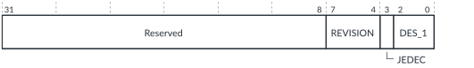

# FMU_PIDR2, Peripheral ID2 Register

Source: <https://developer.arm.com/documentation/102666/0201/Programmers-model-for-GIC-720AE/FMU-register-summary/FMU-PIDR2--Peripheral-ID2-Register>

### FMU\_PIDR2, Peripheral ID2 Register

This register returns byte[2] of the peripheral ID. The FMU\_PIDR2 register is part of the peripheral identification registers.

### Configurations

This register is available in all configurations.

### Attributes

Width
:   32-bit

Functional group
:   See
    [FMU register summary](https://developer.arm.com/documentation/102666/0201/Programmers-model-for-GIC-720AE/FMU-register-summary?lang=en "The GIC-720AE Fault Management Unit (FMU) functions are controlled through registers that are identified with the prefix FMU.") for the address offset, type, and reset value of this register.

### Usage constraints

There are no usage constraints.

### Bit descriptions

Figure 1. FMU\_PIDR2 bit assignments

<table>
<caption>
Table 1. FMU_PIDR2 bit descriptions
</caption>
<colgroup>
<col span="1"/>
<col span="1"/>
<col span="1"/>
</colgroup>
<thead>
<tr>
<th class="documents-nocellnorowborder" colspan="1" id="d167789e133" rowspan="1">Bits</th>
<th class="documents-nocellnorowborder" colspan="1" id="d167789e136" rowspan="1">Name</th>
<th class="documents-cell-norowborder" colspan="1" id="d167789e139" rowspan="1">Description</th>
</tr>
</thead>
<tbody>
<tr>
<td class="documents-nocellnorowborder" colspan="1" rowspan="1">[31:8]</td>
<td class="documents-nocellnorowborder" colspan="1" rowspan="1">-</td>
<td class="documents-cell-norowborder" colspan="1" rowspan="1">Reserved, RAZ</td>
</tr>
<tr>
<td class="documents-nocellnorowborder" colspan="1" rowspan="1">[7:4]</td>
<td class="documents-nocellnorowborder" colspan="1" rowspan="1">REVISION</td>
<td class="documents-cell-norowborder" colspan="1" rowspan="1">Identifies the major revision of the FMU:

          <dl>
<dt class="documents-dlterm">
0x0
</dt>
<dd>
             r0

           </dd>
</dl> </td>
</tr>
<tr>
<td class="documents-nocellnorowborder" colspan="1" rowspan="1">[3]</td>
<td class="documents-nocellnorowborder" colspan="1" rowspan="1">JEDEC</td>
<td class="documents-cell-norowborder" colspan="1" rowspan="1">Indicates that a JEDEC-assigned JEP106 identity code is used.</td>
</tr>
<tr>
<td class="documents-row-nocellborder" colspan="1" rowspan="1">[2:0]</td>
<td class="documents-row-nocellborder" colspan="1" rowspan="1">DES_1</td>
<td class="documents-cellrowborder" colspan="1" rowspan="1">Bits[6:4] of the JEP106 identity code. Bits[3:0] of the JEP106 identity code are assigned to FMU_PIDR1[7:4].</td>
</tr>
</tbody>
</table>
