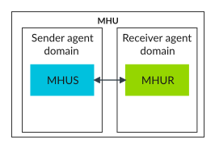
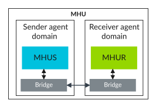
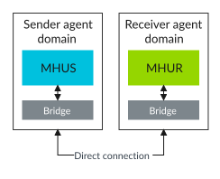
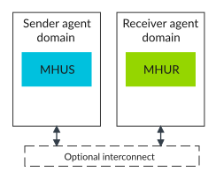

# MHU-320AE structure

Source: <https://developer.arm.com/documentation/107612/0001/Functional-description-of-MHU-320AE/MHU-320AE-structure>

### MHU-320AE structure

You can configure MHU-320AE to have the MHU Sender and MHU Receiver located in the same domain or in separate domains.

Communication between MHU Sender and MHU Receiver is unidirectional. To enable duplex communication, you must use separate instances of MHU-320AE.

The `STRUCTURE_TYPE` configuration parameter controls the hierarchy and structure of MHU components in given configurations:

mono
:   Monolithic MHU-320AE configuration with both MHU Sender and MHU Receiver in the same domain.

    Figure 1. Monolithic MHU configuration

    

full
:   Single MHU-320AE with MHU Sender and MHU Receiver being in separate domains connected by a bridge.

    Figure 2. Full MHU configuration

    

bridge
:   Separate top-level MHU-320AE instances for MHU Sender and MHU Receiver with both being in separate domains. Includes MHU asynchronous bridge for domain crossing. The MHU Sender domain must be connected directly to the MHU Receiver domain.

    Figure 3. Bridge MHU configuration

    

domain
:   Separate top-level MHU-320AE instances for MHU Sender and MHU Receiver without including an asynchronous bridge between them. You can use any protocol compliant AXI5-Stream or ACE5-Lite interconnect for routing messages from MHU Sender to MHU Receiver. MHU-320AE does not provide an interconnect.

    Figure 4. Domain MHU configuration

    

For more information about configuration parameters, see the Arm® CoreLink™ MHU-320AE Message Handling Unit Configuration and Integration Manual.
