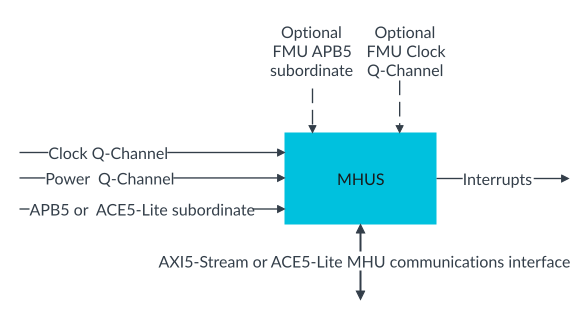

# MHU Sender

Source: <https://developer.arm.com/documentation/107612/0001/Functional-description-of-MHU-320AE/MHU-Sender>

### MHU Sender

The MHU Sender maps onto the MHU Sender (MHUS) of the [Message Handling Unit Architecture version 3.0](https://developer.arm.com/documentation/aes0072/aa). It receives transfers from a Sender Agent and forwards them to a Receiver Agent. It also generates interrupts when the receiver notifies it that a sent transfer has been acknowledged.

To send a transfer to the MHU Receiver, the MHU Sender uses a collection of channels and control registers, referred to as a Postbox (PBX).

In configurations with `FUSA_PRESENT == 1` and `FMU_LOCATION != receiver`, the MHU Sender also contains an FMU block for reporting detected hardware faults.

The following figure shows the MHU Sender and its main interfaces.

Figure 1. MHU Sender (MHUS)

