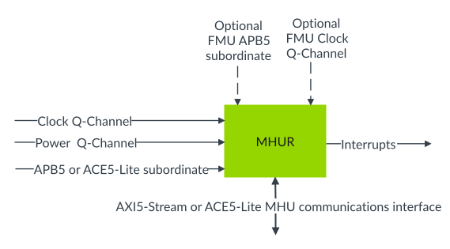

# MHU Receiver

Source: <https://developer.arm.com/documentation/107612/0001/Functional-description-of-MHU-320AE/MHU-Receiver>

### MHU Receiver

The MHU Receiver component maps onto the MHU Receiver (MHUR) of the [Message Handling Unit Architecture version 3.0](https://developer.arm.com/documentation/aes0072/aa). It generates interrupts when receiving any transfers from the MHU Sender and delivers them to the Receiver Agent.

The MHU Receiver uses a collection of channels and control registers, referred to as a Mailbox (MBX).

In configurations with `FUSA_PRESENT == 1` and `FMU_LOCATION != sender`, the MHU Receiver also contains an FMU block for reporting detected hardware faults.

The following figure shows the MHU Receiver and its main interfaces.

Figure 1. MHU Receiver (MHUR)

