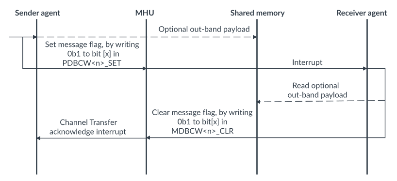

# Doorbell channels

Source: <https://developer.arm.com/documentation/107612/0001/Functional-description-of-MHU-320AE/MHU-320AE-channels/Doorbell-channels>

### Doorbell channels

You can configure MHU-320AE to have up to 128 doorbell channels.

Each doorbell channel holds 32 individual single-bit flags that can be used as event indicators to the MHU Receiver. The MHU Sender can send multiple transfers at once using a single doorbell channel, provided each transfer uses a different flag within the channel.

A doorbell channel transfer includes the following steps:

1. When the Sender agent writes 0b1 to any bit of the PDBCW<n>\_SET register, a doorbell channel transfer is initiated.
2. A doorbell channel transfer interrupt is sent to the MHU Receiver, unless all set flags are masked.
3. The Receiver agent can then acknowledge the receipt of a doorbell channel transfer by writing the corresponding bits of MDBCW<n>\_CLR to 0b1.
4. A doorbell transfer acknowledge interrupt in sent to the MHU Sender, if doorbell channel transfer acknowledge interrupts are enabled.

The Receiver can use the MDBCW<n>\_MSK\_SET and MDBCW<n>\_CLR registers to prevent specific doorbell channel flags from generating transfer events.

The following sequence diagram shows the doorbell transport protocol.

Figure 1. Doorbell transfer protocol

For more information, see Doorbell Extension in the [Message Handling Unit Architecture version 3.0](https://developer.arm.com/documentation/aes0072/aa).

### Related information

- [PDBCW<n>\_SET](/documentation/107612/0001/Programmers-model-for-MHU-320AE/MHU-Sender-registers/MHU-Sender-Postbox-register-summary/PDBCW-n--SET--Postbox-Doorbell-Channel-Window--n--Set-Register--n---0---127?lang=en "Allows setting doorbell channel flags")
- [MDBCW<n>\_CLR](/documentation/107612/0001/Programmers-model-for-MHU-320AE/MHU-Receiver-registers/MHU-Receiver-Mailbox-register-summary/MDBCW-n--CLR--Mailbox-Doorbell-Channel-Window--n--Clear-Register--n---0---127?lang=en "Allows clearing doorbell channel flags")
- [MDBCW<n>\_MSK\_SET](/documentation/107612/0001/Programmers-model-for-MHU-320AE/MHU-Receiver-registers/MHU-Receiver-Mailbox-register-summary/MDBCW-n--MSK-SET--Mailbox-Doorbell-Channel-Window--n--Mask-Set-Register--n---0---127?lang=en "Allows setting doorbell channel mask")
