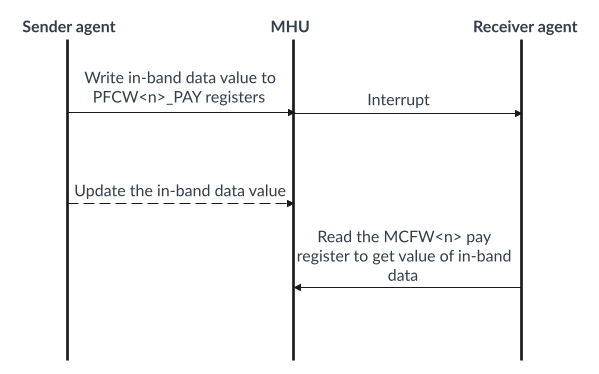

# Fast channels

Source: <https://developer.arm.com/documentation/107612/0001/Functional-description-of-MHU-320AE/MHU-320AE-channels/Fast-channels>

### Fast channels

You can configure the MHU-320AE to have up to 1024 fast channels.

Each fast channel can store 32 or 64 bits of transfer data, depending on your configuration. A fast channel holds the last value written to it, similar to a memory.

1. When the Sender agent writes to the relevant PFCW<n>\_PAY register, a fast channel transfer is initiated.
2. MHU-320AE forwards the written data to the Receiver agent, where it can be read through the relevant MFCW<n>\_PAY register.
3. The Receiver agent can signal a fast channel transfer interrupt, if enabled in the MBX\_FCG\_INT\_EN register.

There are no transfer acknowledge events associated with fast channels, therefore the MHU Sender does not have an architectural way of knowing when a transfer has been read by the MHU Receiver.

To help manage a large number of fast channels, you can have up to 32 fast channel groups.

The following sequence diagram shows the last-value transport protocol, which is used for fast channels.

Figure 1. Fast channel transport protocol

For more information, see Fast Channel Extension in the [Message Handling Unit Architecture version 3.0](https://developer.arm.com/documentation/aes0072/aa).

### Related information

- [PFCW<n>\_PAY32 register](/documentation/107612/0001/Programmers-model-for-MHU-320AE/MHU-Sender-registers/MHU-Sender-Postbox-register-summary/PFCW-n--PAY32--Postbox-Fast-Channel-Window--n--Payload-32bit-Register--n---0---1023?lang=en "Access to payload of Fast Channel <n>")
- [PFCW<n>\_PAY64 register](/documentation/107612/0001/Programmers-model-for-MHU-320AE/MHU-Sender-registers/MHU-Sender-Postbox-register-summary/PFCW-n--PAY64--Postbox-Fast-Channel-Window--n--Payload-64bit-Register--n---0---511?lang=en "Access to payload of Fast Channel <n>")
- [MFCW<n>\_PAY32 register](/documentation/107612/0001/Programmers-model-for-MHU-320AE/MHU-Receiver-registers/MHU-Receiver-Mailbox-register-summary/MFCW-n--PAY32--Mailbox-Fast-Channel-Window--n--Payload-32bit-Register--n---0---1023?lang=en "Access to payload of Fast Channel <n>")
- [MFCW<n>\_PAY64 register](/documentation/107612/0001/Programmers-model-for-MHU-320AE/MHU-Receiver-registers/MHU-Receiver-Mailbox-register-summary/MFCW-n--PAY64--Mailbox-Fast-Channel-Window--n--Payload-64bit-Register--n---0---511?lang=en "Access to payload of Fast Channel <n>")
- [MBX\_FCG\_INT\_EN](/documentation/107612/0001/Programmers-model-for-MHU-320AE/MHU-Receiver-registers/MHU-Receiver-Mailbox-register-summary/MBX-FCG-INT-EN--Mailbox-Fast-Channel-Group-Interrupt-Enable-Register?lang=en "Controls whether a Fast Channel Group contributes to the Mailbox Combined interrupt")
