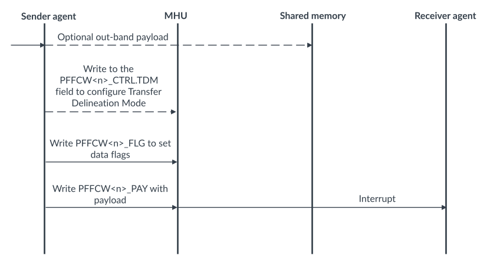
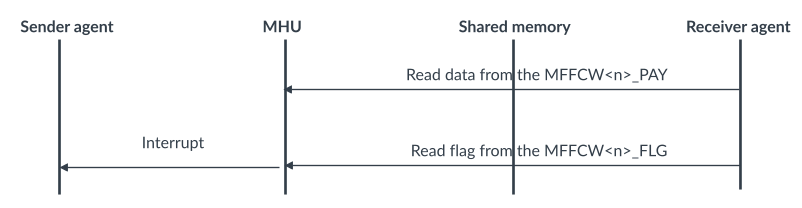
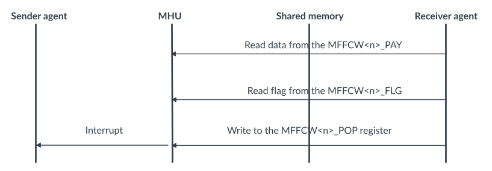

# FIFO channels

Source: <https://developer.arm.com/documentation/107612/0001/Functional-description-of-MHU-320AE/MHU-320AE-channels/FIFO-channels>

### FIFO channels

MHU-320AE can be configured to have up to 64 FIFO channels. Each FIFO channel can store up to 1024 bytes of transfer data.

Software can associate individual transfer bytes as being the Start of Transfer (SOT) and the End of Transfer (EOT) and whether the receipt of it generates a transfer acknowledgement event. Therefore if there is free space, a FIFO channel can store multiple transfers at any given time that can vary in length.

Before sending a FIFO channel transfer, the MHU Sender can configure the Transfer Delineation Mode (TDM) by writing to the PFFCW<n>\_CTRL.TDM register bit that defines how transfer flags are updated in the MHU-320AE:

Software flag
:   Flags are fully managed by software.

Partial flag
:   Flags are partially updated by the MHU with software being able to mark the start and end of transfers when necessary.

Auto flag
:   Flags are fully managed by the MHU.

The Sender agent can then additionally configure specific transfer flags or a requirement for acknowledgement by writing to PFFCW<n>\_FLG. A FIFO channel transfer is initiated when the MHU Sender writes to the PFFCW<n>\_PAY register where the amount of data being pushed is determined by the access size. MHU-320AE does not support 8-bit or 16-bit accesses to FIFO channels.

When a FIFO transfer is received with both EOT and ACK flags set, it can signal a FIFO channel transfer interrupt in the MHU Receiver, if enabled. The corresponding data can be read by the Receiver agent through the MFFCW<n>\_PAY register. The programmed value of the MFFCW<n>\_CTRL.RA\_EN register bit determines if a read to the FIFO channel also pops the data:

- RA\_EN == 1: Read of FIFO data also pops it from FIFO channel.
- RA\_EN == 0: Read of FIFO data does not pop it from FIFO channel. Software additionally writes to the MFFCW<n>\_FIFO\_POP register to pop the data from the FIFO channel.

After the Receiver agent reads a FIFO channel transfer, software can read the associated flags through the MFFCW<n>\_FLG register. If one or more bytes are popped from the FIFO channel with both the ACK and EOT flags set, the flags can signal a FIFO channel transfer acknowledgement interrupt in the Sender agent, if enabled. As multiple transfers may have been acknowledged by the Receiver agent when the Receiver agent processes this event, it reads the PFFCW<n>\_ACK\_CNT register to determine how many transfers have been acknowledged. The action of reading this register clears it. A FIFO channel transfer acknowledge event is only generated when the ACK\_CNT field becomes nonzero after being zero before.

Additionally the Sender agent and Receiver agent can also use the FIFO low and high tide events to know when the FIFO channel fill level reaches predefined thresholds on pushing or popping, for example, to send transfers that exceed the depth of a FIFO channel.

The following sequence diagrams shows a simple FIFO transport protocol.

Figure 1. FIFO transport protocol write

After the write in the FIFO transport protocol is completed, the sequence depends on whether read-acknowledge is enabled.

The following sequence occurs if read-acknowledge is enabled.

Figure 2. FIFO transport protocol read if read acknowledge is enabled

The following sequence occurs if read-acknowledge is not enabled.

Figure 3. FIFO transport protocol read if read acknowledge is disabled

For more information, see FIFO Extension in the [Message Handling Unit Architecture version 3.0](https://developer.arm.com/documentation/aes0072/aa).

### Related information

- [PFFCW<n>\_PAY32 register](/documentation/107612/0001/Programmers-model-for-MHU-320AE/MHU-Sender-registers/MHU-Sender-Postbox-register-summary/PFFCW-n--PAY32--Postbox-FIFO-Channel-Window--n--Payload-Register--32bit-access---n---0---63?lang=en "A 32bit access to the PFFCW<n>_PAY register. The bit descriptions for this register depend on whether the access is a write or a read.")
- [PFFCW<n>\_PAY64 register](/documentation/107612/0001/Programmers-model-for-MHU-320AE/MHU-Sender-registers/MHU-Sender-Postbox-register-summary/PFFCW-n--PAY64--Postbox-FIFO-Channel-Window--n--Payload-Register--64bit-access---n---0---63?lang=en "A 64bit access to the PFFCW<n>_PAY register. The bit descriptions for this register depend on whether the access is a write or a read.")
- [PFFCW<n>\_FL32 register](/documentation/107612/0001/Programmers-model-for-MHU-320AE/MHU-Sender-registers/MHU-Sender-Postbox-register-summary/PFFCW-n--PAY32--Postbox-FIFO-Channel-Window--n--Payload-Register--32bit-access---n---0---63?lang=en "A 32bit access to the PFFCW<n>_PAY register. The bit descriptions for this register depend on whether the access is a write or a read.")
- [PFFCW<n>\_FL64 register](/documentation/107612/0001/Programmers-model-for-MHU-320AE/MHU-Sender-registers/MHU-Sender-Postbox-register-summary/PFFCW-n--PAY64--Postbox-FIFO-Channel-Window--n--Payload-Register--64bit-access---n---0---63?lang=en "A 64bit access to the PFFCW<n>_PAY register. The bit descriptions for this register depend on whether the access is a write or a read.")
- [PFFCW<n>\_CTRL register](/documentation/107612/0001/Programmers-model-for-MHU-320AE/MHU-Sender-registers/MHU-Sender-Postbox-register-summary/PFFCW-n--CTRL--Postbox-FIFO-Channel-Window--n--Control-Register--n---0---63?lang=en "This register contains control bits for FIFO channels")
- [PFFCW<n>\_ACK\_CNT register](/documentation/107612/0001/Programmers-model-for-MHU-320AE/MHU-Sender-registers/MHU-Sender-Postbox-register-summary/PFFCW-n--ACK-CNT--Postbox-FIFO-Channel-Window--n--Acknowledge-Counter-Register--n---0---63?lang=en "Allows determining the number of acknowledged FIFO channel transfers")
- [MFFCW<n>\_PAY32 register](/documentation/107612/0001/Programmers-model-for-MHU-320AE/MHU-Receiver-registers/MHU-Receiver-Mailbox-register-summary/MFFCW-n--PAY32--Mailbox-FIFO-Channel-Window--n--Payload-Register--32bit-access---n---0---63?lang=en "A 32bit access to the MFFCW<n>_PAY register.")
- [MFFCW<n>\_PAY64 register](/documentation/107612/0001/Programmers-model-for-MHU-320AE/MHU-Receiver-registers/MHU-Receiver-Mailbox-register-summary/MFFCW-n--PAY64--Mailbox-FIFO-Channel-Window--n--Payload-Register--64bit-access---n---0---63?lang=en "A 64bit access to the MFFCW<n>_PAY register.")
- [MFFCW<n>\_FLG32 register](/documentation/107612/0001/Programmers-model-for-MHU-320AE/MHU-Receiver-registers/MHU-Receiver-Mailbox-register-summary/MFFCW-n--FLG32--MailboxPostbox-FIFO-Channel-Window--n--Flag-Register--32bit-access---n---0---63?lang=en "A 32bit access to the MFFCW<n>_FLG register.")
- [MFFCW<n>\_FLG64 register](/documentation/107612/0001/Programmers-model-for-MHU-320AE/MHU-Receiver-registers/MHU-Receiver-Mailbox-register-summary/MFFCW-n--FLG64--Mailbox-FIFO-Channel-Window--n--Flag-Register--64bit-access---n---0---63?lang=en "A 64bit access to the MFFCW<n>_FLG register.")
- [MFFCW<n>\_CTRL register](/documentation/107612/0001/Programmers-model-for-MHU-320AE/MHU-Receiver-registers/MHU-Receiver-Mailbox-register-summary/MFFCW-n--CTRL--Mailbox-FIFO-Channel-Window--n--Control-Register--n---0---63?lang=en "This register contains control bits for FIFO channels")
- [MFFCW<n>\_FIFO\_POP register](/documentation/107612/0001/Programmers-model-for-MHU-320AE/MHU-Receiver-registers/MHU-Receiver-Mailbox-register-summary/MFFCW-n--FIFO-POP--Mailbox-FIFO-Channel-Window--n--FIFO-POP-Register--n---0---63?lang=en "Register for popping bytes from a FIFO channel when writing to it")
