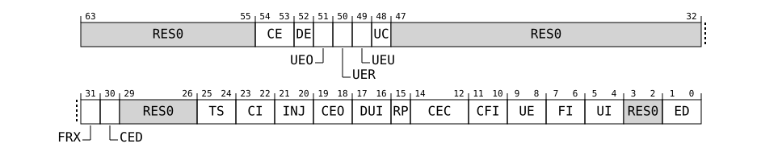

# SRAS_ERR<n>FR, Error Record <n> Feature Register, n = 0 - 3

Source: <https://developer.arm.com/documentation/107612/0001/Programmers-model-for-MHU-320AE/MHU-Sender-registers/MHU-Sender-RAS-register-summary/SRAS-ERR-n-FR--Error-Record--n--Feature-Register--n---0---3>

### SRAS\_ERR<n>FR, Error Record <n> Feature Register, n = 0 - 3

Defines which of the common architecturally-defined features are implemented by the node and, of the implemented features, which are software programmable.

### Configurations

This register is available in all configurations.

### Attributes

Width
:   64

Component
:   MHUS.SRAS

Register offset
:   (64 \* n) + 0x0000

### Bit descriptions

Figure 1. MHUS\_SRAS\_ERR<n>FR bit assignments

<table id="mhus_sras_err_n_fr__asras_errnfr-0">
 <caption>
  
   
    Table 1.
   
   SRAS_ERR&lt;n&gt;FR bit descriptions
  
 </caption>
 <colgroup>
  <col span="1"/>
  <col span="1"/>
  <col span="1"/>
  <col span="1"/>
 </colgroup>
 <thead>
  <tr>
   <th class="documents-nocellnorowborder" colspan="1" id="d71915e151" rowspan="1">
    Bits
   </th>
   <th class="documents-nocellnorowborder" colspan="1" id="d71915e154" rowspan="1">
    Name
   </th>
   <th class="documents-nocellnorowborder" colspan="1" id="d71915e157" rowspan="1">
    Description
   </th>
   <th class="documents-cell-norowborder" colspan="1" id="d71915e160" rowspan="1">
    Reset
   </th>
  </tr>
 </thead>
 <tbody>
  <tr>
   <td class="documents-nocellnorowborder" colspan="1" rowspan="1">
    [63:55]
   </td>
   <td class="documents-nocellnorowborder" colspan="1" rowspan="1">
    
     RES0
    
   </td>
   <td class="documents-nocellnorowborder" colspan="1" rowspan="1">
    Reserved
   </td>
   <td class="documents-cell-norowborder" colspan="1" rowspan="1">
    
     RES0
    
   </td>
  </tr>
  <tr>
   <td class="documents-nocellnorowborder" colspan="1" rowspan="1">
    [54:53]
   </td>
   <td class="documents-nocellnorowborder" colspan="1" rowspan="1">
    CE
   </td>
   <td class="documents-nocellnorowborder" colspan="1" rowspan="1">
    

     Corrected Error recording. Describes the types of Corrected errors the node can record, if any.
    

    <dl>
     <dt class="documents-dlterm">
      
       0b00
      
     </dt>
     <dd>
      

       Does not record Corrected errors.
      

     </dd>
     <dt class="documents-dlterm">
      
       0b10
      
     </dt>
     <dd>
      

       Records only non-specific Corrected errors. That is, Corrected errors recorded by setting SRAS_ERR&lt;n&gt;STATUS.CE to 0b10.
      

     </dd>
    </dl>
   </td>
   <td class="documents-cell-norowborder" colspan="1" rowspan="1">
    
     xx
    
   </td>
  </tr>
  <tr>
   <td class="documents-nocellnorowborder" colspan="1" rowspan="1">
    [52]
   </td>
   <td class="documents-nocellnorowborder" colspan="1" rowspan="1">
    DE
   </td>
   <td class="documents-nocellnorowborder" colspan="1" rowspan="1">
    

     Deferred Error recording. Describes whether the node supports recording Deferred errors.
    

    <dl>
     <dt class="documents-dlterm">
      
       0b0
      
     </dt>
     <dd>
      

       Does not record Deferred errors.
      

     </dd>
    </dl>
   </td>
   <td class="documents-cell-norowborder" colspan="1" rowspan="1">
    
     0b0
    
   </td>
  </tr>
  <tr>
   <td class="documents-nocellnorowborder" colspan="1" rowspan="1">
    [51]
   </td>
   <td class="documents-nocellnorowborder" colspan="1" rowspan="1">
    UEO
   </td>
   <td class="documents-nocellnorowborder" colspan="1" rowspan="1">
    

     Latent or Restartable Error recording. Describes whether the node supports recording Latent or Restartable errors.
    

    <dl>
     <dt class="documents-dlterm">
      
       0b0
      
     </dt>
     <dd>
      

       Does not record Latent or Restartable errors.
      

     </dd>
     <dt class="documents-dlterm">
      
       0b1
      
     </dt>
     <dd>
      

       Records Latent or Restartable errors.
      

     </dd>
    </dl>
   </td>
   <td class="documents-cell-norowborder" colspan="1" rowspan="1">
    
     x
    
   </td>
  </tr>
  <tr>
   <td class="documents-nocellnorowborder" colspan="1" rowspan="1">
    [50]
   </td>
   <td class="documents-nocellnorowborder" colspan="1" rowspan="1">
    UER
   </td>
   <td class="documents-nocellnorowborder" colspan="1" rowspan="1">
    

     Signaled or Recoverable Error recording. Describes whether the node supports recording Signaled or Recoverable errors.
    

    <dl>
     <dt class="documents-dlterm">
      
       0b0
      
     </dt>
     <dd>
      

       Does not record Signaled or Recoverable errors.
      

     </dd>
     <dt class="documents-dlterm">
      
       0b1
      
     </dt>
     <dd>
      

       Records Signaled or Recoverable errors.
      

     </dd>
    </dl>
   </td>
   <td class="documents-cell-norowborder" colspan="1" rowspan="1">
    
     x
    
   </td>
  </tr>
  <tr>
   <td class="documents-nocellnorowborder" colspan="1" rowspan="1">
    [49]
   </td>
   <td class="documents-nocellnorowborder" colspan="1" rowspan="1">
    UEU
   </td>
   <td class="documents-nocellnorowborder" colspan="1" rowspan="1">
    

     Unrecoverable Error recording. Describes whether the node supports recording Unrecoverable errors.
    

    <dl>
     <dt class="documents-dlterm">
      
       0b0
      
     </dt>
     <dd>
      

       Does not record Unrecoverable errors.
      

     </dd>
    </dl>
   </td>
   <td class="documents-cell-norowborder" colspan="1" rowspan="1">
    
     0b0
    
   </td>
  </tr>
  <tr>
   <td class="documents-nocellnorowborder" colspan="1" rowspan="1">
    [48]
   </td>
   <td class="documents-nocellnorowborder" colspan="1" rowspan="1">
    UC
   </td>
   <td class="documents-nocellnorowborder" colspan="1" rowspan="1">
    

     Uncontainable Error recording. Describes whether the node supports recording Uncontainable errors.
    

    <dl>
     <dt class="documents-dlterm">
      
       0b0
      
     </dt>
     <dd>
      

       Does not record Uncontainable errors.
      

     </dd>
    </dl>
   </td>
   <td class="documents-cell-norowborder" colspan="1" rowspan="1">
    
     0b0
    
   </td>
  </tr>
  <tr>
   <td class="documents-nocellnorowborder" colspan="1" rowspan="1">
    [47:32]
   </td>
   <td class="documents-nocellnorowborder" colspan="1" rowspan="1">
    
     RES0
    
   </td>
   <td class="documents-nocellnorowborder" colspan="1" rowspan="1">
    Reserved
   </td>
   <td class="documents-cell-norowborder" colspan="1" rowspan="1">
    
     RES0
    
   </td>
  </tr>
  <tr>
   <td class="documents-nocellnorowborder" colspan="1" rowspan="1">
    [31]
   </td>
   <td class="documents-nocellnorowborder" colspan="1" rowspan="1">
    FRX
   </td>
   <td class="documents-nocellnorowborder" colspan="1" rowspan="1">
    

     Feature Register extension. Defines whether SRAS_ERR&lt;n&gt;FR[63:48] are architecturally defined.
    

    <dl>
     <dt class="documents-dlterm">
      
       0b1
      
     </dt>
     <dd>
      

       SRAS_ERR&lt;n&gt;FR[63:48] are defined by the architecture.
      

     </dd>
    </dl>
   </td>
   <td class="documents-cell-norowborder" colspan="1" rowspan="1">
    
     0b1
    
   </td>
  </tr>
  <tr>
   <td class="documents-nocellnorowborder" colspan="1" rowspan="1">
    [30]
   </td>
   <td class="documents-nocellnorowborder" colspan="1" rowspan="1">
    CED
   </td>
   <td class="documents-nocellnorowborder" colspan="1" rowspan="1">
    

     Error Counter Disable. Indicates whether the node implements a control to disable any implemented Corrected error counters.
    

    <dl>
     <dt class="documents-dlterm">
      
       0b0
      
     </dt>
     <dd>
      

       Enabling and disabling of error counter(s) is not supported.
      

     </dd>
     <dt class="documents-dlterm">
      
       0b1
      
     </dt>
     <dd>
      

       Enabling and disabling of error counter(s) is supported and controlled by SRAS_ERR&lt;n&gt;CTLR.CED.
      

     </dd>
    </dl>
   </td>
   <td class="documents-cell-norowborder" colspan="1" rowspan="1">
    
     x
    
   </td>
  </tr>
  <tr>
   <td class="documents-nocellnorowborder" colspan="1" rowspan="1">
    [29:26]
   </td>
   <td class="documents-nocellnorowborder" colspan="1" rowspan="1">
    
     RES0
    
   </td>
   <td class="documents-nocellnorowborder" colspan="1" rowspan="1">
    Reserved
   </td>
   <td class="documents-cell-norowborder" colspan="1" rowspan="1">
    
     RES0
    
   </td>
  </tr>
  <tr>
   <td class="documents-nocellnorowborder" colspan="1" rowspan="1">
    [25:24]
   </td>
   <td class="documents-nocellnorowborder" colspan="1" rowspan="1">
    TS
   </td>
   <td class="documents-nocellnorowborder" colspan="1" rowspan="1">
    

     Timestamp Extension.
    

    <dl>
     <dt class="documents-dlterm">
      
       0b00
      
     </dt>
     <dd>
      

       Does not support a timestamp register.
      

     </dd>
    </dl>
   </td>
   <td class="documents-cell-norowborder" colspan="1" rowspan="1">
    
     0b00
    
   </td>
  </tr>
  <tr>
   <td class="documents-nocellnorowborder" colspan="1" rowspan="1">
    [23:22]
   </td>
   <td class="documents-nocellnorowborder" colspan="1" rowspan="1">
    CI
   </td>
   <td class="documents-nocellnorowborder" colspan="1" rowspan="1">
    

     Critical error interrupt. Indicates whether the critical error interrupt and associated controls are implemented by the node.
    

    <dl>
     <dt class="documents-dlterm">
      
       0b00
      
     </dt>
     <dd>
      

       Does not support the critical error interrupt. SRAS_ERR&lt;n&gt;CTLR.CI is
       
        RES0
       
       .
      

     </dd>
    </dl>
   </td>
   <td class="documents-cell-norowborder" colspan="1" rowspan="1">
    
     0b00
    
   </td>
  </tr>
  <tr>
   <td class="documents-nocellnorowborder" colspan="1" rowspan="1">
    [21:20]
   </td>
   <td class="documents-nocellnorowborder" colspan="1" rowspan="1">
    INJ
   </td>
   <td class="documents-nocellnorowborder" colspan="1" rowspan="1">
    

     Fault Injection Extension. Indicates whether the Common Fault Injection Model Extension is implemented by the node.
    

    <dl>
     <dt class="documents-dlterm">
      
       0b00
      
     </dt>
     <dd>
      

       Does not support the Common Fault Injection Model Extension.
      

     </dd>
    </dl>
   </td>
   <td class="documents-cell-norowborder" colspan="1" rowspan="1">
    
     0b00
    
   </td>
  </tr>
  <tr>
   <td class="documents-nocellnorowborder" colspan="1" rowspan="1">
    [19:18]
   </td>
   <td class="documents-nocellnorowborder" colspan="1" rowspan="1">
    CEO
   </td>
   <td class="documents-nocellnorowborder" colspan="1" rowspan="1">
    

     Corrected Error overwrite. Indicates the behavior of the node when a second or subsequent Corrected error is recorded and a first Corrected error has previously been recorded by this error record.
    

    <dl>
     <dt class="documents-dlterm">
      
       0b00
      
     </dt>
     <dd>
      

       Keeps the previous error syndrome.
      

     </dd>
    </dl>
   </td>
   <td class="documents-cell-norowborder" colspan="1" rowspan="1">
    
     0b00
    
   </td>
  </tr>
  <tr>
   <td class="documents-nocellnorowborder" colspan="1" rowspan="1">
    [17:16]
   </td>
   <td class="documents-nocellnorowborder" colspan="1" rowspan="1">
    DUI
   </td>
   <td class="documents-nocellnorowborder" colspan="1" rowspan="1">
    

     Error recovery interrupt for deferred errors control. Indicates whether the enabling and disabling of error recovery interrupts on deferred errors is supported by the node.
    

    <dl>
     <dt class="documents-dlterm">
      
       0b00
      
     </dt>
     <dd>
      

       Does not support the enabling and disabling of error recovery interrupts on deferred errors. SRAS_ERR&lt;n&gt;CTLR.DUI is
       
        RES0
       
       .
      

     </dd>
    </dl>
   </td>
   <td class="documents-cell-norowborder" colspan="1" rowspan="1">
    
     0b00
    
   </td>
  </tr>
  <tr>
   <td class="documents-nocellnorowborder" colspan="1" rowspan="1">
    [15]
   </td>
   <td class="documents-nocellnorowborder" colspan="1" rowspan="1">
    RP
   </td>
   <td class="documents-nocellnorowborder" colspan="1" rowspan="1">
    

     Repeat counter. Indicates whether the node implements a second Corrected error counter in SRAS_ERR&lt;n&gt;MISC0.
    

    <dl>
     <dt class="documents-dlterm">
      
       0b0
      
     </dt>
     <dd>
      

       Implements a single Corrected error counter in SRAS_ERR&lt;n&gt;MISC0
      

     </dd>
    </dl>
   </td>
   <td class="documents-cell-norowborder" colspan="1" rowspan="1">
    
     0b0
    
   </td>
  </tr>
  <tr>
   <td class="documents-nocellnorowborder" colspan="1" rowspan="1">
    [14:12]
   </td>
   <td class="documents-nocellnorowborder" colspan="1" rowspan="1">
    CEC
   </td>
   <td class="documents-nocellnorowborder" colspan="1" rowspan="1">
    

     Corrected Error Counter. Indicates whether the node implements the standard Corrected error counter mechanisms in SRAS_ERR&lt;n&gt;MISC0.
    

    <dl>
     <dt class="documents-dlterm">
      
       0b000
      
     </dt>
     <dd>
      

       Does not implement a corrected error counter.
      

     </dd>
     <dt class="documents-dlterm">
      
       0b010
      
     </dt>
     <dd>
      

       Implements an 8-bit Corrected error counter in SRAS_ERR&lt;n&gt;MISC0[39:32].
      

     </dd>
    </dl>
   </td>
   <td class="documents-cell-norowborder" colspan="1" rowspan="1">
    
     xxx
    
   </td>
  </tr>
  <tr>
   <td class="documents-nocellnorowborder" colspan="1" rowspan="1">
    [11:10]
   </td>
   <td class="documents-nocellnorowborder" colspan="1" rowspan="1">
    CFI
   </td>
   <td class="documents-nocellnorowborder" colspan="1" rowspan="1">
    

     Fault handling interrupt for corrected errors control. Indicates whether the enabling and disabling of fault handling interrupts on corrected errors is supported by the node.
    

    <dl>
     <dt class="documents-dlterm">
      
       0b00
      
     </dt>
     <dd>
      

       Does not support the enabling and disabling of fault handling interrupts on corrected errors. SRAS_ERR&lt;n&gt;CTLR.CFI is
       
        RES0
       
       .
      

     </dd>
    </dl>
   </td>
   <td class="documents-cell-norowborder" colspan="1" rowspan="1">
    
     0b00
    
   </td>
  </tr>
  <tr>
   <td class="documents-nocellnorowborder" colspan="1" rowspan="1">
    [9:8]
   </td>
   <td class="documents-nocellnorowborder" colspan="1" rowspan="1">
    UE
   </td>
   <td class="documents-nocellnorowborder" colspan="1" rowspan="1">
    

     In-band error response (External Abort). Indicates whether the in-band error response and associated controls are implemented by the node.
    

    <dl>
     <dt class="documents-dlterm">
      
       0b00
      
     </dt>
     <dd>
      

       In-band error response is not supported.
      

     </dd>
     <dt class="documents-dlterm">
      
       0b10
      
     </dt>
     <dd>
      

       In-band error response is supported and controllable using SRAS_ERR&lt;n&gt;CTLR.UE.
      

     </dd>
    </dl>
   </td>
   <td class="documents-cell-norowborder" colspan="1" rowspan="1">
    
     xx
    
   </td>
  </tr>
  <tr>
   <td class="documents-nocellnorowborder" colspan="1" rowspan="1">
    [7:6]
   </td>
   <td class="documents-nocellnorowborder" colspan="1" rowspan="1">
    FI
   </td>
   <td class="documents-nocellnorowborder" colspan="1" rowspan="1">
    

     Fault handling interrupt. Indicates whether the fault handling interrupt and associated controls are implemented by the node.
    

    <dl>
     <dt class="documents-dlterm">
      
       0b10
      
     </dt>
     <dd>
      

       Fault handling interrupt is supported and controllable using SRAS_ERR&lt;n&gt;CTLR.FI.
      

     </dd>
    </dl>
   </td>
   <td class="documents-cell-norowborder" colspan="1" rowspan="1">
    
     0b10
    
   </td>
  </tr>
  <tr>
   <td class="documents-nocellnorowborder" colspan="1" rowspan="1">
    [5:4]
   </td>
   <td class="documents-nocellnorowborder" colspan="1" rowspan="1">
    UI
   </td>
   <td class="documents-nocellnorowborder" colspan="1" rowspan="1">
    

     Error recovery interrupt for uncorrected errors. Indicates whether the error handling interrupt and associated controls are implemented by the node.
    

    <dl>
     <dt class="documents-dlterm">
      
       0b00
      
     </dt>
     <dd>
      

       Does not support the error handling interrupt. SRAS_ERR&lt;n&gt;CTLR.UI is
       
        RES0
       
       .
      

     </dd>
     <dt class="documents-dlterm">
      
       0b10
      
     </dt>
     <dd>
      

       Error handling interrupt is supported and controllable using SRAS_ERR&lt;n&gt;CTLR.UI.
      

     </dd>
    </dl>
   </td>
   <td class="documents-cell-norowborder" colspan="1" rowspan="1">
    
     xx
    
   </td>
  </tr>
  <tr>
   <td class="documents-nocellnorowborder" colspan="1" rowspan="1">
    [3:2]
   </td>
   <td class="documents-nocellnorowborder" colspan="1" rowspan="1">
    
     RES0
    
   </td>
   <td class="documents-nocellnorowborder" colspan="1" rowspan="1">
    Reserved
   </td>
   <td class="documents-cell-norowborder" colspan="1" rowspan="1">
    
     RES0
    
   </td>
  </tr>
  <tr>
   <td class="documents-row-nocellborder" colspan="1" rowspan="1">
    [1:0]
   </td>
   <td class="documents-row-nocellborder" colspan="1" rowspan="1">
    ED
   </td>
   <td class="documents-row-nocellborder" colspan="1" rowspan="1">
    

     Error reporting and logging. Indicates error record &lt;n&gt; is the first record owned the node, and whether the node implements the controls for enabling and disabling error reporting and logging.
    

    <dl>
     <dt class="documents-dlterm">
      
       0b01
      
     </dt>
     <dd>
      

       Error reporting and logging always enabled. SRAS_ERR&lt;n&gt;CTLR.ED is
       
        RES0
       
       .
      

     </dd>
    </dl>
   </td>
   <td class="documents-cellrowborder" colspan="1" rowspan="1">
    
     0b01
    
   </td>
  </tr>
 </tbody>
</table>

### Accessibility

<table>
 <caption>
  
   
    Table 2.
   
   Accessibility
  
 </caption>
 <colgroup>
  <col span="1"/>
  <col span="1"/>
  <col span="1"/>
  <col span="1"/>
 </colgroup>
 <thead>
  <tr>
   <th class="documents-nocellnorowborder" colspan="1" id="d71915e1184" rowspan="1">
    Component
   </th>
   <th class="documents-nocellnorowborder" colspan="1" id="d71915e1187" rowspan="1">
    Offset
   </th>
   <th class="documents-nocellnorowborder" colspan="1" id="d71915e1190" rowspan="1">
    Instance
   </th>
   <th class="documents-cell-norowborder" colspan="1" id="d71915e1193" rowspan="1">
    Range
   </th>
  </tr>
 </thead>
 <tbody>
  <tr>
   <td class="documents-row-nocellborder" colspan="1" rowspan="1">
    MHUS.SRAS
   </td>
   <td class="documents-row-nocellborder" colspan="1" rowspan="1">
    (64 * n) + 0x0000
   </td>
   <td class="documents-row-nocellborder" colspan="1" rowspan="1">
    SRAS_ERR&lt;n&gt;FR
   </td>
   <td class="documents-cellrowborder" colspan="1" rowspan="1">
    None
   </td>
  </tr>
 </tbody>
</table>
