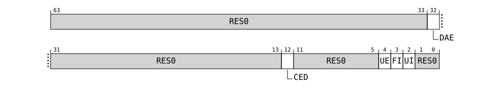

# RRAS_ERR<n>CTLR, Error Record <n> Control Register, n = 0 - 9

Source: <https://developer.arm.com/documentation/107612/0001/Programmers-model-for-MHU-320AE/MHU-Receiver-registers/MHU-Receiver-RAS-register-summary/RRAS-ERR-n-CTLR--Error-Record--n--Control-Register--n---0---9>

### RRAS\_ERR<n>CTLR, Error Record <n> Control Register, n = 0 - 9

The error control register contains enable bits for the node that writes to this record.

### Configurations

This register is available in all configurations.

### Attributes

Width
:   64

Component
:   MHUR.RRAS

Register offset
:   (64 \* n) + 0x0008

### Bit descriptions

Figure 1. MHUR\_RRAS\_ERR<n>CTLR bit assignments

<table id="mhur_rras_err_n_ctlr__arras_errnctlr-0">
 <caption>
  
   
    Table 1.
   
   RRAS_ERR&lt;n&gt;CTLR bit descriptions
  
 </caption>
 <colgroup>
  <col span="1"/>
  <col span="1"/>
  <col span="1"/>
  <col span="1"/>
 </colgroup>
 <thead>
  <tr>
   <th class="documents-nocellnorowborder" colspan="1" id="d49201e151" rowspan="1">
    Bits
   </th>
   <th class="documents-nocellnorowborder" colspan="1" id="d49201e154" rowspan="1">
    Name
   </th>
   <th class="documents-nocellnorowborder" colspan="1" id="d49201e157" rowspan="1">
    Description
   </th>
   <th class="documents-cell-norowborder" colspan="1" id="d49201e160" rowspan="1">
    Reset
   </th>
  </tr>
 </thead>
 <tbody>
  <tr>
   <td class="documents-nocellnorowborder" colspan="1" rowspan="1">
    [63:33]
   </td>
   <td class="documents-nocellnorowborder" colspan="1" rowspan="1">
    
     RES0
    
   </td>
   <td class="documents-nocellnorowborder" colspan="1" rowspan="1">
    Reserved
   </td>
   <td class="documents-cell-norowborder" colspan="1" rowspan="1">
    
     RES0
    
   </td>
  </tr>
  <tr>
   <td class="documents-nocellnorowborder" colspan="1" rowspan="1">
    [32]
   </td>
   <td class="documents-nocellnorowborder" colspan="1" rowspan="1">
    DAE
   </td>
   <td class="documents-nocellnorowborder" colspan="1" rowspan="1">
    

     Disable access errors. Allows disabling reporting of errors due to illegal register accesses.
     
      RAZ/WI
     
     for all records except Software error record 0.
    

    <dl>
     <dt class="documents-dlterm">
      
       0b0
      
     </dt>
     <dd>
      

       Illegal register accesses are treated as errors.
      

     </dd>
     <dt class="documents-dlterm">
      
       0b1
      
     </dt>
     <dd>
      

       Reporting of illegal register accesses is disabled.
      

     </dd>
    </dl>
   </td>
   <td class="documents-cell-norowborder" colspan="1" rowspan="1">
    
     0b0
    
   </td>
  </tr>
  <tr>
   <td class="documents-nocellnorowborder" colspan="1" rowspan="1">
    [31:13]
   </td>
   <td class="documents-nocellnorowborder" colspan="1" rowspan="1">
    
     RES0
    
   </td>
   <td class="documents-nocellnorowborder" colspan="1" rowspan="1">
    Reserved
   </td>
   <td class="documents-cell-norowborder" colspan="1" rowspan="1">
    
     RES0
    
   </td>
  </tr>
  <tr>
   <td class="documents-nocellnorowborder" colspan="1" rowspan="1">
    [12]
   </td>
   <td class="documents-nocellnorowborder" colspan="1" rowspan="1">
    CED
   </td>
   <td class="documents-nocellnorowborder" colspan="1" rowspan="1">
    

     Disable generation of corrected error events from error counters.
    

    <dl>
     <dt class="documents-dlterm">
      
       0b0
      
     </dt>
     <dd>
      

       Corrected error events are generated by the error counter.
      

     </dd>
     <dt class="documents-dlterm">
      
       0b1
      
     </dt>
     <dd>
      

       Corrected error events are generated when an error is recorded.
      

     </dd>
    </dl>
   </td>
   <td class="documents-cell-norowborder" colspan="1" rowspan="1">
    
     0b0
    
   </td>
  </tr>
  <tr>
   <td class="documents-nocellnorowborder" colspan="1" rowspan="1">
    [11:5]
   </td>
   <td class="documents-nocellnorowborder" colspan="1" rowspan="1">
    
     RES0
    
   </td>
   <td class="documents-nocellnorowborder" colspan="1" rowspan="1">
    Reserved
   </td>
   <td class="documents-cell-norowborder" colspan="1" rowspan="1">
    
     RES0
    
   </td>
  </tr>
  <tr>
   <td class="documents-nocellnorowborder" colspan="1" rowspan="1">
    [4]
   </td>
   <td class="documents-nocellnorowborder" colspan="1" rowspan="1">
    UE
   </td>
   <td class="documents-nocellnorowborder" colspan="1" rowspan="1">
    

     In-band error response enable.
    

    <dl>
     <dt class="documents-dlterm">
      
       0b0
      
     </dt>
     <dd>
      

       In-band error response for uncorrected errors disabled.
      

     </dd>
     <dt class="documents-dlterm">
      
       0b1
      
     </dt>
     <dd>
      

       In-band error response for uncorrected errors enabled.
      

     </dd>
    </dl>
   </td>
   <td class="documents-cell-norowborder" colspan="1" rowspan="1">
    
     0b0
    
   </td>
  </tr>
  <tr>
   <td class="documents-nocellnorowborder" colspan="1" rowspan="1">
    [3]
   </td>
   <td class="documents-nocellnorowborder" colspan="1" rowspan="1">
    FI
   </td>
   <td class="documents-nocellnorowborder" colspan="1" rowspan="1">
    

     Fault handling interrupt enable.
    

    <dl>
     <dt class="documents-dlterm">
      
       0b0
      
     </dt>
     <dd>
      

       Fault handling interrupt disabled.
      

     </dd>
     <dt class="documents-dlterm">
      
       0b1
      
     </dt>
     <dd>
      

       Fault handling interrupt enabled.
      

     </dd>
    </dl>
   </td>
   <td class="documents-cell-norowborder" colspan="1" rowspan="1">
    
     0b0
    
   </td>
  </tr>
  <tr>
   <td class="documents-nocellnorowborder" colspan="1" rowspan="1">
    [2]
   </td>
   <td class="documents-nocellnorowborder" colspan="1" rowspan="1">
    UI
   </td>
   <td class="documents-nocellnorowborder" colspan="1" rowspan="1">
    

     Uncorrected error recovery interrupt enable.
    

    <dl>
     <dt class="documents-dlterm">
      
       0b0
      
     </dt>
     <dd>
      

       Error recovery interrupt disabled.
      

     </dd>
     <dt class="documents-dlterm">
      
       0b1
      
     </dt>
     <dd>
      

       Error recovery interrupt enabled.
      

     </dd>
    </dl>
   </td>
   <td class="documents-cell-norowborder" colspan="1" rowspan="1">
    
     0b0
    
   </td>
  </tr>
  <tr>
   <td class="documents-row-nocellborder" colspan="1" rowspan="1">
    [1:0]
   </td>
   <td class="documents-row-nocellborder" colspan="1" rowspan="1">
    
     RES0
    
   </td>
   <td class="documents-row-nocellborder" colspan="1" rowspan="1">
    Reserved
   </td>
   <td class="documents-cellrowborder" colspan="1" rowspan="1">
    
     RES0
    
   </td>
  </tr>
 </tbody>
</table>

### Accessibility

<table>
 <caption>
  
   
    Table 2.
   
   Accessibility
  
 </caption>
 <colgroup>
  <col span="1"/>
  <col span="1"/>
  <col span="1"/>
  <col span="1"/>
 </colgroup>
 <thead>
  <tr>
   <th class="documents-nocellnorowborder" colspan="1" id="d49201e554" rowspan="1">
    Component
   </th>
   <th class="documents-nocellnorowborder" colspan="1" id="d49201e557" rowspan="1">
    Offset
   </th>
   <th class="documents-nocellnorowborder" colspan="1" id="d49201e560" rowspan="1">
    Instance
   </th>
   <th class="documents-cell-norowborder" colspan="1" id="d49201e563" rowspan="1">
    Range
   </th>
  </tr>
 </thead>
 <tbody>
  <tr>
   <td class="documents-row-nocellborder" colspan="1" rowspan="1">
    MHUR.RRAS
   </td>
   <td class="documents-row-nocellborder" colspan="1" rowspan="1">
    (64 * n) + 0x0008
   </td>
   <td class="documents-row-nocellborder" colspan="1" rowspan="1">
    RRAS_ERR&lt;n&gt;CTLR
   </td>
   <td class="documents-cellrowborder" colspan="1" rowspan="1">
    None
   </td>
  </tr>
 </tbody>
</table>
