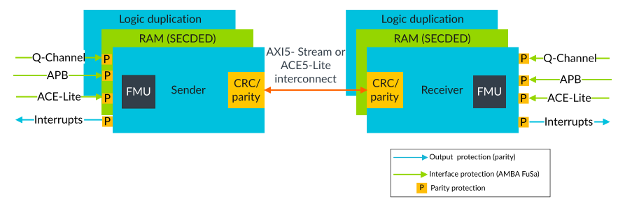

# Protection mechanisms of MHU-320AE

Source: <https://developer.arm.com/documentation/107612/0001/Functional-safety-features-of-MHU-320AE/Protection-mechanisms-of-MHU-320AE>

### Protection mechanisms of MHU-320AE

The MHU-320AE provides built-in protection mechanisms.

The following figure shows location of the MHU-320AE main protection mechanisms.

Figure 1. Protection mechanism distribution

MHU-320AE contains the following FuSa protection mechanisms.

### Lock-step logic protection

The logic is protected with duplicated logic running in lock-step with a temporal delay.

### RAM protection

The RAMs are shared between the lock-stepped primary and secondary blocks and are protected with SECDED ECC. The address is further protected with parity.

### AMBA AXI5-Stream interconnect protection

The AXI5-Stream interconnect that connects the MHU-320AE blocks, is protected with either:

- AMBA parity for simple point-to-point connections
- End-to-end CRC for packets routed over other interconnects or when ADB domain bridges or register slices are required

### AMBA external interface protection

All external AMBA interfaces are protected with AMBA parity signals. AMBA parity protects point-to-point connections consisting of wires and buffers only, and no gates. This protection includes the ACE5-Lite, AXI5-Stream, Q-Channel, and APB external ports.

### Q-Channel protection

The Q-Channel is protected by AMBA parity.

### AXI5-Stream PING/ACK

AXI5\_Stream PING/ACK protection contains a PING/ACK mechanism, as part of CRC end-to-end protection, where separate CRC packets are sent to check the data integrity of data packets and protect against spurious packets and packet loss.

### Clocks and resets

The clocks and resets are duplicated. The internally gated clocks operate with a temporal delay of two clock cycles. That is, the secondary logic operates two cycles later than the primary logic.

### Fault Management Unit

The Fault Management Unit (FMU) resides in the MHU Sender, in the MHU Receiver, or in both, depending on the MHU configuration. It processes faults that the protection mechanisms detect from all MHU-320AE blocks. The FMU records the fault syndrome in the error records and reports the fault using Error Recovery Interrupt (ERI) and Critical Error Interrupt (CRI). There are also FMU registers that enable fault injection and clearing for each protection mechanism. The FMU communicates with an external Safety Island through an APB port. The APB port is for FuSa purposes.

### Protection mechanisms

For a detailed list of the protection mechanisms available in MHU-320AE, see the Fault Detection and Control mechanisms chapter of the MHU-320AE Safety Manual (SM).
