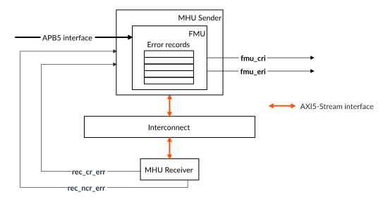

# Fault management unit

Source: <https://developer.arm.com/documentation/107612/0001/Functional-safety-features-of-MHU-320AE/Fault-management-unit>

### Fault management unit

The Fault Management Unit (FMU) implements the following functionality in MHU-320AE.

The FMU implements the following functionality in MHU-320AE:

- Dedicated APB5 interface to access error records and other registers.
- Routes all errors to the Safety Island, if enabled.
- Provides software the means to enable or disable a protection mechanism within a MHU-320AE block.
- Receives error signaling from all protection mechanisms within other MHU-320AE blocks.
- Maintains error records for each MHU-320AE block type, for software inspection and provides information on the source of the error.
- Retains error records across functional reset.
- Enables software error recovery testing by providing error injection capabilities in a protection mechanism.

The `FMU_LOCATION` configuration parameter determines whether the FMU is a part of the MHU Sender or MHU Receiver hierarchy or both.

The following figure shows the FMU and its interconnections when the FMU is located in the MHU Sender.

Figure 1. FMU

