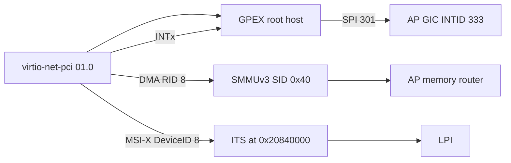

# Apollo QVP QBox PCIe 구현 상태

현재 기본 포트 구성은 [QEMU Gen5 x4/x2 및 bifurcation](qemu-gen5.md)을 참조한다.
아래 내용은 그 변경 전의 단일 GPEX endpoint/IRQ profile 조사 기록이며,
기존 검증 이력과 한계를 보존한다.

작성일: 2026-09-12. [Zena hardware 구성](hardware.md)을 기준으로 현재 QBox의
기능 범위와 fidelity 경계를 정리한다.

물리 인터페이스는 Gen6 x8 한 개와 Gen3 x1 두 개다. ECAM0~4를 다섯 개의
동시 활성 물리 controller로 보는 해석은 잘못이다.

## 구현 요약

AP CPU가 활성화되면 `ap_compute.lua`는 `qemu_gpex` 하나를 생성한다. GPEX는
QEMU `gpex-pcihost`를 실현하고 ECAM, PIO, low/high MMIO target socket, PCI
bus-master initiator, INTx output 네 개를 제공한다. PCI device는 같은
`QemuInstance`의 GPEX PCI bus에 attach된다.

| QBox resource | Address/IRQ | 연결 |
| --- | --- | --- |
| ECAM | `0x43b5_0000`, 256MiB | `ap_router` target view |
| PIO | `0x6020_0000`, 1MiB | `ap_router` target view |
| Low MMIO | `0x6030_0000`, 509MiB | `ap_router` target view |
| High MMIO | `0x4_0000_0000`, 8GiB | `ap_router` target view |
| INTx outputs | GPEX SPI 300–303 | AP GIC inputs |
| DMA initiator | requester ID `0x40` | SystemC SMMUv3 LTI00 when selected, 아니면 AP router |

GPEX의 low/high MMIO socket은 QEMU가 소유한 큰 MMIO memory region의 alias다.
QBox wrapper가 configured global base offset을 적용해 TLM router와 QEMU address가
같게 보이도록 한다. 이는 hardware physical address map을 구현한 것은 아니다.

기본 QVP Linux DT(`apollo-qvp.dts`/`.dtsi`)에는 PCI host node가 없다. 기본 GPEX도
endpoint를 attach하지 않는다. 따라서 기본 BSP 부팅에서 PCI enumeration이 없다는
것은 현재 의도된 동작이며, PCIe path 비동작의 증거가 아니다.

## Opt-in IRQ profile

`QBOX_APOLLO_PCIE_IRQ_TEST=true`일 때만 `virtio-net-pci` endpoint가
`0000:00:01.0`에 attach된다. PCI profile 생성기는 base DT에 overlay를 적용하여
PCI host, dedicated SMMU node, ITS reference, MSI mapping, INTx mapping을 넣는다.

| Profile 항목 | 값 |
| --- | --- |
| Endpoint BDF/RID | `0000:00:01.0` / `0x0008` |
| PCI/ITS DeviceID | `0x0008` |
| SMMU SID | `0x0040` |
| ITS event base | 0 |
| ITS translator | `0x2085_0040` |
| ITS collection entry | 2 bytes |
| MSI | RID 8 → ITS DeviceID 8 |
| DMA | RID 8 → SMMU SID `0x40` |
| INTx | GPEX outputs 300–303; endpoint INTA swizzle은 output 301, GIC INTID 333 |

Linux의 GIC SPI number와 architectural INTID는 다르다. profile DT의 SPI 301은
Linux hwirq/INTID 333이 된다. INTx mode는 `pci=nomsi`를 포함하고 MSI-X mode는
이를 포함하지 않는다. profile은 host bridge 전체 RID range가 아닌 test endpoint
RID 한 개만 `iommu-map`/`msi-map`에 넣어 host bridge 자체를 SID `0x40`으로
취급하지 않는다.

구현 source: `hsoc-stack/tools/qbox-platform/platforms/apollo/hw-block/ap_compute.lua`,
`hsoc-stack/tools/qbox/qemu-components/pci/qemu_gpex/include/qemu_gpex.h`,
`hsoc-stack/tools/qbox/qemu-components/pci/virtio_net_pci/include/virtio_net_pci.h`,
`hsoc-stack/tools/qbox-platform/platforms/apollo/test-profile/apollo-qvp-pcie-irq-overlay.dtso`.

## 검증 상태

이 저장소에는 historical QBox IRQ result와 FVP reference gate가 필요로 하는
`.omo/evidence/...` 입력 및 profile base DTB가 현재 없다. 따라서 과거 결과를
이번 checkout에서 재실행 PASS로 주장하지 않는다.

과거 profile의 범위는 MSI-X→ITS physical LPI, INTx, CPU affinity, CPU offline
fallback, replay 및 cleanup이며 QBox 전용이다. FVP가 ECAM SError로 endpoint를
enumerate하지 못하므로 QBox/FVP device parity는 `NOT_COMPARABLE`, FVP PCIe/ITS는
`UNSUPPORTED`다.

이번 문서 작성 시 수행한 정적 검증은 다음과 같다.

| Command | Result |
| --- | --- |
| `dtc -@ -I dts -O dtb ...apollo-qvp-pcie-irq-overlay.dtso` | PASS |
| `python3 scripts/test/validate_qbox_apollo_fvp_full_map.py` | PASS |
| Focused overlay/profile pytest 3 cases | PASS |

overlay를 실제 base DT에 적용하는 fixture test와 complete guest traffic profile은
현재 누락된 `.omo/evidence/apollo-gic-its/.../apollo-qvp.dtb` 및 FVP gate 때문에
실행할 수 없다. 누락 input을 복원한 뒤 다음 순서로 재검증한다.

1. `prepare_qbox_apollo_pcie_irq_profile.py`로 hash-bound MSI-X/INTx UKI와 disk를 생성한다.
2. `QBOX_APOLLO_PCIE_IRQ_TEST=true`로 두 QBox run을 수행한다.
3. `validate_qbox_apollo_pcie_irq_runtime.py`로 endpoint, IRQ-domain, workload,
   affinity, offline/replay, cleanup을 검증한다.
4. FVP 결과는 ECAM SError 경계를 유지한 채 별도 `UNSUPPORTED`로 기록한다.

## Fidelity backlog

QBox PCIe의 다음 항목은 현재 검증 범위 밖이다.

- Zena ECAM0–4, x8/x4/x1 bifurcation 및 PCIe PHY/controller register model
- link training, LTSSM, reset/perst, clock, hot-plug, AER/DPC error behavior
- Zena controller별 stream-ID policy와 NI-710AE integration
- FVP endpoint traffic 또는 physical ITS delivery와의 parity

새 endpoint를 추가할 때는 default QVP DT를 바꾸지 않고 opt-in overlay와
endpoint-specific RID/SID/DeviceID map을 추가해야 한다. endpoint traffic, MSI-X,
INTx를 각각 guest에서 관측해 profile evidence로 남긴다.
