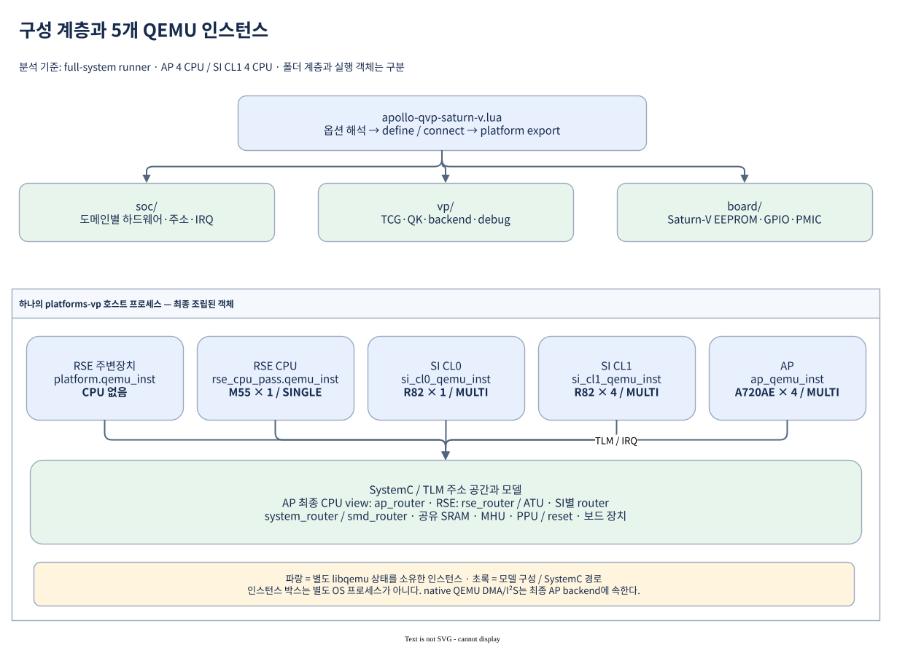
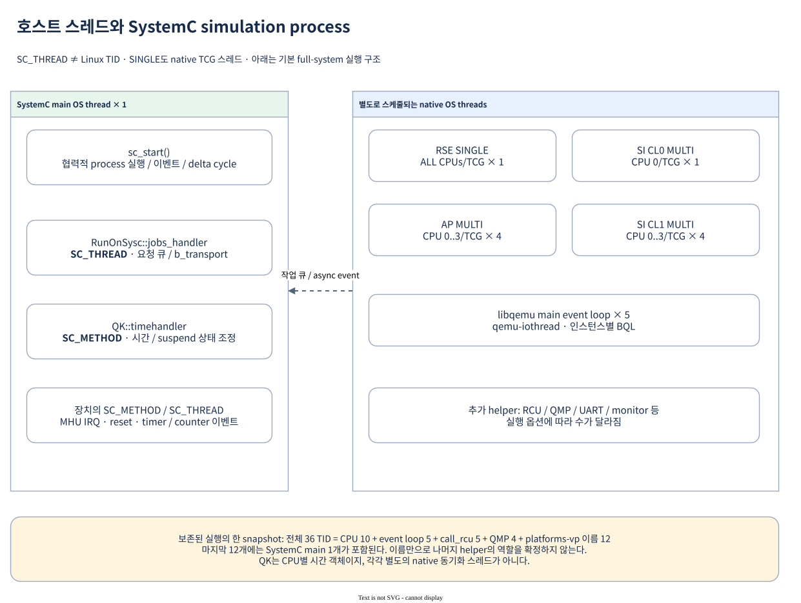
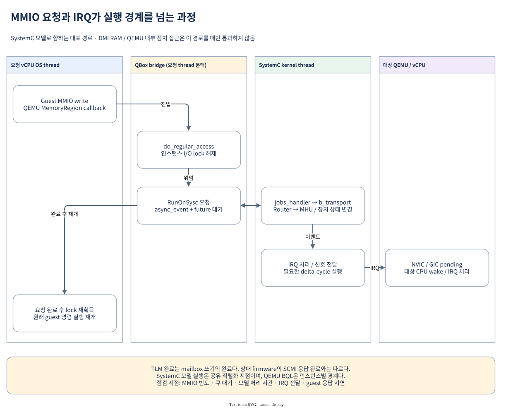
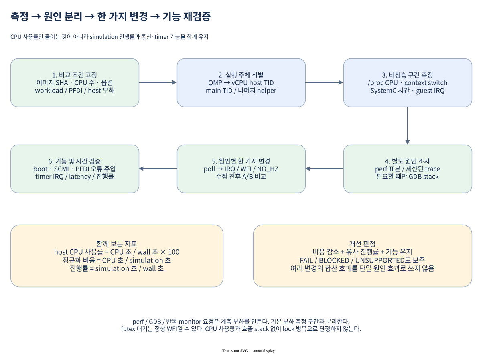

# Apollo QVP QBox 실행 구조와 부하 분석

분석일: **2026-10-03**. 기준은 `apollo-qvp-saturn-v.lua`를 사용하는
**전체 도메인 QBox**이며, 일반 full-system runner의 AP 4 CPU / SI CL1 4 CPU
구성이다. AP만 실행하는 direct-Linux QBox와 standalone QEMU는 범위가 다르다.

현재 소스와 보존된 실행 증거를 대조했다. 이번 작업에서 새 부팅이나 부하 측정을
수행한 것은 아니다. 아래 성능 수치는 2026-10-02~03의 기존 측정값이며,
입력 revision과 원시 자료는 [분석 입력 기록](analysis-inputs.json)에 정리했다.
Codebase Memory 색인은 관련 경로의 coverage/freshness가 불완전하여 실제 소스를
기준으로 판정했다. 런타임 실행 옵션은 Lua 기본값을 덮어쓸 수 있다.

먼저 기억할 관계는 다음과 같다.

- **호스트 프로세스 1개** 안에 **QemuInstance 5개**가 있다.
- CPU 실행 도메인은 **RSE / SI CL0 / SI CL1 / AP의 4개**다.
  RSE 주변장치용 CPU 없는 QEMU 인스턴스가 하나 더 있다.
- 이 구성의 guest CPU 10개는 native TCG 실행 스레드 **10개**를 사용한다.
  QEMU event loop, RCU, QMP, UART 등의 스레드는 별도로 더해진다.
- **SystemC `SC_THREAD`는 Linux OS thread가 아니다.**
  SystemC 커널이 실행하는 협력적 simulation process이며 TID와 1:1 대응하지 않는다.
- 메모리·장치 접근은 경로에 따라 QEMU 내부에서 처리되거나 SystemC/TLM으로 넘어간다.
  여러 vCPU가 병렬 실행되어도 SystemC 모델 처리가 같은 비율로 병렬화되지는 않는다.

## 1. Lua 구성: SoC / VP / Board와 최종 실행 객체



그림의 인스턴스 이름은 일부 접두사를 생략했다. 정확한 CCI 경로는 다음 절의 표에 있다.
이미지는 draw.io XML이 포함된 SVG다. 확대해서 볼 수 있고 draw.io에서 열어 편집할 수 있다.

| 구성 | 책임 | 대표 파일 |
|---|---|---|
| Entry | 옵션 해석, 정의·연결 순서, 최종 `platform` export | `apollo-qvp-saturn-v.lua` |
| `soc/` | 도메인별 CPU, 주소 공간, IRQ, IP 구성 | `soc/apollo.lua`, `soc/hw-block/*` |
| `vp/` | TCG, 시간 동기화, 실행 옵션, backend, QMP/debug | `vp/qvp.lua`, `vp/options.lua`, `vp/backends/*` |
| `board/` | Saturn-V EEPROM, GPIO expander, TPS6594 등 | `board/saturn-v.lua`, `board/hw-block/*` |

경로의 기준 디렉토리는
[`hsoc-stack/tools/qbox-platform/platforms/apollo`](../../hsoc-stack/tools/qbox-platform/platforms/apollo)다.
이 디렉토리 계층은 **소스의 소유권과 조립 단위**다. 폴더마다 OS 프로세스나
SystemC 실행 스레드가 만들어지는 구조가 아니다. 기존 CCI 객체 경로도 상당 부분 유지된다.

[Entry][s1]는 대략 다음 순서로 조립한다.

1. 옵션과 SoC/VP/Board 모듈을 읽고 루트 `Container`를 만든다.
2. fabric, RSE, AP, RoS, SMD를 정의한다.
3. AP 보드 장치와 테스트 연결을 적용하고 AP 주소 view를 연결한다.
4. VP의 native QEMU audio backend를 적용한다.
5. SI CL0/CL1, 보드 PMIC, SI 연결을 구성하고 debug/QMP를 붙인다.
6. 조립이 성공하면 최종 `platform`을 export한다.

따라서 개별 IP 파일의 최초 정의만 읽으면 실제 구성을 놓칠 수 있다.
예를 들어 AP CPU의 초기 socket 설정은 최종
[`address_view.lua`][s2]에서 **`ap_router`로 재연결**된다.
RoS의 DMA/I²S 초기 정의도 [`vp/backends/audio.lua`][s3]에서 AP 인스턴스의
`qemu_dma350` / `qemu_dw_apb_i2s`로 교체된다. RSE boot DMA는 별도의
SystemC 모델이므로 모든 DMA를 같은 backend로 설명하면 안 된다.

## 2. QEMU 인스턴스와 guest CPU의 관계

| 역할 | 실제 `QemuInstance` CCI 경로 | guest CPU | 기본 TCG | CPU 실행 OS thread |
|---|---|---|---|---:|
| RSE 주변장치 | `platform.qemu_inst` | 없음 | SINGLE 설정 | 0 |
| RSE firmware | `platform.rse_cpu_pass.qemu_inst` | Cortex-M55 ×1 | SINGLE | 1 |
| SI CL0 / SCP | `platform.si_cl0_qemu_inst` | Cortex-R82 ×1 | MULTI | 1 |
| SI CL1 / Zephyr | `platform.si_cl1_qemu_inst` | Cortex-R82 ×4 | MULTI | 4 |
| AP / TF-A·U-Boot·Linux | `platform.ap_qemu_inst` | Cortex-A720AE ×4 | MULTI | 4 |
| 합계 | **5개 인스턴스 / 4개 CPU 도메인** | **10 CPU** | | **10** |

RSE의 바깥·안쪽 인스턴스는 [`rse.lua`][s4]에서 각각 정의하며 실제 생성 설정은
[`vp/rse/qemu.lua`][s5]에 있다. 바깥 인스턴스는 PL061 같은 QEMU 주변장치를
소유하고, M55는 `rse_cpu_pass` 안쪽 인스턴스에 속한다.
QMP도 [CPU 도메인 4개][s6]를 대상으로 하므로 **QMP endpoint 4개를 보고
QemuInstance도 4개라고 판단하면 안 된다.**

각 인스턴스의 `AARCH64` 인자는 사용할 libqemu target/backend를 지정한다.
M55가 A-profile CPU라는 뜻이 아니다. 실제 CPU는 QMP의 `qom-type` 또는
CPU wrapper의 설정으로 확인한다. AP의 오래된 QOM path 문자열에 `a72`가
남아 있어도 관측된 `qom-type`은 `cortex-a720ae-arm-cpu`다.

### 일반 runner와 Lua 단독 기본값

[Full-system runner][s7]는 [AP를 활성화][s25]하고 기본 4 CPU를 사용한다.
반면 [`vp/options/execution.lua`][s8]의 raw Lua 옵션은 AP 비활성 기본이며,
활성화할 때 AP CPU 수는 1~16 범위다. SI CL1은 현재 4 CPU 구성이다.
문서의 10 CPU / 10 TCG thread는 **일반 full-system 실행 조건**에 대한 값이다.

### 별도 프로세스 대신 별도 libqemu 상태

[`QemuInstanceManager`와 `QemuInstance`][s9]는 SystemC 객체다.
Manager는 loader 접근을 제공하며 자체 worker thread를 만들지 않는다.
Instance는 libqemu context, 장치 목록, DMI와 실행 설정 등을 소유한다.

현재 [loader][s10]는 같은 라이브러리를 추가로 열 때 임시 파일
`/tmp/qbox_lib.XXXXXX`로 복사하여 `dlopen(RTLD_LOCAL | RTLD_NOW)`한 뒤
unlink한다. `dlmopen`을 쓰는 구조가 아니다. 별도로 로드한 libqemu 상태 덕분에
같은 프로세스 안에서 인스턴스별 CPU·장치·락 상태를 유지한다.
이 방식은 뒤에서 설명할 perf의 `(deleted)` DSO 주소 해석에도 영향을 준다.

## 3. 호스트 OS thread와 SystemC process



| 용어 | 실제 의미 | 관측 방법 |
|---|---|---|
| guest CPU / vCPU | M55, R82, A720AE의 에뮬레이션 상태 | QMP CPU 목록, guest CPU 목록 |
| native OS thread | Linux scheduler가 실행하는 host task | `/proc/PID/task/TID`, `ps -L`, perf |
| SystemC `SC_THREAD` | `wait()`에서 양보·재개하는 simulation process | SystemC 객체/소스, host stack |
| SystemC `SC_METHOD` | 이벤트에 반응하여 실행 후 반환하는 process | sensitivity, delta cycle, 소스 |
| quantum keeper(QK) | CPU 시간과 SystemC 시간의 관계를 관리하는 객체 | `/qk_status`, QK 소스 |
| guest Linux task | 에뮬레이션된 AP CPU에서 실행되는 프로세스·kernel worker | guest `/proc`, guest scheduler trace |

Guest Linux task마다 host thread가 하나 생기지 않는다. 예를 들어 네 개의
`pfdi_worker/*`와 여러 systemd 서비스는 AP의 네 vCPU가 실행하는 guest 작업이다.
Guest task 개수, guest CPU 개수, host TID 개수를 각각 구별해야 한다.

### TCG SINGLE / MULTI / COROUTINE

[SINGLE 구현][s11]은 **인스턴스 안의 CPU들을 하나의 native TCG thread**에서
실행한다. 이름은 `ALL CPUs/TCG`다. [MULTI 구현][s12]은 vCPU마다
`CPU n/TCG` native thread를 만든다. 여러 인스턴스는 같은 이름을 재사용한다.
`CPU 0/TCG`만으로 AP인지 SI CL0인지 알 수 없다.

SINGLE은 SystemC 단일 실행 모드와 동의어가 아니다. CPU를 SystemC process에서
실행하는 `COROUTINE` 경로는 별도로 존재하며, 현재 기본 구성은 이를 사용하지 않는다.
일반적인 MTTCG 개념은 [QEMU 공식 문서](https://www.qemu.org/docs/master/devel/multi-thread-tcg.html)와
같지만, 여기서는 현재 fork의 소스와 QBox callback을 우선한다.

SI CL0가 CPU 하나인데 MULTI로 바꾸어 효과가 있었던 이유도 CPU 수 증가가 아니다.
기존 A/R-profile WFE의 SINGLE 경로가 반복적인 yield와 SystemC 동기화를 유발했고,
MULTI 경로는 그 실행 패턴을 바꿨다. 현재는 SCP WFI idle도 적용되어 있으므로
과거 MULTI 단독 절감률을 현재 구성에 다시 더할 수 없다.

### 인스턴스별 event loop와 추가 helper

[`libqemu.c`][s13]는 인스턴스 초기화 때 native `qemu-iothread`를 만들고
`qemu_init()` / `qemu_main_loop()`를 실행한다. CPU 없는 RSE 주변장치 인스턴스도
이 event loop는 필요하지만 TCG CPU thread는 만들지 않는다.

보존된 [`after-verified-load.json`][e1]의 첫 `host_before` snapshot을 다시 집계하면 다음과 같다.

| host `comm` 분류 | 관측 개수 | 해석 |
|---|---:|---|
| `CPU 0/TCG`~`CPU 3/TCG` | 9 | AP 4 + SI CL0 1 + SI CL1 4 |
| `ALL CPUs/TCG` | 1 | RSE M55 |
| `qemu-iothread` | 5 | 인스턴스별 libqemu event loop |
| `call_rcu` | 5 | RCU helper |
| `IO mon_iothread` | 4 | QMP monitor 계열 thread |
| `platforms-vp` | 12 | SystemC main 1개와 동일 이름의 helper 11개 |
| 합계 | **36** | 이 실행·이 snapshot의 실제 host TID 수 |

CPU 10 + SystemC main 1 + event loop 5 = 핵심 16개지만 **전체 thread 수는
16개로 고정되지 않는다.** Backend, QMP, monitor/debug 설정에 따라 달라진다.
마지막 helper 11개의 개별 역할은 이름만으로 확정하지 않았다.

### SystemC main에서 실행되는 것

[`main.cc`의 `sc_start()`][s14]가 SystemC simulation을 실행한다.
모델의 `SC_THREAD` / `SC_METHOD`는 이 커널의 실행 문맥에서 스케줄된다.
대표적으로 다음이 있다.

- [`RunOnSysc::jobs_handler`][s15]: `SC_THREAD`; 외부 스레드가 보낸 작업을 실행한다.
- [`QK::timehandler`][s16]: `spawn_method()`로 등록한 `SC_METHOD`; 시간 진행과 suspend 상태를 조정한다.
- [`mhu320ae`][s17]: IRQ method와 reset thread; mailbox 이벤트를 처리한다.
- [`char_backend_stdio`][s18]: 입력을 받는 native thread와 SystemC `process` method가 함께 존재한다.

**C++ 객체 하나 = OS thread 하나**도 성립하지 않는다. 같은 객체에 native worker와
SystemC process가 함께 있을 수 있고, 여러 process가 한 SystemC main을 공유한다.
또한 단순한 C++ callback은 호출자의 thread에서 실행되므로, 모든 TLM 함수가
자동으로 SystemC thread로 이동한다고 생각해서는 안 된다.

## 4. CPU 접근, TLM, IRQ와 직렬화 지점



그림은 **SystemC 모델로 향하는 MMIO**의 대표 경로다.
QBox bridge 열은 요청 vCPU의 호출 문맥이며 별도의 OS thread를 뜻하지 않는다.
[`QemuInitiatorSocket::do_regular_access()`][s19]를 따라가면 다음과 같다.

1. native vCPU가 guest MMIO를 실행하고 QEMU MemoryRegion callback에 들어간다.
2. QBox bridge가 인스턴스의 I/O lock을 놓는다.
3. `RunOnSysc`가 작업을 큐에 넣고 `async_event`로 SystemC를 깨운다.
   호출한 native thread는 작업 완료를 기다린다.
4. SystemC `jobs_handler`가 `b_transport()`를 실행하고 router와 모델이 접근을 처리한다.
5. 완료를 돌려받은 vCPU가 I/O lock을 다시 얻고 guest 실행을 계속한다.

이미 SystemC 문맥에서 호출했다면 `RunOnSysc`는 직접 실행할 수 있다.
반대로 RAM에 DMI 또는 직접 memory-region 경로가 성립한 경우 반복 RAM 접근은
매번 이 큐를 통과하지 않는다. QEMU 내부에서 끝나는 장치 접근도 있다.
따라서 guest 메모리 접근 횟수를 그대로 SystemC MMIO 왕복 횟수로 계산하면 안 된다.

**BQL은 인스턴스별 QEMU 락 경계**이고, SystemC 모델 실행은 인스턴스 간 공유
직렬화 지점이다. vCPU 수를 늘리면 guest 계산은 병렬화될 수 있지만 MHU·장치 모델로
동시에 몰리는 MMIO가 많아져 큐와 락 대기가 늘 수도 있다.

### SCMI / PFDI 요청 한 번의 의미

AP는 공유 메모리에 payload를 준비하고 MHU doorbell을 쓴다.
SystemC MHU 모델의 상태 변화와 IRQ 전달을 통해 SI CL0가 요청을 처리하며,
응답은 다시 공유 메모리와 MHU 수신 IRQ를 통해 AP에 전달된다.

SystemC에서 QEMU로 들어가는 IRQ는 [target signal socket][s27]에서 대상
인스턴스의 I/O lock을 잡고 GPIO 입력을 설정한 뒤 락을 놓는다.
역방향 IRQ도 반드시 `RunOnSysc` 큐를 다시 통과하는 것은 아니다.

여기서 **doorbell write의 TLM 완료**와 **상대 firmware의 SCMI 응답 완료**는
서로 다른 시점이다. 병목을 조사할 때는 guest 요청 → MMIO → 상대 IRQ →
firmware 처리 → 응답 IRQ의 지연을 나누어 봐야 한다. 기존 PFDI 측정에는
진단 자체뿐 아니라 이 통신과 scheduling 비용도 포함된다.

| 영역 | 현재 주요 모델 소유권 | 주의점 |
|---|---|---|
| CPU, NVIC/GIC, CPU architectural timer | 각 libqemu / QEMU wrapper | CPU timer는 해당 CPU의 PPI 등으로 연결 |
| router, ATU/보호 view, 공유 SRAM | SystemC/TLM | 최종 주소 변환·DMI 경로를 함께 확인 |
| MHU, PPU/reset, 여러 board IP | SystemC 중심 | MMIO 및 IRQ 이벤트가 커널 실행 경계와 만남 |
| AP DMA-350 / DW APB I²S | 최종 VP 구성에서 AP native QEMU | RSE boot DMA와 구분 |
| UART / QMP / monitor backend | 모델과 host I/O helper의 조합 | 읽기·출력·관측 자체도 host 비용 발생 |

부팅도 모든 CPU를 동시에 자유 실행하는 구조가 아니다. RSE가 먼저 실행되고,
SI/AP는 reset·power·loader handoff를 거쳐 시작한다. RSE 인증/로드, SI CL0 SCP의
PMIC·SCMI 준비, AP TF-A → U-Boot → Linux가 중요한 경로다.
SI CL1 Zephyr도 SI PPU 흐름을 따른다. 이 설명은 논리적 의존 관계이며
모든 분기의 엄밀한 직렬 부팅 타이밍을 뜻하지 않는다.

## 5. 시간 동기화와 idle을 읽는 방법

현재 기본 설정은 `sync_policy=multithread-freerunning`,
`time_sync_strategy=quantum_keeper`다. [`vp/qvp.lua`][s20]의
`quantum_ns=10000000`은 10 ms다.

| 시간/값 | 뜻 | 혼동하면 안 되는 대상 |
|---|---|---|
| host wall time | 실제 관측 구간 | guest가 진행한 시간 |
| QEMU virtual clock | 인스턴스의 가상 시간 | 정확한 실제 CPU cycle 수 |
| `sc_time_stamp()` | SystemC 커널의 simulation time | host monotonic clock |
| QK `local_time` | 해당 QK의 절대 simulation time | CPU 사용률 |
| QK `quantum_time` | SystemC 시간보다 앞선 offset | 한 번의 MMIO 처리 시간 |
| global quantum 10 ms | co-simulation 동기화 설정 | Linux scheduling tick |
| AP/SI counter 125 MHz | timer/counter 기준 주파수 | 초당 125M IRQ |
| AP/SI CL1 100 Hz | OS tick/timeout 단위 10 ms | idle에서 반드시 100 IRQ/s 발생 |

[CPU wrapper][s21]는 QEMU virtual clock을 읽어 QK를 갱신하며 quantum deadline도
관리한다. [Freerunning QK][s22]의 외부 thread `sync()`는 tick notification을 보내고
`need_sync()`는 false다. 일반 quantum-budget 대기와 같은 알고리즘으로 설명하면
안 된다. 기반 `timehandler`의 SystemC 시간 조정과 explicit MMIO/이벤트 처리는
여전히 존재한다. `freerunning`은 무동기화 또는 timing parity 보장을 의미하지 않는다.

MULTI에서는 CPU별 QK를 사용하고 SINGLE에서는 첫 QK를 공유한다.
QK의 `start(job)`에는 선택적인 native worker 생성 기능이 있지만 현재 CPU 경로는
`start()`를 호출한다. **QK 개수만큼 별도 OS 동기화 스레드가 추가되는 구조가 아니다.**

WFI 상태에서는 host condition-variable 대기가 정상일 수 있다. CPU wrapper의
`wait_for_work()`는 SINGLE 공용 또는 MULTI CPU별 condition을 기다린다.
QK stop/start에는 managed reset release에 따른 예외도 있으므로
“모든 WFI가 항상 같은 QK 상태 전환을 한다”는 가정은 피한다.

`/sc_suspended`도 QK 동기화 때문에 변할 수 있어 사용자 Pause와 같지 않다.
`/qk_status`는 근사 관측이며 원자적인 전체 시스템 snapshot이나 guest CPU 사용률이 아니다.
이 구분은 [monitor 계약][s23]에 명시되어 있다.

## 6. 부하 측정: CPU 사용량과 simulation 진행을 함께 기록



### 6.1 비교 조건과 실행 주체를 먼저 고정

비교할 두 실행에서 image SHA256, libqemu Build ID, Lua/CCI override, CPU 수,
TCG/QK 설정, PFDI 주기, BSP/제품 workload를 기록한다. 호스트의 다른 작업과
실행 안정화 시간도 기록한다. full-system과 AP-only 수치를 같은 조건으로 비교하지 않는다.

부팅 후 guest가 idle에 도달한 뒤 예를 들어 10초 안정화하고 **30초 × 3구간**을
측정한다. 기능 probe와 perf/GDB는 이 구간 밖에서 수행한다.
`run_qbox_yocto.sh`는 login launcher이며 기본적으로 post-login probe를 끈다.
기능 판정은 canonical
[`run_qbox_apollo_fvp_full.py`][s7]의 `--post-login-probe`와 필요한 profile을 사용한다.
관측을 유지할 때는 `--keep-running-after-pass --monitor --monitor-port 18110`을
실제 image/출력 경로 인수에 추가한다. 다른 실행과 포트·출력 디렉토리를 공유하지 않는다.

현재 프로세스를 확인하는 기본 명령은 다음과 같다. 과거 측정 파일에 남은 PID를
현재 실행의 PID로 재사용해서는 안 된다.
이하 명령은 workspace 루트에서 실행한다.

```sh
pgrep -a -x platforms-vp
# 위 목록에서 현재 run에 속한 PID를 입력한다.
read -r -p 'QBox PID: ' qbox_pid
ps -L -p "$qbox_pid" -o pid,tid,comm,pcpu,stat,wchan:28
pidstat -t -u -w -p "$qbox_pid" 1 10
```

`pidstat`는 sysstat가 설치된 경우에 사용한다. `ps %CPU`는 짧은 A/B 구간의
정밀 사용률로 쓰지 않고 thread 목록과 대기 위치를 찾는 보조 자료로 사용한다.

### 6.2 QMP로 도메인과 TID 연결

현재 [측정 도구][s24]는 각 CPU 도메인의 [QMP 조회][s26]에서 `thread-id`를 받아
host `/proc` 값에 연결한다. 명칭이 같은 `CPU 0/TCG`를 이름으로 분류하지 않는다.

| CPU 도메인 | QMP biflow 경로 |
|---|---|
| RSE | `platform.rse_cpu_pass.rse_qmp.qmp_socket.qmp_socket_router` |
| SI CL0 | `platform.si_cl0_qmp.qmp_socket.qmp_socket_router` |
| SI CL1 | `platform.si_cl1_qmp.qmp_socket.qmp_socket_router` |
| AP | `platform.ap_qmp.qmp_socket.qmp_socket_router` |

측정 도구는 실행 소유권을 확인하는 monitor collector와 제한된 QMP query를 사용한다.
루트 프로세스의 PID=TID는 SystemC main으로, CPU 목록에 없는 나머지 TID는 helper로
별도 분류한다. **현재 도구의 domain CPU 비용은 vCPU TID 합계이며,
해당 도메인의 I/O/backend 비용 전체가 아니다.** 다섯 event-loop thread를 각각 어느
인스턴스에 귀속할지는 별도 thread-instance 계측이 필요하다.

SINGLE에서 여러 CPU가 하나의 TID를 공유하는 구성은 현재 도구가 중복 TID로 거부한다.
그 경우 공용 TCG 비용을 CPU별로 나눌 수 없으므로 측정기와 집계 정책을 먼저 조정해야 한다.

### 6.3 기존 측정 도구 실행

프로세스가 post-login을 끝냈고 monitor와 `primary-uart-input.fifo`가 준비된 상태에서
실행한다. `run_dir`은 현재 run의 디렉토리이며 동일 console에 다른 명령을 동시에 보내지 않는다.

```sh
read -r -p '현재 run 디렉토리: ' run_dir
read -r -p '새 측정 JSON 경로: ' load_json
python3 scripts/test/measure_qbox_pfdi_load.py \
  --run-dir "$run_dir" --pid "$qbox_pid" \
  --monitor-port 18110 --seconds 30 --windows 3 \
  --output "$load_json"
```

출력 경로는 새 파일을 사용한다. 도구는 host CPU/user/system tick, thread start time,
context switch, SystemC 시간, guest `/proc/interrupts`와 PFDI task accounting을 저장한다.
Guest snapshot은 timed window 밖에서 수집한다. QMP/monitor와 host counter의
endpoint는 원자적이지 않으며 그 시차도 측정 한계다.

계산은 다음처럼 분모를 명시한다. host tick은 `os.sysconf("SC_CLK_TCK")`로 환산한다.

```text
host CPU 초 = (구간 종료 CPU ticks − 시작 CPU ticks) / SC_CLK_TCK
host CPU%   = host CPU 초 / host 경과 초 × 100
정규화 비용 = host CPU 초 / SystemC 경과 초
진행률      = SystemC 경과 초 / host 경과 초
IRQ 발생률  = guest IRQ counter 차이 / guest uptime 차이
```

100%는 **호스트 논리 CPU 하나**다. 307%는 약 3.07개의 CPU 실행 시간을 쓴다는 뜻이다.
CPU%가 줄었지만 simulation 진행률도 줄었다면 유효한 최적화로 결론 내릴 수 없다.
여러 구간의 합산은 CPU 초와 경과 초를 합쳐 시간 가중 평균한다.

AP의 `pfdi-sample-app`만 보면 SMC를 수행하는 kernel `pfdi_worker/*` 비용이 빠진다.
또한 PFDI `count`는 지원 진단 항목 수이며 완료된 진단 실행 횟수 counter가 아니다.

## 7. 병목 위치 찾기와 개선 판단

### 7.1 증상별로 다음 조사를 선택

| 관측 | 가능한 원인 | 다음 확인 | 피해야 할 단정 |
|---|---|---|---|
| 특정 TCG TID가 높음 | guest busy loop, IRQ, 실제 연산, TB 번역 | 해당 TID의 perf와 guest PC/IRQ | 모두 QBox 동기화 비용이라는 단정 |
| SystemC main이 높음 | MMIO 왕복, 모델 계산, async update, logging | main perf stack, 이벤트·MMIO 빈도 | CPU 수를 늘리면 해결된다는 가정 |
| system CPU·context switch가 높음 | futex, 알림 왕복, host contention | user/system 분리, scheduler·stack | 문맥 전환 수 자체를 실패로 간주 |
| futex wait가 많고 CPU는 낮음 | 정상 WFI, future 대기, QK/lock 대기 | 호출자 stack과 guest 상태 | idle 대기를 병목으로 간주 |
| `qemu-iothread`만 높음 | device timer, BH, QMP, backend 작업 | TID별 perf 및 instance 계측 | 같은 `comm`이면 같은 인스턴스라는 가정 |
| wall time만 늘어남 | host 다른 작업, I/O 대기, simulation 정지 | host load, sim/wall, 완료한 guest 작업량 | 낮은 CPU%를 개선으로 보고 |

### 7.2 별도 구간에서 perf 표본 수집

이미 권한이 설정된 호스트에서 현재 PID를 대상으로 다음처럼 유한 시간 수집한다.
`cpu-clock:u`는 사용자 공간 표본이므로 kernel 함수 점유율까지 보여주지 않는다.

```sh
read -r -p '새 perf.data 경로: ' perf_data
perf record -e cpu-clock:u -F 99 --call-graph dwarf,8192 \
  -p "$qbox_pid" -o "$perf_data" -- sleep 30
perf report --stdio --no-children --sort pid,tid,comm,dso,symbol \
  -i "$perf_data"
```

프로세스별 user/system CPU와 context switch를 먼저 보아야 분모가 다른 지표를
섞지 않는다. 특정 TID만 조사할 때는 `-p` 대신 `-t`로 좁힐 수 있다.
샘플 손실과 profiler의 부하도 기록한다. 현재 권한이 부족한 경우 오류를 남기고
권한 정책을 확인하며, 수집 실패를 부하 0으로 처리하지 않는다.

동적으로 복사·unlink한 libqemu는 perf에서 `(deleted)`나 주소로 나타날 수 있다.
실제 로드 바이너리와 **Build ID가 일치하는 unstripped ELF**를 사용하고,
mapping의 load bias/offset을 반영해 symbolization해야 한다. 다른 빌드 ELF에
주소를 바로 넣어 얻은 함수 이름은 증거로 쓰지 않는다.
GDB stop/stack은 wall-time 대기 상태를 설명하지만 perf의 on-CPU 비율을 대신하지 않는다.

### 7.3 현재 적용한 개선과 검증 경계

| 대상 | 원인과 적용한 변경 | 유지·검증해야 할 계약 |
|---|---|---|
| RSE | sticky event가 WFI까지 깨우던 M-profile 경로 수정; WFI/WFE 대기 이유 분리 | WFI는 event를 소비하지 않음, WFE/SEV/SEVONPEND·IRQ wake 유지 |
| SI CL0 TCG | SINGLE WFE의 반복 동기화 비용 감소를 위해 MULTI 기본 | boot, timer wake, MHU/SCMI, PFDI 동작 |
| SI CL0 firmware | IRQ mask 아래 event queue 최종 확인 후 `DSB; WFI` | 큐 확인과 idle 사이 wakeup 누락 방지 |
| AP | `NO_HZ_IDLE=y`, `HZ=100`; 지원하지 않는 PSCI deep idle 광고 제거 | 기본 architectural WFI, high-resolution timer 유지 |
| SI CL1 | 기존 100 Hz·tickless 정책 명시 | 125 MHz counter, deadline-based timer, PFDI 유지 |
| SI CL0 통신 | SCMI Performance Fast Channels OFF; 40 ms poll 제거 | 일반 SCMI mailbox 요청과 MHU 응답 IRQ, governor 전환 |
| AP/SI CL1 PFDI | 진단 주기 3000 ms, SI 보고 watchdog 25 s | AP 60 s watchdog·OoR/boot deadline 유지, 오류 주입·감시 검증 |

Tickless idle은 idle CPU의 scheduling tick을 생략하는 기능이며,
[Linux NO_HZ 문서](https://www.kernel.org/doc/html/latest/timers/no_hz.html)의 개념에 따른다.
`HZ=100`이 모든 timer를 10 ms 이상으로 제한하지 않는다. 실제 AP의 이전 tick은
1 ms가 아니라 **4 ms(HZ=250)**였으며 현재 요구 tick 단위는 10 ms다.
SI CL0 architectural timer는 다음 alarm을 위한 one-shot이고 고정 1 ms scheduler tick이 아니다.

40 ms SCMI idle polling을 없앤 뒤에도 Linux MHU의 **활성 전송 중 1 ms TX ACK 확인**은
남아 있다. 일반 SCMI 응답은 수신 IRQ로 완료된다. Fast Channels OFF에 따라
`fast_switch` capability는 사라지지만 일반 cpufreq 요청은 유지한다.
SI CL0 debugger CLI의 100 ms polling 및 요청 처리 중 DVFS retry 등은 별도 경로다.

QVP의 CPU/cluster PSCI powerdown wakeup은 현재 미구현이다. DT에서 해당 상태를
제외하여 기본 WFI로 idle하고, `cpuidle` profile은 근거가 맞으면
`BLOCKED / unsupported:psci_powerdown_wakeup_unmodeled`로 보고한다.
`current_driver=none`만으로 미지원 판정을 내리거나 깊은 절전 PASS로 간주하지 않는다.

## 8. 기존 측정 결과를 구조에 연결해서 읽기

아래는 PFDI 3초, AP4/SI CL1 4, BSP idle 조건의 **여러 idle 개선을 합친 결과**다.
변경 전 90초와 변경 후 두 실행의 180초 구간을 비교했다.
원본은 [qualification.json][e2], 해석과 실패 이력은
[기존 runtime idle 보고서](../qbox-runtime-idle.md)에 있다.

| 실행 주체 | 변경 전 host CPU | 변경 후 host CPU |
|---|---:|---:|
| SystemC main | 76.95% | 2.15% |
| RSE vCPU | 99.90% | 0.18% |
| SI CL0 vCPU | 97.73% | 1.39% |
| AP 4 vCPU | 28.29% | 6.11% |
| SI CL1 4 vCPU | 0.47% | 0.61% |
| 기타 helper | 3.82% | 2.23% |
| 전체 `platforms-vp` | **307.14%** | **12.72%** |
| simulation / wall | **1.00139** | **1.00152** |

전체 host CPU 비용은 약 **95.86% 감소**했지만, 이것을 40 ms polling 제거만의
절감률로 사용하면 안 된다. RSE WFI, SI0 WFI/TCG, AP tickless 등 여러 변화의
결합 효과다. 각 항목의 독립적인 기여도는 같은 입력의 추가 A/B 실험이 필요하다.
호스트를 독점 격리한 측정도 아니므로 성능 보장 수치가 아니다.

개선 전 별도 실험에서는 SI0 MULTI 하나로 전체 307.14% → 236.44%,
SystemC main 76.95% → 4.33%였다. 이것은 당시 WFE 동기화가 큰 원인이었다는
증거이며, 다른 개선의 절감량에 단순 합산하지 않는다.
[원인 조사 보고서](../qbox-runtime-load.md)에 perf와 소스 분석이 있다.

AP timer IRQ는 idle에서 4 CPU 합 약 1000/s → **37.81/s**였고,
busy CPU0는 **100.32/s**였다. SCMI `LEVEL_SET` 2건 / `LEVEL_GET` 4건은
응답 `poll=0`으로 성공했고 MHU IRQ도 6회 증가했다. 기능을 끄거나 guest 진행을
멈춰서 얻은 CPU 감소인지 함께 검증한 결과다.
제품 이미지의 별도 측정값은 **97.09%**이며 활성 서비스가 다른 workload다.
BSP의 12.72%와 같은 조건의 회귀로 해석하지 않는다.

### 증거 수준과 남은 한계

- 기존 최종 native tests 127개, SCP framework 26개, Python 회귀 110개가 통과했다.
  BSP·제품 boot/post-login과 AP PFDI 7/7, SI CL1 17/17 profile도 통과했다.
- `after-wfi`와 `after-verified`는 부하 측정 이후 검사 도구 문제로 전체 harness가 FAIL이다.
  그 실패를 지우지 않았으며 이후 `functional-final`에서 timer/SCMI 기능을 별도 확인했다.
  이 문서의 36-thread snapshot도 `after-verified`의 보존된 측정 구간에 해당한다.
- RSE/SCP 초기화 및 power-state readback의 간헐적 부팅 실패는 미해결이다.
  성공한 재시도가 cold-boot 신뢰성을 증명하지 않는다.
- PFDI stub 기능 검증은 실제 vendor 진단 library의 coverage나 하드웨어 FTTI 증명이 아니다.
- 물리 전력, cycle accuracy, FVP/RTL timing parity, 장시간 RT 지연 상한,
  migration 호환성과 활성 audio/DMA 전체 workload는 이 결과로 보장하지 않는다.

## 9. 다음 병목을 개선할 때의 실행 순서

1. 현재 낮아진 idle 기준을 새로 측정하고 **실제 목표 workload**도 별도로 측정한다.
   오디오·네트워크·스토리지·PFDI stress는 idle과 다른 병목을 만든다.
2. QMP TID 기준으로 guest 실행 비용, SystemC main, helper를 먼저 분리한다.
   event-loop 비용이 커지면 thread-instance 관계를 추적하는 계측을 추가한다.
3. 관측된 경로만 좁혀 조사한다. 예를 들어 `RunOnSysc` queue 대기와 모델 실행 시간을
   구분할 수 있도록 저빈도 counter/histogram을 추가하고 계측 OFF 결과와 비교한다.
   이 세부 latency 계측은 현재 일반 측정 도구가 제공하는 기능은 아니다.
4. 한 번에 한 변경을 적용한다. IRQ-driven 처리, 불필요한 polling 제거,
   안전한 DMI 경로 검토, 로그 빈도 감소 등을 실제 원인에 따라 선택한다.
   DMA/보호/alias 의미를 확인하지 않은 DMI 우회는 최적화로 간주하지 않는다.
5. CPU%와 CPU 초/sim 초가 줄면서 진행률, 처리량 및 tail latency가 유지되는지 확인한다.
   이어 boot, SCMI/MHU, PFDI 오류 주입, timer wake와 해당 workload를 재검증한다.
6. 실패와 미지원 범위도 같은 결과에 보존한다. global quantum 확대, 일괄 polling 지연,
   CPU 수 감소는 기능·시간 계약이 달라질 수 있어 별도 실험 조건으로 표시한다.

## 10. 소스 및 증거 찾아보기

파일 링크의 line anchor는 분석 revision 기준이다. 이후 코드가 움직이면 표의 symbol을
기준으로 찾는다. Source tree와 보존된 빌드 artifact는 서로 다른 증거이며,
이번 소스 분석을 새 바이너리의 runtime 검증으로 승격하지 않는다.

| 참조 | 핵심 symbol / 확인 위치 |
|---|---|
| [Entry][s1], [AP view][s2], [audio backend][s3] | 최종 조립·재연결·backend 교체 |
| [RSE 구성][s4], [RSE QEMU][s5], [QMP][s6] | 5 instances와 4 CPU domains |
| [Runner][s7], [실행 옵션][s8] | AP 활성화·CPU 수·override |
| [QemuInstance][s9], [loader][s10] | libqemu 소유권·별도 DSO 로딩 |
| [SINGLE][s11], [MULTI][s12], [libqemu][s13] | native TCG 및 event-loop thread 생성 |
| [sc_start][s14], [RunOnSysc][s15] | SystemC 진입·외부 요청 직렬화 |
| [QK][s16], [CPU wrapper][s21], [freerunning][s22] | QK process, virtual clock, wait/wake |
| [MHU][s17], [stdio backend][s18], [initiator][s19] | 모델 process·I/O helper·MMIO bridge |
| [VP quantum][s20], [monitor 계약][s23] | 시간 설정·관측 API의 한계 |
| [측정기][s24], [원시 snapshot][e1], [qualification][e2] | 계산 및 기존 실행 증거 |

다이어그램 파일:
[구성](assets/01-composition.drawio.svg) ·
[스레드](assets/02-threads.drawio.svg) ·
[MMIO/IRQ](assets/03-mmio-irq.drawio.svg) ·
[측정 절차](assets/04-measurement.drawio.svg).
SVG에 편집 가능한 draw.io 모델을 포함했다. 작성 형식은
[draw.io XML reference](https://raw.githubusercontent.com/jgraph/drawio-mcp/main/shared/xml-reference.md)를 따른다.

[s1]: ../../hsoc-stack/tools/qbox-platform/platforms/apollo/apollo-qvp-saturn-v.lua#L4
[s2]: ../../hsoc-stack/tools/qbox-platform/platforms/apollo/soc/hw-block/ap_compute/address_view.lua#L203
[s3]: ../../hsoc-stack/tools/qbox-platform/platforms/apollo/vp/backends/audio.lua#L6
[s4]: ../../hsoc-stack/tools/qbox-platform/platforms/apollo/soc/hw-block/rse/rse.lua#L38
[s5]: ../../hsoc-stack/tools/qbox-platform/platforms/apollo/vp/rse/qemu.lua#L29
[s6]: ../../hsoc-stack/tools/qbox-platform/platforms/apollo/vp/debug/qmp.lua#L9
[s7]: ../../scripts/run/run_qbox_apollo_fvp_full.py#L79
[s8]: ../../hsoc-stack/tools/qbox-platform/platforms/apollo/vp/options/execution.lua#L14
[s9]: ../../hsoc-stack/tools/qbox/qemu-components/common/include/qemu-instance.h#L54
[s10]: ../../hsoc-stack/tools/qbox/systemc-components/common/src/dynlib_loader.cc#L294
[s11]: ../../hsoc-stack/tools/qemu/accel/tcg/tcg-accel-ops-rr.c#L360
[s12]: ../../hsoc-stack/tools/qemu/accel/tcg/tcg-accel-ops-mttcg.c#L142
[s13]: ../../hsoc-stack/tools/qemu/libqemu/libqemu.c#L111
[s14]: ../../hsoc-stack/tools/qbox/platforms/src/main.cc#L68
[s15]: ../../hsoc-stack/tools/qbox/systemc-components/common/include/runonsysc.h#L104
[s16]: ../../hsoc-stack/tools/qbox/systemc-components/common/src/libgssync/qkmultithread.cc#L74
[s17]: ../../hsoc-stack/tools/qbox-platform/systemc-components/mhu320ae/include/mhu320ae.h#L3100
[s18]: ../../hsoc-stack/tools/qbox/systemc-components/backends/char_backend_stdio/include/char_backend_stdio.h#L300
[s19]: ../../hsoc-stack/tools/qbox/qemu-components/common/include/ports/initiator.h#L660
[s20]: ../../hsoc-stack/tools/qbox-platform/platforms/apollo/vp/qvp.lua#L8
[s21]: ../../hsoc-stack/tools/qbox/qemu-components/common/include/cpu.h#L705
[s22]: ../../hsoc-stack/tools/qbox/systemc-components/common/include/qkmulti-freerunning.h#L13
[s23]: ../../hsoc-stack/tools/qbox/docs/monitor.md#L80
[s24]: ../../scripts/test/measure_qbox_pfdi_load.py#L121
[s25]: ../../scripts/run/run_qbox_apollo_fvp_full.py#L2354
[s26]: ../../scripts/test/measure_qbox_pfdi_load.py#L142
[s27]: ../../hsoc-stack/tools/qbox/qemu-components/common/include/ports/qemu-target-signal-socket.h#L31
[e1]: ../../build/qbox-apollo-qvp/runtime-idle/after-verified-load.json
[e2]: ../../build/qbox-apollo-qvp/runtime-idle/qualification.json
