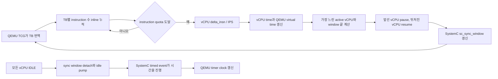
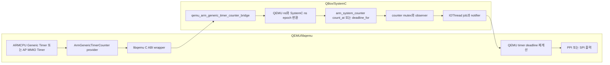

# QBox MCIPS Plugin과 Apollo QVP Timer/Counter 분석

- 작성일: 2026-07-23
- 대상 머신/이미지: `apollo-qvp` / `nexios-image`
- 활성 설정: `RD_ASPEN_VARIANT = "cfg2"`, AP CPU 4개,
  `TMPDIR = "build/tmp_baremetal"`
- 분석 기준:
  - 최상위 저장소: `3c4876c180a96cb897cb41ba38ad476173fa9982`
  - QBox: `2dbbdff91f3680fd8b89e1dbbdf305ac2268248f`
  - QBox Platform: `e37427d50834dd6a9b886ef22af1996483e13bdb`
  - QEMU/libqemu: `99f3ef09d75114866d818bbbcfd95c4486c258a1`
- 조사 범위: QBox MCIPS 구현, QEMU TCG plugin 연동, SystemC/TLM 시간
  동기화, Apollo timer/counter topology, 기존 runtime 증거, 적용 가능성 및
  검증 계획

## 1. 결론

### 1.1 최종 판정

**MCIPS plugin은 Apollo timer/counter 기능 모델의 대체물이 아니다.**
MCIPS가 바꾸는 것은 QEMU TCG vCPU의 명령어 수를 simulation time으로
변환하고 QEMU와 SystemC의 진행 폭을 제한하는 **시간 동기화 정책**이다.
다음 기능은 MCIPS를 켜도 그대로 필요하다.

- CPU 내부 Arm Generic Timer의 CNT* system register와 per-core PPI
- AP REFCLK MMIO timer의 CNTCTL/CNTBase register와 SPI 48/49
- CSS/SMD shared `arm_system_counter`
- AP/SI external counter provider와 QEMU↔QBox callback bridge
- SI0 counter window, comparator, IRQ 34
- RSE local system counter와 TIMER0..3
- secure/non-secure view, reset, access control, IRQ routing

**QEMU 가상시간과 SystemC 시간의 선행·지연 폭을 제한하는 수단으로는
조건부 가능성이 있다.** 특히 host wall clock 의존성을 줄이고, 동일한
instruction rate를 준 vCPU 간의 진행 편차를 quantum 범위 안에서 관리하는
A/B 실험에는 유용하다.

그러나 **현재 구현을 Apollo 기본값으로 전환하는 것은 권고하지 않는다.**
소스 분석에서 다음 두 correctness blocker가 확인되었다.

1. `McipsSync`가 TLM transaction의 annotated delay를 회수하지 않으므로
   QEMU→SystemC access에서 target이 반환한 지연이 CPU 시간에 반영되지 않는다.
2. global quantum의 ns 숫자를 instruction quota로 그대로 사용하므로
   1 GIPS가 아닌 CPU에서는 의도한 synchronization interval이 달라진다.

또한 1초 host wall-clock watchdog이 정지 상태를 감지하면 simulation time을
한 quantum 강제로 전진시키므로, 현재 상태로 strict determinism을 주장할 수
없다. TB instrumentation과 더 잦은 synchronization이 추가되므로 host 성능도
실측 전에는 향상이라고 판단할 수 없다.

### 1.2 질문별 짧은 답

| 질문 | 판정 | 이유 |
| --- | --- | --- |
| MCIPS로 Apollo timer/counter 구조를 단순화할 수 있는가? | 대부분 불가 | 시간 진행 정책일 뿐 register, counter domain, comparator, IRQ, security 모델을 제공하지 않는다. |
| external counter bridge를 제거할 수 있는가? | 불가 | AP MMIO REFCLK와 SI external provider가 shared CSS counter 값을 정확히 보려면 bridge가 계속 필요하다. |
| QEMU와 SystemC의 시간 skew를 줄일 수 있는가? | 조건부 가능 | instruction time과 `sc_sync_window`로 선행 실행을 제한할 수 있다. |
| QEMU→QBox TLM annotated delay를 해결하는가? | 현재 불가 | MCIPS 경로의 `get_local_time()`은 0, `set_local_time()`은 no-op이다. |
| callback/DSO/mutex host 비용을 없애는가? | 불가 | external provider의 count/deadline callback과 `arm_system_counter` mutex는 그대로 남는다. |
| timer interrupt lateness를 해결하는가? | 미입증 | time skew는 줄일 가능성이 있지만 callback, QEMU timer, GIC, guest ISR 지연을 제거하지 않는다. |
| 성능이 빨라지는가? | 미측정 | TB instrumentation과 작은 quantum은 오히려 느릴 수 있다. |

## 2. MCIPS와 MCIPS plugin의 의미

이 문서에서 **MCIPS**는 *Multi-Core Instructions Per Second* 기반의
시간 모델과 synchronization 전략을 뜻한다. **`McipsPlugin`**은 그 전략을
구현한 QBox의 SystemC/C++ 모듈이다. 별도의 timer device나 counter IP가
아니다.

관련 객체의 역할은 다음과 같다.

| 구성 요소 | 역할 |
| --- | --- |
| `McipsPlugin` | vCPU instruction 수집, instruction→time 변환, vCPU pause/resume, QEMU virtual clock 제공, SystemC sync window 제어 |
| `LibQemuPlugin` | QEMU C callback을 C++ SystemC object로 안전하게 dispatch하고 종료 중 callback을 drain |
| `libidlinker` | QEMU가 부여한 plugin ID를 CCI key를 통해 QBox `McipsPlugin`과 연결 |
| `McipsSync` | `QemuCpu`에서 quantum keeper 대신 MCIPS 전략을 선택하는 adapter |
| `sc_sync_window` | QEMU가 허용한 `{from, to}` 시간 창 안에서 SystemC kernel 진행을 동기화 |
| `insn_per_second` | vCPU별 instruction 수를 simulation time으로 환산하는 모델 파라미터 |

QBox의 사용 계약은 `QemuInstance`에
`time_sync_strategy = "mcips"`를 지정하고 TCG/MULTI mode를 사용하는
것이다. 기본값은 `"quantum_keeper"`이다.

```lua
qemu_inst = {
    moduletype = "QemuInstance";
    accel = "tcg";
    tcg_mode = "MULTI";
    time_sync_strategy = "mcips";
}

cpu_0 = {
    moduletype = "cpu_arm_cortexA76";
    args = {"&qemu_inst"};
    insn_per_second = 1000000000;
}
```

근거:

- `hsoc-stack/tools/qbox/README.md:161-203`
- `hsoc-stack/tools/qbox/qemu-components/common/include/qemu-instance.h:152-168`
- `hsoc-stack/tools/qbox/qemu-components/common/include/qemu-instance.h:335-359`
- `hsoc-stack/tools/qbox/qemu-components/common/include/cpu.h:768-804`

## 3. MCIPS 내부 동작

### 3.1 데이터 흐름



동작 순서는 다음과 같다.

1. `QemuInstance`가 `"mcips"` 전략을 선택하면 instance당
   `McipsPlugin` 하나를 만들고 QEMU에 `libidlinker`를 로드한다.
2. `end_of_elaboration()`에서 vCPU scoreboard와 QEMU time-control handle을
   만들고 TB translation, vCPU init/resume/idle, time callback을 등록한다.
3. 번역된 각 TB는 `delta_insn`에 instruction 수를 inline으로 더한다.
4. quota에 도달하면 `delta_insn / insn_per_second`를 `sc_time`으로
   변환하고 vCPU/QEMU 시간을 갱신한다.
5. 가장 느린 active vCPU와 현재 SystemC window 끝 중 더 이른 값을
   threshold로 삼아 vCPU를 pause/resume한다.
6. 모든 CPU가 WFI/WFE 등으로 idle이면 sync window를 detach하고 timed
   `m_idle_tick` event를 사용해 SystemC와 QEMU timer가 계속 진행하도록 한다.

핵심 소스:

- vCPU 상태와 공유 상태:
  `hsoc-stack/tools/qbox/qemu-components/common/include/mcips-plugin.h:20-74`
- plugin/time callback 등록:
  `hsoc-stack/tools/qbox/qemu-components/common/include/mcips-plugin.h:151-217`
- instruction→time 변환:
  `hsoc-stack/tools/qbox/qemu-components/common/include/mcips-plugin.h:272-301`
- threshold와 pause/resume:
  `hsoc-stack/tools/qbox/qemu-components/common/include/mcips-plugin.h:372-418`
- TB instrumentation과 quota:
  `hsoc-stack/tools/qbox/qemu-components/common/include/mcips-plugin.h:517-575`
- idle pump와 QEMU clock:
  `hsoc-stack/tools/qbox/qemu-components/common/include/mcips-plugin.h:94-118,577-640,709-774`

### 3.2 QEMU plugin API 의존성

공식 QEMU TCG plugin API는 TB/명령어 instrumentation과 scoreboard를
제공한다. QEMU 문서는 plugin API가 QEMU version 간 안정 ABI를 보장하지
않는다고 명시하며, out-of-tree plugin은 대상 QEMU version에 맞춰 빌드해야
한다. 공식 문서:

- [QEMU TCG Plugins](https://www.qemu.org/docs/master/devel/tcg-plugins.html)
- [QEMU TCG Instruction Counting](https://www.qemu.org/docs/master/devel/tcg-icount.html)

MCIPS는 upstream의 `qemu_plugin_request_time_control()`뿐 아니라 local QEMU의
추가 API도 사용한다.

- `qemu_plugin_register_time_cb`
- `qemu_plugin_cpu_request_pause`
- `qemu_plugin_cpu_resume`

local QEMU history에는 각각 다음 downstream 변경이 존재한다.

- `6f4d1797ff7f`:
  `plugins: add qemu_plugin_register_time_cb support (!WIP)`
- `6b015a92a0dc`:
  `plugins: export cpu_request_pause and cpu_resume to plugin API`

따라서 현재 QBox MCIPS를 stock upstream QEMU의 일반 plugin으로 보는 것은
부정확하다. local QEMU/libqemu와 함께 version-locked된 기능으로 관리해야
하며, upstream-friendly 구현을 목표로 한다면 downstream API의 필요성과
대체 가능성을 별도로 정리해야 한다.

### 3.3 QEMU `icount`와의 차이

MCIPS와 QEMU `icount`는 둘 다 instruction 수를 사용하지만 같은 기능이
아니다.

| 구분 | MCIPS | QEMU `icount` |
| --- | --- | --- |
| 구현 위치 | QBox SystemC module + QEMU TCG plugin | QEMU 내부 virtual clock |
| 다중 vCPU 제어 | vCPU별 scoreboard, pause/resume, sync window | QEMU 내부 icount scheduler |
| SystemC 연동 | 직접 제공 | QBox가 별도 동기화해야 함 |
| 현재 Apollo MTTCG 적용 | 실험 후보 | `MULTI`와 비호환 |
| 주 용도 | QEMU/SystemC co-simulation 동기화 | QEMU 내부 instruction-count virtual time |

QEMU 공식 문서도 MTTCG와 icount의 제약을 별도로 다룬다. 따라서
“MCIPS를 켠다”를 “QEMU icount를 켠다”로 해석하면 안 된다.

## 4. 현재 Apollo timer/counter 구조

### 4.1 기능 topology

현재 구조의 복잡성은 두 종류로 나눠야 한다.

1. **필수 기능 복잡성**: Arm architecture와 RD-Aspen hardware topology를
   재현하기 위해 필요한 CPU timer, MMIO frame, counter domain, IRQ,
   security split.
2. **통합 복잡성**: QEMU virtual time과 SystemC shared counter 사이의
   callback, epoch 변환, lock, notification, scheduler 경계.

MCIPS는 2번의 일부인 time synchronization 정책에만 관여한다.

| 영역 | 현재 구현 | 주소/IRQ | MCIPS로 대체 |
| --- | --- | --- | --- |
| AP CPU timer | QEMU `ARMCPU` native Generic Timer | MMIO 없음, per-core PPI 19/20/26/27/28/29/30 | 불가 |
| AP REFCLK | QEMU Arm MMIO timer + external CSS counter bridge | CNTCTL `0x1A810000`, S `0x1A820000`/SPI 48, NS `0x1A830000`/SPI 49 | 불가 |
| CSS/SMD | SystemC `arm_system_counter`, 125 MHz | control/read/sync windows | 불가 |
| SI0 CPU timer | Cortex-R82 external counter + shared CSS bridge | PPI 20/27/29 | 불가 |
| SI0 MMIO | `host_gtimer` control/base | `0x2A6F0000`, `0x2A720000`; IRQ 34 미구현 | 불가 |
| SI1 CPU timer | Cortex-R82 external counter + shared CSS bridge | CPU Generic Timer PPI | 불가 |
| RSE | local QEMU SSE counter + TIMER0..3 | control/read, IRQ 3/4/5/27 | 불가 |

주요 근거:

- AP QEMU instance와 CPU:
  `hsoc-stack/tools/qbox-platform/platforms/apollo/hw-block/ap_compute.lua:37-55,593-635`
- AP MMIO REFCLK:
  `hsoc-stack/tools/qbox-platform/platforms/apollo/hw-block/ap_compute.lua:462-489`
- SI0 QEMU instance, counter window, CPU bridge:
  `hsoc-stack/tools/qbox-platform/platforms/apollo/hw-block/si_cl0.lua:579-597,630-654,1064-1105`
- SI1 QEMU instance와 CPU bridge:
  `hsoc-stack/tools/qbox-platform/platforms/apollo/hw-block/si_cl1.lua:119-136,306-330`
- CSS counter:
  `hsoc-stack/tools/qbox-platform/platforms/apollo/hw-block/system_mgmt.lua:407-449`
- RSE local counter/timers:
  `hsoc-stack/tools/qbox-platform/platforms/apollo/hw-block/rse.lua:657-780`
- Arm Zena CSS programming model:
  `doc/arm_zena_css_dev_guide/09-programmers-model-for-zena-css.md`

### 4.2 현재 bridge 경로



external provider의 count/deadline query는 다음 경계를 지난다.

1. QEMU ARM Generic Timer 또는 AP MMIO timer
2. QOM `ArmGenericTimerCounter` provider/proxy
3. libqemu C ABI wrapper
4. QBox `qemu_arm_generic_timer_counter_bridge`
5. QEMU virtual ns ↔ SystemC absolute ns epoch 변환
6. `arm_system_counter::count_at()` 또는 `deadline_for()`
7. shared counter state mutex와 fixed-point 계산

counter가 enable/frequency/increment 상태를 변경하면 observer generation,
instance별 IOThread job, QEMU notifier, timer deadline 재계산 경로가 추가된다.

근거:

- bridge callback, epoch 변환, notification:
  `hsoc-stack/tools/qbox/qemu-components/timer/qemu_arm_generic_timer_counter_bridge/src/qemu_arm_generic_timer_counter_bridge.cc:70-174,190-248`
- QBox libqemu adapter:
  `hsoc-stack/tools/qbox/qemu-components/common/src/libqemu-cxx/arm-generic-timer.cc:39-54`
- QEMU C ABI wrapper:
  `hsoc-stack/tools/qemu/libqemu/wrappers/target/arm.c:56-137`
- QEMU provider:
  `hsoc-stack/tools/qemu/hw/timer/arm_generic_timer_counter.c:39-85,150-253`
- AP MMIO timer recomputation:
  `hsoc-stack/tools/qemu/hw/timer/arm_arch_timer_mmio.c:64-108,466-519`
- counter state/locking:
  `hsoc-stack/tools/qbox/systemc-components/arm_system_counter/src/arm_system_counter.cc:53-110,155-238`
- IOThread job:
  `hsoc-stack/tools/qemu/libqemu/wrappers/iothread-job.c:19-100`

MCIPS를 켜도 이 경로는 삭제되지 않는다. QEMU virtual ns의 생성 방식만
host/quantum-keeper 중심에서 instruction/IPS 중심으로 바뀐다.

## 5. “delay”를 네 종류로 분리해야 하는 이유

현재 문제를 하나의 “QEMU→QBox bridge delay”로 부르면 원인과 개선책을
혼동하게 된다.

| 지연 종류 | 의미 | 현재 주요 원인 | MCIPS 효과 |
| --- | --- | --- | --- |
| Simulation-time skew | QEMU virtual time과 SystemC time의 선행/후행 | temporal decoupling, global quantum, freerunning/quantum policy | 줄일 가능성 있음 |
| Annotated TLM delay | `b_transport(trans, delay)`가 모델에 더한 시간 | target/interconnect가 반환한 `sc_time` | 현 MCIPS는 유실 |
| Host execution overhead | 같은 simulation event를 처리하는 실제 wall time | DSO callback, BQL, mutex, thread scheduling, TB instrumentation | 제거 못함, 증가 가능 |
| IRQ lateness | programmed deadline 대비 실제 PPI/SPI/ISR 관측 시점 | timer callback, scheduler, GIC, guest ISR, quantum ordering | 일부 개선 가능하나 미입증 |

### 5.1 Simulation-time skew

현재 Apollo global quantum은 `10,000,000 ns`, 즉 10 ms다.

- `hsoc-stack/tools/qbox-platform/platforms/apollo/hw-block/fabric.lua:3-8`

AP, SI0, SI1, RSE `QemuInstance`는 `time_sync_strategy`를 명시하지 않아
기본 `quantum_keeper`를 사용한다. AP는
`multithread-freerunning`, SI0/SI1은 `multithread-quantum`, RSE는
`multithread-freerunning`이 기본이다.

MCIPS는 vCPU instruction time과 SystemC window 끝을 비교해 선행 vCPU를
pause하므로 이 종류의 skew를 줄이는 후보가 된다. 그러나 instance당 plugin
하나이므로 AP/SI0/SI1/RSE의 네 QEMU instance를 하나의 global CPU clock으로
직접 조정하지는 않는다. 각 instance의 skew를 관측하고 별도 gate로
검증해야 한다.

### 5.2 Annotated TLM delay 유실

일반 quantum-keeper 경로는 transaction 전후의 local time을 보존한다.

```cpp
auto now = m_cpu.initiator_get_local_time();
target_socket->b_transport(trans, now);
m_cpu.initiator_set_local_time(now);
```

근거:

- transaction 경로:
  `hsoc-stack/tools/qbox/qemu-components/common/include/ports/initiator.h:659-689`
- `QuantumKeeperSync::get_local_time()/set_local_time()`:
  `hsoc-stack/tools/qbox/qemu-components/common/include/cpu.h:1303-1325`

반면 base `CpuTimeSyncStrategy`의 `get_local_time()`은
`SC_ZERO_TIME`, `set_local_time()`은 no-op이고, `McipsSync`는
`on_end_of_elaboration()`만 override한다.

- `hsoc-stack/tools/qbox/qemu-components/common/include/cpu.h:80-91,131-143`
- `hsoc-stack/tools/qbox/qemu-components/common/include/cpu.h:1332-1339`

따라서 target이 transaction delay를 늘려 반환해도 MCIPS CPU 시간에는
반영되지 않는다. **MCIPS는 QEMU→QBox annotated delay 문제의 해결책이
아니며, timing-aware target에서는 기존 경로보다 fidelity가 낮아질 수 있다.**

### 5.3 Host execution overhead

external counter query에는 QEMU↔libqemu↔QBox 경계와
`arm_system_counter` mutex가 남는다. state mutation은 IOThread job과
notifier를 추가로 통과한다. MCIPS는 이 호출 수나 lock을 없애지 않는다.
오히려 다음 비용을 추가한다.

- 모든 translated TB에 instruction-count inline operation
- quota conditional callback
- MCIPS mutex와 vCPU pause/resume
- `sc_sync_window` update
- 작은 quantum을 사용할 경우 더 잦은 synchronization

따라서 MCIPS의 host 성능 효과는 **미측정**이다. 최적화라고 전제해서는
안 되며 `simulated seconds / wall second`, host CPU 사용률, callback 수를
함께 측정해야 한다.

### 5.4 IRQ lateness

기존 timer A/B 증거는 AP CPU 내부 timer까지 external CSS provider로
연결했던 구성에서 큰 가변 overshoot가 발생했고, AP CPU timer를 native
QEMU timer로 되돌린 뒤 개선되었음을 보여준다.

| 구성 | 3초 표본 평균 | 최소 | 최대 |
| --- | ---: | ---: | ---: |
| original timer feature Yocto | 3.938 s | 3.280 s | 5.450 s |
| final AP-native Yocto | 3.106 s | 3.090 s | 3.120 s |
| final local Buildroot | 3.068 s | 3.060 s | 3.080 s |

근거:

- `build/timer-ab/evidence/timer-ab-summary.md:16-47`
- `build/qbox-apollo-qvp/timer-ab/fixed-yocto-20260723-005315/timer-summary.txt`
- `build/qbox-apollo-qvp/timer-ab/fixed-local-20260723-005714/timer-summary.txt`

이 결과는 external provider 구성에서 variable late clockevent delivery가
발생했다는 end-to-end 증거다. 하지만 callback mutex, freerunning rendezvous,
QEMU timer callback, GIC, guest ISR 중 어느 하나의 비용을 분리한 profiler
결과는 아니다. 따라서 “MCIPS가 이 수치를 해결한다”는 결론은 낼 수 없다.

## 6. 현재 MCIPS 구현의 blocker와 위험

### 6.1 Blocker 1: IPS별 quota scaling

현재 초기화는 global quantum을 ns 숫자로 변환한다.

```text
m_global_quantum = floor(m_quantum.to_seconds() * 1e9)
```

그 숫자를 TB conditional callback의 **instruction count threshold**로
그대로 사용한다.

- `hsoc-stack/tools/qbox/qemu-components/common/include/mcips-plugin.h:161-163`
- `hsoc-stack/tools/qbox/qemu-components/common/include/mcips-plugin.h:542-575`

실제 vCPU 시간 변환은 `delta_insn / insn_per_second`이므로 callback
interval은 다음과 같다.

```text
actual_interval_ns = quantum_ns * 1e9 / insn_per_second
```

| IPS | 설정 quantum 100 µs일 때 실제 quota interval |
| ---: | ---: |
| 100 MIPS | 1 ms |
| 1 GIPS | 100 µs |
| 2 GIPS | 50 µs |

QBox README는 CPU별 100 MIPS 설정을 정상 사용 예로 제시하므로 문서 계약과
구현이 맞지 않는다. Apollo config-only pilot은 이 결함을 고치기 전까지
모든 vCPU를 1 GIPS로 고정해야 하지만, 이는 회피책이지 수정이 아니다.

권고 수정:

```text
quota_insn = ceil(quantum_seconds * insn_per_second)
```

CPU별 quota를 사용하고 100 MIPS, 1 GIPS, 2 GIPS에서 같은 simulation-time
interval이 되는 focused test가 필요하다.

### 6.2 Blocker 2: TLM delay-aware MCIPS 부재

`McipsSync`가 per-vCPU local TLM time을 보존하고 returned delay를 instruction
time과 결합하도록 설계해야 한다. 단순히 값을 더하면 QEMU virtual clock의
in-flight instruction time과 이중 계상할 수 있으므로 다음 정책을 먼저
정의해야 한다.

- vCPU별 transaction 시작 timestamp
- returned delay를 어느 vCPU의 base time에 합칠지
- 동시 vCPU transaction의 merge 규칙
- DMI access의 latency 정책
- timer clock callback이 instruction time과 access delay를 합성하는 방법

### 6.3 Risk 1: wall-clock watchdog

`get_qemu_clock()`은 QEMU time이 host `steady_clock` 기준 1초 이상
정지했다고 판단하면 idle tick을 즉시 발생시킨다. `idle_tick_method()`는
active CPU가 있는 상태에서 QEMU/CPU 시간을 한 quantum 증가시킨다.

- watchdog state:
  `hsoc-stack/tools/qbox/qemu-components/common/include/mcips-plugin.h:69-74`
- 강제 전진:
  `hsoc-stack/tools/qbox/qemu-components/common/include/mcips-plugin.h:99-115`
- freeze 검출:
  `hsoc-stack/tools/qbox/qemu-components/common/include/mcips-plugin.h:750-768`

이는 liveness workaround이며 architectural time이 아니다. host load에 따라
결과가 달라질 수 있으므로 deterministic validation에서는 watchdog trip
수가 0이어야 한다. 장기적으로는 disable/error/telemetry mode를 제공하는
편이 안전하다.

### 6.4 Risk 2: 10 ms global quantum

현재 10 ms quantum은 timer deadline과 IRQ ordering을 분석하기에는 지나치게
큰 출발점이다. QBox README는 100 µs를 시작점으로 권고하지만, 이는 Apollo
pass criterion이 아니라 일반 권고다.

- 현재 Apollo:
  `hsoc-stack/tools/qbox-platform/platforms/apollo/hw-block/fabric.lua:7`
- QBox 권고:
  `hsoc-stack/tools/qbox/README.md:303-338`

작은 quantum은 skew bound를 줄이는 대신 synchronization overhead를
늘린다. 실제 timer requirement와 performance 결과를 보고 선택해야 한다.

### 6.5 Risk 3: multi-instance skew

Apollo에는 AP, SI0, SI1, RSE의 독립 QEMU instance가 있다. MCIPS plugin도
instance마다 따로 생성된다. shared CSS counter를 사용하더라도 모든
instance의 observation timestamp가 동일하다는 뜻은 아니다.

각 sample에 대해 다음을 직접 gate해야 한다.

```text
mapped_skew_ns =
    qemu_virtual_ns + bridge_epoch_offset_ns - systemc_sample_ns
```

최소한 `abs(mapped_skew_ns) <= configured_quantum_ns`를 만족해야 하며,
최종 bound는 timer/firmware requirement로 더 좁혀야 한다.

### 6.6 Risk 4: 기능 fidelity gap은 별도 문제

MCIPS와 무관하게 다음 gap은 별도 모델 작업이 필요하다.

- SI0 `host_gtimer`에 comparator/expiry/IRQ 34가 없음
- CSS synchronization frame의 request/ack, network delay, timeout, SPI 286
  동작이 완전한 end-to-end 모델로 입증되지 않음
- SI1 CPU timer frequency contract와 visible CSS count의 일치 여부가
  runtime으로 입증되지 않음
- RSE local system counter input과 firmware timer contract의 일치 여부가
  runtime으로 입증되지 않음
- native AP CPU와 MMIO bridge를 분리한 현재 topology에 맞게 timer snapshot
  도구를 갱신할 필요가 있음

이 문제는 synchronization plugin으로 해결할 수 없다.

## 7. 적용 대안

### 대안 A: 현재 quantum keeper + bridge 유지

**현재 production baseline으로 권고한다.**

- AP CPU Generic Timer는 native QEMU path 유지
- AP MMIO REFCLK와 SI external counter는 shared CSS bridge 유지
- RSE local counter는 별도 유지
- callback, deadline, IRQ 구간별 계측을 추가해 실제 병목을 분리

장점은 현재 검증된 topology를 보존하고 MCIPS blocker를 회피한다는 점이다.
단점은 multi-thread temporal decoupling과 bridge overhead 분석이 계속
필요하다는 점이다.

### 대안 B: all-domain MCIPS config-only pilot

**진단용 실험으로만 조건부 권고한다.**

- AP/SI0/SI1/RSE 모든 QEMU instance에 동시에 MCIPS 적용
- 모든 vCPU를 1 GIPS로 고정
- 10 ms와 100 µs quantum을 각각 측정
- 기존 timer/counter 모델과 bridge는 그대로 유지
- watchdog trip, instance skew, IRQ lateness, wall performance를 기록

AP만 MCIPS로 바꾸고 SI/RSE를 quantum keeper로 두는 혼합 구성은 shared
counter와 cross-domain handoff의 해석을 어렵게 하므로 production 후보로
권고하지 않는다. 원인 격리용 일회성 실험은 가능하다.

### 대안 C: delay-aware MCIPS

**장기 후보로 가장 타당하다.**

필수 변경:

1. CPU별 IPS에 맞는 instruction quota 계산
2. `McipsSync::get_local_time()/set_local_time()` 구현
3. instruction time과 TLM delay의 단일 합성 규칙
4. watchdog 설정/telemetry 및 deterministic failure policy
5. multi-instance skew observer
6. same-timestamp timer/IRQ/reset/window delta-order test

이 구조가 완성되면 instruction execution time과 QBox interconnect/device
delay를 하나의 simulation-time model로 결합할 수 있다. 다만 동시 vCPU
transaction과 이중 계상 방지 설계가 필요하므로 단순 config 변경 범위를
넘는다.

### 대안 D: focused `COROUTINE + icount` oracle

**timer correctness 비교 기준으로 권고한다.**

single-thread focused platform에서 QEMU icount를 사용해 deterministic reference를
만들고 MCIPS/QK 결과와 비교한다. MTTCG Apollo full system의 deployment
architecture로 쓰는 것이 아니라 timer deadline, counter monotonicity,
same-time ordering을 비교하는 oracle이다.

## 8. 권고 실험 계획

### 8.1 Phase 0: 기존 source와 runtime baseline 고정

다음 결과를 source SHA와 함께 보존한다.

```bash
python3 scripts/test/validate_qbox_apollo_fvp_full_map.py
python3 scripts/test/audit_qbox_core_boundary.py

cmake --build build/local-apollo-qvp/work/qbox-platform \
  --target arm_system_counter-tests host_gtimer-tests \
           qemu-arm-generic-timer-bridge-tests \
  --parallel <N>

ctest --test-dir build/local-apollo-qvp/work/qbox-platform \
  -R 'arm_system_counter-tests|host_gtimer-tests|qemu-arm-generic-timer-bridge-tests' \
  --output-on-failure
```

기존 bridge test는 QEMU instance를 정지 상태로 사용하므로 실행 중인
MCIPS CPU progression 증거가 아니다. 다음 focused test가 별도로 필요하다.

### 8.2 Phase 1: MCIPS focused tests

| Test | 입력 | PASS gate |
| --- | --- | --- |
| quota scaling | IPS 100 M/1 G/2 G, quantum 10/100 µs | 같은 simulation quantum에서 callback, 시간 오차 0 또는 정의된 rounding 이내 |
| annotated delay | access마다 `delay += 37 ns`, DMI off | QEMU clock = instruction time + 누적 37 ns |
| timer deadline | 실행 중인 1/4 vCPU + shared counter + CVAL | early fire 0, lateness가 정의된 bound 이내 |
| WFI wakeup | 모든 CPU idle 후 timer expiry | deadlock 0, watchdog trip 0, IRQ로 정상 resume |
| delta ordering | expiry/reset/window end가 같은 timestamp | 반복 실행에서 동일 event order |
| SMP | AP 4/16 CPU, 서로 다른 idle/resume pattern | deadlock/livelock 0, vCPU skew bound 준수 |

현재 구현은 annotated-delay test와 non-1-GIPS quota test에서 실패할 것으로
예상된다. 이 두 실패를 명시적 blocker로 사용해야 한다.

### 8.3 Phase 2: Apollo A/B matrix

동일 image/firmware/source SHA에서 각 구성을 최소 5회 반복한다.

| Case | Strategy | Quantum | IPS | 목적 |
| --- | --- | ---: | ---: | --- |
| A | quantum keeper | 10 ms | 해당 없음 | 현재 baseline |
| B | MCIPS | 10 ms | 모든 CPU 1 GIPS | strategy 효과 격리 |
| C | MCIPS | 100 µs | 모든 CPU 1 GIPS | 작은 skew window의 효과/비용 |
| D | coroutine + icount | focused only | 고정 | correctness oracle |

runner는 runtime platform parameter 전달을 지원한다.

```bash
python3 scripts/run/run_qbox_apollo_fvp_full.py \
  --si-mode live-cl0-cl1 \
  --timer-probe \
  --timeout 600 \
  --platform-param platform.ap_qemu_inst.time_sync_strategy=mcips \
  --platform-param platform.si_cl0_qemu_inst.time_sync_strategy=mcips \
  --platform-param platform.si_cl1_qemu_inst.time_sync_strategy=mcips \
  --platform-param platform.rse_cpu_pass.qemu_inst.time_sync_strategy=mcips \
  --platform-param platform.quantum_ns=100000
```

추가로 AP의 `platform.ap_cpu_<n>.insn_per_second`, SI0/1 CPU, RSE
`platform.rse_cpu_pass.cpu_0.insn_per_second`를 모두
`1000000000`으로 명시해야 한다. 실행 전 생성된 CCI hierarchy에서 실제
parameter 경로를 확인하고 결과 artifact에 기록한다. 위 명령은
`time_sync_strategy`와 quantum 전달 방향을 보여주는 pilot template이며,
현 blocker 수정 전 production enablement 명령이 아니다.

### 8.4 필수 telemetry

각 run에 다음 데이터를 남겨야 한다.

- instance별 QEMU virtual ns, SystemC ns, bridge epoch offset, mapped skew
- vCPU별 instruction count, modeled time, IDLE/RUNNING/PAUSED 상태
- programmed CVAL, provider deadline ns, QEMU timer expiry, IRQ assertion,
  guest ISR 관측 시점
- counter sample의 observed value와 observation timestamp
- AP CPU/AP NS/AP S/SI0/SI1의 same-time counter 차이
- MCIPS quota callback 수, pause/resume 수, watchdog trip 수
- external provider count/deadline callback 수와 누적 host 시간
- bridge/counter mutex wait/hold time
- simulated seconds / wall second, host CPU 사용률, boot marker별 wall time
- 5회 event trace/hash 일치 여부

### 8.5 최종 pass gate

MCIPS를 Apollo 기본값 후보로 올리기 위한 최소 gate는 다음과 같다.

- quota scaling test: 모든 IPS에서 PASS
- annotated TLM delay test: exact match
- counter monotonicity regression: 0
- timer early fire: 0
- secure/NS frame IRQ cross-fire: 0
- watchdog trip: 0
- 모든 instance mapped skew: 설정 quantum 이하
- AP 4/16 CPU deadlock/livelock: 0
- WFI timer wakeup: 반복 PASS
- source/config가 동일한 5회 trace: 정의된 deterministic field 일치
- host 성능: baseline 대비 결과를 수치로 보고하되, correctness와 별도 판정

## 9. 개선 우선순위

1. **MCIPS를 켜기 전에 계측을 개선한다.**
   현재 timer snapshot을 native AP CPU와 MMIO bridge 관측으로 분리하고,
   QEMU virtual time, SystemC time, deadline, IRQ 단계별 timestamp를 추가한다.
2. **MCIPS quota scaling을 수정하고 focused test를 추가한다.**
   이는 문서가 허용하는 heterogeneous IPS의 correctness 문제다.
3. **delay-aware MCIPS time model을 설계한다.**
   transaction delay와 instruction time의 이중 계상을 방지하는 per-vCPU
   정책이 먼저다.
4. **100 µs all-domain pilot을 실행한다.**
   단, 1 GIPS 고정과 watchdog trip 0 gate를 둔다.
5. **기능 gap은 별도 해결한다.**
   SI0 comparator/IRQ 34, SMD sync protocol, SI1/RSE frequency contract는
   MCIPS와 독립된 모델 작업이다.
6. **결과가 입증될 때만 기본값 전환을 검토한다.**
   성능 개선과 timing fidelity 개선을 별도 지표로 판단한다.

## 10. 조사와 검증의 한계

- 기존 3초 sleep A/B는 end-to-end clockevent lateness 증거이지만 bridge
  callback이나 mutex의 단독 latency profile은 아니다.
- 이번 보고서 작성 과정에서는 MCIPS를 Apollo full system에 실제로
  활성화하지 않았다. 현 소스의 blocker가 먼저 확인되었기 때문이다.
- 기존 timer snapshot pass만으로 서로 다른 QEMU instance의 timestamp skew가
  0이라고 볼 수 없다.
- QEMU TCG plugin API는 version-sensitive하며, local downstream API의
  upstream 수용 여부는 이번 조사에서 확인된 사실이 아니다.
- performance 개선은 추정하지 않았다. 실측 전 상태는 “미측정”이다.

## 11. 참고 자료

### 11.1 Local source

- QBox MCIPS:
  `hsoc-stack/tools/qbox/qemu-components/common/include/mcips-plugin.h`
- QBox CPU synchronization strategies:
  `hsoc-stack/tools/qbox/qemu-components/common/include/cpu.h`
- QBox QEMU instance:
  `hsoc-stack/tools/qbox/qemu-components/common/include/qemu-instance.h`
- QBox TLM initiator:
  `hsoc-stack/tools/qbox/qemu-components/common/include/ports/initiator.h`
- Apollo timer bridge:
  `hsoc-stack/tools/qbox/qemu-components/timer/qemu_arm_generic_timer_counter_bridge/`
- Apollo shared counter:
  `hsoc-stack/tools/qbox/systemc-components/arm_system_counter/`
- Apollo platform:
  `hsoc-stack/tools/qbox-platform/platforms/apollo/`
- local QEMU Arm timer/provider:
  `hsoc-stack/tools/qemu/hw/timer/`,
  `hsoc-stack/tools/qemu/target/arm/`,
  `hsoc-stack/tools/qemu/libqemu/wrappers/target/arm.c`
- existing comparison:
  `doc/qbox-fvp-timer-counter-comparison-ko.md`
- existing implementation plan:
  `doc/apollo-qvp-timer-counter-implementation-plan-ko.md`
- timer A/B evidence:
  `build/timer-ab/evidence/timer-ab-summary.md`

### 11.2 External primary sources

- [Qualcomm QBox README at pinned upstream commit](https://github.com/qualcomm/qbox/blob/e0fae787c0697101cc5c4406404aa53b6efb51cd/README.md)
- [QEMU TCG Plugins](https://www.qemu.org/docs/master/devel/tcg-plugins.html)
- [QEMU TCG Instruction Counting](https://www.qemu.org/docs/master/devel/tcg-icount.html)
