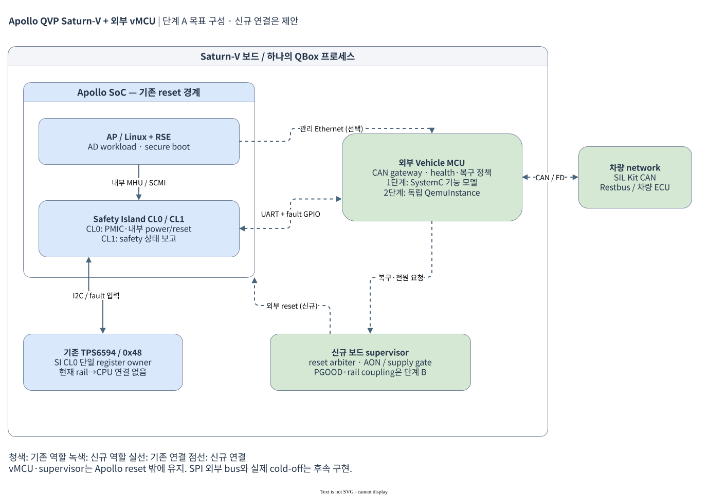

# Apollo QVP Saturn-V 외부 vMCU 통합 계획

**[HTML 시각화: vMCU와 Apollo의 연결·동작](visualization.html)** — 경로 강조,
구성 요소별 소스, 정상 감시·고장 복구·종료/wake의 단계별 흐름, GPIO·검증 결과.
브라우저에서 직접 열 수 있으며 외부 JavaScript/CSS 의존성이 없다.
편집 가능한 구성도는 [draw.io 원본](assets/vmcu-current.drawio)으로 제공한다.

작성 기준: 2026-10-05. 대상은 현재 checkout의 `apollo-qvp-saturn-v.lua`와 공개 제조사·Vector 문서다. **현재 구현은 TC397 Zephyr, SI CL0의 기존 PFDI 결과를 5초마다 전달하는 Safety UART, 독립 GPIO와 AP 관리 UART다.** CAN/CAN FD의 실제 SIL Kit 연동, PMIC 조회와 AP 복구·종료·wake는 [CAN과 제어 서비스](can-and-services.md)에 기록한다. Safety 계약·검증 경계는 [SI CL0 Safety Channel](si0-safety-channel.md)에 기록한다. Zephyr 도입 기록은 [Zephyr vMCU 구현](zephyr-implementation.md), 이전 구현 결과는 [TC397 최소 구현](tc397-minimal-implementation.md)과 [UART heartbeat](uart-heartbeat-implementation.md), 최초 조사 기준점은 [analysis-inputs.json](analysis-inputs.json)에 기록한다.

## 1. 권장 방향

Saturn-V 보드에 **Apollo SoC와 별도 reset·전원 수명을 갖는 외부 vMCU**를 추가한다. Apollo 내부 Safety Island는 계속 SoC 내부 안전 감시와 전력 관리를 담당하고, vMCU는 차량 CAN, ignition/wake, SoC 상태 감시, 보드 수준 복구를 담당한다. 두 주체를 같은 것으로 취급하지 않는다.

| 질문 | 권장안 |
|---|---|
| QBox에 QemuInstance를 추가하는가? | **현재 QEMU에 이식한 최소 TC397을 별도 process로 사용**한다. Apollo UART 연동 검증을 마쳤고, 내부 `vmcu_qemu_inst` 통합은 후속 평가다. 실제 Zephyr app과 shell을 실행하고 ASCLIN0은 AP 관리, ASCLIN2는 SI CL0 safety, PORT0는 독립 GPIO에 사용한다. generic Arm은 대안이며 vendor firmware 호환과 RH850 backend는 미검증·미구현이다. |
| SIL Kit은 어디에 연결하는가? | 보드 바깥 차량 CAN 네트워크가 1차 경계다. TC397 QEMU M_CAN MMIO/FIFO/IRQ ↔ native SIL Kit bridge ↔ 차량/시험 participant를 연결한다. QBox 내부 공통 virtual-time 연동은 후속이다. |
| SoC↔vMCU 통신은 무엇인가? | 목표는 **Ethernet/UDP 관리 채널 + SPI 주기 상태 채널 + 독립 GPIO fault/reset/wake**다. 초기 QVP는 UART byte 경로를 이용한다. 현재 DW SSI에는 외부 SPI socket이 없어 SPI bus 연결을 먼저 구현해야 한다. 물리 부품과 다른 경로는 QVP 대체 경로로 표시한다. |
| 무엇을 제어하는가? | 부팅 허가, heartbeat/freshness, 고장 통보, 차량 command 유효성, graceful shutdown, 제한된 reset/retry, wake를 단계적으로 구현한다. 차량의 안전 상태는 별도 차량 안전 설계가 결정한다. |
| PMIC를 누가 관리하는가? | 초기에는 **현재 TPS6594의 단일 소유자 SI CL0를 유지**한다. vMCU는 요청/응답과 독립 fault 관찰로 감독한다. SoC 전체 전원 차단은 별도 always-on 전원 경로와 보드 sequencer가 있어야 하며, 기존 PMIC I2C 버스에 두 master를 바로 연결하지 않는다. |

여기서 vMCU의 `v`는 **Vehicle**이며, SIL Kit의 vECU는 실행 형태를 뜻한다. SystemC 기능 모델, QEMU 펌웨어 모델, 외부 상용 MCU simulator는 같은 차량 MCU 역할을 구현하는 서로 다른 backend다.

## 2. 문서 구성

1. [현재 소스와 레퍼런스 조사](references.md): 실제 파일, NVIDIA Orin/Thor 구성, 재사용 가능한 요소와 미확인 사항.
2. [통합 구조와 인터페이스](architecture.md): QemuInstance 선택, MCU 펌웨어, SPI/UART/Ethernet/CAN 계약, 소유 디렉터리.
3. [제어·안전 시나리오와 PMIC](control-and-power.md): 상태 전이, heartbeat, reset 범위, PMIC 단일 소유권과 전원 시퀀스.
4. [SIL Kit 연동](sil-kit.md): 직접 bridge와 공식 adapter 비교, 시간·thread·CAN 모델링 경계.
5. [구현 순서와 검증](implementation-plan.md): 단계별 산출물, 통과 조건, 고장 주입과 보류 항목.
6. [TC397 QEMU 재사용 조사](tc397-qemu.md): 공개 TC397 fork, 지원 peripheral과 공백, 실제 machine 생성 확인, 외부 실행과 libqemu 통합 비교.
7. [현재 QEMU의 TC397 최소 구현·검증](tc397-minimal-implementation.md): 단일 CPU0, ELF, IR/STM/ASCLIN 구현과 빌드·부팅·기능 시험 및 후속 계획.
8. [Apollo–TC397 UART heartbeat 구현·검증](uart-heartbeat-implementation.md): 선택적 DW UART2 연결, MCU firmware의 deadline 판정, full Saturn-V guest traffic과 IRQ 확인.

9. [Zephyr vMCU app·shell 구현](zephyr-implementation.md): 독립 kernel/toolchain, Zephyr 도입 당시 두 UART와 BSP peer 기능 검증 기록.
10. [SI CL0 Safety Channel](si0-safety-channel.md): 기존 PFDI 결과, 5초 보고, Orin GPIO 조사·연결, Safety CLI와 검증.
11. [CAN과 제어 서비스](can-and-services.md): 실제 M_CAN/SIL Kit, PMIC proxy, AP 복구·종료·wake와 재협상.

## 3. 목표 구성

구성도는 **QBox 내부 통합 이후의 목표안**이다. TC397 첫 PoC는 외부 QEMU process로 실행하는 별도 경로를 따른다. 청색은 기존 역할, 녹색은 신규 역할, 점선은 추가 구현이 필요한 연결이다. SVG에는 draw.io 원본이 포함되어 편집할 수 있다. 보드 PMIC와 always-on 전원 영역의 실제 부품·rail 배치는 회로도 확보 후 확정한다.

## 4. 결정과 남은 조건

현재 `board/saturn-v.lua` 자체가 실물 Saturn-V schematic 일치를 `UNVERIFIED`로 명시한다. 따라서 이 계획에서 새로 정의한 핀 이름, MCU 종류, CAN channel, timeout은 보드 사양 확정값이 아니다. NVIDIA 예제도 해당 DRIVE AGX 개발 보드의 근거이며 모든 Orin/Thor 제품에 동일한 MCU가 붙는다는 뜻은 아니다.

현재 범위는 **standalone TC397, Zephyr shell과 SI CL0 PFDI Safety UART, AP ping/status 관리 및 GPIO 연결**이다. AP 합성 workload는 제거했다. 차량 CAN/SIL Kit, SI CL0 PMIC 조회 proxy와 AP-only 종료·wake를 추가했다. PMIC rail 기반 전원 시퀀스는 후속 단계다. 실제 vendor binary 호환, CAN bus-off/중재 timing, PMIC PFSM·watchdog 및 SoC cold power-cycle은 각각 별도 통과 조건을 둔다.

구현 착수 전에 필요한 외부 입력은 Saturn-V 회로도/전원 트리, 목표 MCU와 펌웨어 사용권, 차량 CAN DBC/ARXML·진단 요구, fault reaction deadline이다. 이 자료가 없어도 QVP 기능 계약과 시험 fixture 구현은 진행할 수 있으며, 실물 대응과 안전 시간 보장은 `UNVERIFIED`로 유지한다.

## 5. 이 문서의 검증 기록

초기 문서의 로컬 링크, 소스 경로, 공백 오류 및 구성도 2개의 XML·SVG 렌더링과 화면을 확인했다. 초기 증거는 `build/qbox-apollo-qvp/vmcu-plan-review/`, 외부 fork 조사는 `build/qbox-apollo-qvp/vmcu-tc397-research/`에 보관한다. 최소 모델은 `build/qbox-apollo-qvp/tc397-minimal/`, UART heartbeat 실행 증거는 `build/qbox-apollo-qvp/vmcu-link/`에 보관한다. Zephyr app/shell·상태/RPC와 BSP 통합 증거는 `build/qbox-apollo-qvp/vmcu-zephyr/`, kernel/toolchain·host protocol 증거는 `build/qbox-apollo-qvp/zephyr-vmcu/`에 있다. UART 결과를 CAN·PMIC·전원 동작의 검증으로 확대하지 않는다.

현재 SI CL0 PFDI Safety UART·GPIO 검증과 원본 고장 주입 결과는
[SI CL0 Safety Channel](si0-safety-channel.md#구현-소유권검증)과
[manifest](../../build/qbox-apollo-qvp/vmcu-si0-safety/manifest.json)에 연결한다.

CAN/SIL Kit, PMIC 조회, AP 복구·종료·wake의 최신 검증 결과는
[CAN과 제어 서비스](can-and-services.md#검증)와
[추가 구현 manifest](../../build/qbox-apollo-qvp/vmcu-services/manifest.json)에 기록한다.
