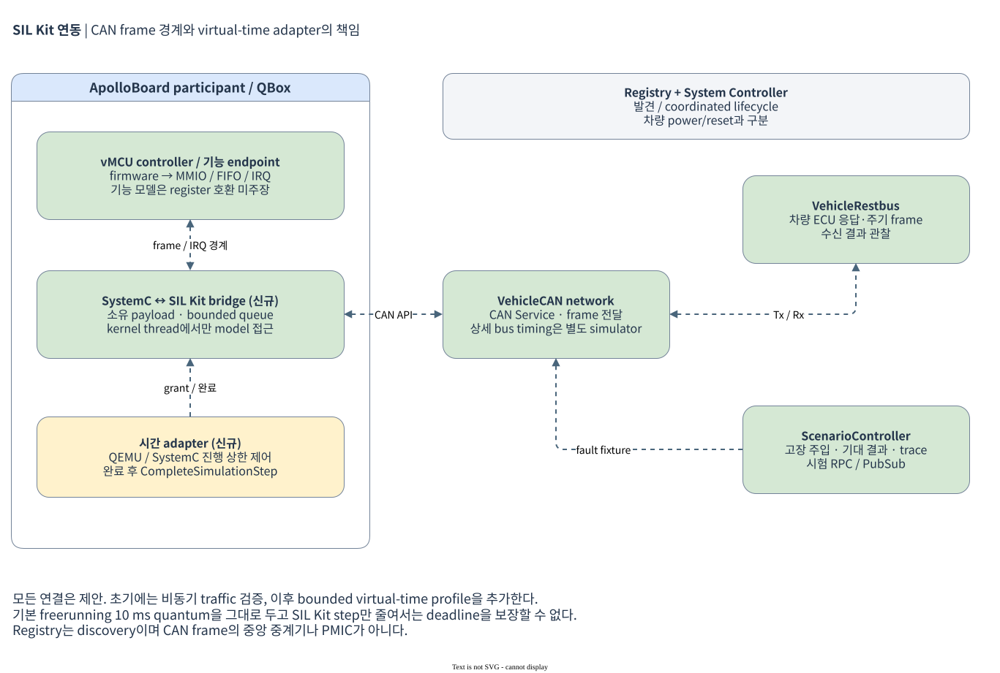

# SIL Kit 연동 구현과 후속 시간 동기 계획

상위 문서: [통합 계획](README.md). 조사한 공식 문서는 SIL Kit 5.0.7을 표시한다. **현재 구현은 TC397 외부 QEMU의 실제 M_CAN endpoint와 native SIL Kit bridge다.** 실행·메시지·검증은 [CAN과 제어 서비스](can-and-services.md), SDK와 wire 계약은 [native participant README](../../scripts/silkit/README.md)를 따른다. 아래 SystemC 직접 bridge와 coordinated time은 후속 설계다.

## 1. 권장 경계

**SIL Kit은 차량 네트워크와 시험 participant를 연결하고, QBox는 CPU·MMIO·IRQ·보드 신호를 실행한다.** QBox 내부 TLM socket을 SIL Kit CAN으로 직접 대체하지 않는다. controller가 내보낸 CAN frame을 bridge가 옮기고, 받은 frame을 controller Rx FIFO/IRQ 경로로 되돌린다.

| participant/service | 역할 | 소유 시간·상태 |
|---|---|---|
| `ApolloBoard` | QBox 전체를 대표하는 bridge; vMCU vehicle CAN endpoint 노출 | SystemC와 모든 내부 QemuInstance의 진행을 함께 제한 |
| `VehicleRestbus` | 차량 ECU 응답·주기 frame·진단 fixture | CAN service 및 자체 simulation step |
| `ScenarioController` | fault injection, expected result, evidence 수집 | 시험 제어 RPC/PubSub와 virtual time |
| `NetworkSimulator` 선택 | CAN arbitration/error/delay 등 detailed bus 동작 | 별도 simulator가 구현한 network 시간 |
| Registry | participant discovery/연결 구성 | 보드 power controller나 CAN ECU가 아님 |
| System Controller | coordinated lifecycle의 시작/정지 조건 | simulation lifecycle이며 차량 전원 상태와 별개 |

`VehicleCAN`을 첫 logical network 이름으로 하고 controller 이름은 `VMCU_CAN0`로 고정한다. 실제 DBC/ARXML이 정해지면 bus/channel mapping을 확장한다. CAN 자체는 CAN Service, raw UART byte는 PubSub, test command는 RPC로 나눈다. SoC의 생산용 power command를 시험 전용 RPC로 대체하지 않는다. participant·network·topic 명칭은 제안이다.

participant의 matching network/topic을 이용한 연결 및 lifecycle 구분은 [공식 Simulation Concepts](https://vectorgrp.github.io/sil-kit-docs/simulation/simulation.html)를 따른다.

## 2. 연결 방식 비교

| 방식 | 적용 경로 | 선택 기준/제한 |
|---|---|---|
| **QBox SystemC 직접 bridge** | controller frame port ↔ SIL Kit CAN API, GPIO event ↔ 시험 topic | 후속 virtual-time 통합 후보. SystemC queue와 virtual-time 제어를 같은 통합 코드에서 다룰 수 있다. 새 thread/time adapter 구현이 필요하다. |
| 공식 QEMU Adapter | QEMU socket Ethernet ↔ SIL Kit Ethernet, chardev ↔ PubSub | AP 관리 traffic prototype에 적합. QBox 내부 libqemu instance에 자동 attach되는 plugin이 아니다. socket backend 노출 가능성을 먼저 확인한다. |
| 공식 vCAN Adapter | Linux SocketCAN/vcan ↔ SIL Kit CAN | `can-utils`, host restbus, 기존 SocketCAN 프로그램을 빠르게 연결할 때 사용한다. Linux wall-clock과 socket scheduling을 포함하므로 deterministic deadline 검증과 분리한다. |
| 외부 MCU simulator participant | MCU virtual platform ↔ CAN/상태 signal adapter | [공개 TC397 fork](tc397-qemu.md)를 초기 후보로 사용한다. 현재 CAN0 node0 M_CAN, PORT0와 UART serialized contract를 구현했다. 공통 시간 동기는 후속이다. RH850는 아직 모델을 확보하지 않았다. |

[공식 QEMU Adapter](https://raw.githubusercontent.com/vectorgrp/sil-kit-adapters-qemu/main/README.md)는 socket Ethernet/chardev 연결과 QMP 제어 예제를 제공한다. chardev의 byte 전달이 SPI CS/mode/clock, controller IRQ, bus timing을 자동 모델링하는 것은 아니다. QMP reset은 simulator 제어이며 PMIC rail sequence의 증거가 아니다.

[공식 vCAN Adapter](https://raw.githubusercontent.com/vectorgrp/sil-kit-adapters-vcan/main/README.md)는 Linux SocketCAN 경계를 제공한다. host vcan에서 송수신된 frame은 MCU firmware가 CAN MMIO를 정상 구동했다는 증거가 아니므로 `HOST_FRAME_SMOKE`와 `MCU_DRIVER_TRAFFIC` 결과를 나눈다.

## 3. SystemC thread와 callback 계약

1. SIL Kit callback은 받은 payload를 **소유 메모리로 복사**하고 bounded queue에 넣는다. callback의 `Span`이나 data pointer를 저장해 나중에 사용하지 않는다.
2. callback thread에서 `b_transport`, `wait`, QEMU register 접근, `sc_signal::write`, 일반 `sc_event::notify`를 직접 호출하지 않는다. 현재 QBox의 async ingress 패턴을 검토해 kernel thread에서 queue를 소비하도록 연결한다.
3. kernel thread가 허용된 simulation boundary에서 Rx를 controller에 전달하고 FIFO/IRQ를 갱신한다. Tx 요청도 소유 thread와 lifetime 규칙을 정해 전달한다.
4. queue overflow/늦은 frame/disconnect는 counter와 fault result로 노출한다. 무제한 queue 또는 silent drop을 쓰지 않는다. 중단 중 callback이 component를 참조하지 않게 handler 해제·drain·join 순서를 정한다.

CAN frame에는 ID, extended/FD/BRS/ESI flag, DLC, 실제 payload를 보존한다. bus/channel, local sequence, boot epoch는 **bridge/trace metadata**로 관리하며 `CanFrame` 고유 필드가 아니다. 차량 수신자에게 freshness 정보를 전달하려면 해당 CAN payload/DBC에 별도로 정의해야 한다. classic/FD의 허용 조합과 payload 크기를 adapter 양단에서 검사한다. bridge 양방향 echo로 같은 frame이 무한 재주입되지 않도록 Tx/Rx 방향과 origin을 추적한다.

SIL Kit의 simple CAN simulation은 전송을 긍정적으로 확인하며 detailed error-state 검증을 대신하지 않는다. DLC/length 일치도 호출자가 책임진다. 따라서 Tx ACK를 물리 bus ACK나 상대 application 처리 완료와 동일시하지 않는다. [CAN Service API](https://vectorgrp.github.io/sil-kit-docs/api/services/can.html)

## 4. 시간 동기: 통신 성공과 deadline 검증 분리

### 4.1 두 실행 모드

| 모드 | 목적 | 판정 범위 |
|---|---|---|
| 비동기 기능 연결 | socket/vCAN/외부 도구로 API·payload·상태 전이 확인 | traffic/protocol PASS 가능, deterministic timeout·bus delay는 `NOT_COMPARABLE` |
| coordinated virtual time | 동일 seed·입력으로 fault deadline/순서 재현 | 모든 QEMU/SystemC/participant의 advance bound와 event ordering을 검증한 범위에서만 시간 주장 |

현재 QVP 기본은 10 ms quantum과 freerunning 정책이다. SIL Kit step을 1 ms로 지정하는 것만으로 QEMU의 선행 실행을 막을 수 없다. CPU quantum, SystemC event, bridge queue, 외부 participant가 같은 budget 안에서 진행하도록 별도 실행 profile을 만든다. vMCU와 SI/AP가 실제로 이 bound를 지키는지 timestamp trace로 측정해야 한다.

### 4.2 제안하는 동기 알고리즘

QBox를 하나의 synchronized participant로 시작한다. [Time Synchronization API](https://vectorgrp.github.io/sil-kit-docs/api/services/timesync.html)의 asynchronous step handler와 `CompleteSimulationStep()`를 후보로 사용한다. callback은 grant 정보를 kernel owner에게 전달하고, **QBox 쪽이 실제 처리를 완료한 뒤** step을 완료한다.

| 단계 | bridge/QBox의 의무 |
|---|---|
| grant 수신 | `T`, `Δt`를 기록하고 진행 상한 설정. SystemC 시작·진행은 kernel owner 한 곳에서만 수행 |
| 입력 적용 | 현재 boundary에 유효한 event를 queue에서 읽음. 다른 sender 사이의 동시 event 순서는 명시적 tie-break 규칙으로 고정 |
| 내부 실행 | CPU local time과 SystemC가 허용 범위를 초과하지 않게 advance. 비동기 데이터 도착 시 boundary/late policy 준수 |
| 출력 발행 | 서비스 timestamp 규칙에 맞는 boundary에서 발행. 내부 event 시간은 필요 시 별도 trace/payload에 보존 |
| step 완료 | 해당 step의 입력·출력·queue 상태를 확정한 뒤 `CompleteSimulationStep()` 호출 |

일반 service event timestamp는 SIL Kit이 정한다. 과거 SystemC 시각을 CAN frame timestamp에 임의 대입하는 설계를 하지 않는다. 내부 구간 event를 다음 boundary로 모으는 정책을 선택하면 최대 한 step의 추가 지연을 budget에 반영하고, 그 시각 전송과 실제 controller 요청 시각을 각각 기록한다. [공식 timestamp·step 구간 규칙](https://vectorgrp.github.io/sil-kit-docs/simulation/simulation.html#timestamps-in-messages)을 적용한다.

처음에는 fixture용 `Δt=1 ms`를 후보로 측정하되, bus arbitration이나 짧은 fault deadline에 충분하다는 의미는 아니다. step 크기는 시험의 허용 quantization error에서 역산한다. 작은 step에서 simulation speed가 낮아져도 guest deadline을 wall-clock으로 임의 변경하지 않는다.

coordinated run 중 필수 participant가 사라지면 시험을 중단/실패 처리한다. MCU의 논리적 고장은 participant 자체를 죽이는 대신 CPU stall, link drop, signal fault로 주입해야 나머지 시간이 계속 진행하는 시나리오를 재현하기 쉽다. participant crash 시험은 별도 harness failure 결과로 기록한다.

## 5. CAN fidelity와 고장 주입

| 단계 | 구현/시험 | 주장할 수 없는 내용 |
|---|---|---|
| CAN frame | ID/flags/DLC/data, filter, 양방향 전달, bounded queue | 실제 bus 중재, bit time, ACK slot, error counter |
| MCU controller | MMIO/FIFO/IRQ, Tx completion, Rx overrun, reset, firmware ISR | controller가 정확히 모델링하지 않은 vendor 기능 |
| detailed network | arbitration/load/delay/error-state를 별도 network simulator로 검증 | transceiver/termination/배선의 전기적 특성 |
| 물리 비교 | 필요 시 별도 HIL hardware와 동일 scenario 비교 | SIL 결과만으로 ISO 26262, 실차 또는 RTL parity 주장 |

SIL Kit [Network Simulator API](https://vectorgrp.github.io/sil-kit-docs/api/netsim.html)는 메시지 전달을 simulator로 위임하는 틀이다. CAN 상세 모델은 제공자가 구현해야 하며 API는 experimental이다. `bus-off` enum 존재만으로 검증 지원을 선언하지 않고, 채택 버전과 상세 simulator가 그 상태 전이·회복을 생성하는지 확인한다. 미지원이면 `UNSUPPORTED`로 남긴다.

프로토콜 layer에서 drop/delay/corrupt/replay를 주입한 시험과 controller/network error를 주입한 시험을 구분한다. CRC를 망가뜨린 UART frame은 CAN bit error 시험이 아니다. PMIC fault는 test-only injection interface에서 발생시키며 정상 guest가 같은 기능을 임의 호출하지 못하게 profile을 분리한다.

## 6. 빌드·배포와 실행 순서

QBox는 기존 C++14 규칙을 유지한다. 선택한 SIL Kit header/compiler/ABI가 맞는지 최소 link test로 확인하고, 필요하면 bridge target만 독립 설정하거나 C API 경계를 사용한다. SIL Kit을 이유로 workspace 전체 C++ 표준을 올리지 않는다. `libSilKit`의 배포 library, RPATH, license, core/adapter version 및 checksum을 기록한다. 현재 별도 bootstrap script가 공식 SDK 5.0.7 archive SHA256을 검증하며 Yocto/QBox ABI에는 SDK를 추가하지 않는다.

실행 순서는 Registry → 필요한 participants 생성 → communication-ready에서 controller 설정 → coordinated start → scenario → evidence flush → lifecycle stop이다. 정확한 CLI는 실제 구현 버전의 `--help`와 runner를 기준으로 문서화한다. 이 계획에는 아직 없는 `run_vmcu` 명령이나 가짜 실행 예제를 추가하지 않는다.

외부 adapter를 쓰는 profile은 endpoint/IP/port를 manifest로 고정하고 충돌을 검사한다. functional/qemu backend 모두 bridge를 비활성화한 기존 Saturn-V 실행을 유지해야 한다. SIL Kit 연결 실패가 정상 Apollo boot를 막을지는 해당 profile의 mandatory participant 정책으로 명시한다.
